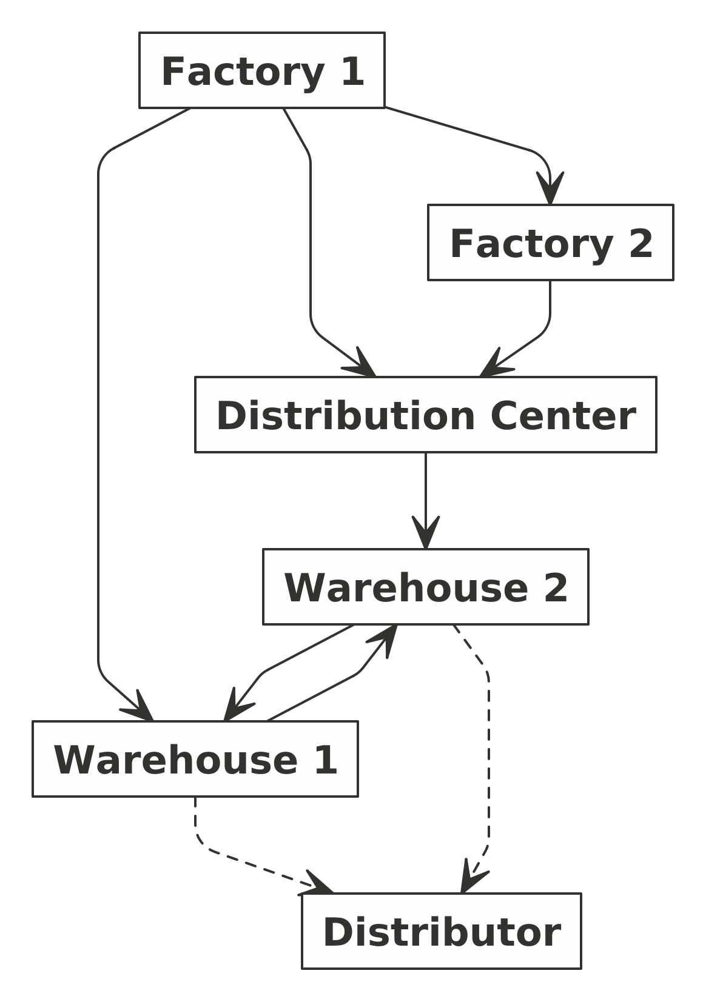

```{r setup, include=FALSE}
knitr::opts_chunk$set(echo = TRUE)
setwd("~/Documents/ikanx101/_posts/linear problem/post 8")
nomnoml::nomnoml("#direction: down,
                 [Factory 1] -> [Factory 2]
                 [Factory 1] -> [Distribution Center]
                 [Factory 2] -> [Distribution Center]
                 
                 [Factory 1] -> [Warehouse 1]
                 [Distribution Center] -> [Warehouse 2]
                 
                 [Warehouse 1] -> [Warehouse 2]
                 [Warehouse 2] -> [Warehouse 1]
                 
                 [Warehouse 1] --> [Distributor]
                 [Warehouse 2] --> [Distributor]
                 
                 ",
                 "alur.png")
rm(list=ls())
```

Suatu perusahaan manufaktur memiliki dua _factories_ yang terpisah jaraknya. Kedua _factories_ tersebut memproduksi __barang jadi__ untuk kemudian dijual oleh _distributor_. Ada alur distribusi yang harus dilalui __barang jadi__ tersebut hingga ke tangan _distributor_. Bagaimana alurnya?

Berikut adalah _flow_-nya:

```{r out.width="30%",fig.align='center',echo=FALSE,warning=FALSE,message=FALSE}

```

- _Factory 1_ __bisa__ mendistribusikan __barang jadi__ tersebut ke:
    - _Factory 2_,
    - _Distribution center_, dan
    - _Warehouse 1_.
- _Factory 2_ __hanya bisa__ mendistribusikan __barang jadi__ ke _distribution center_.
- _Distribution center_ __hanya bisa__ mendistribusikan __barang jadi__ ke _warehouse 2_.
- _Warehouse 1_ __bisa__ saling _overflow_ barang __dari dan ke__ _warehouse 2_.
- Distributor akan mengambil __barang jadi__ jadi _warehouse 1_ dan/atau _warehouse 2_.

_Nah_, berikut data pelengkap lainnya:

- Produksi:
    - _Factory 1_ hanya bisa menghasilkan __barang jadi__ sebanyak `50` unit per hari.
    - _Factory 2_ hanya bisa menghasilkan __barang jadi__ sebanyak `40` unit per hari.
- Transportasi:
    - Biaya transportasi __barang jadi__ dari _Factory 1_ ke _Factory 2_ adalah `Rp200`/unit. Tapi karena keterbatasan _space_ yang ada, _transporter_ hanya bisa mengangkut maksimal `10` unit per hari.
    - Biaya transportasi __barang jadi__ dari _Factory 1_ ke _distribution center_ adalah `Rp400`/unit. Tidak ada batasan berapa banyak unit yang bisa diantar.
    - Biaya transportasi __barang jadi__ dari _Factory 1_ ke _warehouse 1_ adalah `Rp900`/unit. Tidak ada batasan berapa banyak unit yang bisa diantar.
    - Biaya transportasi __barang jadi__ dari _Factory 2_ ke _distribution center_ adalah `Rp300`/unit. Tidak ada batasan berapa banyak unit yang bisa diantar.
    - Biaya transportasi __barang jadi__ dari _distribution center_ ke _warehouse 2_ adalah `Rp100`/unit. Tapi karena keterbatasan _space_ yang ada, _transporter_ hanya bisa mengangkut maksimal `80` unit per hari.
    - Biaya transportasi __barang jadi__ dari _warehouse 1_ ke _warehouse 2_ adalah `Rp300`/unit. Sedangkan biaya transportasi __barang jadi__ dari _warehouse 2_ ke _warehouse 1_ adalah `Rp200`/unit.Tidak ada batasan berapa banyak unit yang bisa diantar.
- _Stock Level_
    - _Warehouse 1_ harus memiliki `30` unit __barang jadi__ dalam sehari untuk di-_pick up_ oleh distributor.
    - _Warehouse 2_ harus memiliki `60` unit __barang jadi__ dalam sehari untuk di-_pick up_ oleh distributor.
    - _Distribution center_ hanya berfungsi sebagai tempat perantara dan _sorting center_ sehingga __tidak boleh__ menyimpan __barang jadi__ sama sekali.
    
### _Problem_

Bagaimana jalur distribusi yang paling optimal?

Definisi optimal:

> Jalur distribusi yang memiliki _cost_ paling kecil dengan tetap memenuhi kebutuhan distributor.

---

## Model Matematika

Untuk memecahkan masalah _optimization_ ini, saya akan buat model matematikanya. 

### Definisi variabel

Namun, saya akan mendefinisikan variabel berikut ini:

 : __barang jadi__ yang ditransport dari titik `a1` ke titik `a2`.

### _Objective function_

Tujuan model ini adalah meminimalisir _cost_:


)

### _Constraints_

Ini adalah _constraints_ yang dihadapi:

_Factory 1_


_Factory 2_


_Distribution Center_


_Warehouse 1_


_Warehouse 2_


_Max_ transportasi _factory 1_ ke _factory 2_:

$$x_{F1-F2} \leq 10$$

_Max_ transportasi _distribution center_ ke _warehouse 2_:

$$x_{DC-W2} \leq 80$$

_Min_ nilai $x$:

$$x \geq 0$$

---

## Solusi

Dari _constraints_ di atas, saya bisa menyelesaikannya dengan bantuan _solver_ di __R__. Sehingga solusi yang saya dapatkan adalah sebagai berikut:

$$x_{F1-F2} = 0$$

$$x_{F1-DC} = 40$$

$$x_{F1-W1} = 10$$

$$x_{F2-DC} = 40$$

$$x_{DC-W2} = 80$$

$$x_{W1-W2} = 0$$

$$x_{W2-W1} = 20$$

Jika dibuat _summary_-nya:

> _Factory 1_ memproduksi 50 unit __barang jadi__. Sebanyak 10 unit langsung dikirim ke _warehouse 1_, sisanya (40 unit) dikirim ke _distibution center_. Sedangkan _factory 2_ 40 unit dan semuanya langsung dikirim ke _distribution center_. Sehingga di _distribution center_ ada total 80 unit __barang jadi__. Semuanya lantas dikirim ke _warehouse 2_. Karena _warehouse 2_ hanya bisa menampung 60 unit, maka 20 unit di-_overflow_ ke _warehouse 1_.

Total _cost_ yang dihasilkan adalah `Rp49.000` dan ini merupakan _cost_ yang paling kecil di antara semua alternatif yang mungkin.

--- 

`if you find this article helpful, please support this blog by clicking the ads.`