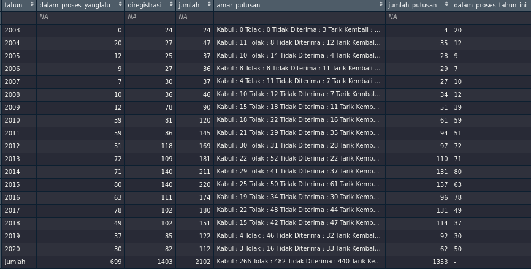

```{r setup, include=FALSE}
knitr::opts_chunk$set(echo = TRUE)
setwd("~/ikanx101.com/_posts/mahkamah konstitusi/bagian 1")
```

Konon katanya riuh-ricuh pengesahan __Undang-Undang Cipta Kerja__ akan bermuara di __Mahkamah Konstitusi__. Nah, sebelum saya akan membahas mengenai analisa data tersebut __Mahkamah Konstitusi__, saya akan berikan dulu tutorial _web scrape_ dan _data carpentry_ dari situs tersebut.

Data yang mau saya ambil adalah data __rekapitulasi perkara pengujian UU__ yang disajikan dalam bentuk tabel di [situs resmi __Mahkamah Konstitusi__](https://mkri.id/index.php?page=web.RekapPUU&menu=4). Berikut adalah tabel yang ada di situs tersebut:

```{r,echo=FALSE}
knitr::include_graphics("rekap.png")
```

Oh iya, hampir semua data di website pemerintah sudah berbentuk tabel. Jadi sangat mudah untuk di-_scrape_ menggunakan `library(rvest)`. Namun yang menjadi permasalahan adalah pada saat _data carpentry_-nya yang cenderung rumit sehingga membuat orang menjadi malas untuk mengerjakannya.

> Oke, yuk saya tunjukkan caranya!

---

## Panggil _Libraries_

Tiga _libraries_ utama yang akan saya pakai adalah:

1. `library(rvest)` untuk melakukan _web scraping_. _Script_ utama yang akan saya gunakan adalah `html_table()`. Cukup mudah kan.
1. `library(dplyr)` untuk melakukan _data carpentry_ dengan prinsip _tidy_ (` %>% `).
1. `library(tidyr)` untuk melakukan _data carpentry_ juga. _Script_ yang akan saya gunakan adalah `separate()`.

Selain _libraries_ di atas, saya akan gunakan juga `janitor::clean_names()` untuk membersihkan `colnames()` dari dataset.

```{r,message=FALSE,warning=FALSE}
library(rvest)
library(dplyr)
library(tidyr)
```

---

## Ambil _url_ dan _Scrape_

Sekarang saya akan melakukan _webscraping_. Caranya cukup mudah, hanya perlu menentukan _url_-nya saja dan tulis algoritma menggunakan `library(rvest)`.

```{r,message=FALSE,warning=FALSE}
# url
url = "https://mkri.id/index.php?page=web.RekapPUU&menu=4"

# web scrape
data = 
  read_html(url) %>% 
  html_table(fill = T)
```

Dalam hitungan detik (tergantung koneksi juga), tabel di situs tersebut sudah masuk ke dalam _global environment_ di __R__. Mari kita lihat dulu data apa saja yang terambil.

```{r,message=FALSE,warning=FALSE}
str(data)
```

Data yang masuk berbentuk _list_ berisi hanya `1` _data frame_ saja. Oleh karena itu, saya hanya akan mengambil _data frame_ tersebut. Lalu saya bersihkan penamaan `colnames()` data tersebut dengan `janitor`.

```{r,message=FALSE,warning=FALSE}
# ambil data frame dari element pertama dari list
data = data[[1]]

# membersihkan nama kolom
data = 
  data %>% 
  janitor::clean_names()
```

Sekarang kita lihat _raw data_ hasil _scrape_-nya.

```{r,echo=FALSE}

```

---

## _Data Carpentry_

Dari _raw data_ tersebut, ada banyak __PR__ yang harus saya selesaikan. Apa saja?

1. Menghapus baris pertama yang kosong.
1. Menghapus baris terakhir karena berisi `Jumlah`. Saya tidak memerlukannya karena saya bisa menghitung sendiri nanti.
1. Memecah kolom `amar_putusan` menjadi beberapa kolom lain.

Oke, sebelum melakukannya, saya cek kembali struktur datanya:

```{r,message=FALSE,warning=FALSE}
str(data)
```

---

### _Data Carpentry_ Tahap I

Sekarang saya akan melakukan hal yang mudah terlebih dahulu. Melakukan poin `1` dan `2` dari __PR__ saya. Namun ada yang perlu diperhatikan. Setelah nanti kita menghapus baris pertama dan baris `Jumlah`, kolom `tahun` dan kolom `dalam_proses_tahun_ini` akan kita ubah menjadi `numeric`.

```{r,message=FALSE,warning=FALSE}
data = 
  data %>% 
  filter(!is.na(jumlah)) %>% 
  filter(tahun != "Jumlah") %>% 
  mutate(tahun = as.numeric(tahun),
         dalam_proses_tahun_ini = as.numeric(dalam_proses_tahun_ini))
```

Hasilnya sebagai berikut:

```{r,echo=FALSE}

```

---

### _Data Carpentry_ Tahap II

Berikutnya adalah membereskan kolom `amar_putusan`. Ini adalah pekerjaan yang paling asyik menurut saya karena sebenarnya _gak_ sulit _kok_.

Pertama-tama, mari kita lihat dulu apa _sih_ isi dari kolom `amar_putusan`. Berikut adalah `3` data teratas untuk `amar_putusan`:

```{r,echo=FALSE}
head(data$amar_putusan,3)
```

Nah, setelah melihat data tersebut apakah sudah terbayang apa yang akan dilakukan? Kira-kira ini yang akan saya lakukan:

1. Menghapus `\r` dan `\t` dari data tersebut.
1. Melakukan `separate()` dengan _separator_ berupa `\n`.
1. Hanya mengambil angka dari masing-masing kolom lalu membuatnya menjadi `numeric`.

> Simpel kan?

Ini _script_-nya:

```{r,message=FALSE,warning=FALSE}
data = 
  data %>% 
  mutate(amar_putusan = gsub("\\\r","",amar_putusan),
         amar_putusan = gsub("\\\t","",amar_putusan)) %>% 
  separate(amar_putusan,
           into = c("kabul","tolak","tidak_diterima","tarik_kembali","gugur","tidak_berwenang"),
           sep = "\\\n") %>% 
  mutate(tolak = gsub("\\D","",tolak),
         tolak = as.numeric(tolak),
         kabul = gsub("\\D","",kabul),
         kabul = as.numeric(kabul),
         tidak_diterima = gsub("\\D","",tidak_diterima),
         tidak_diterima = as.numeric(tidak_diterima),
         tarik_kembali = gsub("\\D","",tarik_kembali),
         tarik_kembali = as.numeric(tarik_kembali),
         gugur = gsub("\\D","",gugur),
         gugur = as.numeric(gugur),
         tidak_berwenang = gsub("\\D","",tidak_berwenang),
         tidak_berwenang = as.numeric(tidak_berwenang))
```

Sekarang kita lihat data yang sudah bersihnya:

```{r,echo=FALSE}
save(data,file = "clean.rda")
```

```{r,message=FALSE,warning=FALSE}
colnames(data) = c("Tahun",
                   "Dalam proses yg lalu",
                   "Diregistrasi",
                   "Jumlah",
                   "Dikabulkan",
                   "Ditolak",
                   "TIdak diterima",
                   "Tarik kembali",
                   "Gugur",
                   "Tidak berwenang",
                   "Jumlah putusan",
                   "Dalam proses tahun ini",
                   "Jumlah UU yg diuji")
knitr::kable(data)
```

_Gimana_? Mudah kan?