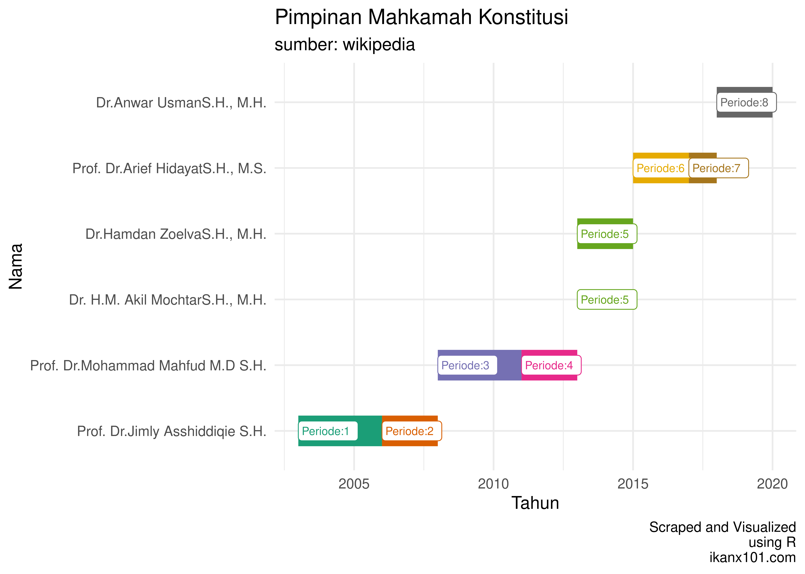
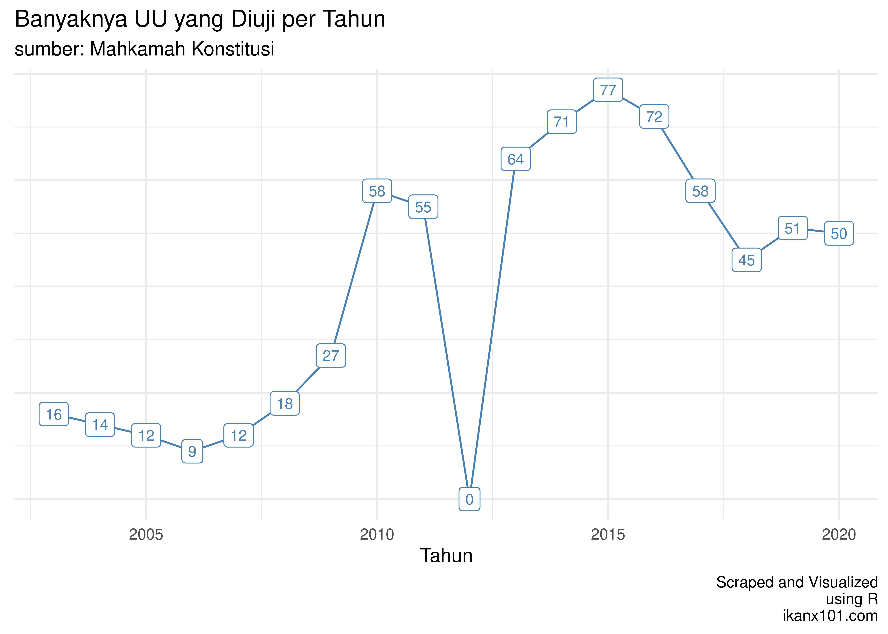

Rekap Judicial Review Undang-Undang di MK
================

Demo buruh, mahasiswa, dan beberapa elemen masyarakat lain yang
berlangsung beberapa hari belakangan dalam rangka menolak pengesahan
**UU Cipta Kerja** tampaknya akan berakhir di **Mahkamah Konstitusi**.
Dari beberapa berita yang saya
[baca](https://news.detik.com/berita/d-5211575/pekerja-dan-organisasi-buruh-ini-resmi-gugat-uu-cipta-kerja-ke-mk),
ada individual dan organisasi buruh yang sudah mendaftarkan *judicial
review* ke MK.

-----

Mahkamah Konstitusi berdiri pada 18 Agustus 2003 dan bertugas sebagai
pemegang kekuasaan kehakiman bersama-sama dengan Mahkamah Agung. Lalu
apa pembeda MA dengan MK?

Kewenangan Mahkamah Konstitusi adalah:

1.  Menguji undang-undang terhadap UUD 1945.
2.  Memutus sengketa kewenangan lembaga negara yang kewenangannya
    diberikan oleh UUD 1945.
3.  Memutus pembubaran partai politik.
4.  Memutus perselisihan tentang hasil pemilihan umum.
5.  Memberikan keputusan atas pendapat DPR bahwa Presiden dan/atau Wakil
    Presiden telah melakukan pelanggaran hukum, atau perbuatan tercela,
    atau tidak memenuhi syarat sebagai Presiden dan/atau Wakil Presiden
    sebagaimana dimaksud dalam UUD 1945.

Sejak mulai berdiri hingga saat ini, tercatat ada `6` orang yang menjadi
ketua MK.

Secara organisasi, hakim konstitusi hanya berisikan `9` orang (termasuk
ketua MK), yang sistem seleksinya:

  - `3`orang diajukan oleh DPR.
  - `3` orang diajukan oleh Presiden.
  - `3` orang diajukan oleh MA dengan penetapan presiden.

dengan masa kerja selama `5` tahun.

-----

Dari paparan di atas, jadi sudah jelas bahwa *Judicial Review*
Undang-Undang hanya sebagian tugas MK selain tugas-tugas yang lain.

Sekarang, berbekal data yang telah saya
[*scrape*](https://ikanx101.com/blog/tutorial-mk/), mari kita lihat
beberapa temuan berikut.

## Banyaknya Undang-Undang yang Diuji

Berdasarkan data yang saya *scrape* per 14 Oktober 2020 pukul 20.05,
sejak berdiri hingga saat ini, MK sudah melakukan pengujian terhadap 709
UU.

Artinya, rata-rata ada 41.7 buah UU yang diuji per tahunnya.

> Sebuah angka yang lumayan menurut saya. Jika begitu, saya malah jadi
> mempertanyakan bagaimana kinerja si pembuat UU sampai-sampai digugat
> terus hasilnya di MK.

Pada tahun `2012` dari data yang ada, tertulis tidak ada UU yang diuji.
Ada beberapa kemungkinan:

1.  Memang demikian adanya (tidak ada sama sekali).
2.  MK sedang sibuk mengerjakan tugas kewajibannya yang lain.
3.  MK masih menguji UU yang diregistrasi pada tahun lalu yang belum
    diselesaikan (semacam PR tahun lalu).

Saya melihat tren positif dari grafik di atas. Semakin meleknya
masyarakat akan hukum dan keberadaan MK, sekarang mereka bisa menguji
kembali UU yang dihasilkan pemerintah dan DPR.

Seharusnya bapak dan ibu anggota dewan bisa *aware* dengan data ini.
Lagian secara kinerja, DPR masih sedikit menghasilkan UU. Sumber:

1.  [Katadata.co.id](https://katadata.co.id/safrezifitra/indepth/5e9a4e618a956/mengukur-kinerja-dpr-lama-dan-harapan-untuk-dpr-baru).
2.  [Kompas](https://nasional.kompas.com/read/2019/09/26/14022561/hasilkan-84-uu-kinerja-dpr-dinilai-kalah-jauh-dari-periode-sebelumnya).

## Putusan Perkara
