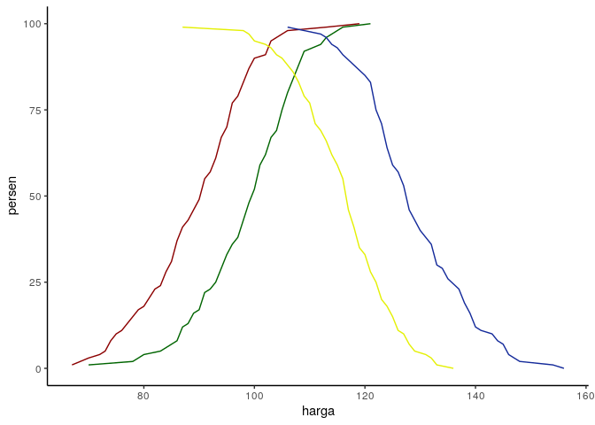

Perbedaan Price Sensitivity dan Price Elasticity dalam Market Research
================

Setidaknya saya sudah menuliskan dua tulisan terkait *study price
elasticity*, pertama tentang [konsep
perhitungannya](https://ikanx101.com/blog/blog-posting-regresi/) dan
[limitasinya](https://ikanx101.com/blog/price_elas_lagi/). Biasanya
*price elasticity* itu dilakukan pada bidang *sales research* karena
data primer yang dibutuhkan itu merupakan data *sales qty* saat suatu
produk berada pada tingkat harga tertentu.

Tujuan utama *price elasticity* adalah menentukan suatu indeks
elastisitas yang bisa memprediksi kenaikan / penurunan *sales qty* saat
harga suatu produk berubah. Dari indeks tersebut, kita juga bisa
menentukan harga optimal yang bisa memaksimalkan omset.

Dalam dunia *market research*, salah satu studi terkait harga yang
paling sering dilakukan adalah *price sensitivity*. Studi ini bisa
dilakukan pada:

1.  Pengembangan produk baru yang belum *launching* di pasaran.
2.  Evaluasi terhadap produk *existing* yang ada di pasaran.

Tujuan utama dari *price sensitivity* ini adalah **menentukan harga
terbaik berdasarkan persepsi konsumen**.

Sebagai contoh, misalkan suatu *project market research* sedang
mensurvey *market acceptance* untuk suatu produk minuman *brand* ***A***
yang belum beredar di pasaran. Produk minuman ***A*** ini memiliki fitur
dan klaim sebagai berikut:

> Minuman *brand* ***A*** adalah minuman kopi kekinian rasa durian yang
> enak. Minuman ini rendah lemak, rendah gula, tinggi multivitamin, dan
> mengandung isotonik. Minuman ini cocok untuk menemani dan menunjang
> aktivitas kamu sehari-hari.

Responden akan diberikan informasi fitur dan klaim di atas termasuk juga
rancangan (*prototype*) kemasan produk minuman ***A***.

Setelah membaca dan melihat dengan detail, responden kemudian akan
ditanyakan 4 *set* pertanyaan, yaitu:

- Berapa tingkat harga yang **termurah** sehingga Anda mau bayarkan
  untuk membeli produk ***A***?
- Berapa tingkat harga yang **termurah** tetapi saking murahnya Anda
  tidak mau membeli produk ***A***? (Karena Anda akan *concern* terhadap
  kualitas produk dengan harga semurah itu)
- Berapa tingkat harga yang **termahal** tapi Anda masih mau bayarkan
  untuk membeli produk ***A***?
- Berapa tingkat harga yang **termahal** sehingga Anda tidak mau membeli
  produk **A**?

Perlu diperhatikan bahwa responden tidak diwajibkan pernah mencicipi
produk yang dirisetkan. Kita cukup mendapatkan jawaban berdasarkan
persepsi responden. Tapi jika responden pernah mencicipi produk yang
disurvey, jawabannya tentu lebih baik. Oleh karena itu, biasanya akan
ada variabel *marker* sebagai penanda responden mana saja yang pernah
dan tidak pernah agar saat analisa bisa di-*cross*.

Dari jawaban yang diberikan oleh responden, kita akan menghitung
*cummulative percentage* dari keempat pertanyaan tersebut. Setelah itu,
kita akan membuat *plot*-nya seperti berikut ini:

<!-- -->

Jika kita lihat *linechart* di atas, warna:

1.  Hijau menandakan jawaban responden terhadap tingkat harga termurah
    sehingga membeli produk.
2.  Merah menandakan jawaban responden terhadap tingkat harga termurah
    tapi akibatnya mereka tidak mau membeli produk.
3.  Kuning menandakan jawaban responden terhadap tingkat harga termahal
    tapi mereka masih mau membeli produk.
4.  Biru menandakan jawaban responden terhadap tingkat harga termahal
    sehingga mereka tidak mau membeli produk.

Dari informasi di atas, kita bisa menyimpulkan beberapa hal seperti:

1.  Harga optimal adalah titik harga perpotongan antara garis hijau dan
    kuning.
2.  Area atau *range* harga yang masih bisa diterima oleh konsumen
    adalah area antara: - Perpotongan garis Merah dan Kuning. -
    Perpotongan garis Hijau dan Biru.

Perlu saya tekankan sekali lagi bahwa *price sensitivity* adalah mutlak
berdasarkan persepsi dari konsumen, sehingga ada kemungkinan hasil
risetnya akan bertolak belakang dengan kondisi *real* yang ada di
lapangan pasca survey dilakukan. Oleh karena itu, kita bisa siasati
dengan melakukan metode survey yang *proper* dan menginfomasikan secara
detail fitur produk kepada konsumen.

------------------------------------------------------------------------

`if you find this article helpful, support this blog by clicking the ads`
