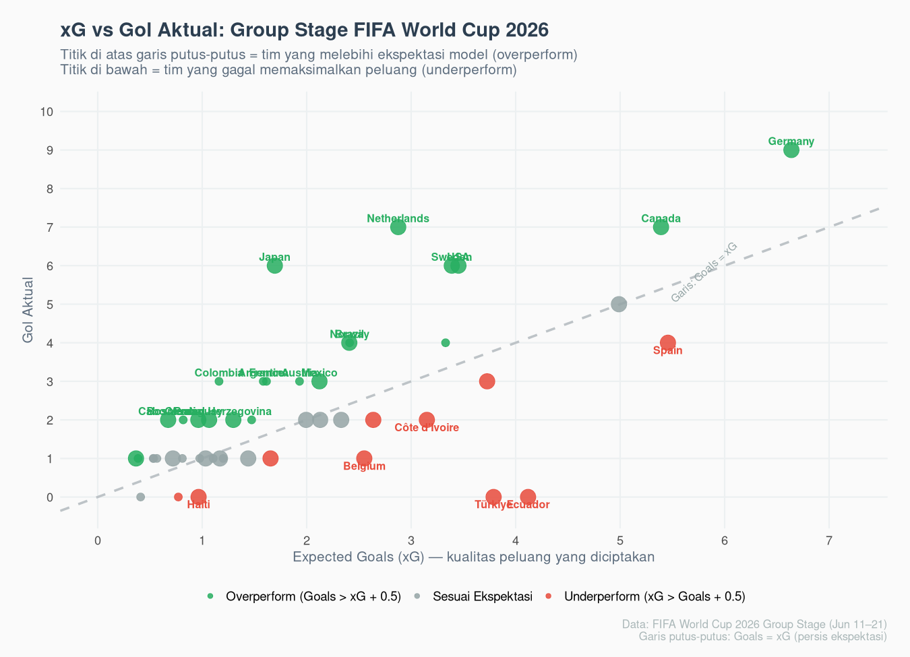
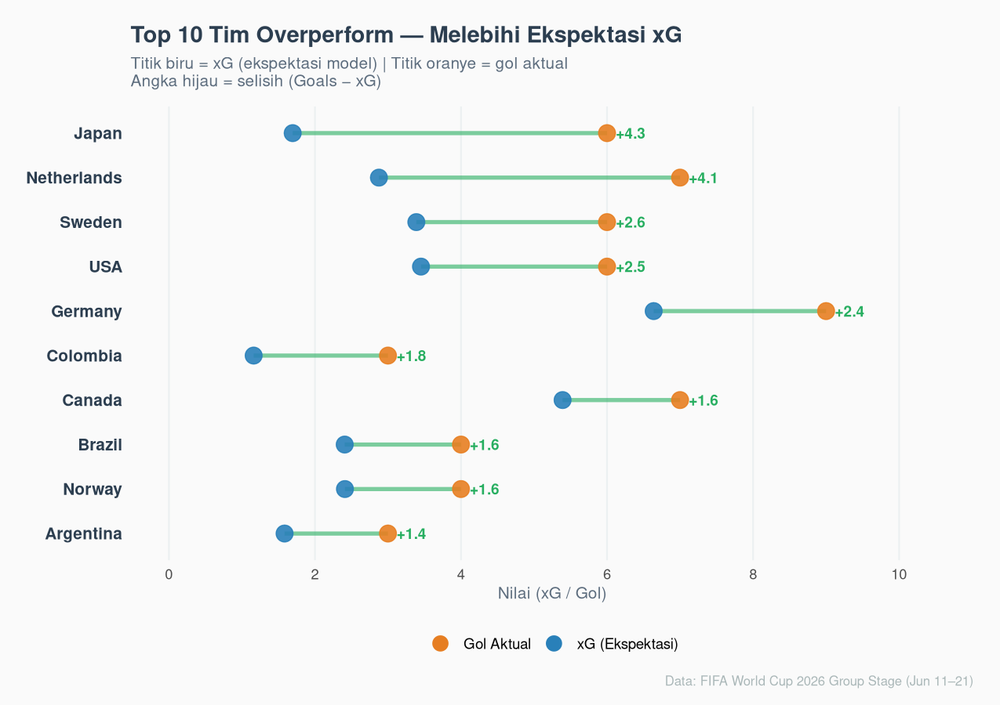
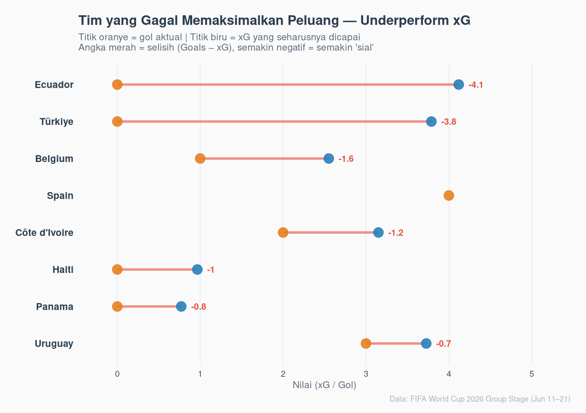
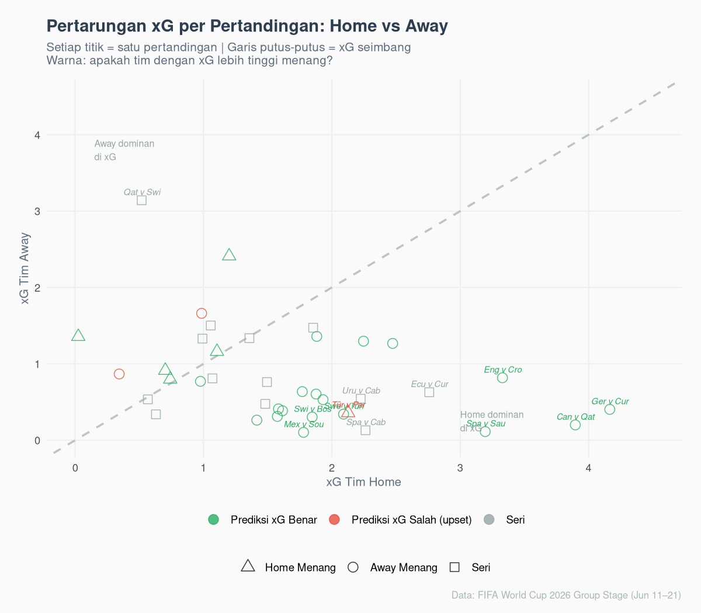

Tadi pagi, sembari menunggu si sulung di RS, saya buka laptop. Niat awalnya mau kerja tapi entah kenapa malah berakhir nonton *highlight* pertandingan Ekuador di Piala Dunia 2026.

> Satu hal yang menarik adalah: Ekuador bermain cukup baik. Mereka nyerang, punya peluang, tembakan ke gawang lumayan banyak. Tapi skor akhir? Nol.

Sementara di pertandingan lain, Jepang menang besar. Padahal kalau lihat jalannya pertandingan, mereka tidak terkesan mendominasi.

_Lho_, kok bisa?

---

## Kenalan Dulu dengan xG

Dalam dunia analitik sepakbola modern, ada satu metrik yang saya anggap paling jujur: **_Expected Goals_**, atau disingkat **xG**.

Bayangkan Anda sedang memasak. Anda punya semua bahan, resepnya sudah benar, suhu ovennya pas. Secara teori, kue Anda *harusnya* keluar sempurna.

> Tapi kadang kuenya gosong. Kadang malah lebih enak dari ekspektasi.

__xG__ bekerja dengan logika yang sama. Setiap kali ada tembakan dalam pertandingan, model __xG__ menghitung: *"dari situasi seperti ini, seberapa besar kemungkinan berbuah gol?"*

- Kalau tembakan dari jarak dekat tanpa penjaga = xG tinggi (~0.7–0.9).
- Kalau tembakan dari luar kotak dengan sudut sempit = xG rendah (~0.03–0.05).

**FIFA menghitung xG berdasarkan tujuh faktor utama:**

1. **Lokasi tembakan** — seberapa dekat dan seberapa lurus sudutnya ke gawang
2. **Bagian tubuh** — kaki dominan, kaki lemah, atau kepala punya probabilitas berbeda
3. **Jenis assist** — dari *cross*, *through-ball*, bola mati, atau *rebound*
4. **Situasi permainan** — *open play* vs tendangan bebas langsung vs penalti
5. **Tekanan bek** — apakah ada bek yang langsung menekan saat tembakan?
6. **Posisi kiper** — apakah kiper sudah siap?
7. **Fase serangan** — *counterattack* biasanya punya xG lebih tinggi karena pertahanan lawan belum tersusun rapi

Model ini dilatih dari **jutaan data tembakan historis** di pertandingan sepakbola top level dunia. Jadi angkanya bukan tebak-tebakan — ia adalah rata-rata dari ribuan situasi serupa yang pernah terjadi sebelumnya.

> Penalti = ~0.76 xG. Artinya dari 100 penalti, rata-rata 76 berbuah gol.
> Tembakan jarak jauh dengan sudut sempit = ~0.03 xG. Kalau masuk, itu lebih karena keberuntungan dari pada kualitas.

Intinya sederhana: **xG mencerminkan kualitas peluang, bukan kualitas nasib.**

---

## Data yang Kita Punya

_Grup Stage_ Piala Dunia 2026 masih berlangsung dari 11 hingga saat ini. Total ada **48 tim** bermain di **39 pertandingan** dengan format yang lebih besar dari edisi sebelumnya.

Kalau kita total semua angkanya:

- **Total gol yang tercetak**: 117
- **Total xG seluruh pertandingan**: 97.81

Secara agregat, turnamen ini *overperform* sekitar 20 gol dari ekspektasi. Artinya, secara keseluruhan, para penyerang di Piala Dunia 2026 cukup klinis.

Tapi di balik rata-rata itu, ada cerita-cerita ekstrem yang menarik.

```{r scatter, fig.cap="Scatter plot xG vs Gol Aktual — semua 48 tim grup stage", out.width="100%"}

```

Titik-titik **hijau** di atas garis putus-putus adalah tim yang mencetak lebih banyak gol dari yang seharusnya. Titik **merah** di bawah adalah tim yang harusnya lebih banyak mencetak gol — tapi tidak.

---

## Tim yang "Beruntung": Melampaui Ekspektasi

```{r overperformers, fig.cap="Top 10 tim overperform di grup stage", out.width="100%"}

```

Dari 48 tim, ada **22 tim** yang mencetak lebih banyak gol dari xG mereka (selisih > 0.5). Tapi beberapa tim ini *jauh* melampaui ekspektasi.

### Jepang: +4.30 dari xG

Ini yang paling ekstrem.

Jepang mencetak **6 gol** dari total xG hanya **1.70**. Artinya secara kualitas peluang, model memprediksi mereka harusnya hanya mencetak sekitar 1–2 gol. Tapi yang terjadi? Enam.

Kalau dianalogikan: bayangkan Anda punya bahan-bahan untuk membuat satu loyang kue, tapi entah bagaimana Anda berhasil menghasilkan enam.

Apakah Jepang bermain luar biasa? Bisa jadi. Tapi angka +4.3 itu luar biasa besarnya bahkan untuk standar tim elit sekalipun. Secara statistik, ini sulit dipertahankan di babak berikutnya.

### Belanda: +4.12 dari xG

Tujuh gol dari xG 2.88. Belanda tampak sangat *on fire* di fase grup — tapi sama seperti Jepang, ada pertanyaan besar: apakah ini level permainan mereka yang sebenarnya, atau keberuntungan sedang berpihak?

### Jerman: +2.36 dari xG — tapi dengan catatan berbeda

Ini ceritanya sedikit berbeda. Jerman mencetak **9 gol** dari xG **6.64**. Mereka memang *overperform*, tapi xG-nya sendiri sudah sangat tinggi. Artinya: Jerman bukan hanya beruntung — mereka memang menciptakan banyak peluang berkualitas *dan* klinis di depan gawang.

> **Artinya:** Ada dua jenis overperformer. Yang pertama adalah tim yang "beruntung" — peluangnya biasa saja tapi entah mengapa masuk. Yang kedua adalah tim yang memang dominan *dan* efisien. Jerman ada di kategori kedua. Jepang dan Belanda lebih ke kategori pertama.

---

## Tim yang "Sial": Peluang Banyak, Gol Nihil

```{r underperformers, fig.cap="Tim yang gagal memaksimalkan peluang mereka", out.width="100%"}

```

Dari sisi lain, ada **10 tim** yang jauh di bawah ekspektasi mereka.

### Ekuador: -4.12 dari xG

Kembali ke cerita awal saya.

Ekuador menciptakan peluang-peluang senilai total **4.12 xG**. Dalam bahasa sederhana: model memprediksi mereka harusnya mencetak sekitar 4 gol. Gol yang betul-betul tercetak? **Nol.**

Ini seperti seorang karyawan yang sudah kerja keras, hadir tepat waktu, menyelesaikan semua tugasnya — tapi tidak mendapat pengakuan apapun. Pekerjaannya nyata, hasilnya tidak tercermin.

Sayangnya, Ekuador tidak bisa memperbaiki ini lagi di fase gugur.

### Turki: -3.79 dari xG

Cerita yang hampir sama. xG 3.79, gol aktual: nol. Bayangkan frustrasi para pemain dan suporternya.

### Spanyol: -1.46 dari xG

Ini yang paling mengkhawatirkan dari sudut pandang "prediksi ke depan."

Spanyol *memang sudah lolos* dari grup. Dan mereka bukan tim yang kekurangan peluang — xG 5.46 adalah salah satu tertinggi di turnamen. Tapi hanya 4 gol yang tercetak.

Artinya: lini depan Spanyol belum tajam. Peluangnya ada, kreativitasnya ada, tapi finishing-nya belum klik. Jika ini tidak diperbaiki, mereka bisa bermasalah di babak gugur ketika setiap peluang jauh lebih berharga.

---

## Seberapa Akurat xG dalam Memprediksi Hasil?

Pertanyaan yang wajar muncul: kalau xG hanya model, seberapa bisa kita percaya?

```{r match_xg, fig.cap="xG per pertandingan: apakah tim dengan xG lebih tinggi menang?", out.width="100%"}

```

Dari **39 pertandingan** di grup stage ini (dengan mengabaikan hasil seri), tim yang memiliki xG lebih tinggi dalam satu pertandingan ternyata **menang di 88.5% kasus**.

Itu angka yang cukup tinggi.

Tapi 11.5% sisanya — itulah yang membuat sepakbola tetap menarik. Itulah Ekuador yang punya xG tinggi tapi kalah. Itulah Jepang yang punya xG rendah tapi menang besar.

> **Korelasi bukan kausalitas** — xG yang tinggi tidak *menyebabkan* kemenangan. Ia hanya *mencerminkan* dominasi permainan. Tim yang bermain lebih baik, menciptakan peluang lebih berkualitas, biasanya menang. Tapi "biasanya" bukan "selalu."

---

## Jadi, Apa yang Bisa Kita Simpulkan?

Ada tiga hal yang menurut saya penting dari data grup stage ini:

**1. Jangan terlalu percaya pada tim yang overperform besar.**

Jepang (+4.3) dan Belanda (+4.12) tampak dominan di fase grup. Tapi kalau kualitas peluang mereka tidak meningkat di babak gugur, ada risiko besar bahwa gol-gol yang selama ini "beruntung" masuk tidak akan terus datang.

**2. Jangan remehkan tim yang underperform.**

Spanyol dan Belgia *seharusnya* lebih berbahaya dari apa yang terlihat di papan skor. Jika mereka memperbaiki finishing, mereka bisa menjadi kejutan besar.

**3. xG adalah peta, bukan kenyataan.**

Peta yang bagus membantu kita navigasi. Tapi peta tidak bisa memprediksi bahwa ada jalan baru yang baru dibangun, atau bahwa ada kecelakaan di tengah jalan. xG memberi kita gambaran *seharusnya* — tapi sepakbola selalu punya cara untuk mengejutkan kita.

---

Setelah selesai menulis ini, saya tutup laptop dan balik lagi nonton *highlight*.

Kali ini Turki. Melihat betapa banyak peluang yang mereka sia-siakan, saya akhirnya mengerti kenapa angka-angka itu tidak pernah cukup untuk menjelaskan rasa frustrasi seorang suporter.

Data bicara. Tapi sepakbola tetap dimainkan di lapangan, bukan di spreadsheet.

---

*Data: FIFA World Cup 2026 Group Stage (11–21 Juni 2026). Analisis menggunakan R dan ggplot2.*
