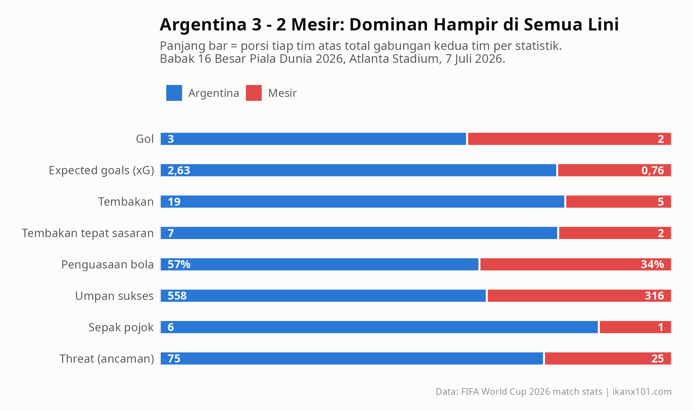
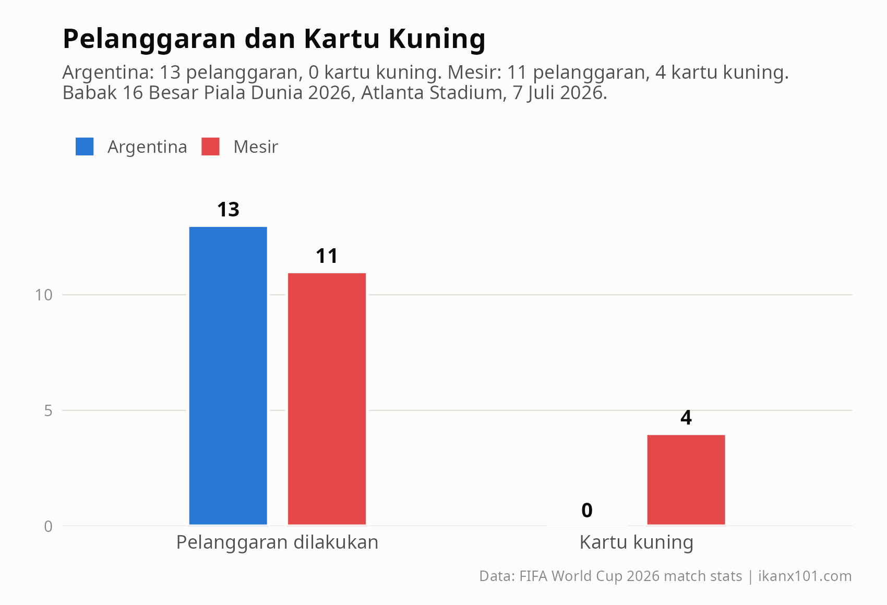
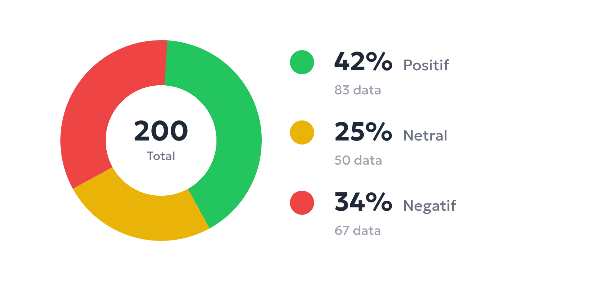
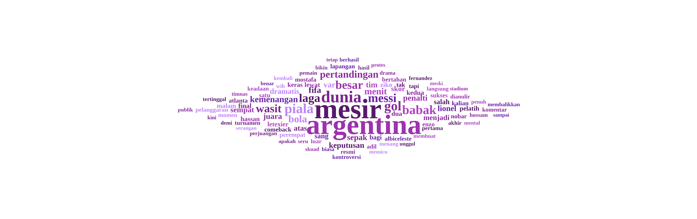
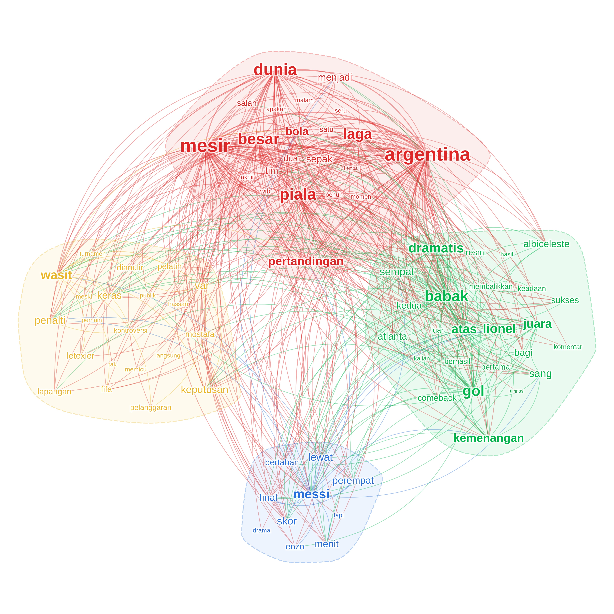

> Bayangkan kamu adalah Lionel Messi. Umurmu 39 tahun. Ini (hampir pasti) Piala Dunia terakhirmu. Timmu sedang tertinggal dari Mesir di babak 16 besar. Lalu wasit menunjuk titik putih. Seisi stadion Atlanta menahan napas. Kamu maju, mengambil ancang-ancang... gagal.

Malam itu, sang megabintang menolak jalan pintas. Untungnya bagi Argentina, mereka tetap menang 3-2 lewat _comeback_ dramatis.

Tapi bukan itu yang membuat _handphone_ saya ramai semalam.

Malam itu saya sedang asyik membaca berita-berita _update_ Piala Dunia di internet. Dari satu portal pindah ke portal lain, dari hasil pertandingan sampai klasemen, ujung-ujungnya saya nyasar ke media sosial. Dan di sanalah saya menemukan _timeline_ yang banjir dengan satu tema: __dugaan kecurangan wasit__. _"Gol Mesir dianulir, lalu Argentina diberikan penalti. Halooo?"_ Ada juga yang lebih berani: _"FIFA sudah tulis skripnya. Messi harus juara di Piala Dunia terakhirnya."_

_Wah wah wah. Seru nih..._

_Nah_, sebagai orang yang sehari-harinya bergelut dengan data, saya punya penyakit: kalau ada klaim yang ramai, tangan saya gatal ingin membuka datanya. Maka pagi ini saya lakukan dua hal:

1. Membuka __data statistik pertandingan__ dari situs FIFA: apa yang sebenarnya tercatat di lapangan?
1. Menarik __200 post Instagram__ dengan hashtag __#ArgentinavsMesir__ menggunakan [socialx.id/studio](https://www.socialx.id/studio), lalu mengolahnya dengan _text analysis_: sebenarnya netizen sedang membicarakan apa saja?

Satu _disclaimer_ sebelum mulai: tulisan ini __murni pemaparan data__. Saya tidak akan menghakimi wasitnya benar atau salah. Vonisnya saya serahkan ke pembaca sekalian.

_Cekidot!_

---

## Ronde 1: Apa yang Tercatat di Lapangan?

Laga digelar __7 Juli 2026 di Atlanta Stadium__. Biar adil, kita lihat dulu modal kedua tim menuju babak ini:

| Tim | Jalan menuju 16 besar |
| --- | --- |
| Argentina | 5 laga, menang semua |
| Mesir | 1 menang, 3 seri — spesialis laga alot |

Dan inilah potret 90 menit itu dalam satu gambar:

_Perbandingan statistik utama. Panjang bar menunjukkan porsi tiap tim._

Coba lihat baris demi barisnya. Ini bukan pertandingan yang imbang:

- __Tembakan 19 vs 5.__ Hampir empat kali lipat.
- __xG 2,63 vs 0,76.__ Buat yang belum familiar, _expected goals_ mengukur "nilai" seluruh peluang sebuah tim. Peluang-peluang Argentina malam itu setara 2-3 gol, dan mereka benar-benar mencetak 3. Nah yang menarik: peluang Mesir cuma senilai 0,76 gol, tapi mereka bisa mencetak 2. Dari kacamata xG, tim yang panen melebihi "jatahnya" malam itu justru Mesir.
- __Penguasaan bola 57% vs 34%__, umpan sukses __558 vs 316__, threat __75 vs 25__.

Satu detail lagi yang jarang dibahas: __keempat gol plus satu gol lainnya di laga ini, semuanya dari permainan terbuka__. Tidak ada satu pun gol dari titik putih — karena satu-satunya penalti di laga ini, ya itu tadi gagal dieksekusi Messi.

## Ronde 2: Jejak Sang Pengadil di Angka

Sekarang bagian yang ditunggu-tunggu. Klaim _netizen_ sejatinya bukan soal jumlah tembakan, melainkan soal __keputusan wasit__. Maka kita panggil statistik yang relevan: pelanggaran, kartu, dan penalti.

_Jumlah pelanggaran dan kartu kuning kedua tim._

Lengkapnya begini:

| Statistik | Argentina | Mesir |
| --- | --- | --- |
| Pelanggaran dilakukan | 13 | 11 |
| Kartu kuning | 0 | 4 |
| Kartu merah | 0 | 0 |
| Penalti diperoleh | 1  | 0 |

Dua fakta yang bisa kita dapatkan:

1. Jumlah pelanggaran kedua tim __berimbang__: 13 berbanding 11, bahkan Argentina yang lebih banyak melanggar. Tapi distribusi kartunya __timpang__: Mesir mengoleksi 4 kartu kuning, Argentina bersih tanpa kartu.
1. Argentina memperoleh satu hadiah penalti (di data FIFA tercatat `Penalties = 1` — eksekusi ulangan dihitung sebagai satu kejadian penalti). Dua kali percobaan Messi, dua-duanya gagal. Artinya: __keputusan penalti itu, seberapa pun ramainya diperdebatkan, tidak menyumbang satu gol pun ke papan skor__.

Simpan dua fakta itu dulu. Sekarang kita pindah dari lapangan ke linimasa.

---

## Ronde 3: Membedah 200 _Posts_ Instagram

Dari 200 _posts_ ber-_hashtag_ #ArgentinavsMesir yang saya tarik via [socialx.id/studio](https://www.socialx.id/studio), saya jalankan tiga analisis: _sentiment analysis_, _wordcloud_, dan _text network analysis_.

Satu hal yang perlu saya tekankan, analisa-analisa ini hanya berdasarkan _hashtag_ tersebut. Saya sangat yakin lebih banyak _netizen_ yang berkomentar dan melakukan analisa di sosial medanya. Tapi sayangnya saya tidak bisa (baca: mau) untuk mengambil keseluruhan data tersebut. 

Jadi ini bisa dikatakan __sebagai analisa terbatas yang bisa jadi ada biasnya__.

### Sentimen: Tiga Kubu di Satu Hashtag

_Hasil analisis sentimen 200 post #ArgentinavsMesir._

| Sentimen | Jumlah | Persentase |
| --- | --- | --- |
| Positif | 83 | 42% |
| Negatif | 67 | 34% |
| Netral | 50 | 25% |

Menarik ya. Kalau kamu hanya membaca _timeline_ yang riuh, kesannya seluruh dunia sedang marah. Datanya bilang lain: __post bernada positif justru kelompok terbesar__ (42%), disusul negatif (34%). Percakapannya terbelah, tidak ada satu nada yang mendominasi mutlak. Sepertiga yang bernada negatif itu nyata dan besar — tapi dia bukan mayoritas.

### _Wordcloud_: Satu Laga, Dua Cerita

_Wordcloud dari 200 post #ArgentinavsMesir._

Singkirkan dulu kata-kata generik (_mesir_, _argentina_, _piala_, _dunia_, _messi_). Sisanya membentuk dua cerita yang berjalan paralel:

1. __Cerita drama di lapangan__: _tertinggal_, _comeback_, _membalikkan_, _dramatis_, _kemenangan_, _gol_. Persis alur laganya — Argentina sempat tertinggal sebelum membalikkan keadaan.
1. __Cerita di meja wasit__: _wasit_, _penalti_, _var_, _dianulir_, _keputusan_, _pelanggaran_, _kontroversi_, sampai nama sang pengadil: _Letexier_. Kata _dianulir_ muncul menonjol — konsisten dengan ramainya pembahasan gol Mesir yang dibatalkan lewat VAR.

Dua ronde penalti Messi yang gagal itu juga meninggalkan jejak di sini: kata _penalti_ termasuk yang paling besar di luar nama kedua tim.

### _Text Network_: Memetakan Kubu-Kubu Percakapan

_Wordcloud_ hanya bilang kata apa yang sering muncul. Pertanyaan yang lebih menarik: kata-kata itu __bergerombol jadi topik apa__? Untuk itu saya buat _text network analysis_-nya:

_Network kata dari 200 post. Satu warna = satu *cluster* topik._

Algoritma menemukan __empat *clusters*__ percakapan:

| _Cluster_ | Kata kunci | Topik |
| --- | --- | --- |
| Merah | dunia, piala, mesir, argentina, laga | Obrolan umum soal laga |
| Kuning | wasit, penalti, var, dianulir, keputusan, letexier | Kepemimpinan wasit |
| Hijau | kemenangan, gol, comeback, dramatis, albiceleste | Kemenangan Argentina |
| Biru | messi, perempat, final, skor, menit | Messi dan laga berikutnya |

Ini bagian favorit saya. Perhatikan posisi *cluster* __kuning__ (wasit) dan __hijau__ (kemenangan): keduanya berada di sisi _network_ yang berjauhan, dengan sedikit sekali garis yang menghubungkan langsung. Artinya? __Dua topik ini dibicarakan oleh gerombolan akun yang berbeda.__ Yang sedang membedah keputusan Letexier hampir tidak menyinggung indahnya _comeback_; yang sedang merayakan gol nyaris tidak mampir ke urusan __VAR__. Satu pertandingan, dua realita, masing-masing dengan penontonnya sendiri.

Dua detail lain yang terbaca dari _network_:

- Di *cluster* kuning, ikut nimbrung nama-nama pemain Mesir: _Mostafa_, _Hassan_. Percakapan soal wasit lekat dengan insiden yang melibatkan pemain Mesir.
- *Cluster* biru menunjukkan sebagian netizen sudah _move on_: mereka sibuk menghitung peluang Messi di perempat final. _Hehe_.

---

## _Epilog_

Apakah semua ini berarti wasitnya adil? Atau sebaliknya? Seperti janji saya di awal: __itu bukan wilayah tulisan ini__. Angka-angkanya sudah saya hidangkan apa adanya, silakan kamu timbang sendiri. Lagipula _post_ instagram yang saya ambil hanyalah sebagian kecil dari banyaknya komen _netizen_.

Sampai jumpa di tulisan berikutnya!
