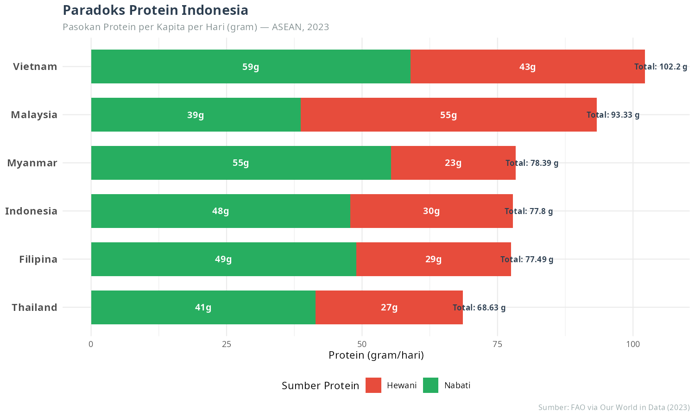
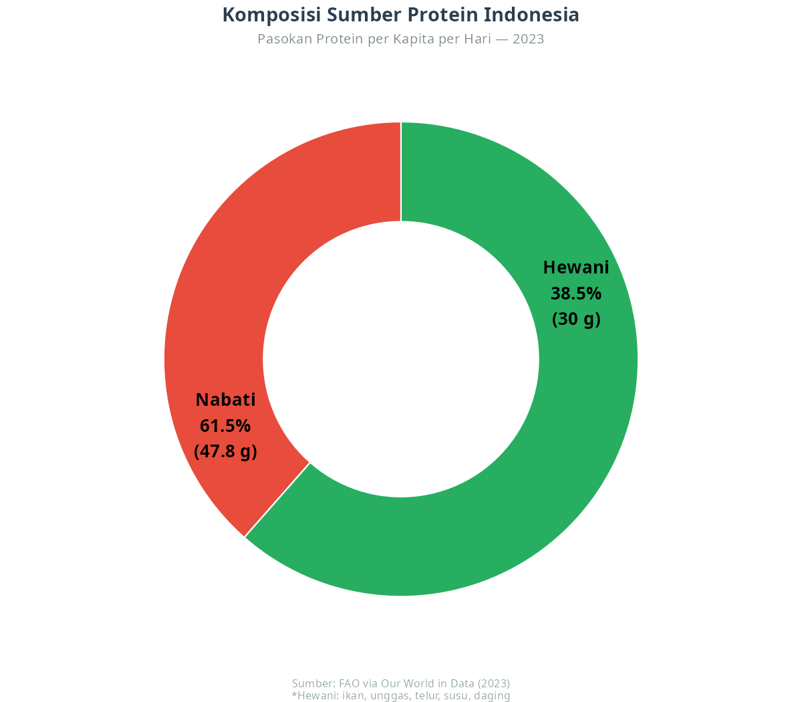
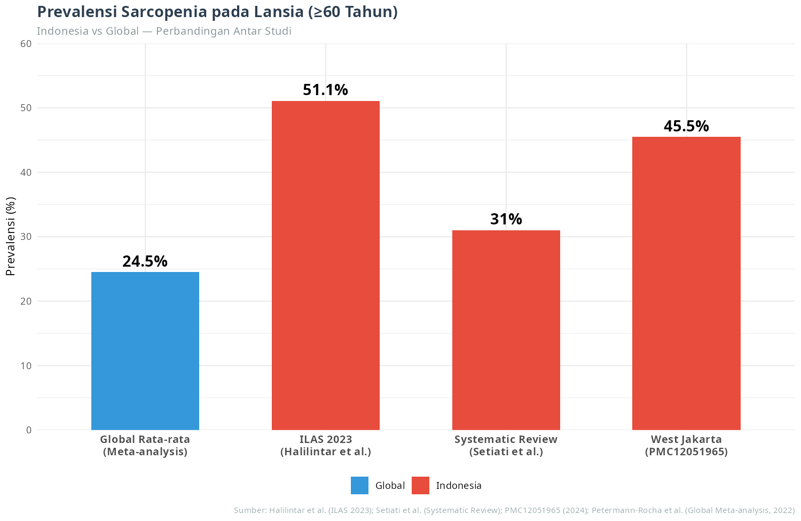
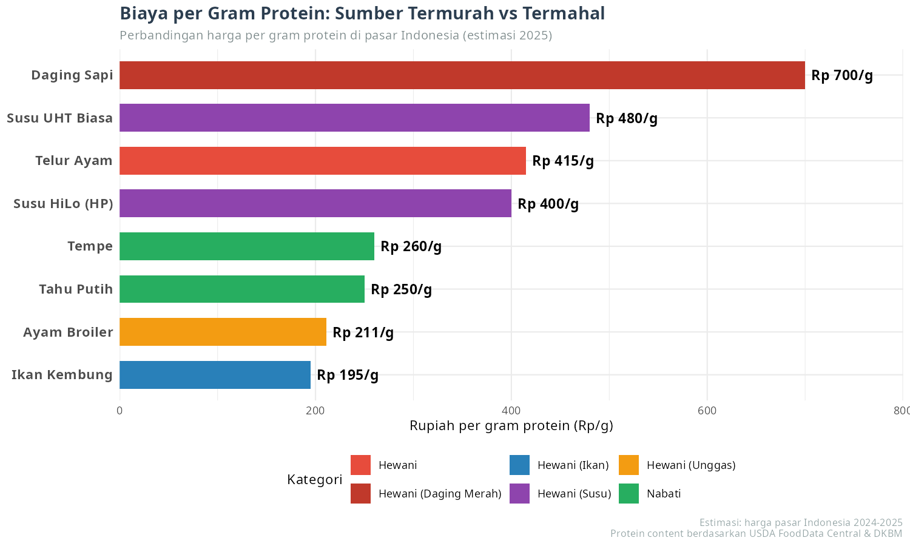

Artikel ini lahir dari sesi diskusi santai dengan _AI agent_ asisten pribadi saya. Dimulai dari sebuah pertanyaan sederhana: 

> _"Benarkah rakyat Indonesia kurang konsumsi daging?"_

Kemudian saya menelusuri beberapa data dan menguji dugaan saya hingga akhirnya mencoba merumuskan strategi untuk suatu produk nutrisi.

---

## Awal Mula: Benarkah Indonesia Kurang Makan Daging?

Saya membaca sekilas laporan __OECD__ yang menyebut konsumsi daging Indonesia rendah. Di benak saya langsung terbersit: **seberapa rendah?** Apakah ini masalah yang perlu dikhawatirkan, atau cuma statistik yang dibesar-besarkan?

Maka saya mulai mencari data tersebut.

### Data 1: Konsumsi Daging per Kapita di ASEAN (2023)

| Negara | Unggas | Sapi | Babi | Domba/Kambing | **Total Daging** |
|---|---|---|---|---|---|
| **Malaysia** | 51,90 | 8,75 | 7,24 | 1,17 | **69,07 kg** |
| **Vietnam** | 19,65 | 5,92 | 34,37 | 0,24 | **60,48 kg** |
| **Filipina** | 15,75 | 3,36 | 14,11 | 0,26 | **33,48 kg** |
| **Thailand** | 10,23 | 1,45 | 12,67 | 0,04 | **24,48 kg** |
| **Indonesia** | 15,95 | 3,01 | 0,56 | 0,41 | **19,95 kg** |
| **Myanmar** | 12,09 | 2,65 | 5,91 | 0,22 | **20,87 kg** |

*Sumber: FAO via Our World in Data (2023)*

**Indonesia berada di posisi terendah bersama Myanmar.** Konsumsi dagingnya hanya sekitar ~20 kg per orang per tahun. Bandingkan dengan Malaysia yang mencapai ~69 kg, lebih dari 3 kali lipat. Tapi apakah ini berarti kita kekurangan protein?

Jawabannya ternyata **tidak sesederhana itu**.

## Paradoks Protein: Konsumsi Daging Rendah, Tapi Protein Total Terpenuhi

Inilah titik di mana data mulai bicara hal yang menarik.

### Data 2: Pasokan Protein per Kapita per Hari (2023)

| Negara | Protein Total | Protein Hewani | Protein Nabati | % Hewani |
|---|---|---|---|---|
| Vietnam | 102,2 g | 43,2 g | 59,0 g | 42,3% |
| Malaysia | 93,3 g | 54,7 g | 38,7 g | 58,6% |
| Myanmar | 78,4 g | 23,1 g | 55,3 g | 29,4% |
| **Indonesia** | **77,8 g** | **30,0 g** | **47,8 g** | **38,5%** |
| Filipina | 77,5 g | 28,6 g | 48,9 g | 36,9% |
| Thailand | 68,6 g | 27,2 g | 41,4 g | 39,6% |

*Sumber: FAO via Our World in Data (2023)*

Perhatikan data Thailand:

> **Thailand konsumsi dagingnya 24,48 kg — lebih tinggi dari Indonesia 19,95 kg. Tapi protein total Thailand justru LEBIH RENDAH (68,6 g vs 77,8 g).**

Kok bisa?

Jawabannya ada di **ikan** dan **nabati**.

### Ikan: _"Senjata Rahasia"_ Protein Indonesia

Indonesia punya konsumsi ikan yang sangat tinggi. Pada 2021:

| Negara | Konsumsi Ikan (kg/kapita/tahun) |
|---|---|
| Malaysia | 52,3 kg |
| **Indonesia** | **41,1 kg** |
| Myanmar | 40,9 kg |
| Vietnam | 40,6 kg |
| Thailand | 28,6 kg |
| Filipina | 26,8 kg |

*Sumber: FAO via Our World in Data (2021)*

**Indonesia adalah konsumen ikan tertinggi kedua di ASEAN.** Dengan 41,1 kg per kapita per tahun, ikan menjadi sumber protein hewani utama yang menggantikan peran daging.

### Tahu Tempe: Pahlawan Protein Nabati

Ini yang membedakan Indonesia dari negara Asia Tenggara lainnya. Tahu dan tempe, terutama tempe hasil fermentasi, adalah makanan sehari-hari yang dikonsumsi lintas kelas sosial. Tempe memiliki **19-20 gram protein per 100 gram**. Angka ini setara dengan daging! Selain itu tahu, meskipun kandungan airnya lebih tinggi, tetap menjadi sumber protein yang murah dan mudah diakses.

Dari total 77,8 gram protein per hari:

- **61% dari nabati** (tahu, tempe, beras, kacang-kacangan)
- **39% dari hewani** (ikan, unggas, telur, susu, daging)

Ini adalah **paradoks protein Indonesia**: meskipun konsumsi daging terendah di ASEAN, protein total kita sehat karena kombinasi **ikan + nabati** yang sudah mendarah daging dalam pola makan tradisional.

---

## Bom Waktu [_Sarcopenia_](https://ikanx101.com/blog/sarcopenia-hilo/)

> **"Kenyang protein belum tentu cukup untuk otot."**

Kalau data rata-rata nasional menunjukkan kecukupan, kenapa saya merasa ada sesuatu yang tidak beres?

Jawabannya terletak pada **kualitas dan distribusi**.

Protein hewani (dari ikan, daging, telur, susu) memiliki **profil asam amino esensial yang lebih lengkap** dan **lebih mudah diserap** oleh tubuh manusia, terutama untuk **sintesis otot**. Protein nabati, meskipun baik, memerlukan kombinasi yang cermat agar asam aminonya seimbang.

Dan inilah masalahnya: **30 gram protein hewani per hari itu tidak cukup untuk menjaga massa otot, terutama pada lansia.**

Selain itu, saya kok merasa konsumsi protein pada data tersebut tidak mewakili keseluruhan populasi Indonesia. Tapi tentunya ini __menurut keyakinan__ saya _yah_, semoga saja saya salah.

### _Sarcopenia: The Silent Epidemic_

**Sarcopenia** adalah kondisi dimana seseorang mengalami penurunan massa, kekuatan, dan fungsi otot akibat penuaan. _Sarcopenia_ adalah ancaman yang tidak banyak dibicarakan di Indonesia. Tahun lalu saya pernah [menuliskan tentang hal ini di _blog_](https://ikanx101.com/blog/sarcopenia-hilo/).

| Studi | Sampel | Prevalensi |
|---|---|---|
| **ILAS 2023** (Halilintar et al.) | 1.598 lansia ≥60 tahun nasional | **51,1%** *possible sarcopenia* |
| **West Jakarta** (PMC12051965, 2024) | 334 lansia ≥60 tahun | ~**45,5%** |
| **Systematic Review** (Setiati et al.) | Multi-studi Indonesia | **9,1% - 53%** |
| **Global rata-rata** (Meta-analysis) | — | ~**24,5%** |

Dari hasil penelitian yang terbatas: **Satu dari dua lansia Indonesia berisiko sarcopenia.** Angka ini 2 kali lipat lebih tinggi dari rata-rata global.

Inilah yang saya sebut **bom waktu demografis**. Indonesia sedang menikmati bonus demografi (masa-masa di saat usia produktif mendominasi). Tapi 20-30 tahun lagi, tanpa intervensi pola makan dan gaya hidup, kita bisa menghadapi generasi lansia yang rapuh, rentan jatuh, kehilangan kemandirian. Akibatnya bisa membebani sistem kesehatan yang belum siap.

**Ironisnya**: hampir tidak ada yang peduli. Coba tanya orang di sekitar kita. Berapa banyak yang tahu istilah sarcopenia?

## Harga Protein: Kenapa Solusi "Beli Daging Saja" Itu Tidak Realistis

Ketika saya membahas temuan ini dengan AI asisten saya, ia menantang premis saya tentang harga. Dan ini membuka mata saya.

Mari kita lihat biaya per gram protein dari berbagai sumber makanan:

| Sumber Protein | Perkiraan Harga (Rp/kg) | Protein/100g | **Rp/gram protein** |
|---|---|---|---|
| Ikan Kembung | 35.000 | 18 g | **~195** |
| Tahu Putih | 5.000 | 8 g | **~250** |
| Tempe | 13.000 | 20 g | **~260** |
| Ayam Broiler | 38.000 | 18 g | **~211** |
| Susu HiLo (HP) | ~20.000/L | 5 g/100ml | **~400** |
| Telur Ayam | 2.500/butir | 6 g/butir | **~415** |
| Daging Sapi | 140.000 | 20 g | **~700** |

> **Fakta mengejutkan**: Tahu dan tempe justru lebih murah per gram protein daripada telur. Kemudia ikan kembung adalah sumber protein hewani termurah.

**Ini wawasan penting untuk strategi intervensi**: solusi yang paling realistis dan berkelanjutan bukanlah mengubah pola makan rakyat ke daging sapi atau susu mahal, melainkan **mengoptimalkan apa yang sudah ada**:

1. **Optimalkan konsumsi ikan lokal** (lele, kembung, tongkol, nila).
2. **Maksimalkan tahu dan tempe** — sumber protein nabati terbaik dan termurah.
3. **Edukasi kombinasi protein** — tidak perlu mahal untuk cukup.
4. **Suplemen protein hewani untuk segmen spesifik** — lansia perkotaan yang kesulitan mengunyah.

> Semoga saja program intervensi seperti __MBG__ bisa menggerakkan optimalisasi konsumsi asupan protein ini.

---

## Refleksi Tentang __Qurban__

Sebagai _muslim_, dalam hitungan minggu kita akan melaksanakan ibadah qurban. Tentu saja Qurban ini berlangsung setiap tahunnya. Di komplek saya (dan hampir di semua daerah di Indonesia), daging sapi qurban dibagikan ke semua warga sekitar tanpa memandang agama. Tradisi ini mulia baik secara spiritual maupun sosial.

Dalam konteks _sarcopenia_, apakah qurban bisa menjadi solusi?

> **Jawabannya: tidak secara struktural.**

Dengan ~1,8 juta ekor hewan qurban per tahun (~45.000 ton daging), dan penerima manfaat sekitar 20-25 juta jiwa, setiap penerima rata-rata mendapat ~2 kg daging. Jika dikonsumsi 50-100 gram per hari, itu hanya bertahan 20-40 hari. **Setahun penuh ada 325 hari tanpa daging qurban.**

Tapi ini **bukan berarti qurban tidak penting**. Justru sebaliknya — saya melihat **potensi besar yang belum sepenuhnya tergarap**:

> **Bagaimana jika kesadaran berqurban bisa meningkat? Bukan hanya sebagai ritual tahunan, tetapi sebagai gerakan sosial pangan yang lebih masif?**

Di negara dengan 240 juta penduduk muslim terbesar di dunia, peningkatan jumlah qurban bahkan 10-20% per tahun bisa menambah pasokan protein hewani gratis ke puluhan juta penerima. Ini adalah instrumen redistribusi protein yang unik dan tidak dimiliki negara lain.

Qurban tetaplah solusi parsial tapi potensinya bisa ditingkatkan jauh lebih besar jika kesadaran umat akan dimensi gizi dan kesehatannya ikut tumbuh.

> Jika tertarik membaca analisis lebih mendalam, saya pernah menulis tentang HiLo sebagai strategi mitigasi _sarcopenia_ di tautan berikut: [ikanx101.com/blog/sarcopenia-hilo](https://ikanx101.com/blog/sarcopenia-hilo/)

---

## Dari Data ke Arah: Implikasi untuk Produk Nutrisi

Saya bekerja di bidang _market research_, sudah jadi naluri saya setelah melihat data kemudian bertanya: **"Lalu apa yang bisa dilakukan?"**

### Masalah yang Teridentifikasi

1. **Protein total cukup** (77,8 g/hari) tapi **kualitas kurang optimal** karena 61% dari nabati. Selain itu distribusinya juga masih tanda tanya.
2. **Protein hewani hanya 30 g/hari**. Hal ini belum ideal untuk sintesis otot optimal.
3. **Prevalensi sarcopenia 51% pada lansia**. Hal ini mengindikasikan defisit kronis protein hewani yang baru terlihat di usia tua.
4. **Akses terbatas**, daging dan susu mahal, belum terjangkau semua lapisan.
5. **Kesadaran rendah**, _sarcopenia_ bukan kosakata umum.

### Peluang untuk Produk Seperti __Susu HiLo__

Dari paparan data di atas, __menurut *point of view* saya__ ada beberapa hal yang bisa dipertimbangkan dalam konteks strategi _marketing_. Tentu saya bukan menggurui justru sebaliknya, saya hanya ingin berbagi perspektif saja.

**Beberapa hal yang mungkin bisa dipertimbangkan:**

**Pertama**, pertimbangkan untuk **tidak menjual "sarcopenia"**. Ini bahasa medis yang menakutkan dan tidak relevan untuk sebagian besar konsumen. Sebagai gantinya, **jual "hidup aktif dan otot sehat untuk masa depan"** — lebih aspiratif, lebih positif, lebih relevan untuk target usia 30-50 tahun yang punya daya beli.

**Kedua**, manfaatkan **heritage brand yang sudah kuat**. HiLo sudah dikenal sebagai "susu untuk gerak aktif" sejak awal 2000-an. *Pivot* ke _high protein_ adalah langkah cerdas, tetapi jangan tinggalkan akar yang sudah dikenal itu. **"Gerak aktif + protein cukup"** adalah narasi yang lebih utuh daripada _"cegah sarcopenia"_.

**Ketiga**, bungkus dengan **budaya makan Indonesia**. Jangan memposisikan HiLo sebagai pengganti nasi, lauk, atau makanan tradisional. Justru sebisa mungkin ia hadir sebagai **pelengkap yang praktis**. Secara sederhana, bahasanya bisa dibuat seperti ini:

> "Sudah makan tahu tempe? Bagus. Tapi otot juga butuh protein hewani yang cukup. HiLo bisa bantu."

**Keempat**, sadari bahwa **solusi sejati ada pada yang sudah tersedia**: ikan murah, tahu, tempe, telur. HiLo bukan jawaban untuk seluruh Indonesia tapi ia adalah jawaban untuk **segmen spesifik** (urban, daya beli cukup, sudah sadar kesehatan) yang butuh **suplemen protein hewani praktis**.

## _Epilog_

Ada tiga hal yang saya bawa pulang dari diskusi ini:

**Pertama**, **data seringkali tidak sesederhana kelihatannya**. "Konsumsi daging rendah" terdengar seperti masalah — sampai Anda lihat bahwa konsumsi ikan Indonesia adalah yang tertinggi kedua di ASEAN. Konteks mengubah segalanya.

**Kedua**, **paradoks bukan kontradiksi**. Bahwa konsumsi daging rendah tapi protein total mencukupi bukanlah kesalahan data — ini adalah ciri khas pola makan Indonesia yang unik dan layak dipahami lebih dalam.

**Ketiga**, **dari problem framing, validasi data, sampai solusi — semuanya perlu dikerjakan dengan hati-hati**. Sebagai _data scientist_, godaan terbesar adalah cepat menyimpulkan. Tapi semakin dalam saya menggali, semakin saya sadar bahwa **pertanyaan yang tepat lebih penting daripada jawaban yang cepat**.

---
  
`if you find this article helpful, support this blog by clicking the ads.`

