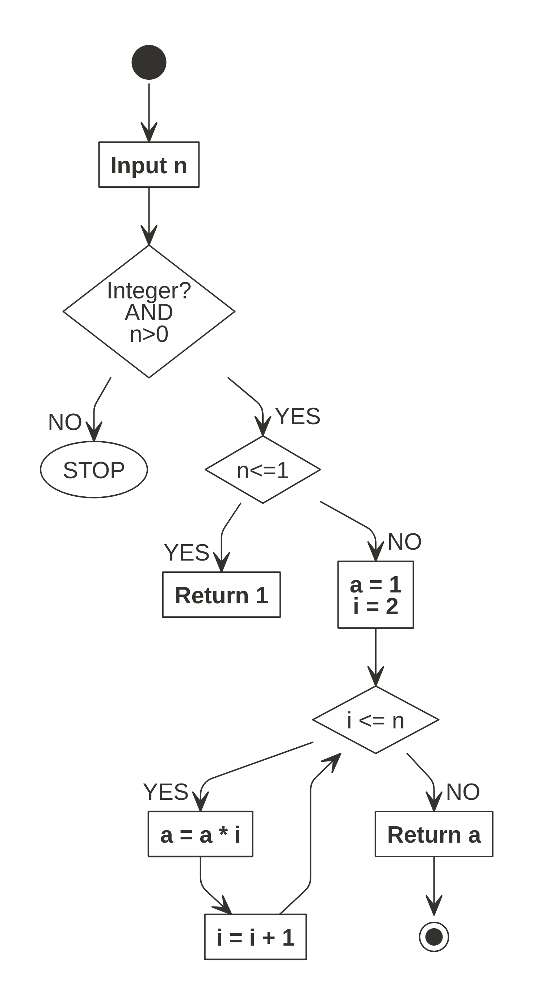

```{r setup, include=FALSE}
knitr::opts_chunk$set(echo = TRUE)
```

Saya memutuskan untuk membuat satu kategori baru di _blog_ saya, yakni: __pembahasan soal dan ujian__ di Sains Komputasi ITB saat saya kuliah beberapa saat lalu. Pada tulisan yang pertama ini, saya akan membahas tugas pertama yang sayadapatkan saat masuk magister di Sains Komputasi, yakni dari mata kuliah _Algorithm and Software Design_.

_Cekidot!_

---

# _TASK_ 1
## Soal
_Construct a flowchat to solve factorial problem!_

## Jawab

Untuk memudahkan pembuatan algoritma, kita akan melihat kembali definisi dari [faktorial](https://id.wikipedia.org/wiki/Faktorial) sebagai berikut:

$$n! = (n)(n-1)(n-2)..(1)$$

Dengan syarat $n \geq 0$ dan $n$ berupa _integer_. Namun perlu diperhatikan bahwa $0! = 1$.

Oleh karena itu, kita bisa menggunakan prinsip rekursif dengan algoritma dalam _pseudocode_ berikut ini:

### Algoritma dalam _Pseudocode_

```
INPUT n

IF n NOT INTEGER OR n < 0 STOP

IF n = 0 OR n = 1 RETURN 1

ELSE 

DEFINE a = 1

FOR i 2:n
  a = a*i
RETURN a
```

Bentuk _flowchart_ dari _pseudocode_ di atas adalah sebagai berikut:

```{r out.width="50%",echo=FALSE,fig.align='center',fig.cap = "Flowchart Faktorial"}

```

__R__ ___function___

Sekarang algoritma di atas jika dibuat __R__ _function_-nya adalah sebagai berikut:

```{r}
f_torial = function(n){
  # initial definition
  hasil = 1
  
  # conditional
  if(n < 0){hasil = "n yang dimasukkan < 0"}
    else if(n %in% c(0,1)){hasil = 1}
      else{
        for(i in 2:n){
          hasil = hasil*i
          }
      }
  
  # return output perhitungan
  output = list(
    `Input angka` = n,
    `n!` = hasil
  )
  
  # print output
  return(output)
}
```

Mari kita cek hasilnya dalam berbagai kondisi berikut:

```{r}
f_torial(-2)
f_torial(0)
f_torial(1)
f_torial(4)
f_torial(7)
f_torial(10)
```

# _TASK_ 2
## Soal
_Construct Pascal's triangle!_

## Jawab

Segitiga pascal adalah "segitiga" yang barisnya dibangun dari penambahan baris di atasnya (dengan baris teratas adalah bilangan 1). Berikut adalah ilustrasinya:

```{r out.width="80%",echo=FALSE,fig.align='center',fig.cap = "Pascal Triangle"}

```

Bagaimana cara membuatnya?

- Baris `1` berisi bilangan 1.
- Baris `2` berisi barisan bilangan dengan `2` elemen. Isinya adalah baris `1` di kanan dan kirinya.
- Baris `3` berisi barisan bilangan dengan `3` elemen. Isinya adalah baris `2` setelah kita tambahkan elemen baru di kanan dan kirinya.
- Baris `n` berisi barisan bilangan dengan `n` elemen. Isinya adalah baris `n-1` setelah kita tambahkan elemen baru di kanan dan kirinya.

### Algoritma dalam _Pseudocode_

```
INPUT n

x = 1

FOR i 2:n
  x = (0,x) + (x,0)
  OUTPUT x
```

### __R__ _function_

Berikut adalah fungsinya jika dibuat di __R__:

```{r}
pascal = function(n){
  # initial
  x = 1
  print(x)
  for(i in 2:n){
    x = c(0,x) + c(x,0)
    print(x)
  }
}
```

Mari kita coba dengan beberapa nilai:

```{r}
pascal(4)
pascal(8)
```