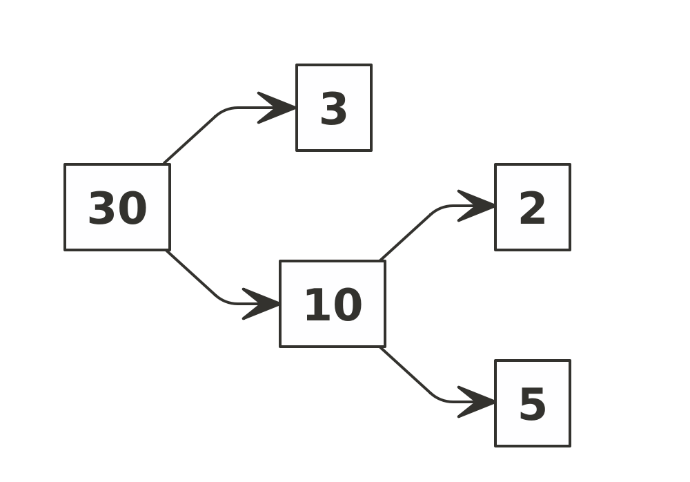
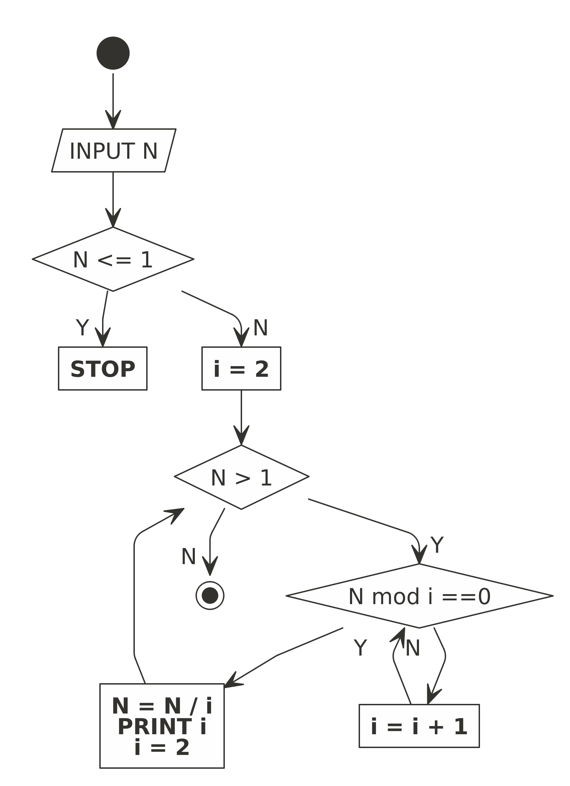

Belajar Membuat Algoritma Pencari Faktor Bilangan
================

> *Minggu depan kamu harus ngajarin si sulung faktor bilangan.*

Begitu titah nyonya tadi sore kepada saya.

Sekilas mencari faktor dari suatu bilangan adalah hal yang mudah. Kita
hanya perlu mencari himpunan bilangan terkecil dan *unique* yang
membangun bilangan tertentu. Caranya adalah dengan membagi bilangan
tersebut dengan bilangan yang lebih kecil dan memecahnya menjadi
bilangan yang lebih sederhana.

Kalau dipikir-pikir lagi, suatu faktor **pasti** merupakan [bilangan
prima](https://ikanx101.com/blog/prime-number/).

Sebagai contoh, misalkan kita hendak mencari faktor dari bilangan
*n* = 30.



Faktor dari bilangan 30 adalah (2, 3, 5) dan semuanya adalah bilangan
prima.

------------------------------------------------------------------------

## Algoritma

Mencari faktor mungkin hal yang mudah tapi bagaimana dengan **menuliskan
langkah kerja tersebut menjadi suatu algoritma**?

> Saya yakin ini hal yang lebih rumit dibanding menghitungnya. *hehe*

Oke, sekarang saya akan coba membuat algoritmanya dalam bentuk
*flowchart*. *Oh iya*, algoritma ini sebenarnya modifikasi dari
algoritma bilangan prima dari [*post* saya
sebelumnya](https://ikanx101.com/blog/prime-number/).



Dari *flowchart* di atas, kita akan buat *function* **R**-nya. Sekalian
saya juga akan hitung *processing time* dari algoritma ini.

``` r
cari_faktor = function(n){
  start = Sys.time()
  soal = n
  if(n <= 0){
    cat("Tidak boleh memasukkan nilai 0 atau negatif")
    break
  } else if(n == 1){
    cat("Anda memasukkan nilai 1")
    break
  } else{
    faktor = c()
    i = 2
    while(n > 1){
      if(n %% i == 0){
        n = n/i
        faktor = c(faktor,i)
        i = 2
      } else {i = i + 1}
    }
    faktor = unique(sort(faktor))
  }
  end = Sys.time()
  waktu = end - start
  # output
  output = list("n" = soal,
                "faktor yang dihasilkan" = faktor,
                "running time" = waktu)
  return(output)
}
```

Sekarang *moment of truth*, kita akan cek hasilnya untuk berbagai macam
bilangan.

``` r
cari_faktor(6)
```

    ## $n
    ## [1] 6
    ## 
    ## $`faktor yang dihasilkan`
    ## [1] 2 3
    ## 
    ## $`running time`
    ## Time difference of 0.0002169609 secs

``` r
cari_faktor(2021)
```

    ## $n
    ## [1] 2021
    ## 
    ## $`faktor yang dihasilkan`
    ## [1] 43 47
    ## 
    ## $`running time`
    ## Time difference of 0.0001013279 secs

``` r
cari_faktor(4552)
```

    ## $n
    ## [1] 4552
    ## 
    ## $`faktor yang dihasilkan`
    ## [1]   2 569
    ## 
    ## $`running time`
    ## Time difference of 0.0001661777 secs

``` r
cari_faktor(20922)
```

    ## $n
    ## [1] 20922
    ## 
    ## $`faktor yang dihasilkan`
    ## [1]   2   3  11 317
    ## 
    ## $`running time`
    ## Time difference of 0.0001146793 secs

``` r
cari_faktor(340673)
```

    ## $n
    ## [1] 340673
    ## 
    ## $`faktor yang dihasilkan`
    ## [1]  101 3373
    ## 
    ## $`running time`
    ## Time difference of 0.0006930828 secs

``` r
cari_faktor(1234567891011)
```

    ## $n
    ## [1] 1.234568e+12
    ## 
    ## $`faktor yang dihasilkan`
    ## [1]      3      7     13     67    107 630803
    ## 
    ## $`running time`
    ## Time difference of 0.1250334 secs

Terlihat *function* di atas berhasil menemukan faktor dari bilangan dan
*processing time*-nya masih dibawah 0.5 detik bahkan untuk bilangan
berdigit besar.

------------------------------------------------------------------------

`if you find this article helpful, support this blog by clicking the ads.`
