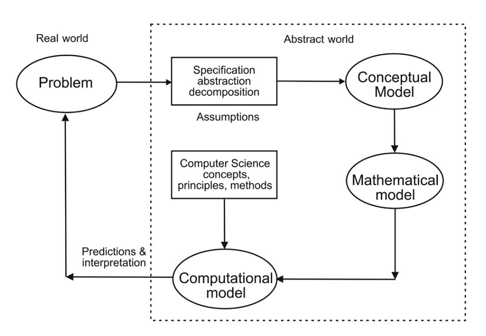
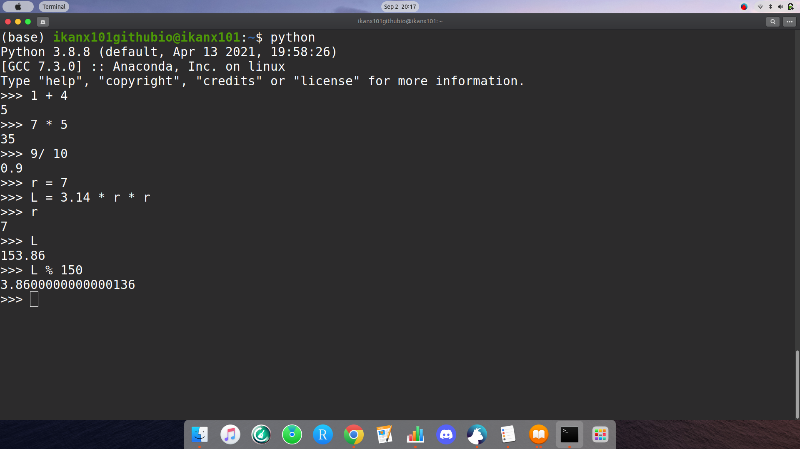

```{r setup, include=FALSE}
knitr::opts_chunk$set(echo = TRUE)
setwd("~/S2 Sains Komputasi ITB/Kuliah/Semester I/Pemrograman dalam Sains/Tugas/Minggu II/Summary Chapter I II")
library(dplyr)
library(ggplot2)
```

\newpage
\tableofcontents
\newpage
\listoffigures
\newpage

# CHAPTER I 
# _Problem Solving_ dan _Computing_ {.unlisted .unnumbered}

## _Introduction_

Dalam hidupnya, manusia pasti akan berhadapan dengan masalah. Tidak sedikit permasalahan yang membutuhkan penyelesaian secara komputasi sedangkan otak manusia memiliki keterbatasan dalam melakukan komputasi yang rumit. Oleh karena itu, mereka menciptakan suatu _tools_ yang dapat membantu mereka menyelesaikan masalah tersebut, salah satunya adalah _computer solution_ seperti _computer program_.

_Computer program_ berisi data dan sekumpulan perintah berupa algoritma untuk melakukan _well-defined tasks_.

_Computer program_ pada dasarnya menjalankan _computational model_, yakni implementasi dari model matematika yang diformulasikan untuk mencari solusi permasalahan. Biasanya _computational model_ membutuhkan _resource_ komputasi yang tinggi.

## _Computer Problem Solving_

_Problem solving_ adalah proses membuat solusi komputer dari masalah nyata. Hal yang paling menantang dari proses ini adalah memilih metode yang tepat untuk menyelesaikan permasalahan tersebut. 

Sebagai mana yang kita tahu ada istilah _no free lunch_, artinya metode penyelesaian setiap permasalahan adalah _unique_^[_No free lunch_: https://ikanx101.com/blog/no_free-lunch/].

```{r,echo=FALSE,warning=FALSE,message=FALSE,fig.align='center',fig.cap="Proses Problem Solving"}
nomnoml::nomnoml("
                 [Understand problem] -> [Describe problem]
                 [Describe problem] -> [Design algorithm]
                 [Design algorithm] -> [Develop computer\nsolution]
                 
                 [Describe problem|
                    [Form] -> [Clear]
                    [Form] -> [Complete]
                    [Form] -> [Unambiguous]
                    ]
                 ")
```

Algoritma adalah sekumpulan baris perintah untuk melakukan suatu proses komputasi dari suatu _data_ input sehingga menghasilkan data _output_. Algoritma bisa dituliskan dalam bentuk _pseudo-code_ atau _flowcharts_.

Program komputer ditulis berdasarkan algoritma yang telah dibuat sebelumnya dengan bahasa pemrograman tertentu.

## _Elementary Concepts_

Model adalah representasi dari sistem atau masalah. Bisa jadi model hanya berisi bagian tertentu saja dari sistem atau masalah. Suatu model bisa juga lebih sederhana dari masalah sebenarnya asalkan masih relevan dalam beberapa aspek.

> Bagaimana cara kita membuat model tersebut?

Sebenarnya dalam membuat suatu model dari permasalahan yang ada, prosesnya mirip dengan melakukan penelitian pada umumnya^[_Flow_ melakuan penelitian: https://ikanx101.com/blog/tujuan/]. Setidaknya ada beberapa tahapan sebagai berikut:

```{r out.width="100%",echo=FALSE,warning=FALSE,message=FALSE,fig.align='center',fig.cap="Flow Melakukan Research"}
knitr::include_graphics("proses riset.png")
```

Salah satu tahap kritis yang paling penting adalah tahapan pertama, yakni __formulasi masalah__.

> _Salah dalam memformulasikan masalah akan menimbulkan masalah bagi keseluruhan penelitian._

Di dalam _computational modelling_, formulasi masalah biasa disebut dengan _abstraction_. _Abstraction_ yang baik harus bisa mendapatkan elemen esensial dari permasalahan atau sistem.

Setelah kita berhasil melakukan _abstraction_, kita harus mulai berpikir bagaimana memformulasikan masalah tersebut dan mulai mencari solusi komputasinya. Proses ini disebut dengan _computational thinking_.

\newpage

Ada __empat pilar utama__ dalam _computational thinking_:

1. Dekomposisi.
    - Memecah masalah besar ke masalah-masalah yang lebih kecil sehingga lebih bisa di-_manage_.
1. _Pattern recognition_.
    - Menganalisa dan melihat apakah ada pola atau pengulangan.
1. _Algorithm design_
    - Menuliskan langkah-langkah dalam bentuk formal.
1. _Abstraction_
    - Memisahkan mana yang _important_, mana yang _less important_.


```{r,echo=FALSE,warning=FALSE,message=FALSE,fig.align='center',fig.cap="Elemen Computational Thinking"}
nomnoml::nomnoml("
                 [Computational Thinking] -> [Problem reasoning]
                 [Computational Thinking] -> [Describe/design\nmath solution]
                 [Describe/design\nmath solution] -> [Can be implemented in computer]
                 
                 [Computational Thinking] -> [Multi-disciplinary\nInter-disciplinary]
                 [Multi-disciplinary\nInter-disciplinary] -> [Required]
                 
                 [Computational Thinking] -> [Construct computational model]
                 ")
```

Setelah kita memformulasikan masalah dan membuat modelnya, untuk mendapatkan solusi kita bisa menempuh cara matematis. Sebagai contoh kita bisa mencari solusi dari model _predator-prey_^[Contoh model persamaan diferensial yang terkenal: https://en.wikipedia.org/wiki/Lotka%E2%80%93Volterra_equations] dengan menurunkan sendiri persamaan diferensial yang ada. Namun ada kalanya kita tidak bisa melakukan hal tersebut sehingga perlu ada penyelesaian dengan pendekatan numerik. Contoh sederhana adalah penggunaan Metode Newton yang memanfaatkan _Taylor's Series_ dan iterasi untuk mendapatkan akar suatu persamaan^[Metode Newton: https://ikanx101.com/blog/newton_method/].

Dari sinilah muncul istilah _computational science_ (sains komputasi). 

> Sains komputasi menggabungkan komsep dan prinsip dari matematika dan _computer science_ untuk diaplikasikan di bidang sains lain atau _engineering_.

```{r,echo=FALSE,warning=FALSE,message=FALSE,fig.align='center',fig.cap="Integrasi Sains Komputasi"}
nomnoml::nomnoml("
                 [Computer Science] -> [Computational Science]
                 [Sciences] -> [Computational Science]
                 [Applied Math] -> [Computational Science]
                 [Computational Science] <- [Engineering]
                 [Computational Science] <- [Other discipline]
                 ")
```

\newpage

## _Developing Computational Models_

```{r out.width="50%",echo=FALSE,warning=FALSE,message=FALSE,fig.align='center',fig.cap="Development of Computational Models"}

```

_Computational model_ dibangun secara iteratif. Maksudnya pada saat kita membuat modelnya, perlu ada proses _fine tuning_ (penyempurnaan) berkelanjutan agar model tersebut bisa merepresentasikan masalah atau sistem dengan baik.

```{r out.width="50%",echo=FALSE,warning=FALSE,message=FALSE,fig.align='center',fig.cap="Model development and Abstract Levels"}
knitr::include_graphics("Screenshot from 2021-09-01 09-50-50.png")
```

\newpage

## Contoh Kasus

Pada bagian ini saya sarikan contoh kasus yang ada pada buku, yakni:

1. _Converter_ Celcius ke Farenheit.
1. Perhitungan luas dan keliling lingkaran.

Untuk memudahkan proses _summary_, saya akan gunakan _framework_ sebagai berikut:

```{r out.width="100%",echo=FALSE,warning=FALSE,message=FALSE,fig.align='center',fig.cap="Framework Problem - Output"}
nomnoml::nomnoml("
                 [Masalah] -> [Tujuan]
                 [Tujuan] -> [Input]
                 [Input] -> [Proses]
                 [Proses] -> [Output]
                 [Tujuan] review <-- [Output] 
                 
                 [Proses|
                    [Function]
                    [Algorithm]
                    ]
                 
                 [Input|
                    [Data]
                    [Rules]
                    [Constraints]
                    [dsb]
                    ]
                    
                 ")
```

\newpage 

### _Converter_ Celcius ke Farenheit

#### _Initial Problem Statement_ {-}
Turis Eropa yang datang ke Amerika perlu mengetahui temperatur di kotanya berkunjung. Mereka butuh informasi temperatur dalam Farenheit sementara informasi temperatur yang ada dalam Celcius.

Dari _statement_ di atas, kita masukkan ke dalam _framework_ sebagai berikut:

- __Masalah__ 
    - Turis Eropa biasa menggunakan unit Farenheit sedangkan di Amerika menggunakan unit Celcius. Mereka perlu mengetahui berapa suhu udara di kotanya berkunjung (dalam Farenheit) menggunakan informasi temperatur dalam Celcius.
- __Tujuan__
    - Melakukan konversi temperatur Farenheit ke Celcius.
- ___Input___
    - Informasi yang dimiliki saat ini adalah temperatur udara dalam Celcius, misal dinotasikan sebagai $C$.
- __Proses__
    - Untuk melakukan konversi, saya akan membuat fungsi berikut ini: $F = \frac{9}{5}C + 32$.
- __Output__
    - Hasil akhir yang diharapkan adalah temperatur udara dalam unit Farenheit, yakni $F$.

Secara _simple_, algoritmanya adalah sebagai berikut:

```
INPUT C
COMPUTE F = (9/5)*C + 32
OUTPUT F
```

#### _Key Take Points_ {-}
Kasus ini adalah salah satu contoh kasus yang sangat _clear_ dalam hal komputasi (proses perhitungan) sehingga kita sudah tidak perlu lagi melakukan _fine tuning_ terhadap algoritma yang ada.

Untuk melakukan proses perhitungan, saya menggunakan fungsi matematis hubungan antara $F$ dan $C$. Fungsi matematis inilah yang sudah kita pelajari di kalkulus.

### Perhitungan Luas dan Keliling Lingkaran

#### _Initial Problem Statement_ {-}
Hitung luas dan keliling lingkaran dari suatu lingkaran berjari-jari $r$.

Dari _statement_ di atas, kita masukkan ke dalam _framework_ sebagai berikut:

- __Masalah__ 
    - Menggunakan informasi berupa jari-jari $r$, kita harus menghitung luas dan keliling lingkaran.
- __Tujuan__
    - Menghitung luas lingkaran.
    - Menghitung keliling lingkaran.
- ___Input___
    - Informasi yang dimiliki saat ini adalah jari-jari $r$.
- __Proses__
    - Untuk menghitung luas, kita gunakan fungsi $L = \pi r^2$.
    - Untuk menghitung keliling, kita gunakan fungsi $K = 2 \pi r$.
- __Output__
    - Hasil akhir yang diharapkan adalah luas $L$ dan keliling $K$.

Secara _simple_, algoritmanya adalah sebagai berikut:

```
INPUT r
COMPUTE L = pi * r^2
        K = 2 * pi * r
OUTPUT L
       K
```

## Kategori _Computational Models_

Seperti halnya model matematika, ada dua pendekatan yang bisa digunakan dalam membuat suatu fungsi, yakni:

1. _Continuous model_
    - Salah satu contoh dari model ini adalah model yang menggunakan persamaan diferensial.
1. _Discrete model_
    - Salah satu contoh dari model ini adalah pendekatan distribusi _Poisson_^[https://en.wikipedia.org/wiki/Poisson_distribution] untuk data gol tercipta dalam sebuah pertandingan sepakbola.
    
## _Software Life Cycle_

Dalam _software development_, kita bisa menggunakan _waterfall model_. Maksudnya adalah fase berikutnya tidak boleh jalan sebelum fase sebelumnya selesai.

```{r out.width="50%",echo=FALSE,warning=FALSE,message=FALSE,fig.align='center',fig.cap="Waterfall Model"}
knitr::include_graphics("Screenshot from 2021-09-01 11-54-45.png")
```

\newpage

Selain fase yang ada di _waterfall model_, ada fase lainnya yakni:

```{r out.width="100%",echo=FALSE,warning=FALSE,message=FALSE,fig.align='center',fig.cap="Fase Lain dalam Sorftware Life Cycle"}
nomnoml::nomnoml("
                 [Fase lain] -> [Analysis]
                 [Fase lain] -> [Design]
                 [Fase lain] -> [Implementation]
                 [Testing] -> [Fase lain]
                 [Installation] -> [Fase lain]
                 [Maintenance] -> [Fase lain]
                 ")
```

## _Design Modular_

Dalam membuat menghadapi suatu permasalahan yang kompleks, kita bisa menggunakan analogi _chocolate bar_^[https://towardsdatascience.com/how-to-solve-complex-problems-efficiently-629c71adcd8d]. 

> _If you have to solve a complex problem, you will want to cut it in the smallest pieces as possible, until reaching the most elementary ones, and then expand them little by little to understand the overall problem._

Di dalam buku ini istilah yang digunakan adalah _divide and conquer_. Sejatinya permasalahan yang kompleks bisa dipecah menjadi submasalah-submasalah kecil yang _manage-able_. Proses ini bisa kita sebut sebagai _decomposition_.

Oleh karena itu, _abstraction_ dan _decomposition_ memegang peranan penting dalam menyelesaikan masalah.

\newpage

```{r out.width="100%",echo=FALSE,warning=FALSE,message=FALSE,fig.align='center',fig.cap="Konsep Decomposition"}
knitr::include_graphics("Screenshot from 2021-09-02 07-08-45.png")
```

## Bahasa Pemrograman

Ada banyak bahasa pemrograman di dunia ini. Kita bisa memilih bahasa mana yang sesuai dengan kebutuhan, tujuan, kemampuan, dan permasalahan yang dihadapi. Sebagai contoh:

1. Saat seseorang membutuhkan _output_ berupa aplikasi mandiri (_executable file_), tentu dia tidak akan mempertimbangkan bahasa pemrograman MATLAB.
1. Saat seseorang membutuhkan _output_ hanya berupa _advance statistical analysis_ dari data yang ada, tentu dia tidak akan mempertimbangkan bahasa pemrograman Java atau C.

Salah satu istilah dalam bahasa pemrograman yang sering kita dengar adalah _high level programming language_. Apa artinya?

> _High level programming language_ adalah bahasa pemrograman yang bersifat _problem oriented_ dan bisa dijalankan tanpa ada keterbatasan di _hardware_. 

Salah satu ciri lainnya adalah penggunaan skrip yang lebih mirip _human language_ dibandingkan _machine language_^[https://www.bbc.co.uk/bitesize/guides/z4cck2p/revision/1].

_Python_ merupakan salah satu contoh _high level programming language_ yang memiliki __IDE__ beragam.

\newpage

### _Interpreter Python_

Interpreter adalah program yang digunakan untuk mengecek skrip yang ditulis dan langsung mengeksekusinya.

```{r out.width="50%",echo=FALSE,warning=FALSE,message=FALSE,fig.align='center',fig.cap="Contoh Python yang Dijalankan di Command Prompt"}

```

```{r out.width="50%",echo=FALSE,warning=FALSE,message=FALSE,fig.align='center',fig.cap="Contoh Python yang Dijalankan di Spyder IDE"}

```

\newpage

### _Compilers_

Berbeda dengan _interpreter_, _compiler_ adalah program yang mengubah bahasa pemrograman menjadi bahasa mesin sehingga bisa dijalankan oleh komputer. Salah satu contohnya adalah bahasa pemrograman Pascal yang memungkinkan kita meng-_compile_ algoritma menjadi _excecutable file_ (`.exe`).

## Presisi, Akurasi, dan Galat

Seperti yang telah kita ketahui bersama, solusi yang dihasilkan dalam _computational model_ bisa berasal dari metode penyelesaian numerik. Salah satu sifat dasar dari metode numerik adalah __aproksimasi__ (pendekatan). Oleh karena itu, kita harus mempertimbangkan galat (_error_) yang ada yakni: akurasi dan presisi.

```{r out.width="100%",echo=FALSE,warning=FALSE,message=FALSE,fig.align='center',fig.cap="Presisi, Akurasi, dan Galat"}
nomnoml::nomnoml("
                 [Presisi] -> [how closely a numeric value used\nrepresents the value itis representing]
                 [how closely a numeric value used\nrepresents the value itis representing] -> [Berapa digit angka yang digunakan\ndalam perhitungan numerik?]
                 [Akurasi] -> [how closely a number agrees with the true\nvalue of the number it is representing]
                 [how closely a number agrees with the true\nvalue of the number it is representing] -> [Berapa galat yang dihasilkan oleh\nperhitungan numerik?]
                 [Error] -> [Presisi]
                 [Error] -> [Akurasi]
                 
                 ")
```

Kita bisa menggunakan beberapa definisi galat atau _error_ tergantung dengan kebutuhan. Setidaknya ada dua _error_ yang biasanya digunakan:

- _Error_: selisih antara _true value_ dengan _approximate value_. 

Secara matematis kita tuliskan:

$$err = value_{true} - value_{approx}$$

- _Relative error_: _ratio_ dari _error_ terhadap _true value_. 

Secara matematis kita tuliskan: 

$$relative_{err} = \frac{err}{value_{true}} = \frac{value_{true} - value_{approx}}{value_{true}}$$

Salah satu kegunaannya adalah sebagai kriteria penghentian iterasi pada saat kita menggunakan metode numerik tertentu.

#### Misalkan {-}
Kita hendak mencari suatu akar persamaan menggunakan metode Newton. Kita akan _set_ terlebih dahulu berapa level akurasi yang masih bisa kita terima sehingga proses iterasi bisa berhenti saat aproksimasi yang dihasilkan sudah __sangat dekat__ dengan solusi sebenarnya^[https://ikanx101.com/blog/newton_method/].

### Jenis-Jenis Galat
Berikut adalah beberapa jenis galat yang bisa terjadi saat kita melakukan perhitungan numerik:

1. _Iteration error_.
1. _Approximation error_.
1. _Roundoff error_.
    - Yakni _error_ yang tercipta akibat adanya pembulatan^[https://hithaldia.in/faculty/sas_faculty/Mrs_Sumana_Mandal/Lecture%20Note%20(M(CS)301%20&%20M(CS)401).pdf].
    - Contoh:
        - Nilai _exact_ dari suatu variabel $x = 1.0104074$
        - Nilai hampiran atau pendekatannya adalah $\hat{x} = 1.0104$
        - Sehingga _error_ yang tercipta adalah $\Delta = 1.0104074 - 1.0104$

\newpage

# CHAPTER II
# _Simple Python Programs_ {.unlisted .unnumbered}

## _Introduction_

Setidaknya ada dua cara bagi kita untuk menuliskan _script_ Python, yakni:

```{r out.width="100%",echo=FALSE,warning=FALSE,message=FALSE,fig.align='center',fig.cap="Cara Scripting di Python"}
nomnoml::nomnoml("
                 [Python] -> [Interactive Mode]
                 [Python] -> [Script Mode]
                 
                 [Interactive Mode] -> [Langsung tereksekusi saat tekan enter]
                 
                 [Script Mode] -> [Menuliskan barisan perintah Python di skrip\nBisa menggunakan text editor lain\nuntuk kemudian dieksekusi di Python]
                 ")
```

Pada _summary_ chapter ini, saya akan melampirkan _screenshoot_ atas beberapa _script_ yang saya eksekusi di Python CLI menggunakan _terminal_. Versi Python yang saya gunakan adalah versi `Python 3.8.8` yang berjalan di OS `Ubuntu 20.04.2 LTS`.

```{r out.width="100%",echo=FALSE,warning=FALSE,message=FALSE,fig.align='center',fig.cap="Python CLI via Terminal"}

```

\newpage

## _Simple Operations_

Berikut adalah beberapa perintah atau fungsi dasar di Python.

### _Mathematical Operations_

Kita bisa menggunakan Python untuk melakukan perhitungan seperti halnya _calculator_. Berikut adalah contohnya:

```{r out.width="100%",echo=FALSE,warning=FALSE,message=FALSE,fig.align='center',fig.cap="Mathematical Operations"}

```

Jika kita perhatikan dengan baik, saya melakukan _assigning variable_ pada _script_ di atas dengan menggunakan perintah ` = `. Python juga bisa meng-_handle_ data berupa bilangan kompleks^[https://id.wikipedia.org/wiki/Bilangan_kompleks].

Bilangan kompleks biasa dinotasikan sebagai $z = a + bi$. Di Python didefinisikan sebagai `complex(x,y)` untuk $x$ dan $y$ suatu bilangan tertentu.

Misalkan: 

```
>>> complex(1,2)
(1+2j)
```

### _Advance Mathematical Operations_

Selain operator matematika dasar, kita juga bisa melakukan operasi matematika yang lebih _advance_ dengan memanfaatkan ___modul___ `math`. Kita bisa `import` ke dalam _environment_.

Contohnya:

```{r out.width="100%",echo=FALSE,warning=FALSE,message=FALSE,fig.align='center',fig.cap="Advance Mathematical Operations"}

```

Terkait penggunaan _power_ atau pangkat, ada aturan penulisan khusus di Python.

Misalkan $x^n . y . sin^{2m}(z)$ dengan $x,y,z$ suatu bilangan tertentu. Maka penulisannya adalah sebagai berikut:

```
>>> x = 2
>>> y = 1
>>> z = pi
>>> n = .5
>>> y = 2
>>> m = 3
>>> (x**n) * y * sin(z)**(2*m)
9.541356079099411e-96
```

\newpage

Demikian pula dengan akar kuadrat. Misalkan kita ingin menghitung $\sqrt{z . n + 3m}$ maka:

```
>>> sqrt(z*n + 3*m)
3.2512761074376466
```

### _Scientific Notation_

Dalam beberapa kasus numerik, ada kalanya kita menggunakan beberapa _scientific notation_. Misalkan kita hendak mendefinisikan galat yang bisa diterima. Misalkan $\epsilon = 10^{-5}$. Maka format penulisannya di Python adalah sebagai berikut:

```
>>> eps = 1e-5
>>> eps
1e-05
```

## _Programs_

Suatu program berisi dua komponen utama, yakni:

1. Pendefinisian data, dan
1. Sekumpulan perintah.

### Pendefinisian Data

Suatu program bisa berisi satu atau lebih data. Pendefinisian data dilakukan dengan _assign_ suatu _value_ ke dalam suatu _variable_.

Python bersifat _case sensitive_, maka penamaan variabel menjadi penting^[Panduan penamaan variabel di __R__ https://ikanx101.com/blog/train-r-4/#tata-cara-memberikan-nama-object-atau-variabel].

#### Tipe Data di Python

Sama halnya dengan __R__^[Tipe data di data sains https://ikanx101.com/blog/train-r-4/#tipe-data-di-r], ada empat tipe data, yakni:

1. `character`: merupakan tipe data berupa karakter atau string. Semua data bisa dilihat sebagai _character_. Oleh karena itu, secara hierarki tipe data ini ditempatkan di urutan paling atas. Namun, data tipe ini tidak bisa dilakukan operasi aritmatika.
1. `numeric`: merupakan tipe data angka mirip bilangan _real_. 
1. `integer`: merupakan tipe data angka berupa bilangan bulat. 
1. `logical`: merupakan tipe data _boolean_. Hanya berisi TRUE atau FALSE. Tipe data ini sangat berguna saat kita melakukan  _conditional_, _looping_, atau membuat _regex_ (_reguler expression_).

Secara hierarki: `character > numeric > integer > logical`.

Untuk mengecek suatu variabel merupakan tipe data apa, kita bisa menggunakan perintah `type()`. Contohnya:

```
>>> x = 5
>>> type(x)
int
>>> y = "halo"
>>> type(y)
str
>>> z = True
>>> type(z)
bool
```

### _Assignment Variable_

_Assignment_ suatu variabel dilakukan dengan perintah `=`. Prinsip dasarnya adalah:

`variable = expression`

Saya telah menuliskan beberapa contoh di bagian-bagian sebelumnya.

### Perintah Dasar _Input_ dan _Output_

#### _Input_ {-}

_Input statement_ berguna untuk membaca masukan dari _user_. Bentuknya adalah _prompted_ sehingga user harus memasukkan _value_ yang diinginkan.

Misalkan:

```
>>> usia = input("Berapa usia Anda: ")
Berapa usia Anda:
```

Jika kita masukkan suatu _value_, maka _value_ tersebut akan _assigned_ ke variabel `usia`.

#### _Output_ {-}

Untuk membuat _output_ dari suatu variabel, kita bisa menggunakan perintah `print(variable)`.

Contohnya adalah sebagai berikut:
```
>>> print(y)
halo
>>> print("nilai x adalah ", x)
nilai x adalah 5
```

### Contoh Membuat _Script_

Kita bisa membuat _script_ di _software_ _text editor_ lalu menyimpannya dalam format `.py` untuk kemudian di-_run_ di _interpreter_.

Saya akan berikan contoh sederhana program yang bertujuan untuk menghitung _body mass index_ seseorang.

```
nama = input("Masukkan nama Anda: ")
berat = input("Masukkan berat badan Anda: ")
tinggi = input("Masukkan tinggi badan Anda: ")

berat = int(berat)
tinggi = int(tinggi)

bmi = berat / (tinggi/100)**2
bmi = round(bmi,2)

print("Yth. Bpk/Ibu ",nama,", BMI Anda adalah sebesar: ",bmi)
```

Saya akan simpan _script_ di atas bernama `bmi.py`.

Jika saya ingin memanggilnya di _terminal_ tanpa harus membuka _script_, saya cukup ketikkan:

```
python bmi.py
```

Berikut adalah tampilannya:

```{r out.width="80%",echo=FALSE,warning=FALSE,message=FALSE,fig.align='center',fig.cap="Run .py di Terminal Linux"}

```

\newpage

## Contoh Program Sederhana

Dari buku, ada beberapa program sederhana yang dicontohkan, yakni:

1. _Converter_ temperatur Celcius ke Farenheit.
1. Penghitung _Euclidean distance_ antara dua titik koordinat $(x_1,y_1)$ dan $(x_2,y_2)$.

Untuk memudahkan penjelasan, saya akan gunakan kembali ___framework problem - output___ pada `Figure 7`.

### _Converter_ Celcius ke _Farenheit_

Maka bentuk programnya adalah sebagai berikut:

```
celcius = input("Masukkan temperatur dalam Celcius: ")
celcius = int(celcius)
far = celcius * (9.0/5.0) + 32.0

print("Suhu dalam Celcius: ",celcius,", sedangkan dalam Farenheit menjadi: ",far)
```

Saya simpan skrip di atas dengan nama `cel_far.py`. Jika saya _run_ di _terminal_:

```{r out.width="100%",echo=FALSE,warning=FALSE,message=FALSE,fig.align='center',fig.cap="Run Converter Celcius Farenheit di Terminal Linux"}

```

\newpage

### Penghitung _Euclidean Distance_

Dari _statement_ di atas, kita masukkan ke dalam _framework_ sebagai berikut:

- __Masalah__ 
    - Menghitung jarak antara dua titik koordinat $(x_1,y_1)$ dan $(x_2,y_2)$. 
- __Tujuan__
    - Menghitung jarak antara dua titik koordinat $(x_1,y_1)$ dan $(x_2,y_2)$.
- ___Input___
    - Titik $(x_1,y_1)$ dan $(x_2,y_2)$.
- __Proses__
    - Untuk menghitung jarak, kita akan gunakan teorema Phytagoras $jarak = \sqrt{(x_1 - x_2)^2 + (y_1 - y_2)^2}$.
- __Output__
    - Hasil akhir yang diharapkan adalah nilai $jarak$.

Misalkan saya memiliki titik $(1,4)$ dan $(5,10)$ sebagai berikut:

```{r,echo=FALSE,warning=FALSE,message=FALSE,fig.align='center',fig.cap="Ilustrasi Perhitungan Jarak"}
data = data.frame(x = c(1,5),
                  y = c(4,10))

data %>% 
  ggplot(aes(x,y)) +
  geom_point(size = 5) +
  coord_equal() +
  xlim(0,12) +
  ylim(0,12) +
  geom_line(linetype = 2,
            size = .25,
            color = "darkred") +
  geom_segment(x = 1, xend = 5,
               y = 4, yend = 4,
               color = "steelblue",
               linetype = 2) +
  geom_segment(x = 5, xend = 5,
               y = 4, yend = 10,
               color = "steelblue",
               linetype = 2)

```

Jarak kedua titik bisa dipandang sebagai sisi miring dari segitiga siku-siku yang dibentuk.

\newpage

Secara _simple_, _script_-nya adalah sebagai berikut:

```
x1 = input("Masukkan titik koordinat x1: ")
y1 = input("Masukkan titik koordinat y1: ")
x2 = input("Masukkan titik koordinat x2: ")
y2 = input("Masukkan titik koordinat y2: ")

x1 = int(x1)
x2 = int(x2)
y1 = int(y1)
y2 = int(y2)

del_x = (x1-x2)**2
del_y = (y1-y2)**2

import math
jarak = math.sqrt(del_x + del_y)

print("Jarak antara kedua titik adalah: ",jarak)
```

Saya simpan sebagai _file_ bernama `jarak.py`. Jika saya _run_ di _terminal_, berikut hasilnya:

```{r out.width="100%",echo=FALSE,warning=FALSE,message=FALSE,fig.align='center',fig.cap="Run Program Jarak di Terminal Linux"}
knitr::include_graphics("Screenshot from 2021-09-03 08-59-28.png")
```

\newpage

## Struktur Umum Program Python

Secara umum, berikut adalah urutan isi program Python:

```{r out.width="100%",echo=FALSE,warning=FALSE,message=FALSE,fig.align='center',fig.cap="Struktur Program Python"}
nomnoml::nomnoml("#direction:down,
                 [Import Commands] -> [Global Data]
                 [Global Data] -> [Function]
                 [Function] -> [Instruction]
                 
                 [Function|
                  Adakalanya kita menggunakan beberapa set perintah secara berulang kali\nUntuk memudahkan penulisan skrip, kita bisa buat function\nagar lebih efisien dalam penulisan kodenya
                  ]
                 
                 [Global Data|
                  Data atau object yang diassign ke dalam\nGLobal environment python
                  ]
                  
                 [Import Commands|
                  Tidak ada kewajiban untuk melakukan hal ini.|
                  Disesuaikan dengan kebutuhan komputasi dan\npermasalahan yang dihadapi
                  ]
                 ")
```

\newpage

## Pendefinisian _Function_

Pada Python, kita bisa membuat _custom function_ sendiri. Gunanya adalah agar _set_ perintah yang biasa kita gunakan berulang bisa menjadi lebih singkat penulisannya.

Struktur menuliskannya adalah sebagai berikut:

```
def function_name ( [parameters] ) :
  [ local declarations ]
  [ executable language statements ]
```

Kita buat contoh saja dari permasalahan di bagian sebelumnya, yakni konversi suhu. Saya akan membuat satu _function_ untuk itu.

```
def convert (c):
	f = c * (9.0/5.0) + 32.0
	return(f)
	
celcius = input("Masukkan temperatur dalam Celcius: ")
celcius = int(celcius)
print("Suhu dalam Celcius: ",celcius,", 
      sedangkan dalam Farenheit menjadi: ",convert(celcius))
```

\newpage

Saya simpan dalam file bernama `cel_far_func.py`. Berikut jika saya _run_ dalam _terminal_:

```{r out.width="100%",echo=FALSE,warning=FALSE,message=FALSE,fig.align='center',fig.cap="Run Program Celcius Farenheit dalam Function"}

```

\center
# == End == {.unlisted .unnumbered}