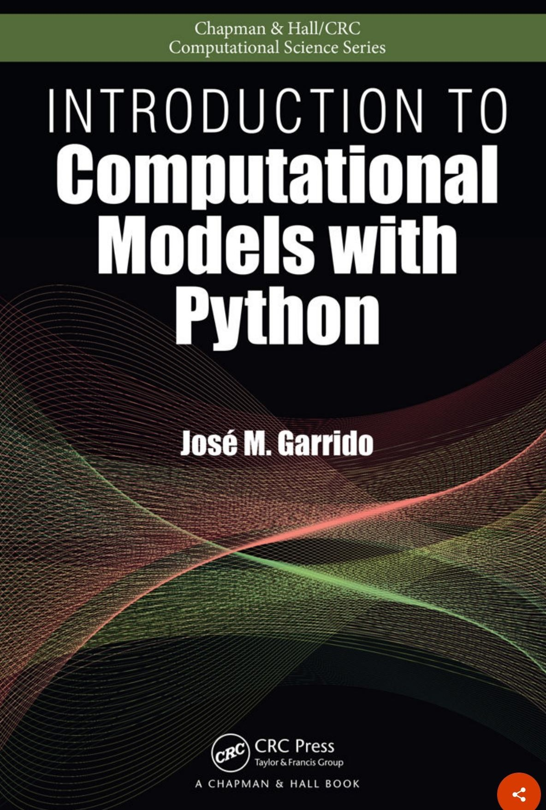
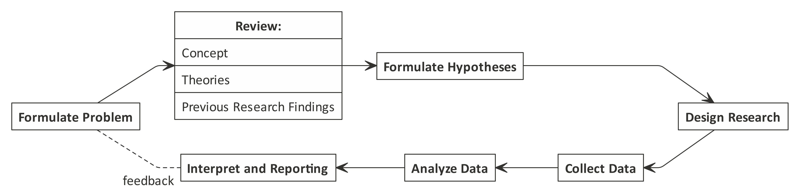
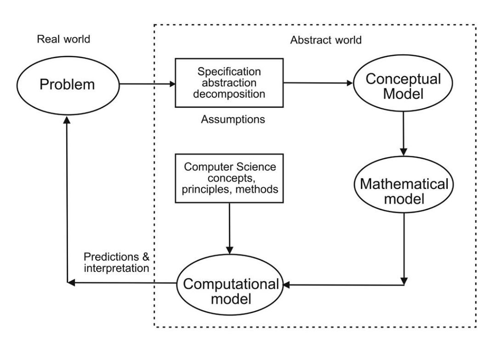
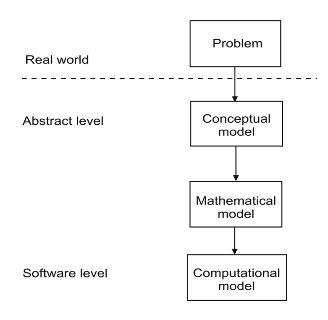
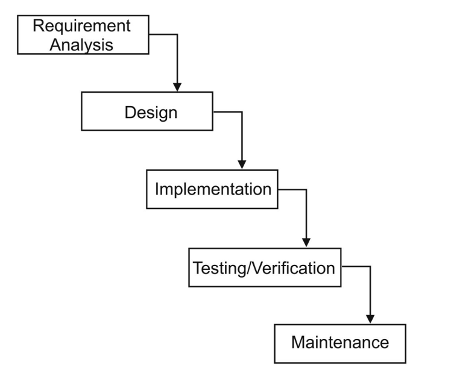
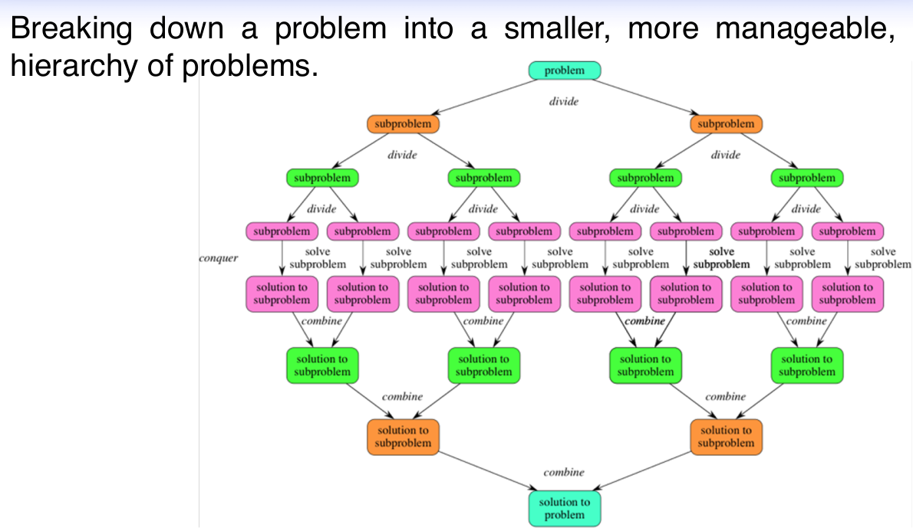

```{r setup, include=FALSE}
knitr::opts_chunk$set(echo = TRUE)
setwd("~/ikanx101 BLOG/_posts/matematika ITB/algoritma/Garrido I")
rm(list=ls())
```

Pada minggu-minggu awal perkuliahan pemrograman dalam sains, kami diminta untuk merangkum satu buku yang akan dijadikan rujukan dalam kuliah ini, yakni: ___INTRODUCTION TO COMPUTATIONAL MODELS WITH PHYTON___ karya __Jose M. Garrido__.

```{r out.width="25%",echo=FALSE,fig.align='center'}

```

Walaupun buku ini ditulis untuk bahasa _Python_, tapi pada __chapter I__ ini berlaku sangat _general_ karena ditekankan pada _computational thinking_.

Saya rasa sangat sayang jika rangkuman ini hanya ada di _drive_ laptop saja. Jadi saya akan coba _share_ rangkumannya ditambah dengan beberapa materi yang sudah saya pernah dapatkan dari sumber lainnya. Selamat membaca.

---

# _Problem Solving_ dan _Computing_ 

## _Introduction_

Dalam hidupnya, manusia pasti akan berhadapan dengan masalah. Tidak sedikit permasalahan yang membutuhkan penyelesaian secara komputasi sedangkan otak manusia memiliki keterbatasan dalam melakukan komputasi yang rumit. Oleh karena itu, mereka menciptakan suatu _tools_ yang dapat membantu mereka menyelesaikan masalah tersebut, salah satunya adalah _computer solution_ seperti _computer program_.

_Computer program_ berisi data dan sekumpulan perintah berupa algoritma untuk melakukan _well-defined tasks_.

_Computer program_ pada dasarnya menjalankan _computational model_, yakni implementasi dari model matematika yang diformulasikan untuk mencari solusi permasalahan. Biasanya _computational model_ membutuhkan _resource_ komputasi yang tinggi.

## _Computer Problem Solving_

_Problem solving_ adalah proses membuat solusi komputer dari masalah nyata. Hal yang paling menantang dari proses ini adalah memilih metode yang tepat untuk menyelesaikan permasalahan tersebut. 

Sebagai mana yang kita tahu ada istilah _no free lunch_, artinya metode penyelesaian setiap permasalahan adalah _unique_^[_No free lunch_: https://ikanx101.com/blog/no_free-lunch/].

```{r,echo=FALSE,warning=FALSE,message=FALSE,fig.align='center',fig.cap="Proses Problem Solving"}
nomnoml::nomnoml("
                 [Understand problem] -> [Describe problem]
                 [Describe problem] -> [Design algorithm]
                 [Design algorithm] -> [Develop computer\nsolution]
                 
                 [Describe problem|
                    [Form] -> [Clear]
                    [Form] -> [Complete]
                    [Form] -> [Unambiguous]
                    ]
                 ")
```

Algoritma adalah sekumpulan baris perintah untuk melakukan suatu proses komputasi dari suatu _data_ input sehingga menghasilkan data _output_. Algoritma bisa dituliskan dalam bentuk _pseudo-code_ atau _flowcharts_.

Program komputer ditulis berdasarkan algoritma yang telah dibuat sebelumnya dengan bahasa pemrograman tertentu.

## _Elementary Concepts_

Model adalah representasi dari sistem atau masalah. Bisa jadi model hanya berisi bagian tertentu saja dari sistem atau masalah. Suatu model bisa juga lebih sederhana dari masalah sebenarnya asalkan masih relevan dalam beberapa aspek.

> Bagaimana cara kita membuat model tersebut?

Sebenarnya dalam membuat suatu model dari permasalahan yang ada, prosesnya mirip dengan melakukan penelitian pada umumnya^[_Flow_ melakuan penelitian: https://ikanx101.com/blog/tujuan/]. Setidaknya ada beberapa tahapan sebagai berikut:

```{r out.width="100%",echo=FALSE,warning=FALSE,message=FALSE,fig.align='center',fig.cap="Flow Melakukan Research"}

```

Salah satu tahap kritis yang paling penting adalah tahapan pertama, yakni __formulasi masalah__.

> _Salah dalam memformulasikan masalah akan menimbulkan masalah bagi keseluruhan penelitian._

Di dalam _computational modelling_, formulasi masalah biasa disebut dengan _abstraction_. _Abstraction_ yang baik harus bisa mendapatkan elemen esensial dari permasalahan atau sistem.

Setelah kita berhasil melakukan _abstraction_, kita harus mulai berpikir bagaimana memformulasikan masalah tersebut dan mulai mencari solusi komputasinya. Proses ini disebut dengan _computational thinking_.

Ada __empat pilar utama__ dalam _computational thinking_:

1. Dekomposisi.
    - Memecah masalah besar ke masalah-masalah yang lebih kecil sehingga lebih bisa di-_manage_.
1. _Pattern recognition_.
    - Menganalisa dan melihat apakah ada pola atau pengulangan.
1. _Algorithm design_
    - Menuliskan langkah-langkah dalam bentuk formal.
1. _Abstraction_
    - Memisahkan mana yang _important_, mana yang _less important_.
    

```{r,echo=FALSE,warning=FALSE,message=FALSE,fig.align='center',fig.cap="Elemen Computational Thinking"}
nomnoml::nomnoml("
                 [Computational Thinking] -> [Problem reasoning]
                 [Computational Thinking] -> [Describe/design\nmath solution]
                 [Describe/design\nmath solution] -> [Can be implemented in computer]
                 
                 [Computational Thinking] -> [Multi-disciplinary\nInter-disciplinary]
                 [Multi-disciplinary\nInter-disciplinary] -> [Required]
                 
                 [Computational Thinking] -> [Construct computational model]
                 ")
```

Setelah kita memformulasikan masalah dan membuat modelnya, untuk mendapatkan solusi kita bisa menempuh cara matematis. Sebagai contoh kita bisa mencari solusi dari model _predator-prey_^[Contoh model persamaan diferensial yang terkenal: https://en.wikipedia.org/wiki/Lotka%E2%80%93Volterra_equations] dengan menurunkan sendiri persamaan diferensial yang ada. Namun ada kalanya kita tidak bisa melakukan hal tersebut sehingga perlu ada penyelesaian dengan pendekatan numerik. Contoh sederhana adalah penggunaan Metode Newton yang memanfaatkan _Taylor's Series_ dan iterasi untuk mendapatkan akar suatu persamaan^[Metode Newton: https://ikanx101.com/blog/newton_method/].

Dari sinilah muncul istilah _computational science_ (sains komputasi). 

> Sains komputasi menggabungkan komsep dan prinsip dari matematika dan _computer science_ untuk diaplikasikan di bidang sains lain atau _engineering_.

```{r,echo=FALSE,warning=FALSE,message=FALSE,fig.align='center',fig.cap="Integrasi Sains Komputasi"}
nomnoml::nomnoml("
                 [Computer Science] -> [Computational Science]
                 [Sciences] -> [Computational Science]
                 [Applied Math] -> [Computational Science]
                 [Computational Science] <- [Engineering]
                 [Computational Science] <- [Other discipline]
                 ")
```

## _Developing Computational Models_

```{r out.width="50%",echo=FALSE,warning=FALSE,message=FALSE,fig.align='center',fig.cap="Development of Computational Models"}

```

_Computational model_ dibangun secara iteratif. Maksudnya pada saat kita membuat modelnya, perlu ada proses _fine tuning_ (penyempurnaan) berkelanjutan agar model tersebut bisa merepresentasikan masalah atau sistem dengan baik.

```{r out.width="50%",echo=FALSE,warning=FALSE,message=FALSE,fig.align='center',fig.cap="Model development and Abstract Levels"}

```


## Contoh Kasus

Pada bagian ini saya sarikan contoh kasus yang ada pada buku, yakni:

1. _Converter_ Celcius ke Farenheit.
1. Perhitungan luas dan keliling lingkaran.

Untuk memudahkan proses _summary_, saya akan gunakan _framework_ sebagai berikut:

```{r out.width="100%",echo=FALSE,warning=FALSE,message=FALSE,fig.align='center',fig.cap="Framework Problem - Output"}
nomnoml::nomnoml("
                 [Masalah] -> [Tujuan]
                 [Tujuan] -> [Input]
                 [Input] -> [Proses]
                 [Proses] -> [Output]
                 [Tujuan] review <-- [Output] 
                 
                 [Proses|
                    [Function]
                    [Algorithm]
                    ]
                 
                 [Input|
                    [Data]
                    [Rules]
                    [Constraints]
                    [dsb]
                    ]
                    
                 ")
```


### _Converter_ Celcius ke Farenheit

#### _Initial Problem Statement_ {-}
Turis Eropa yang datang ke Amerika perlu mengetahui temperatur di kotanya berkunjung. Mereka butuh informasi temperatur dalam Farenheit sementara informasi temperatur yang ada dalam Celcius.

Dari _statement_ di atas, kita masukkan ke dalam _framework_ sebagai berikut:

- __Masalah__ 
    - Turis Eropa biasa menggunakan unit Farenheit sedangkan di Amerika menggunakan unit Celcius. Mereka perlu mengetahui berapa suhu udara di kotanya berkunjung (dalam Farenheit) menggunakan informasi temperatur dalam Celcius.
- __Tujuan__
    - Melakukan konversi temperatur Farenheit ke Celcius.
- ___Input___
    - Informasi yang dimiliki saat ini adalah temperatur udara dalam Celcius, misal dinotasikan sebagai $C$.
- __Proses__
    - Untuk melakukan konversi, saya akan membuat fungsi berikut ini: $F = \frac{9}{5}C + 32$.
- __Output__
    - Hasil akhir yang diharapkan adalah temperatur udara dalam unit Farenheit, yakni $F$.

Secara _simple_, algoritmanya adalah sebagai berikut:

```
INPUT C
COMPUTE F = (9/5)*C + 32
OUTPUT F
```

#### _Key Take Points_ 
Kasus ini adalah salah satu contoh kasus yang sangat _clear_ dalam hal komputasi (proses perhitungan) sehingga kita sudah tidak perlu lagi melakukan _fine tuning_ terhadap algoritma yang ada.

Untuk melakukan proses perhitungan, saya menggunakan fungsi matematis hubungan antara $F$ dan $C$. Fungsi matematis inilah yang sudah kita pelajari di kalkulus.


### Perhitungan Luas dan Keliling Lingkaran

#### _Initial Problem Statement_ 
Hitung luas dan keliling lingkaran dari suatu lingkaran berjari-jari $r$.

Dari _statement_ di atas, kita masukkan ke dalam _framework_ sebagai berikut:

- __Masalah__ 
    - Menggunakan informasi berupa jari-jari $r$, kita harus menghitung luas dan keliling lingkaran.
- __Tujuan__
    - Menghitung luas lingkaran.
    - Menghitung keliling lingkaran.
- ___Input___
    - Informasi yang dimiliki saat ini adalah jari-jari $r$.
- __Proses__
    - Untuk menghitung luas, kita gunakan fungsi $L = \pi r^2$.
    - Untuk menghitung keliling, kita gunakan fungsi $K = 2 \pi r$.
- __Output__
    - Hasil akhir yang diharapkan adalah luas $L$ dan keliling $K$.

Secara _simple_, algoritmanya adalah sebagai berikut:

```
INPUT r
COMPUTE L = pi * r^2
        K = 2 * pi * r
OUTPUT L
       K
```

## Kategori _Computational Models_

Seperti halnya model matematika, ada dua pendekatan yang bisa digunakan dalam membuat suatu fungsi, yakni:

1. _Continuous model_
    - Salah satu contoh dari model ini adalah model yang menggunakan persamaan diferensial.
1. _Discrete model_
    - Salah satu contoh dari model ini adalah pendekatan distribusi _Poisson_^[https://en.wikipedia.org/wiki/Poisson_distribution] untuk data gol tercipta dalam sebuah pertandingan sepakbola.
    
## _Software Life Cycle_

Dalam _software development_, kita bisa menggunakan _waterfall model_. Maksudnya adalah fase berikutnya tidak boleh jalan sebelum fase sebelumnya selesai.

```{r out.width="50%",echo=FALSE,warning=FALSE,message=FALSE,fig.align='center',fig.cap="Waterfall Model"}

```


Selain fase yang ada di _waterfall model_, ada fase lainnya yakni:

```{r out.width="100%",echo=FALSE,warning=FALSE,message=FALSE,fig.align='center',fig.cap="Fase Lain dalam Sorftware Life Cycle"}
nomnoml::nomnoml("
                 [Fase lain] -> [Analysis]
                 [Fase lain] -> [Design]
                 [Fase lain] -> [Implementation]
                 [Testing] -> [Fase lain]
                 [Installation] -> [Fase lain]
                 [Maintenance] -> [Fase lain]
                 ")
```

## _Design Modular_

Dalam membuat menghadapi suatu permasalahan yang kompleks, kita bisa menggunakan analogi _chocolate bar_^[https://towardsdatascience.com/how-to-solve-complex-problems-efficiently-629c71adcd8d]. 

> _If you have to solve a complex problem, you will want to cut it in the smallest pieces as possible, until reaching the most elementary ones, and then expand them little by little to understand the overall problem._

Di dalam buku ini istilah yang digunakan adalah _divide and conquer_. Sejatinya permasalahan yang kompleks bisa dipecah menjadi submasalah-submasalah kecil yang _manage-able_. Proses ini bisa kita sebut sebagai _decomposition_.

Oleh karena itu, _abstraction_ dan _decomposition_ memegang peranan penting dalam menyelesaikan masalah.


```{r out.width="100%",echo=FALSE,warning=FALSE,message=FALSE,fig.align='center',fig.cap="Konsep Decomposition"}

```

## Bahasa Pemrograman

Ada banyak bahasa pemrograman di dunia ini. Kita bisa memilih bahasa mana yang sesuai dengan kebutuhan, tujuan, kemampuan, dan permasalahan yang dihadapi. Sebagai contoh:

1. Saat seseorang membutuhkan _output_ berupa aplikasi mandiri (_executable file_), tentu dia tidak akan mempertimbangkan bahasa pemrograman MATLAB.
1. Saat seseorang membutuhkan _output_ hanya berupa _advance statistical analysis_ dari data yang ada, tentu dia tidak akan mempertimbangkan bahasa pemrograman Java atau C.

Salah satu istilah dalam bahasa pemrograman yang sering kita dengar adalah _high level programming language_. Apa artinya?

> _High level programming language_ adalah bahasa pemrograman yang bersifat _problem oriented_ dan bisa dijalankan tanpa ada keterbatasan di _hardware_. 

Salah satu ciri lainnya adalah penggunaan skrip yang lebih mirip _human language_ dibandingkan _machine language_^[https://www.bbc.co.uk/bitesize/guides/z4cck2p/revision/1].

__R__ dan _Python_ merupakan salah satu contoh _high level programming language_ yang memiliki __IDE__ beragam.


## Presisi, Akurasi, dan Galat

Seperti yang telah kita ketahui bersama, solusi yang dihasilkan dalam _computational model_ bisa berasal dari metode penyelesaian numerik. Salah satu sifat dasar dari metode numerik adalah __aproksimasi__ (pendekatan). Oleh karena itu, kita harus mempertimbangkan galat (_error_) yang ada yakni: akurasi dan presisi.

```{r out.width="100%",echo=FALSE,warning=FALSE,message=FALSE,fig.align='center',fig.cap="Presisi, Akurasi, dan Galat"}
nomnoml::nomnoml("
                 [Presisi] -> [how closely a numeric value used\nrepresents the value itis representing]
                 [how closely a numeric value used\nrepresents the value itis representing] -> [Berapa digit angka yang digunakan\ndalam perhitungan numerik?]
                 [Akurasi] -> [how closely a number agrees with the true\nvalue of the number it is representing]
                 [how closely a number agrees with the true\nvalue of the number it is representing] -> [Berapa galat yang dihasilkan oleh\nperhitungan numerik?]
                 [Error] -> [Presisi]
                 [Error] -> [Akurasi]
                 
                 ")
```

Kita bisa menggunakan beberapa definisi galat atau _error_ tergantung dengan kebutuhan. Setidaknya ada dua _error_ yang biasanya digunakan:

- _Error_: selisih antara _true value_ dengan _approximate value_. 

Secara matematis kita tuliskan:

$$err = value_{true} - value_{approx}$$

- _Relative error_: _ratio_ dari _error_ terhadap _true value_. 

Secara matematis kita tuliskan: 

$$relative_{err} = \frac{err}{value_{true}} = \frac{value_{true} - value_{approx}}{value_{true}}$$

Salah satu kegunaannya adalah sebagai kriteria penghentian iterasi pada saat kita menggunakan metode numerik tertentu.

#### Misalkan 
Kita hendak mencari suatu akar persamaan menggunakan metode Newton. Kita akan _set_ terlebih dahulu berapa level akurasi yang masih bisa kita terima sehingga proses iterasi bisa berhenti saat aproksimasi yang dihasilkan sudah __sangat dekat__ dengan solusi sebenarnya^[https://ikanx101.com/blog/newton_method/].

### Jenis-Jenis Galat
Berikut adalah beberapa jenis galat yang bisa terjadi saat kita melakukan perhitungan numerik:

1. _Iteration error_.
1. _Approximation error_.
1. _Roundoff error_.
    - Yakni _error_ yang tercipta akibat adanya pembulatan^[https://hithaldia.in/faculty/sas_faculty/Mrs_Sumana_Mandal/Lecture%20Note%20(M(CS)301%20&%20M(CS)401).pdf].
    - Contoh:
        - Nilai _exact_ dari suatu variabel $x = 1.0104074$
        - Nilai hampiran atau pendekatannya adalah $\hat{x} = 1.0104$
        - Sehingga _error_ yang tercipta adalah $\Delta = 1.0104074 - 1.0104$
