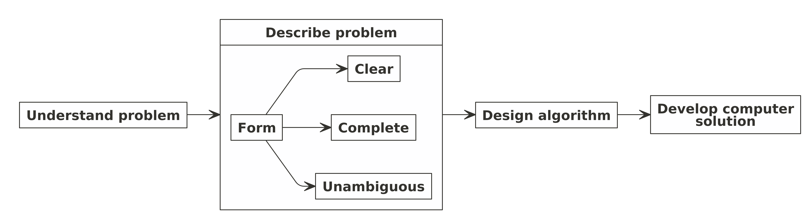
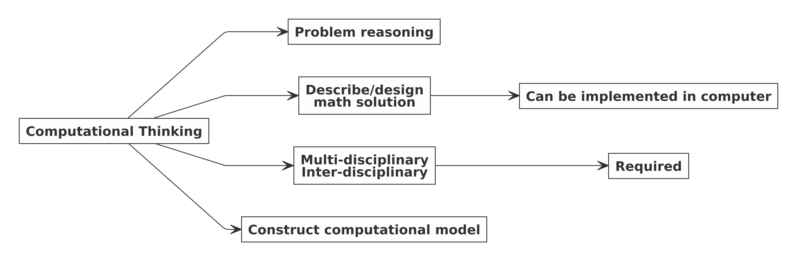
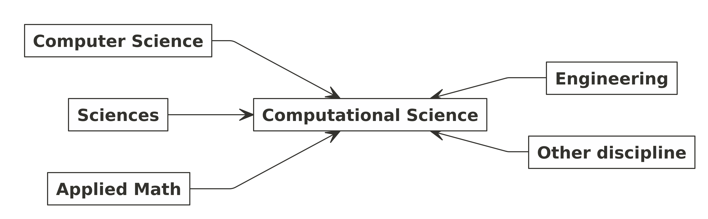
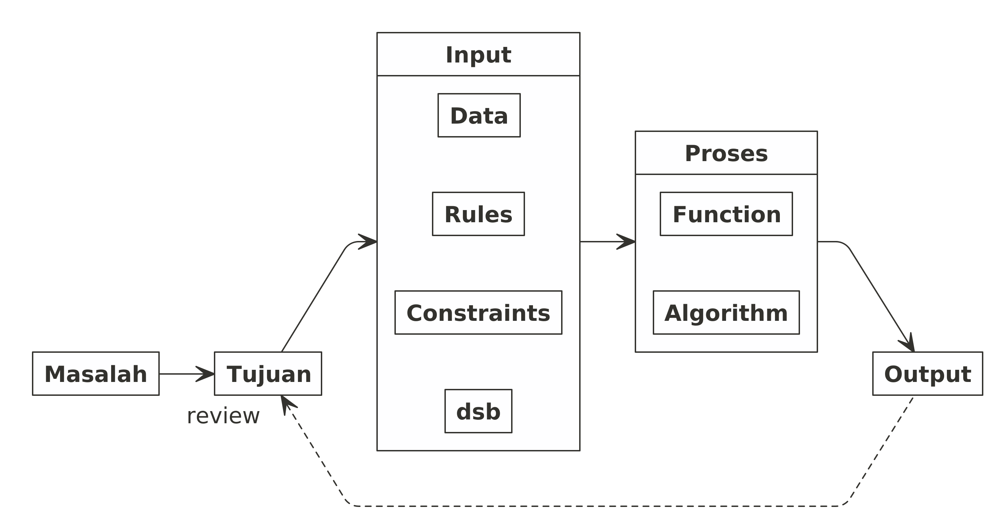
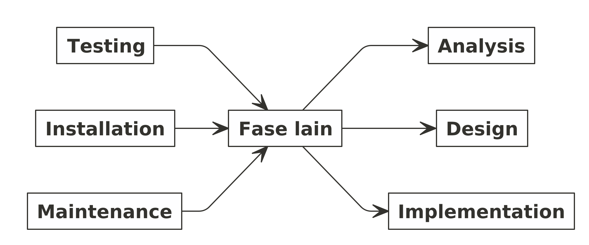
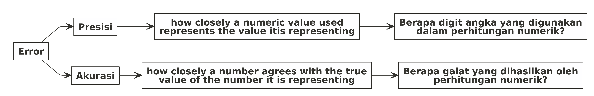

Computational Thinking, Computational Science, dan Computational Model
================

Pada minggu-minggu awal perkuliahan pemrograman dalam sains, kami
diminta untuk merangkum satu buku yang akan dijadikan rujukan dalam
kuliah ini, yakni: ***INTRODUCTION TO COMPUTATIONAL MODELS WITH
PHYTON*** karya **Jose M. Garrido**.

Walaupun buku ini ditulis untuk bahasa *Python*, tapi pada **chapter I**
ini berlaku sangat *general* karena ditekankan pada *computational
thinking*.

Saya rasa sangat sayang jika rangkuman ini hanya ada di *drive* laptop
saja. Jadi saya akan coba *share* rangkumannya ditambah dengan beberapa
materi yang sudah saya pernah dapatkan dari sumber lainnya. Selamat
membaca.

------------------------------------------------------------------------

# *Problem Solving* dan *Computing*

## *Introduction*

Dalam hidupnya, manusia pasti akan berhadapan dengan masalah. Tidak
sedikit permasalahan yang membutuhkan penyelesaian secara komputasi
sedangkan otak manusia memiliki keterbatasan dalam melakukan komputasi
yang rumit. Oleh karena itu, mereka menciptakan suatu *tools* yang dapat
membantu mereka menyelesaikan masalah tersebut, salah satunya adalah
*computer solution* seperti *computer program*.

*Computer program* berisi data dan sekumpulan perintah berupa algoritma
untuk melakukan *well-defined tasks*.

*Computer program* pada dasarnya menjalankan *computational model*,
yakni implementasi dari model matematika yang diformulasikan untuk
mencari solusi permasalahan. Biasanya *computational model* membutuhkan
*resource* komputasi yang tinggi.

## *Computer Problem Solving*

*Problem solving* adalah proses membuat solusi komputer dari masalah
nyata. Hal yang paling menantang dari proses ini adalah memilih metode
yang tepat untuk menyelesaikan permasalahan tersebut.

Sebagai mana yang kita tahu ada istilah *no free lunch*, artinya metode
penyelesaian setiap permasalahan adalah *unique*[1].

Proses Problem Solving

Algoritma adalah sekumpulan baris perintah untuk melakukan suatu proses
komputasi dari suatu *data* input sehingga menghasilkan data *output*.
Algoritma bisa dituliskan dalam bentuk *pseudo-code* atau *flowcharts*.

Program komputer ditulis berdasarkan algoritma yang telah dibuat
sebelumnya dengan bahasa pemrograman tertentu.

## *Elementary Concepts*

Model adalah representasi dari sistem atau masalah. Bisa jadi model
hanya berisi bagian tertentu saja dari sistem atau masalah. Suatu model
bisa juga lebih sederhana dari masalah sebenarnya asalkan masih relevan
dalam beberapa aspek.

> Bagaimana cara kita membuat model tersebut?

Sebenarnya dalam membuat suatu model dari permasalahan yang ada,
prosesnya mirip dengan melakukan penelitian pada umumnya[2]. Setidaknya
ada beberapa tahapan sebagai berikut:

Flow Melakukan Research

Salah satu tahap kritis yang paling penting adalah tahapan pertama,
yakni **formulasi masalah**.

> *Salah dalam memformulasikan masalah akan menimbulkan masalah bagi
> keseluruhan penelitian.*

Di dalam *computational modelling*, formulasi masalah biasa disebut
dengan *abstraction*. *Abstraction* yang baik harus bisa mendapatkan
elemen esensial dari permasalahan atau sistem.

Setelah kita berhasil melakukan *abstraction*, kita harus mulai berpikir
bagaimana memformulasikan masalah tersebut dan mulai mencari solusi
komputasinya. Proses ini disebut dengan *computational thinking*.

Ada **empat pilar utama** dalam *computational thinking*:

1.  Dekomposisi.
    -   Memecah masalah besar ke masalah-masalah yang lebih kecil
        sehingga lebih bisa di-*manage*.
2.  *Pattern recognition*.
    -   Menganalisa dan melihat apakah ada pola atau pengulangan.
3.  *Algorithm design*
    -   Menuliskan langkah-langkah dalam bentuk formal.
4.  *Abstraction*
    -   Memisahkan mana yang *important*, mana yang *less important*.

Elemen Computational Thinking

Setelah kita memformulasikan masalah dan membuat modelnya, untuk
mendapatkan solusi kita bisa menempuh cara matematis. Sebagai contoh
kita bisa mencari solusi dari model *predator-prey*[3] dengan menurunkan
sendiri persamaan diferensial yang ada. Namun ada kalanya kita tidak
bisa melakukan hal tersebut sehingga perlu ada penyelesaian dengan
pendekatan numerik. Contoh sederhana adalah penggunaan Metode Newton
yang memanfaatkan *Taylor’s Series* dan iterasi untuk mendapatkan akar
suatu persamaan[4].

Dari sinilah muncul istilah *computational science* (sains komputasi).

> Sains komputasi menggabungkan komsep dan prinsip dari matematika dan
> *computer science* untuk diaplikasikan di bidang sains lain atau
> *engineering*.

Integrasi Sains Komputasi

## *Developing Computational Models*

Development of Computational Models

*Computational model* dibangun secara iteratif. Maksudnya pada saat kita
membuat modelnya, perlu ada proses *fine tuning* (penyempurnaan)
berkelanjutan agar model tersebut bisa merepresentasikan masalah atau
sistem dengan baik.

Model development and Abstract Levels

## Contoh Kasus

Pada bagian ini saya sarikan contoh kasus yang ada pada buku, yakni:

1.  *Converter* Celcius ke Farenheit.
2.  Perhitungan luas dan keliling lingkaran.

Untuk memudahkan proses *summary*, saya akan gunakan *framework* sebagai
berikut:

Framework Problem - Output

### *Converter* Celcius ke Farenheit

#### *Initial Problem Statement*

Turis Eropa yang datang ke Amerika perlu mengetahui temperatur di
kotanya berkunjung. Mereka butuh informasi temperatur dalam Farenheit
sementara informasi temperatur yang ada dalam Celcius.

Dari *statement* di atas, kita masukkan ke dalam *framework* sebagai
berikut:

-   **Masalah**
    -   Turis Eropa biasa menggunakan unit Farenheit sedangkan di
        Amerika menggunakan unit Celcius. Mereka perlu mengetahui berapa
        suhu udara di kotanya berkunjung (dalam Farenheit) menggunakan
        informasi temperatur dalam Celcius.
-   **Tujuan**
    -   Melakukan konversi temperatur Farenheit ke Celcius.
-   ***Input***
    -   Informasi yang dimiliki saat ini adalah temperatur udara dalam
        Celcius, misal dinotasikan sebagai
        .
-   **Proses**
    -   Untuk melakukan konversi, saya akan membuat fungsi berikut ini:
        .
-   **Output**
    -   Hasil akhir yang diharapkan adalah temperatur udara dalam unit
        Farenheit, yakni
        .

Secara *simple*, algoritmanya adalah sebagai berikut:

    INPUT C
    COMPUTE F = (9/5)*C + 32
    OUTPUT F

#### *Key Take Points*

Kasus ini adalah salah satu contoh kasus yang sangat *clear* dalam hal
komputasi (proses perhitungan) sehingga kita sudah tidak perlu lagi
melakukan *fine tuning* terhadap algoritma yang ada.

Untuk melakukan proses perhitungan, saya menggunakan fungsi matematis
hubungan antara  dan
. Fungsi matematis
inilah yang sudah kita pelajari di kalkulus.

### Perhitungan Luas dan Keliling Lingkaran

#### *Initial Problem Statement*

Hitung luas dan keliling lingkaran dari suatu lingkaran berjari-jari
.

Dari *statement* di atas, kita masukkan ke dalam *framework* sebagai
berikut:

-   **Masalah**
    -   Menggunakan informasi berupa jari-jari
        , kita harus
        menghitung luas dan keliling lingkaran.
-   **Tujuan**
    -   Menghitung luas lingkaran.
    -   Menghitung keliling lingkaran.
-   ***Input***
    -   Informasi yang dimiliki saat ini adalah jari-jari
        .
-   **Proses**
    -   Untuk menghitung luas, kita gunakan fungsi
        .
    -   Untuk menghitung keliling, kita gunakan fungsi
        .
-   **Output**
    -   Hasil akhir yang diharapkan adalah luas
         dan keliling
        .

Secara *simple*, algoritmanya adalah sebagai berikut:

    INPUT r
    COMPUTE L = pi * r^2
            K = 2 * pi * r
    OUTPUT L
           K

## Kategori *Computational Models*

Seperti halnya model matematika, ada dua pendekatan yang bisa digunakan
dalam membuat suatu fungsi, yakni:

1.  *Continuous model*
    -   Salah satu contoh dari model ini adalah model yang menggunakan
        persamaan diferensial.
2.  *Discrete model*
    -   Salah satu contoh dari model ini adalah pendekatan distribusi
        *Poisson*[5] untuk data gol tercipta dalam sebuah pertandingan
        sepakbola.

## *Software Life Cycle*

Dalam *software development*, kita bisa menggunakan *waterfall model*.
Maksudnya adalah fase berikutnya tidak boleh jalan sebelum fase
sebelumnya selesai.

Waterfall Model

Selain fase yang ada di *waterfall model*, ada fase lainnya yakni:

Fase Lain dalam Sorftware Life Cycle

## *Design Modular*

Dalam membuat menghadapi suatu permasalahan yang kompleks, kita bisa
menggunakan analogi *chocolate bar*[6].

> *If you have to solve a complex problem, you will want to cut it in
> the smallest pieces as possible, until reaching the most elementary
> ones, and then expand them little by little to understand the overall
> problem.*

Di dalam buku ini istilah yang digunakan adalah *divide and conquer*.
Sejatinya permasalahan yang kompleks bisa dipecah menjadi
submasalah-submasalah kecil yang *manage-able*. Proses ini bisa kita
sebut sebagai *decomposition*.

Oleh karena itu, *abstraction* dan *decomposition* memegang peranan
penting dalam menyelesaikan masalah.

Konsep Decomposition

## Bahasa Pemrograman

Ada banyak bahasa pemrograman di dunia ini. Kita bisa memilih bahasa
mana yang sesuai dengan kebutuhan, tujuan, kemampuan, dan permasalahan
yang dihadapi. Sebagai contoh:

1.  Saat seseorang membutuhkan *output* berupa aplikasi mandiri
    (*executable file*), tentu dia tidak akan mempertimbangkan bahasa
    pemrograman MATLAB.
2.  Saat seseorang membutuhkan *output* hanya berupa *advance
    statistical analysis* dari data yang ada, tentu dia tidak akan
    mempertimbangkan bahasa pemrograman Java atau C.

Salah satu istilah dalam bahasa pemrograman yang sering kita dengar
adalah *high level programming language*. Apa artinya?

> *High level programming language* adalah bahasa pemrograman yang
> bersifat *problem oriented* dan bisa dijalankan tanpa ada keterbatasan
> di *hardware*.

Salah satu ciri lainnya adalah penggunaan skrip yang lebih mirip *human
language* dibandingkan *machine language*[7].

**R** dan *Python* merupakan salah satu contoh *high level programming
language* yang memiliki **IDE** beragam.

## Presisi, Akurasi, dan Galat

Seperti yang telah kita ketahui bersama, solusi yang dihasilkan dalam
*computational model* bisa berasal dari metode penyelesaian numerik.
Salah satu sifat dasar dari metode numerik adalah **aproksimasi**
(pendekatan). Oleh karena itu, kita harus mempertimbangkan galat
(*error*) yang ada yakni: akurasi dan presisi.

Presisi, Akurasi, dan Galat

Kita bisa menggunakan beberapa definisi galat atau *error* tergantung
dengan kebutuhan. Setidaknya ada dua *error* yang biasanya digunakan:

-   *Error*: selisih antara *true value* dengan *approximate value*.

Secara matematis kita tuliskan:

-   *Relative error*: *ratio* dari *error* terhadap *true value*.

Secara matematis kita tuliskan:

Salah satu kegunaannya adalah sebagai kriteria penghentian iterasi pada
saat kita menggunakan metode numerik tertentu.

#### Misalkan

Kita hendak mencari suatu akar persamaan menggunakan metode Newton. Kita
akan *set* terlebih dahulu berapa level akurasi yang masih bisa kita
terima sehingga proses iterasi bisa berhenti saat aproksimasi yang
dihasilkan sudah **sangat dekat** dengan solusi sebenarnya[8].

### Jenis-Jenis Galat

Berikut adalah beberapa jenis galat yang bisa terjadi saat kita
melakukan perhitungan numerik:

1.  *Iteration error*.
2.  *Approximation error*.
3.  *Roundoff error*.
    -   Yakni *error* yang tercipta akibat adanya pembulatan[9].
    -   Contoh:
        -   Nilai *exact* dari suatu variabel
            
        -   Nilai hampiran atau pendekatannya adalah
            
        -   Sehingga *error* yang tercipta adalah
            

[1] *No free lunch*: <https://ikanx101.com/blog/no_free-lunch/>

[2] *Flow* melakuan penelitian: <https://ikanx101.com/blog/tujuan/>

[3] Contoh model persamaan diferensial yang terkenal:
<https://en.wikipedia.org/wiki/Lotka%E2%80%93Volterra_equations>

[4] Metode Newton: <https://ikanx101.com/blog/newton_method/>

[5] <https://en.wikipedia.org/wiki/Poisson_distribution>

[6] <https://towardsdatascience.com/how-to-solve-complex-problems-efficiently-629c71adcd8d>

[7] <https://www.bbc.co.uk/bitesize/guides/z4cck2p/revision/1>

[8] <https://ikanx101.com/blog/newton_method/>

[9] <https://hithaldia.in/faculty/sas_faculty/Mrs_Sumana_Mandal/Lecture%20Note%20(M(CS)301%20&%20M(CS)401>).pdf
