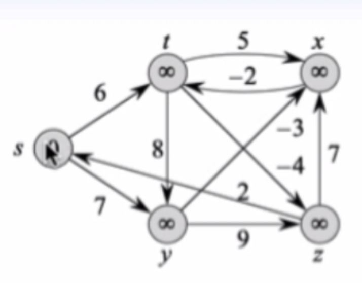

```{r setup, include=FALSE}
knitr::opts_chunk$set(echo = TRUE)
setwd("~/ikanx101 BLOG/_posts/matematika ITB/algoritma/graf")

library(dplyr)
library(ggplot2)
```

Pada kuliah _software design_ yang lalu, saya diberi PR untuk menyelesaikan __Bellman-Ford Algorithm__ dari sebuah graf berikut:

```{r out.width="30%",echo=FALSE,fig.align='center'}

```

Kali ini saya tidak akan membahas bagaimana menyelesaikan algoritma tersebut, tapi lebih ke bagaimana melukis graf di atas dengan `library(ggplot2)` di __R__.

> Jadi kalau rekan-rekan menyangka tulisan ini adalah tutorial membuat grafik dari data, Anda salah...!

__Graf__ yang dimaksudkan di sini bukanlah grafik dari data, tapi _graf_ dari matematika diskrit.

---

## Melukis di `ggplot2`

Salah satu kegunaan `library(ggplot2)` yang paling saya suka adalah kemampuannya untuk melukis apapun yang hendak kita mau lukis. Ibarat kata kanvas kosong, kita bisa menambahkan apapun ke dalamnya.

> Limitasinya adalah perbendaharaan function saja.

_Nah_, bagaimana melukis grafnya?

Kita akan membuat `data.frame()` terlebih dahulu berisi `5` titik dan labelnya dengan posisi seperti pada contoh di atas.

```{r,echo=FALSE}
data = data.frame(
  label = c("s","t","x","y","z"),
  x = c(0,2,4,2,4),
  y = c(0,5,5,-5,-5)
)

data %>% knitr::kable()
```

Mungkin belum terlihat ini gunanya apa, maka akan saya buat `ggplot` dari data tersebut:

```{r,fig.align='center',fig.retina=10}
graf = 
  ggplot() +
  geom_label(data = data,
             aes(x = x, 
                 y = y,
                 label = label))

graf
```

Sudah mulai terlihat kan?

Sekarang kita akan gambar garis panah dengan `geom_segment()` untuk garis lurus dan `geom_curve()` untuk garis melengkung berikut:

```{r,fig.align='center',fig.retina=10}
graf +
  geom_segment(aes(x=0,xend=2,
                   y=0,yend=5),
               arrow = arrow(length = unit(.2,"cm"))) +
  geom_segment(aes(x=0,xend=2,
                   y=0,yend=-5),
               arrow = arrow(length = unit(.2,"cm"))) +
  geom_curve(aes(x=2,xend=4,
                 y=5,yend=5),
             arrow = arrow(length = unit(.2,"cm"))) +
  geom_segment(aes(x=4,xend=2,
                   y=5,yend=5),
               arrow = arrow(length = unit(.2,"cm"))) +
  geom_segment(aes(x=2,xend=4,
                   y=5,yend=-5),
               arrow = arrow(length = unit(.2,"cm"))) +
  geom_segment(aes(x=2,xend=2,
                   y=5,yend=-5),
               arrow = arrow(length = unit(.2,"cm"))) +
  geom_segment(aes(x=2,xend=4,
                   y=-5,yend=-5),
               arrow = arrow(length = unit(.2,"cm"))) +
  geom_segment(aes(x=2,xend=4,
                   y=-5,yend=5),
               arrow = arrow(length = unit(.2,"cm"))) +
  geom_segment(aes(x=4,xend=4,
                   y=-5,yend=5),
               arrow = arrow(length = unit(.2,"cm"))) +
  geom_segment(aes(x=4,xend=0,
                   y=-5,yend=0),
               arrow = arrow(length = unit(.2,"cm"))) 
  
```


Sudah mulai terbentuk kan?

Sekarang kita tinggal merapikan urutan kemunculan masing-masing elemen dan panjang garis agar tidak saling menutupi.

Hasilnya sebagai berikut:

```{r,echo=FALSE,fig.align='center',fig.retina=10}
graf = 
  ggplot() +
  # s-t
  geom_segment(aes(x=0,xend=2-.1,
                   y=0,yend=5),
               arrow = arrow(length = unit(.2,"cm"))) +
  # s-y
  geom_segment(aes(x=0,xend=2-.1,
                   y=0,yend=-5),
               arrow = arrow(length = unit(.2,"cm"))) +
  # t-x
  geom_curve(aes(x=2,xend=4-.1,
                 y=5,yend=5-.1),
             arrow = arrow(length = unit(.2,"cm"))) +
  # x-t
  geom_segment(aes(x=4,xend=2+.1,
                   y=5,yend=5),
               arrow = arrow(length = unit(.2,"cm"))) +
  # t-z
  geom_segment(aes(x=2,xend=4-.1,
                   y=5,yend=-5+.5),
               arrow = arrow(length = unit(.2,"cm"))) +
  # t-y
  geom_segment(aes(x=2,xend=2,
                   y=5,yend=-5+.5),
               arrow = arrow(length = unit(.2,"cm"))) +
  # y-z
  geom_segment(aes(x=2,xend=4-.1,
                   y=-5,yend=-5),
               arrow = arrow(length = unit(.2,"cm"))) +
  # y-x
  geom_segment(aes(x=2,xend=4-.1,
                   y=-5,yend=5-.5),
               arrow = arrow(length = unit(.2,"cm"))) +
  # z-x
  geom_segment(aes(x=4,xend=4,
                   y=-5,yend=5-.5),
               arrow = arrow(length = unit(.2,"cm"))) +
  # z-s
  geom_segment(aes(x=4,xend=0+.1,
                   y=-5,yend=0+.1),
               arrow = arrow(length = unit(.2,"cm"))) +
  geom_label(data = data,
             aes(x = x, 
                 y = y,
                 label = label),
             size = 7) +
  theme_void()

graf
```


Sekarang tinggal menambahkan bobot garis, caranya dengan `annotate("text")` sebagai berikut:

```{r}
graf = 
  graf +
  # s-t = 6
  annotate("text",x = 1,y=3,label = "6") +
  # s-y = 7
  annotate("text",x = 1,y=-3,label = "7") +
  # t-x = 5
  annotate("text",x = 3,y=3.4,label = "5") +
  # x-t = -2
  annotate("text",x = 3,y=4.6,label = "-2") +
  # z-x = 7 
  annotate("text",x = 3.9,y=0,label = "7") +
  # y-z = 9
  annotate("text",x = 3,y=-4.8,label = "9") +
  # t-y = 8
  annotate("text",x = 2.1,y=1,label = "8") +
  # z-s = 2 
  annotate("text",x = 1,y=-0.5,label = "2") +
  # y-x = -3
  annotate("text",x = 2.6,y=-1.5,label = "-3") +
  # t-z = -2
  annotate("text",x = 3.5,y=-3,label = "-2")

graf
```

> Bagaimana? Mudah kan?

---

`if you find this article helpful, support this blog by clicking the ads.`
