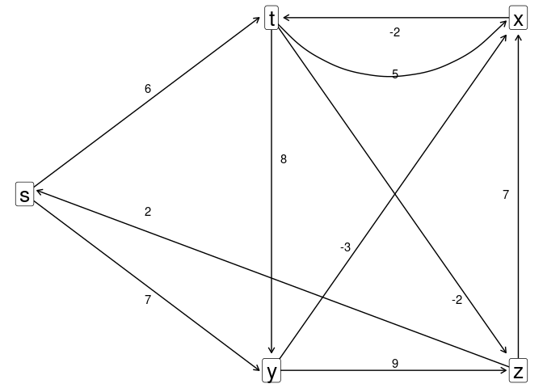

Melukis Graf dengan ggplot2
================

Pada kuliah *software design* yang lalu, saya diberi PR untuk
menyelesaikan **Bellman-Ford Algorithm** dari sebuah graf berikut:


Kali ini saya tidak akan membahas bagaimana menyelesaikan algoritma
tersebut, tapi lebih ke bagaimana melukis graf di atas dengan
`library(ggplot2)` di **R**.

> Jadi kalau rekan-rekan menyangka tulisan ini adalah tutorial membuat
> grafik dari data, Anda salah…!

**Graf** yang dimaksudkan di sini bukanlah grafik dari data, tapi *graf*
dari matematika diskrit.

------------------------------------------------------------------------

## Melukis di `ggplot2`

Salah satu kegunaan `library(ggplot2)` yang paling saya suka adalah
kemampuannya untuk melukis apapun yang hendak kita mau lukis. Ibarat
kata kanvas kosong, kita bisa menambahkan apapun ke dalamnya.

> Limitasinya adalah perbendaharaan function saja.

*Nah*, bagaimana melukis grafnya?

Kita akan membuat `data.frame()` terlebih dahulu berisi `5` titik dan
labelnya dengan posisi seperti pada contoh di atas.

| label |   x |   y |
|:------|----:|----:|
| s     |   0 |   0 |
| t     |   2 |   5 |
| x     |   4 |   5 |
| y     |   2 |  -5 |
| z     |   4 |  -5 |

Mungkin belum terlihat ini gunanya apa, maka akan saya buat `ggplot`
dari data tersebut:

``` r
graf = 
  ggplot() +
  geom_label(data = data,
             aes(x = x, 
                 y = y,
                 label = label))

graf
```


Sudah mulai terlihat kan?

Sekarang kita akan gambar garis panah dengan `geom_segment()` untuk
garis lurus dan `geom_curve()` untuk garis melengkung berikut:

``` r
graf +
  geom_segment(aes(x=0,xend=2,
                   y=0,yend=5),
               arrow = arrow(length = unit(.2,"cm"))) +
  geom_segment(aes(x=0,xend=2,
                   y=0,yend=-5),
               arrow = arrow(length = unit(.2,"cm"))) +
  geom_curve(aes(x=2,xend=4,
                 y=5,yend=5),
             arrow = arrow(length = unit(.2,"cm"))) +
  geom_segment(aes(x=4,xend=2,
                   y=5,yend=5),
               arrow = arrow(length = unit(.2,"cm"))) +
  geom_segment(aes(x=2,xend=4,
                   y=5,yend=-5),
               arrow = arrow(length = unit(.2,"cm"))) +
  geom_segment(aes(x=2,xend=2,
                   y=5,yend=-5),
               arrow = arrow(length = unit(.2,"cm"))) +
  geom_segment(aes(x=2,xend=4,
                   y=-5,yend=-5),
               arrow = arrow(length = unit(.2,"cm"))) +
  geom_segment(aes(x=2,xend=4,
                   y=-5,yend=5),
               arrow = arrow(length = unit(.2,"cm"))) +
  geom_segment(aes(x=4,xend=4,
                   y=-5,yend=5),
               arrow = arrow(length = unit(.2,"cm"))) +
  geom_segment(aes(x=4,xend=0,
                   y=-5,yend=0),
               arrow = arrow(length = unit(.2,"cm"))) 
```


Sudah mulai terbentuk kan?

Sekarang kita tinggal merapikan urutan kemunculan masing-masing elemen
dan panjang garis agar tidak saling menutupi.

Hasilnya sebagai berikut:


Sekarang tinggal menambahkan bobot garis, caranya dengan
`annotate("text")` sebagai berikut:

``` r
graf = 
  graf +
  # s-t = 6
  annotate("text",x = 1,y=3,label = "6") +
  # s-y = 7
  annotate("text",x = 1,y=-3,label = "7") +
  # t-x = 5
  annotate("text",x = 3,y=3.4,label = "5") +
  # x-t = -2
  annotate("text",x = 3,y=4.6,label = "-2") +
  # z-x = 7 
  annotate("text",x = 3.9,y=0,label = "7") +
  # y-z = 9
  annotate("text",x = 3,y=-4.8,label = "9") +
  # t-y = 8
  annotate("text",x = 2.1,y=1,label = "8") +
  # z-s = 2 
  annotate("text",x = 1,y=-0.5,label = "2") +
  # y-x = -3
  annotate("text",x = 2.6,y=-1.5,label = "-3") +
  # t-z = -2
  annotate("text",x = 3.5,y=-3,label = "-2")

graf
```

<!-- -->

> Bagaimana? Mudah kan?

------------------------------------------------------------------------

`if you find this article helpful, support this blog by clicking the ads.`
