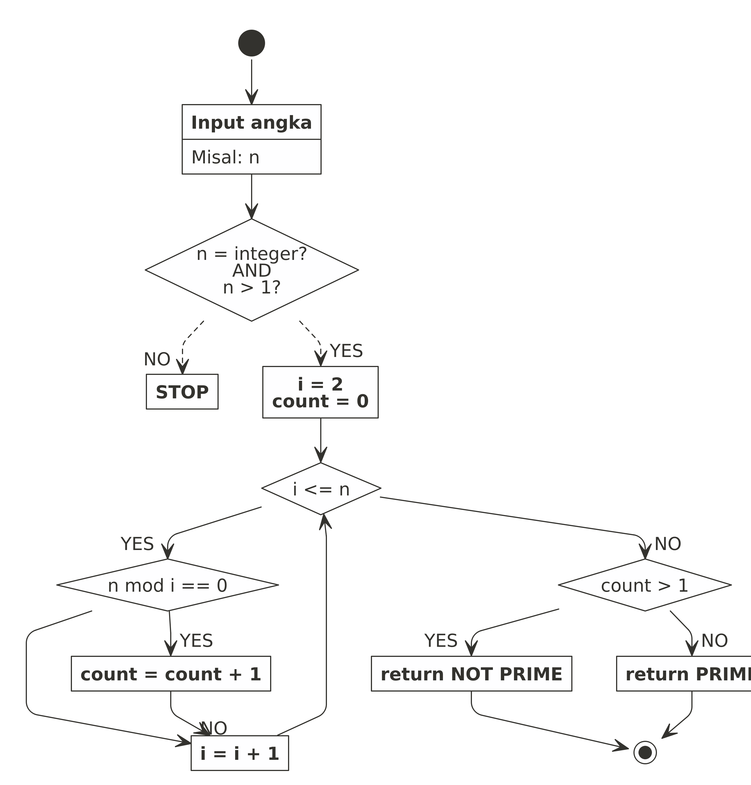
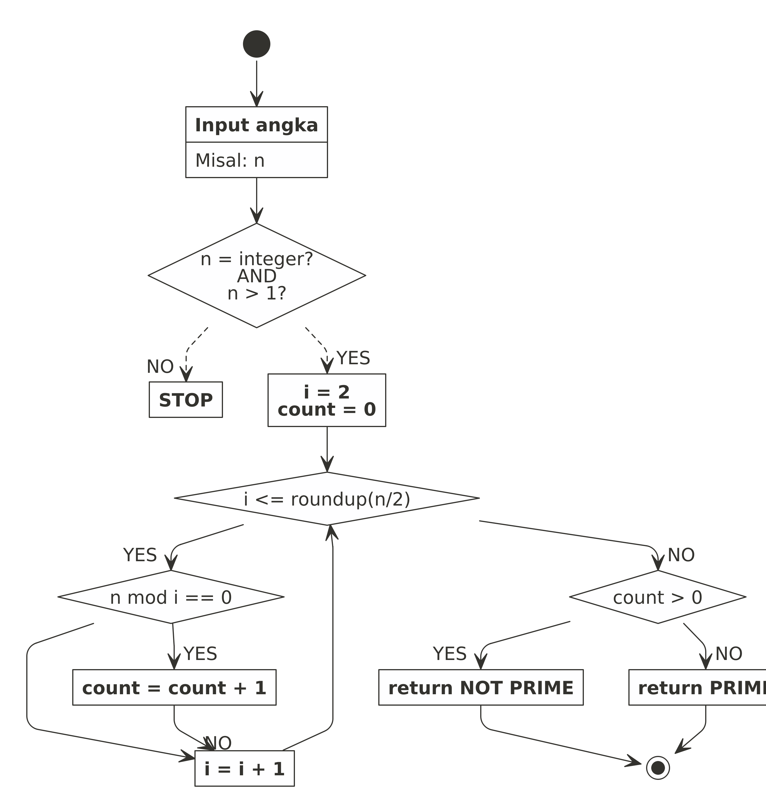
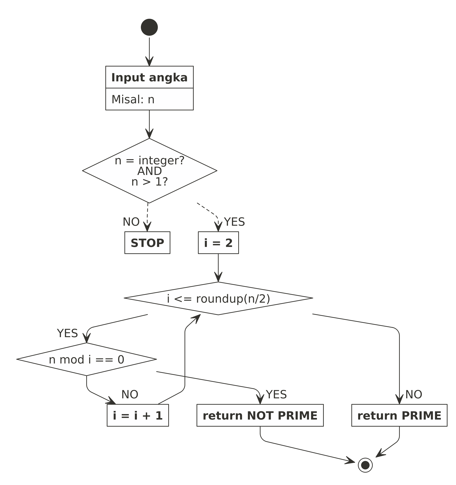

Bagaimana Caranya Membandingkan Algoritma? Studi Kasus Bilangan Prima
================

Bagi saya, algoritma adalah sekumpulan baris perintah atau langkah kerja
terstruktur yang berfungsi untuk melakukan komputasi.

Masing-masing orang memiliki gaya, cara, dan preferensinya sendiri dalam
membuat algoritma.

Bisa jadi suatu permasalahan bisa diselesaikan dengan berbagai macam
cara (algoritma). Lantas jika beberapa algoritma **hasilnya sama-sama
benar**, bagaimana menentukan algoritma yang terbaik?

> Kita bisa membandingkan seberapa cepat algoritma tersebut bekerja.

Istilahnya adalah *computing time* atau *running time*.

Saya akan bercerita tentang pengalaman saya dulu ketika kuliah.

------------------------------------------------------------------------

> Bilangan prima adalah bilangan yang hanya habis dibagi oleh dirinya
> sendiri.

Pada 2005 silam, saat saya sedang kuliah di tingkat dua, saya mengikuti
salah satu mata kuliah wajib di Matematika. Nama mata kuliahnya adalah
Komputasi Matematika. Mata kuliah ini adalah mata kuliah matematika
dengan praktikum pertama kali.

> Di tingkat pertama (alias **TPB** – *Tahap Persiapan Bersama*) hanya
> ada praktikum Fisika dan Kimia.

Saya ingat benar di laboratorium komputer, kami ditugaskan untuk membuat
program yang bisa mendeteksi apakah suatu bilangan termasuk bilangan
prima atau bukan. Waktu itu, bahasa yang digunakan adalah
[Pascal](https://en.wikipedia.org/wiki/Pascal_(programming_language)).
*Output*-nya berupa *executable file* (`.exe`).

Waktu itu, proses yang saya lakukan adalah sebagai berikut:



Rekan sebelah saya, Anwar memberikan komentar:

> “Kenapa harus ada *looping* dari 2 sampai *n* ?”

Sambil cengengesan saya menjawab:

> “Ini adalah solusi yang menjamin suatu angka benar prima atau tidak…”

------------------------------------------------------------------------

Saya yakin jawaban saya benar adanya tapi secara komputasi akan memakan
waktu yang lama saat bilangan yang dimasukkan sangat besar. Waktu itu
Anwar memberikan saran:

> “Bagaimana jika kita bagi dua saja selang pencariannya? Alih-alih
> *looping* dari 2 hinnga *n*, kita akan *looping* dari 2 hingga
> $\\frac{n}{2}$ saja.”

Bagaimana jika *n* yang dimasukkan adalah bilangan ganjil? Kita akan
bulatkan $\\frac{n}{2}$ ke atas. Lantas bagaimana dengan kriteria
penentuannya?

Jika sebelumnya saya menggunakan kriteria *c**o**u**n**t* &gt; 1 sebagai
penentu bilangan tersebut bukan prima. Kali ini saya menggunakan
kriteria *c**o**u**n**t* &gt; 0 sebagai penentu.

Kenapa?

> Karena *looping*-nya tidak sampai *n*. Jadi tidak ada kesempatan bagi
> bilangan prima bisa dibagi oleh dirinya sendiri.



Setelah dimodifikasi tersebut, apakah ada perbedaan waktu komputasinya?

Saya telah membuat dua fungsi di **R** berdasarkan dua *flowchart* di
atas. Mari kita bandingkan waktunya untuk mengecek suatu bilangan yang
**besar** berikut:

``` r
is_prime(4092021)
```

    ## $kesimpulan
    ## [1] "Not Prime"
    ## 
    ## $`waktu proses`
    ## Time difference of 6.544936 secs

``` r
is_prime_2(4092021)
```

    ## $kesimpulan
    ## [1] "Not Prime"
    ## 
    ## $`waktu proses`
    ## Time difference of 3.227916 secs

Terlihat bahwa waktu komputasi pada *function* kedua lebih hemat  ∼ 50%
dari *function* pertama.

Lantas apakah ada cara penyelesaian (baca: algoritma) lain yang lebih
cepat?

Kita bisa modifikasi *flowchart* kedua dengan cara:

> Saat suatu bilangan berhasil dibagi oleh angka selain dirinya, kita
> akan stop iterasinya!

Saya menduga ini akan menjadi penghematan yang cukup besar mengingat
kita tidak perlu melakukan *looping* terlalu banyak.



Sekarang kita cek waktu komputasinya dengan angka yang sama:

``` r
is_prime_3(4092021)
```

    ## $kesimpulan
    ## [1] "NOT PRIME"
    ## 
    ## $`waktu proses`
    ## Time difference of 0.00001168251 secs

> *Jauh berkurang kan!*

Mari kita coba kembali untuk angka lainnya.

``` r
is_prime(9988771)
```

    ## $kesimpulan
    ## [1] "Not Prime"
    ## 
    ## $`waktu proses`
    ## Time difference of 15.50772 secs

``` r
is_prime_2(9988771)
```

    ## $kesimpulan
    ## [1] "Not Prime"
    ## 
    ## $`waktu proses`
    ## Time difference of 7.801074 secs

``` r
is_prime_3(9988771)
```

    ## $kesimpulan
    ## [1] "NOT PRIME"
    ## 
    ## $`waktu proses`
    ## Time difference of 0.000041008 secs

Algoritma ketiga cenderung akan sangat singkat karena biasanya hampir
semua angka bisa dibagi oleh angka lain yang memiliki digit kecil.

Apakah ada cara lain? Tentu saja karena setiap orang pasti punya cara
pikir yang berbeda-beda!

------------------------------------------------------------------------

`if you find this article helpful, support this blog by clicking the ads.`
