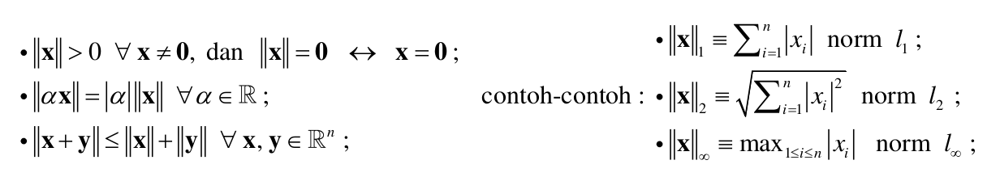
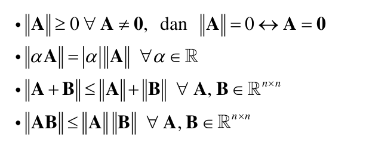
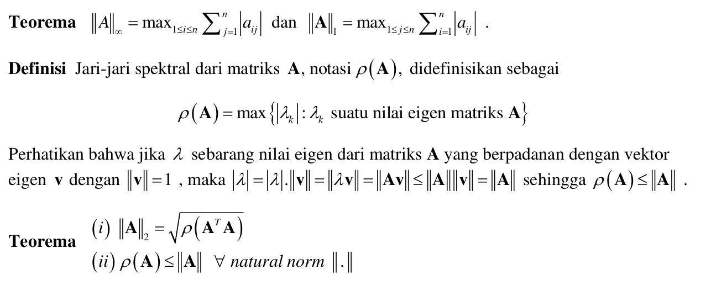

```{r setup, include=FALSE}
knitr::opts_chunk$set(echo = TRUE)
setwd("~/ikanx101 BLOG/_posts/matematika ITB/aljabar")
library(dplyr)
```

> Dunia ini dikendalikan oleh Algoritma!

Pernyataan tersebut seringkali saya dengar di mana-mana. Pernyataan in juga yang membuat saya ingin berkuliah lagi mengambil studi master __sains komputasi__.

Namun setelah mengikuti kuliah beberapa minggu belakangan, saya sadar bahwa pernyataan itu salah sepenuhnya. Pernyataan yang tepat adalah:

> ___Dunia ini dikendalikan oleh ALJABAR!___

Tidak menyangka bahwa dalam dunia numerik, konsep-konsep di aljabar linear __sangat amat__ digunakan. Sebagai contoh, saat kita hendak menyelesaikan suatu sistem persamaan linear berikut:

---

## Sistem Persamaan Linear

Suatu sistem persamaan linear bisa dituliskan dalam bentuk aljabar berupa matriks dan vektor sebagai berikut:

$$Ax = b$$

__SPL__ tersebut akan memiliki solusi saat $A$ memiliki invers, yakni $A^{-1}$.

> Bagaimana caranya menghitung $A^{-1}$ dari $A$?

Pada aljabar linear elementer, kita bisa melakukan __operasi baris elementer__ (__OBE__) sebagai berikut:

$$[A | I] \rightarrow [I|A^{-1}]$$

---

Jika $A$ merupakan matriks yang berukuran kecil, kita bisa menghitungnya dengan mudah. Namun saat kita berhadapan dengan matriks berukuran __sangat amat__ besar dan kompleks, kita bisa mengandalkan metode aproksimasi.

> Ternyata metode aproksimasi juga berlandaskan konsep aljabar linear yang kuat!

Oleh karena itu, sebelum saya lanjut berbicara mengenai metode aproksimasi, saya akan menuliskan beberapa materi _refreshment_ terkait aljabar linear.

---

## _Refreshment_ Aljabar Linear 

### Teorema __SPL__

> Jika $A$ adalah matriks $n \times n$ _inversible_, maka untuk setiap vektor $b$ $1 \times n$ pada sistem persamaan linear $Ax = b$ memiliki tepat satu solusi. Yaitu:

$$x = A^{-1}b$$

Berikut ini kita coba _review_ kembali secara singkat beberapa konsep dalam aljabar yang kelak akan membantu kita memahami bagaimana cara penyelesaian __SPL__ secara numerik.

---

### Matriks Singular dan Tak Singular

Dari penjelasan sebelumnya kita telah mengenal apa itu matriks invers. Kita akan mengingat kembali suatu konsep bernama determinan matriks. Di __R__ kita bisa menghitung determinan dari suatu matriks dengan perintah `det(matriks)`.

> Jika suatu matriks persegi memiliki determinan = 0, maka matriks tersebut tidak memiliki invers. Matriks yang tidak memiliki invers disebut __matriks singular__.

Kebalikannya:

> Jika suatu matriks memiliki determinan $\neq 0$, maka matriks memiliki invers. Matriks berinvers disebut __matriks tak singular__.

---

### Determinan Matriks

Untuk matriks berukuran $2 \times 2$, cara menghitung determinan matriksnya adalah sebagai berikut:

$$A = \begin{bmatrix}
a & b \\
c & d \\
\end{bmatrix}$$

$$|A| = ad - bc$$

Bagaimana dengan matriks berukuran $3 \times 3$? Berikut caranya:

Kita perlu memperlebar kolom dari matriks tersebut agar semua elemen terkena.

$$A = \begin{bmatrix}
a & b & c\\
d & e & f \\
g & h & i \\
\end{bmatrix}$$

$$|A| = (aei + bfg + cdh) - (ceg + afh + bdi)$$

### Sifat-Sifat Determinan Matriks

Misalkan $A$ adalah matriks yang memiliki determinan, maka:

1. $|A^T| = |A|$
1. $|A . B| = |A| . |B|$
1. $|A^n| = |A|^n$
1. $|A^{-1}| = \frac{1}{|A|}$
1. $|k \times A_{m \times m}| = k^m \times |A|$

---

### Nilai Eigen dan Vektor Eigen

#### Definisi

Jika $A$ adalah matriks $n \times n$, maka vektor tak nol $x \in \mathbb{R}^n$ dinamakan __vektor eigen__ dari $A$ jika $Ax$ adalah kelipatan skalar dari $x$. Yakni:

$$Ax = \lambda x$$

untuk suatu skalar $\lambda$ tertentu. $\lambda$ disebut sebagai __nilai eigen__ yang bersesuaian dengan __vektor eigen__.


#### Teorema

Jika $A$ adalah matriks berukuran $n \times n$, maka $\lambda$ adalah nilai eigen dari $A$ jika dan hanya jika ia memenuhi persamaan:

$$det(\lambda I - A) = 0$$

Persamaan di atas disebut dengan __persamaan karakterisktik__.

Vektor dan nilai eigen bisa dihitung di __R__ menggunakan _function_ `eigen(matriks)`.

---

### Norm Vektor

Norm vektor merupakan fungsi pemetaan dari vektor-vektor di $x \in \mathbb{R}^n$ ke bilangan _real_ $||x||$ sehingga memenuhi:

```{r out.width="100%",fig.align='center',echo=FALSE,fig.cap="Sifat Norm Vektor"}

```

### Norm Matriks

Norm matriks merupakan fungsi pemetaan dari matriks-matriks bujur sangkar di $\mathbb{R}^{n \times n}$ ke $\mathbb{R}$ sehingga memenuhi:

```{r out.width="60%",fig.align='center',echo=FALSE,fig.cap="Sifat Norm Matriks"}

```

$$\forall z \neq 0 \text{ dan natural matrix norm } ||.|| \text{ diperoleh } ||Az|| \leq ||A|| . ||z||$$

#### Cara menghitung norm matriks

Beberapa teorema dan definisi yang berguna:

```{r out.width="100%",fig.align='center',echo=FALSE,fig.cap="Norm Matriks dan Jari-jari Spektral"}

```

_Summaries_:

1. Norm $\infty$ adalah nilai max sum harga mutlak baris.
1. Norm $1$ adalah nilai max sum harga mutlak kolom.

#### Teorema Kekonvergenan

Suatu matriks $A$ dikatakan __konvergen ke 0__ jika $\lim_{k \rightarrow \infty} (A^k)_{ij} = 0$.

Pernyataan berikut ini ekivalen:

1. $A$ matriks yang __konvergen__.
1. $\lim_{k \rightarrow \infty} ||A^k|| = 0$, untuk suatu _natural norm_.
1. $\lim_{k \rightarrow \infty} ||A^k|| = 0$, untuk setiap _natural norm_.
1. $\rho(A) < 1$.
1. $\lim_{k \rightarrow \infty} A^kx = 0, \forall x$.

Perhatikan baik-baik teorema di atas. Terutama pada poin `4` dimana menjadi __kunci__ kekonvergenan dari suatu skema iterasi kelak.

```{r,include=FALSE}
rm(list=ls())
```

### Matriks Diagonal, _Upper_, dan _Lower_

Matriks diagonal adalah matriks yang hanya berisi elemen di diagonalnya saja. Matriks _upper triangle_ adalah matriks yang hanya berisi segitiga di atas. Matriks _lower triangle_ adalah matriks yang hanya berisi segitiga di bawah.

### Matriks Diagonal Dominan Kuat

Matriks __diagonal dominan kuat__ adalah matriks yang memiliki elemen harga mutlak diagonal terbesar.

Misalkan:

```{r,echo=FALSE}
A = matrix(c("a11","a12","a13","a21","a22","a23","a31","a32","a33"),byrow = T, nrow = 3)
A
```

Definisi __diagonal dominan kuat__ adalah:

$$|a_{ii}| > \sum_{i=1,j \neq i}^n |a_{ij}|$$

Contoh:

```{r,echo=FALSE}
A = matrix(c(7,2,0,3,5,-1,0,5,-6),byrow = T, nrow = 3)
A
```

$A$ merupakan matriks __diagonal dominan kuat__ karena:

$$|7| > |2| + |0|$$ 

$$|5| > |3| + |-1|$$

$$|-6| > |0| + |-5|$$

Matriks __diagonal dominan kuat__ adalah _non singular_.

> Bagaimana jika $A$ kita bukan matriks __diagonal dominan kuat__?

Kita harus lakukan _pre-processing_ sehingga menjadi matriks __diagonal dominan kuat__ dengan cara:

1. Tukar baris, atau
1. Tukar kolom.

---

### Aljabar di __R__

Dari semua konsep aljabar yang telah dijelaskan pada bagian sebelumnya, mari kita lihat beberapa function di __R__-nya:

Misalkan saya definisikan $v$ suatu vektor sebagai berikut:

```{r}
v = c(2,4,-1,3)
# menghitung norm 1 dari vektor v
norm_vec_1 = function(x)sum(abs(x))
norm_vec_1(v)
# menghitung norm 2 dari vektor v
norm_vec_2 = function(x)sqrt(sum(abs(x)^2))
norm_vec_2(v)
# menghitung norm infinity dari vektor v
norm_vec_inf = function(x)max(abs(x))
norm_vec_inf(v)
```

Misalkan saya definisikan matriks $A$ sebagai berikut:

```{r}
A = matrix(c(2,4,-1,3,1,5,-2,3,-1),ncol = 3)
A
# transpose matriks
t(A)
# inverse matriks
matlib::inv(A)
# menghitung nilai dan vektor eigen
eigen(A)
# perkalian matriks
A %*% matlib::inv(A) %>% round()
# menghitung norm 1 dari matriks A
norm(A,"1")
# menghitung norm 2 dari matriks A
norm(A,"2")
# menghitung norm infinity dari matriks A
norm(A,"i")
# menghitung rho
rho = function(matriks){
  ei = eigen(matriks)
  ei = max(abs(ei$values))
  return(ei)
}
rho(A)
# norm 2 juga bisa dihitung dengan cara
rho(t(A) %*% A) %>% sqrt()
```

### _Key Take Points_ Materi Aljabar Linear

Perhatikan betul teorema kekonvergenan matriks dan bagaimana cara menghitung $\rho$.

---

Demikian _refreshment_ materi aljabar linear. Aplikasinya pada analisa numerik akan saya tuliskan di _posts_ selanjutnya.

---

`if you find this article helpful, support this blog by clicking the ads.`