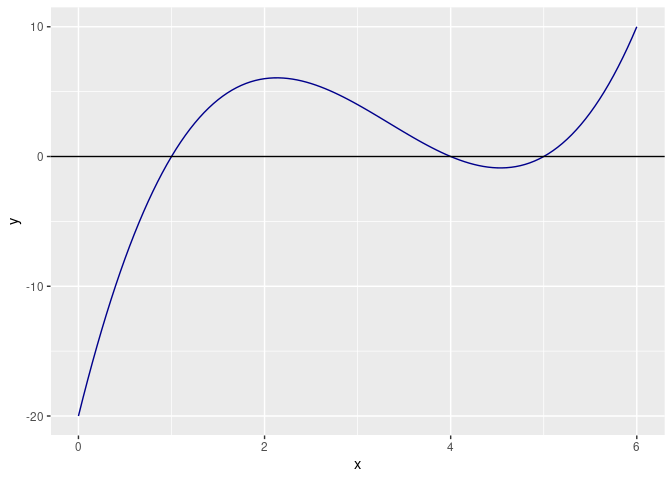
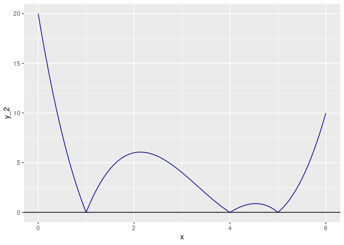

Metode Numerik: Mencari Akar Fungsi dengan Menggunakan Golden Ratio
================

Pada dua *posts* sebelumnya, saya pernah menulis bagaimana metode
[*bisection*](https://ikanx101.com/blog/metode-bisection/) dan metode
[*Newton*](https://ikanx101.com/blog/newton_method/) untuk mencari akar
dari suatu fungsi.

Salah satu kelemahan dari metode *bisection* adalah *running time*.
Salah satu kelemahan dari metode *Newton* adalah harus mencari turunan
dari fungsi yang dikerjakan
").

> *Apakah ada metode yang cepat dan tidak memerlukan turunan?*

------------------------------------------------------------------------

# *Golden Ratio*

Kalian semua pasti pernah mendengar tentang istilah [*golden
ratio*](https://en.wikipedia.org/wiki/Golden_ratio). Konon katanya
kesempurnaan dan keseimbangan di dunia itu mengikuti aturan *golden
ratio*.

> Lantas apa hubungannya *golden ratio* dengan pendekatan numerik untuk
> mencari akar persamaan?

Ada satu metode numerik bernama *Golden Section Search* yang bisa
dipakai untuk mencari **nilai minimum global**. Prinsipnya adalah
sebagai berikut:

> Misalkan ")
> disebut [*unimodal*](https://id.wikipedia.org/wiki/Modus_(statistika))
> pada selang
> ![I = \[a,b\]](https://latex.codecogs.com/png.latex?I%20%3D%20%5Ba%2Cb%5D "I = [a,b]"),
> jika terdapat sebuah titik
> 
> sehingga ")
> monoton turun murni pada
> ![\[a,p\]](https://latex.codecogs.com/png.latex?%5Ba%2Cp%5D "[a,p]")
> dan monoton naik murni pada
> ![\[p,b\]](https://latex.codecogs.com/png.latex?%5Bp%2Cb%5D "[p,b]").

Dari definisi diatas dimungkinkan suatu cara untuk mengidentifikasi
bahwa fungsi
") memiliki
**minimum global tunggal** di titik
, dengan tidak secara
***eksplisit*** melibatkan turunan fungsi. Jika diperhatikan dengan
baik, diharapkan titik 
menjadi **titik terendah dari grafik fungsinya** sehingga masalah ini
menjadi **masalah minimisasi**.

Jadi proses optimisasi bisa dimodifikasi untuk menghitung akar
persamaan.

Sekarang permasalahannya adalah menentukan di mana letak titik
. Nah, si *golden ratio*
masuk di tahap ini untuk menentukan dimana letak si titik
.

------------------------------------------------------------------------

# Cara Kerja *Golden Section Search*

Dari selang
![\[a,b\]](https://latex.codecogs.com/png.latex?%5Ba%2Cb%5D "[a,b]")
yang ada, akan dicari dua titik baru
") yang
berada di dalam selang dengan menggunakan rumus:

 / r")

 / r")

dengan  adalah *golden
ratio*.


Perhatikan bahwa
.
Kita perlu cek nilai
, f(c), f(d), f(b)").

Perhatikan bahwa karena 
*unimodal* maka
") dan
")
masing-masing bernilai lebih kecil dari
 , f(b) \}").
Perhatikan dua kondisi berikut ini:

1.  Jika
     \leq f(d)")
    maka dari sifat *unimodal*,
     monoton naik di
    selang
    ![\[d,b\]](https://latex.codecogs.com/png.latex?%5Bd%2Cb%5D "[d,b]")
    dan dengan demikian maka
    ![p \\in \[a,d\]](https://latex.codecogs.com/png.latex?p%20%5Cin%20%5Ba%2Cd%5D "p \in [a,d]").
2.  Jika
     > f(d)")
    maka dari sifat *unimodal*,
     monoton turun di
    selang
    ![\[a,c\]](https://latex.codecogs.com/png.latex?%5Ba%2Cc%5D "[a,c]")
    dan dengan demikian maka
    ![p \\in \[c,b\]](https://latex.codecogs.com/png.latex?p%20%5Cin%20%5Bc%2Cb%5D "p \in [c,b]").

Situasi di atas memungkinkan kita untuk **melakukan reduksi lebar selang
pencarian** untuk mencari titik
.

Algoritma iterasinya adalah sebagai berikut:

    if f(c) <= f(d)
      b = d
      fb = fd
    else
      a = c
      fa = fc
    end
      c = a + r * (b-a) 
      fc = f(c) 
      d = a + (1-r)*(b-a) 
      fd = f(d)

Iterasi akan berhenti saat kita mendefinisikan *toleransi error max*
yang diperbolehkan.

------------------------------------------------------------------------

## Dari Optimisasi ke Mencari Akar

Terdapat hubungan antara masalah optimisasi ini dengan akar persamaan.
Persamaan
 = 0")
memiliki solusi  jika
fungsi objektif  dari
masalah optimisasi yang didefinisikan sebagai berikut:

-    = (f(x))^2")
    memiliki nilai minimum global sebesar
    .
-    = |f(x)|")
    memiliki nilai minimum global sebesar
    .
-    = - \frac{1}{a+ |f(x)|}")
    memiliki nilai minimum global sebesar
    .

### Contoh

Untuk fungsi
 = x^3 - 10x^2 + 29x -20")
di
,
tentukan semua akarnya dengan metode *Golden Section Search* !

#### Jawab

Mari kita buat dulu grafik fungsinya di selang tersebut:



Kalau kita perhatikan, akar persamaan tersebut ada di selang
![\[0,2\],\[3.5,4.5\].\[4.5,6\]](https://latex.codecogs.com/png.latex?%5B0%2C2%5D%2C%5B3.5%2C4.5%5D.%5B4.5%2C6%5D "[0,2],[3.5,4.5].[4.5,6]").

> Perlu saya ingatkan kembali, tujuan dari **GSS** adalah mencari titik
> minimum global di selang tertentu.

Oleh karena itu, jika kita ingin mencari akar, maka kita harus ubah
terlebih dahulu fungsinya mejadi
 = |f(x)|").
Berikut adalah grafiknya:



Sekarang kita bisa mencari akarnya di selang
![\[0,2\]](https://latex.codecogs.com/png.latex?%5B0%2C2%5D "[0,2]"),
yakni:

``` r
rm(list=ls())

# definisikan r sebagai golden ratio
r = (1 + sqrt(5))/2
tol_max = 10^(-10)

# fungsi dari soal
f_awal = function(x){x^3 - 10*x^2 + 29*x -20}
f = function(x){abs(x^3 - 10*x^2 + 29*x -20)}

# initial
a = 0
b = 2

while(abs(b - a) > tol_max){
  c = b - (b - a) / r
  d = a + (b - a) / r
  
  if(f(c) < f(d)){
    b = d
    } else{
    a = c
    }
  
}

hasil = (a+b)/2
```

Akar pada selang tersebut adalah di
 1.

Sekarang saya akan bikin *function*-nya di **R** untuk bisa mencari akar
 di selang lainnya.

Kita akan coba pada selang
![\[3.5,4.5\]](https://latex.codecogs.com/png.latex?%5B3.5%2C4.5%5D "[3.5,4.5]")
sebagai berikut:

``` r
golden_ss(3.5,4.5,f)
```

    ## [1] 4

Selanjutnya pada selang
![\[4.5,6\]](https://latex.codecogs.com/png.latex?%5B4.5%2C6%5D "[4.5,6]")
sebagai berikut:

``` r
golden_ss(4.5,6,f)
```

    ## [1] 5

Secara iterasi, *GSS* memiliki *processing time* yang lebih cepat.
