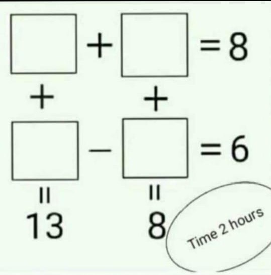

```{r setup, include=FALSE}
knitr::opts_chunk$set(echo = TRUE)
setwd("~/ikanx101 BLOG/_posts/matematika ITB/analisa numerik lanjut/SPL")
```

```{r out.width="35%",echo=FALSE,fig.align='center',fig.retina=10}

```

Kemarin siang di salah satu grup WA, seorang teman mengirimkan gambar seperti di atas. Seketika naluri saya tergerak untuk memecahkan _puzzle_ tersebut. _hehe_

Simpel kok, gak serumit yang dibayangkan.

---

Caranya cukup tuliskan gambar di atas ke dalam bentuk ini:

$$x_1 + x_2 = 8$$

$$x_2 + x_3 = 8$$

$$-x_3 + x_4 = 6$$

$$x_1 + x_4 = 13$$

Jika rekan-rekan membaca tulisan saya yang [ini](https://ikanx101.com/blog/aljabar-rpubs/), kita bisa dengan mudah menyelesaikan sistem persamaan linear ini dengan cara:

$$Ax = b$$

$$x = A^{-1}b$$

Yuk, kita selesaikan:

```{r}
# dalam bentuk matriks
A = matrix(c(1,1,0,0,
             0,1,1,0,
             0,0,-1,1,
             1,0,0,1),
           byrow = T,
           ncol = 4)
b = c(8,8,6,13)

# jawaban eksak
matlib::inv(A) %*% b
```

Selesai _deh_.

Gampang kan?