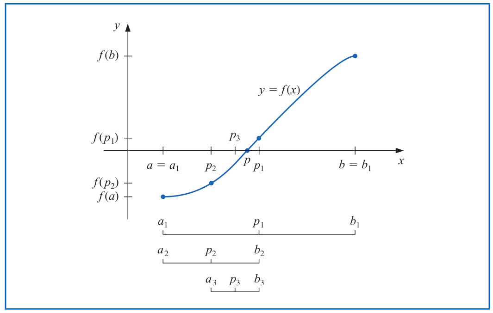

```{r setup, include=FALSE}
knitr::opts_chunk$set(echo = TRUE)
rm(list=ls())

setwd("~/ikanx101 BLOG/_posts/matematika ITB/analisa numerik lanjut/bisection theorem")

library(dplyr)
library(ggplot2)
```

Hari ini adalah hari pertama saya kuliah S2 di Sains Komputasi ITB. Kuliah hari ini dibuka dengan mata kuliah Analisa Numerik Lanjut oleh Prof. Kuntjoro.

Ketika S1 dulu, saya pernah mengambil mata kuliah yang beliau ajar di Kelompok Keahlian Matematika Keuangan.

---

_Nah_, pada pertemuan pembuka ini dibahas materi _refreshment_ saat kuliah __Metode Numerik__ di S1 dulu yakni metode _bisection_ untuk mencari akar dari suatu persamaan.

Mungkin banyak dari rekan-rekan sekalian yang bertanya-tanya:

> Apa sih manfaat dari ilmu ini?

Numerik erat sekali kaitannya dengan ___aproksimasi___. Percayalah bahwa menghitung dengan cara eksak biasanya lebih melelahkan dibandingkan dengan perhitungan numerik. Karena numerik sejatinya merupakan proses iterasi yang relatif __mudah__ dilakukan.

---

Saya mulai dari definisi sederhana, apakah akar persamaan itu?

Akar dari persamaan adalah nilai saat fungsi kontinu bernilai nol.

> Misalkan $f(x)$ adalah fungsi kontinu. Setiap nilai $r$ yang memenuhi $f(r)=0$ disebut __akar persamaan__.

Kata kuncinya di sini adalah fungsinya harus __kontinu__ _yah_.

Sekarang kita coba pikirkan baik-baik, jika saya memiliki fungsi $f$ yang kontinu di selang $[a,b]$ dengan $f(a) . f(b) <0$ artinya pasti ada suatu nilai $c \in [a,b]$ sehingga $f(c)=0$.

Pemikiran tersebut dilandasi oleh sebuah teorema bernama _Intermediate Value Theorem_ (Teorema Nilai Antara).

> Misalkan $f \in C[a,b]$ dan $L$ adalah suatu nilai di atara $f(a)$ dan $f(b)$. Maka __ada__ suatu nilai $c \in (a,b)$ yang memenuhi $f(c) = L$.

Atas dasar teorema ini metode _bisection_ lahir.

## Algoritma Metode _Bisection_

Berikut adalah algoritma atau langkah kerjanya:

- __Step 1__: Find $a$ and $b$ with $a < b$ such that $f(a).f(b) < 0$.
- __Step 2__: Set $c = (a+b)/2$ and evaluate $f(c)$. If $f(c) = 0$  then $r = c$ and stop. Otherwise continue to Step 3.
- __Step 3__: If $f(a).f(c) < 0$ then reset $b = c$. Otherwise reset $a = c$.
- __Step 4__: If $b–a < \epsilon$ then stop. Use $(a+b)/2$  as the approximation to $r$. Otherwise return to Step 2.

Ilustrasi:

```{r out.width="100%",fig.align='center',fig.cap="Ilustrasi Bisection",echo=FALSE}

```

Untuk menemukan akar dari $f(x)$, kita perlu _set_ terlebih dahulu nilai $a$ dab $b$ yang dibutuhkan. Lalu kita ambil nilai tengah antara $a$ dan $b$ (misalkan $p_1$). Kita akan evaluasi nilai $f(p_1)$. Kemudian kita akan _bisection_ atau belah lagi menjadi $p_2$, $p_3$, dan seterusnya hingga __diterima__.

Kategori penerimaan bisa kita definisikan galat tertentu yang bisa kita terima.

---

## Contoh

> Cari nilai $x$ di selang $[0,2]$ yang memenuhi persamaan $x.sin(x) = 1$.

Masalah di atas sama dengan mencari nilai $x \in [0,2]$ sehingga $x.sin(x)-1=0$.

Perhatikan grafik fungsi berikut ini:

```{r,fig.align = "center",message=FALSE,warning=FALSE,echo=FALSE}
# set nilai x
baris = seq(0,2,by = .05)
# fungsi dari soal
f = function(x){x*sin(x)-1}
# nilai y
y = f(baris)
# bikin plotnya
data.frame(x = baris,y) %>% 
  ggplot(aes(x,y)) +
  geom_line(group = 1,
            color = "darkblue") +
  coord_equal() +
  geom_hline(yintercept = 0)
```

Terlihat bahwa:

1. $f(x)$ kontinu pada selang tersebut.
1. Ada tepat satu titik $c \in [0,2]$ di mana nilai $f(x)=0$.

Sekarang kita hitung berapa akar persamaannya menggunakan metode _bisection_ di __R__ sebagai berikut:

```{r}
# clean global environment
rm(list=ls())

# informasi yang dibutuhkan
a = 0 # batas bawah
b = 2 # batas atas
f = function(x){x*sin(x)-1} # fungsi dari soal
iter_max = 50 # batas iterasi yang diperbolehkan
tol_max = 0.00000005 # galat atau error yang masih bisa saya terima

# initial condition
i = 1

# membuat rumah untuk hasil iterasi
hasil = data.frame(n = NA,
                   a = NA,
                   b = NA,
                   c = NA)

# iterasi dimulai dari sini
while(i <= iter_max && (b-a)/2 > tol_max){
  p = a + ((b-a)/2) # mengambil nilai p, yakni titik tengah antara a dan b
  FP = f(p) # hit f(p)
  FA = f(a) # hit f(a)
  FB = f(b) # hit f(b)
  hasil[i,] = list(i,a,b,p) # mencetak hasil perhitungan ke dalam "rumah" yang sudah disediakan
  if(FA*FP < 0){b = p} else{a = p} # ingat aturan bisection!
  i  = i + 1 # penambahan i pada iterasi
}
```

```{r,echo=FALSE}
hasil %>% knitr::kable(align = "c","simple")
```

Kita dapatkan nilai $f(c)=0$ pada $c=$ `r p` dengan toleransi $\epsilon =$ `r tol_max` pada iterasi ke `r i-1` kali

---

`if you find this article helpful, support this blog by clicking the ads`