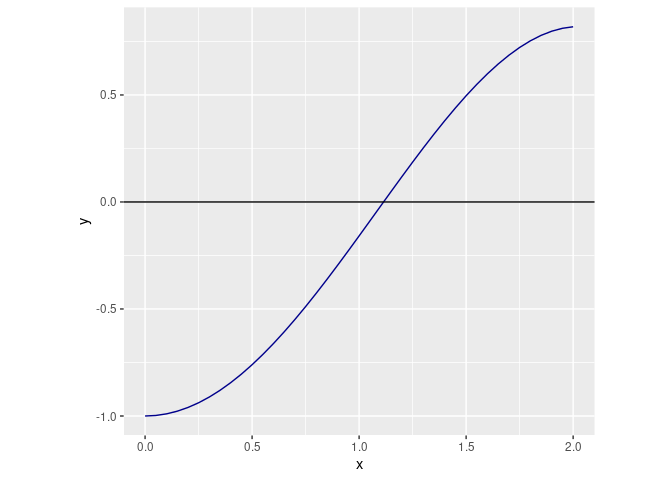

Metode Bisection untuk Mencari Akar Persamaan
================

Hari ini adalah hari pertama saya kuliah S2 di Sains Komputasi ITB.
Kuliah hari ini dibuka dengan mata kuliah Analisa Numerik Lanjut oleh
Prof. Kuntjoro.

Ketika S1 dulu, saya pernah mengambil mata kuliah yang beliau ajar di
Kelompok Keahlian Matematika Keuangan.

------------------------------------------------------------------------

*Nah*, pada pertemuan pembuka ini dibahas materi *refreshment* saat
kuliah **Metode Numerik** di S1 dulu yakni metode *bisection* untuk
mencari akar dari suatu persamaan.

Mungkin banyak dari rekan-rekan sekalian yang bertanya-tanya:

> Apa sih manfaat dari ilmu ini?

Numerik erat sekali kaitannya dengan ***aproksimasi***. Percayalah bahwa
menghitung dengan cara eksak biasanya lebih melelahkan dibandingkan
dengan perhitungan numerik. Karena numerik sejatinya merupakan proses
iterasi yang relatif **mudah** dilakukan.

------------------------------------------------------------------------

Saya mulai dari definisi sederhana, apakah akar persamaan itu?

Akar dari persamaan adalah nilai saat fungsi kontinu bernilai nol.

> Misalkan *f*(*x*) adalah fungsi kontinu. Setiap nilai *r* yang
> memenuhi *f*(*r*) = 0 disebut **akar persamaan**.

Kata kuncinya di sini adalah fungsinya harus **kontinu** *yah*.

Sekarang kita coba pikirkan baik-baik, jika saya memiliki fungsi *f*
yang kontinu di selang \[*a*, *b*\] dengan *f*(*a*).*f*(*b*) &lt; 0
artinya pasti ada suatu nilai *c* ∈ \[*a*, *b*\] sehingga *f*(*c*) = 0.

Pemikiran tersebut dilandasi oleh sebuah teorema bernama *Intermediate
Value Theorem* (Teorema Nilai Antara).

> Misalkan *f* ∈ *C*\[*a*, *b*\] dan *L* adalah suatu nilai di atara
> *f*(*a*) dan *f*(*b*). Maka **ada** suatu nilai *c* ∈ (*a*, *b*) yang
> memenuhi *f*(*c*) = *L*.

Atas dasar teorema ini metode *bisection* lahir.

## Algoritma Metode *Bisection*

Berikut adalah algoritma atau langkah kerjanya:

-   **Step 1**: Find *a* and *b* with *a* &lt; *b* such that
    *f*(*a*).*f*(*b*) &lt; 0.
-   **Step 2**: Set *c* = (*a* + *b*)/2 and evaluate *f*(*c*). If
    *f*(*c*) = 0 then *r* = *c* and stop. Otherwise continue to Step 3.
-   **Step 3**: If *f*(*a*).*f*(*c*) &lt; 0 then reset *b* = *c*.
    Otherwise reset *a* = *c*.
-   **Step 4**: If *b*–*a* &lt; *ϵ* then stop. Use (*a* + *b*)/2 as the
    approximation to *r*. Otherwise return to Step 2.

Ilustrasi:

<div class="figure" style="text-align: center">


<p class="caption">
Ilustrasi Bisection
</p>

</div>

Untuk menemukan akar dari *f*(*x*), kita perlu *set* terlebih dahulu
nilai *a* dab *b* yang dibutuhkan. Lalu kita ambil nilai tengah antara
*a* dan *b* (misalkan *p*<sub>1</sub>). Kita akan evaluasi nilai
*f*(*p*<sub>1</sub>). Kemudian kita akan *bisection* atau belah lagi
menjadi *p*<sub>2</sub>, *p*<sub>3</sub>, dan seterusnya hingga
**diterima**.

Kategori penerimaan bisa kita definisikan galat tertentu yang bisa kita
terima.

------------------------------------------------------------------------

## Contoh

> Cari nilai *x* di selang \[0, 2\] yang memenuhi persamaan
> *x*.*s**i**n*(*x*) = 1.

Masalah di atas sama dengan mencari nilai *x* ∈ \[0, 2\] sehingga
*x*.*s**i**n*(*x*) − 1 = 0.

Perhatikan grafik fungsi berikut ini:



Terlihat bahwa:

1.  *f*(*x*) kontinu pada selang tersebut.
2.  Ada tepat satu titik *c* ∈ \[0, 2\] di mana nilai *f*(*x*) = 0.

Sekarang kita hitung berapa akar persamaannya menggunakan metode
*bisection* di **R** sebagai berikut:

``` r
# clean global environment
rm(list=ls())

# informasi yang dibutuhkan
a = 0 # batas bawah
b = 2 # batas atas
f = function(x){x*sin(x)-1} # fungsi dari soal
iter_max = 50 # batas iterasi yang diperbolehkan
tol_max = 0.00000005 # galat atau error yang masih bisa saya terima

# initial condition
i = 1

# membuat rumah untuk hasil iterasi
hasil = data.frame(n = NA,
                   a = NA,
                   b = NA,
                   c = NA)

# iterasi dimulai dari sini
while(i <= iter_max && (b-a)/2 > tol_max){
  p = a + ((b-a)/2) # mengambil nilai p, yakni titik tengah antara a dan b
  FP = f(p) # hit f(p)
  FA = f(a) # hit f(a)
  FB = f(b) # hit f(b)
  hasil[i,] = list(i,a,b,p) # mencetak hasil perhitungan ke dalam "rumah" yang sudah disediakan
  if(FA*FP < 0){b = p} else{a = p} # ingat aturan bisection!
  i  = i + 1 # penambahan i pada iterasi
}
```

|  n  |    a     |    b     |    c     |
|:---:|:--------:|:--------:|:--------:|
|  1  | 0.000000 | 2.000000 | 1.000000 |
|  2  | 1.000000 | 2.000000 | 1.500000 |
|  3  | 1.000000 | 1.500000 | 1.250000 |
|  4  | 1.000000 | 1.250000 | 1.125000 |
|  5  | 1.000000 | 1.125000 | 1.062500 |
|  6  | 1.062500 | 1.125000 | 1.093750 |
|  7  | 1.093750 | 1.125000 | 1.109375 |
|  8  | 1.109375 | 1.125000 | 1.117188 |
|  9  | 1.109375 | 1.117188 | 1.113281 |
| 10  | 1.113281 | 1.117188 | 1.115234 |
| 11  | 1.113281 | 1.115234 | 1.114258 |
| 12  | 1.113281 | 1.114258 | 1.113770 |
| 13  | 1.113770 | 1.114258 | 1.114014 |
| 14  | 1.114014 | 1.114258 | 1.114136 |
| 15  | 1.114136 | 1.114258 | 1.114197 |
| 16  | 1.114136 | 1.114197 | 1.114166 |
| 17  | 1.114136 | 1.114166 | 1.114151 |
| 18  | 1.114151 | 1.114166 | 1.114159 |
| 19  | 1.114151 | 1.114159 | 1.114155 |
| 20  | 1.114155 | 1.114159 | 1.114157 |
| 21  | 1.114157 | 1.114159 | 1.114158 |
| 22  | 1.114157 | 1.114158 | 1.114157 |
| 23  | 1.114157 | 1.114157 | 1.114157 |
| 24  | 1.114157 | 1.114157 | 1.114157 |
| 25  | 1.114157 | 1.114157 | 1.114157 |

Kita dapatkan nilai *f*(*c*) = 0 pada *c*= 1.1141571 dengan toleransi
*ϵ*= 5^{-8} pada iterasi ke 25 kali

------------------------------------------------------------------------

`if you find this article helpful, support this blog by clicking the ads`
