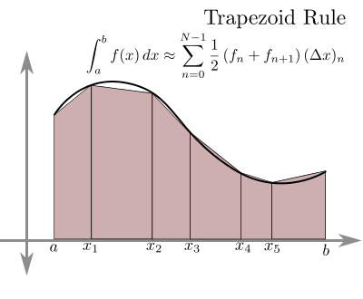

```{r setup, include=FALSE}
knitr::opts_chunk$set(echo = TRUE)
setwd("~/ikanx101 BLOG/_posts/matematika ITB/analisa numerik lanjut/hitung Pi")
rm(list=ls())

library(dplyr)
library(ggplot2)
```

Pada _post_ yang lalu, saya pernah menuliskan bagaimana [simulasi MonteCarlo](https://ikanx101.com/blog/hitung-pi/) digunakan untuk mengaproksimasi nilai $\pi$. Jika kamu belum membacanya, saya sarankan untuk membacanya terlebih dahulu.

Pada tulisan tersebut, saya mencoba mengaproksimasi dengan cara seperti melempar _darts_ ke $1/4$ lingkaran. Luas lingkarannya adalah rasio banyaknya __darts on target per total lemparan darts__ yang saya lakukan.

```{r out.width="50%",echo=FALSE,fig.align='center'}
knitr::include_graphics("https://raw.githubusercontent.com/ikanx101/ikanx101.github.io/master/_posts/Monte%20Carlo/Hitung%20Pi/Blog-post_files/figure-gfm/unnamed-chunk-2-1.png")
```

---

## Aproksimasi Cara Lain

Sebenarnya ada banyak cara untuk menghampiri nilai $\pi$, salah satunya adalah dengan menghitung integral atau luas daerah di bawah kurva lingkaran berjari-jari 1 satuan. 

Oke, untuk memudahkan, saya akan buat $1/4$ lingkaran berikut ini:

$$f(x) = \sqrt{1 - x^2} \text{, untuk x } \in [0,1]$$

```{r,echo=FALSE,warning=FALSE,message=FALSE,fig.align='center'}
rm(list=ls())

f = function(x){sqrt(-x^2 + 1^2)}

data.frame(x = seq(0,1,by = .005)) %>% 
  mutate(y = f(x)) %>% 
  ggplot(aes(x,y)) +
  geom_line(color = "steelblue") +
  coord_equal() +
  geom_vline(xintercept = 0) +
  geom_hline(yintercept = 0) +
  labs(title = "Grafik Fungsi Lingkaran Berjari-jari 1 Satuan",
       subtitle = "Cari luas dibawah kurva!",
       caption = "Visualized using R\nikanx101.com") +
  theme(plot.title = element_text(hjust = .5, size = 15),
        plot.caption = element_text(hjust = .5, size = 10),
        plot.subtitle = element_text(hjust = .5, size = 12))

```


Ekspektasinya adalah: $\pi = 4 \times \int_0^1 f(x)$.

Secara eksak, kita bisa menghitung integral fungsinya dan akhirnya mendapatkan nilai $\pi$.

> _Bagaimana jika saya terlalu malas untuk melakukan integral?_

Saya bisa memilih untuk melakukan pendekatan secara numerik. Yakni dengan menghitung luas di bawah kurva menggunakan hampiran _trapezoid_. Berikut adalah ilustrasinya:

```{r out.width="55%",echo=FALSE,fig.align='center',fig.cap="Sumber bragitoff.com"}

```

Menggunakan rumus yang tertera di atas, tugas kita sekarang "hanya" menentukan mau menggunakan nilai _N_ berapa. _N_ adalah berapa banyak _trapezoid_ yang hendak kita _generate_. Tentunya semakin banyak, semaki akurat, tapi secara komputasi akan lebih "lama" (walaupun gak lama-lama _banget donk_).

_Yuk_ kita hitung dengan berbagai macam nilai _N_. Kita akan bandingkan:

1. _Error_-nya dengan nilai $\pi$ _default_ di __R__. Saya definisikan $error = |\pi - hampiran|$.
1. _Processing time_.

```{r,include=FALSE}
trapezoid = function(x0,xn,n,f){
  start = Sys.time()
  h = (xn - x0) / n
  f0 = f(x0)
  # selang pertama
  i = 1
  k = x0 + i*h
  fn = f(k)
  integration = (f0+fn)/2
  for(i in 2:n){
    f0 = fn
    k = x0 + i*h
    fn = f(k)
    temp = (f0+fn)/2
    integration = integration + temp
  }
  integration = integration * h
  end = Sys.time()
  waktu = end - start
  # output
  output = list(N = n,
                Pi = integration,
                delta = abs(pi - integration),
                Waktu = waktu)
  return(output)
}
```


```{r,echo=FALSE,warning=FALSE,message=FALSE}
options(scipen = 99)
f = function(x){4 * sqrt(1 - x^2)}
n = c(5,10,40,100,400,1000,2500,5000,10000,25000,60000)

hasil = data.frame(N = NA,
                   Pi_hampiran = NA,
                   Error = NA,
                   Proc_Time = NA)

for(i in 1:length(n)){
  hasil[i,] = trapezoid(0,1,n[i],f) 
}

hasil %>% knitr::kable()
```


Terkonfirmasi _yah_ bahwa semakin banyak _N_ hasil hampirannya semakin akurat dan _processing time_-nya relatif lebih lama.

---

`if you find this article helpful, support this blog by clicking the ads.`