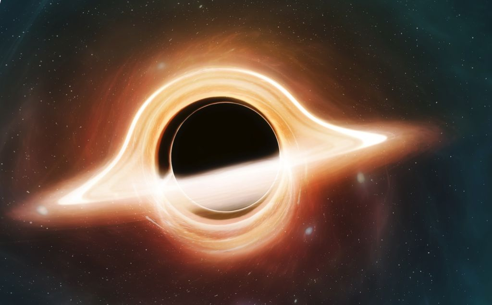

```{r setup, include=FALSE}
knitr::opts_chunk$set(echo = TRUE)
rm(list=ls())
library(dplyr)
library(ggplot2)
```

Pada _posting_ [sebelumnya](https://ikanx101.com/blog/spiral-rpubs/) saya membahas salah satu _meta heuristic algorithm_ bernama ___Spiral Dynamic Optimization Algorithm___ (SDOA).

Kali ini saya akan kembali membahas salah satu _meta heuristic algorithm_ yang menurut saya sangat simpel kerjanya. Algoritmanya mirip sekali dengan SDOA namun tanpa harus melakukan rotasi. Hal ini sangat berguna saat menghadapi variabel yang banyak sehingga tidak memberatkan komputer saat melakukan komputasi matriks rotasi berukuran besar.

Algoritma ini terinspirasi dari salah satu fenomena alam, yakni _black hole_. Ada beberapa _paper_ yang membahas tentang algoritma ini. Kelak saya akan meramu beberapa temuan dan _improvement_ yang saya dapatkan dari _papers_ tersebut dan membuat modifikasi algoritmanya menjadi: ___Big Bang - Black Hole Inspired Optimization Algorithm___.

---

Berbeda dengan solusi eksak yang __sudah pasti__ menghasilkan solusi paling optimal, solusi hasil perhitungan _meta heuristic_ __belum tentu menghasilkan solusi paling optimal__.

Kenapa demikian? Karena setiap algoritmanya mengandung unsur keacakan.

> ___Konon setiap kejadian yang terjadi di dunia terjadi secara acak.___

Namun dengan melakukan beberapa _improvements_, kita bisa mendapatkan solusi yang optimal dari perhitungan _meta heuristic_.

# OPTIMISASI

Masalah optimisasi yang ada di matematika sebenarnya adalah masalah pencarian nilai maksimum atau minimum. Terlepas dari apakah ada _constraints_ atau tidak.

Oleh karena itu, ada dua istilah yang sering muncul saat kita berbicara mengenai hal ini:

1. _Local optima_: nilai maksimum atau minimum yang terjadi di selang tertentu. Bukan merupakan solusi dari keseluruhan daerah definisi.
1. _Global optimum_: nilai maksimum atau minimum yang terjadi di daerah definisi. Tentunya ini adalah __solusi yang dicari__.

```{r out.width="60%",echo=FALSE,fig.align='center'}

```

---

# Aplikasi Algoritma Optimisasi

Untuk apa _sih_ kita menggunakan algoritma _meta heuristic_ ini?

> ___Menyelesaikan permasalahan yang ditemui...___

Lebih besar dari masalah yang kkita hadapi saat training optimisasi di KampusX silam. Aplikasi algoritma ini sangat banyak, mulai dari:

1. Penyelesaian masalah optimisasi (baik linear atau non linear).
    - Bisa untuk menyelesaikan _objective function_ yang linear atau tidak linear.
    - Bisa untuk menyelesaikan berbagai macam tipe variabel: diskrit, kontinu, dan biner.
    - Bisa untuk menyelesaikan _constrained problem_ dan _unconstrained problem_.
1. _Feature selection_ untuk:
    - _Machine learning model_. 
    - _Deep learning model_.
    - Baik untuk permasalahan klasifikasi dan regresi.
1. dll (tergantung imajinasi Anda).

Kita akan bahas satu-persatu di bagian selanjutnya.

# _BIG BANG - BLACK HOLE INSPIRED OPTIMIZATION ALGORITHM_

BHO merupakan salah satu algoritma optimisasi _meta heuristic_ yang terinspirasi dari kejadian _big bang_ hingga kemunculan _black hole_ sehingga __memakan__ objek angkasa yang lain.

```{r out.width="50%",echo=FALSE,fig.align='center'}

```

<br>

Prinsip kerjanya sederhana, yakni:

1. Membuat suatu _big bang_, mengakibatkan banyak bintang lahir.
1. Menjadikan salah satu bintang sebagai _black hole_.
1. Menarik semua bintang lain menuju _black hole_ karena gravitasinya.
1. Saat bintang masuk ke area _event horizon_ dari _black hole_, maka bintang tersebut akan hilang. 
1. Saat jumlah bintang berkurang karena tertarik ke _black hole_, bintang-bintang baru akan bermunculan.

__Bintang__ yang kita sebutkan di atas sejatinya adalah __calon solusi__ sementara ___black hole___ adalah __solusi__ yang dicari.

### Ilustrasi

Untuk memudahkan, lihatlah ilustrasi dari bintang-bintang sebagai berikut:

```{r,echo=FALSE,fig.align='center',message=FALSE,warning=FALSE}
N = 300
x = runif(N,0,1)
y = runif(N,0,1)

data.frame(x,y,color = c(1,rep(0,(N-1)))) %>% 
  ggplot(aes(x,y)) +
  geom_point(aes(color = factor(color),
                 size = color)) +
  scale_color_manual(values = c("black","red")) +
  theme_void() +
  theme(legend.position = "none")
```


Misalkan titik merah adalah titik solusi yang dicari. Maka titik merah akan menjadi _black hole_ yang menyerap semua bintang yang ada dengan suatu nilai _gravity rate_ tertentu.

Beberapa kritik atas algoritma ini adalah kelemahannya untuk mencari _global optima_. BHO cenderung __mudah terjebak__ dalam _local optima_ (seolah-olah _local optima_ adalah solusi yang dicari sehingga menjadikan _black hole_ terlalu cepat memakan bintang yang lain). Sementara kemampuannya dalam mengeksplorasi area lainnya menjadi lemah. Oleh karena itu kita bisa melakukan beberapa  _improvement_ dengan mengubah cara perhitungan _gravity rate_ dan menambahkan _another big bang_ jika banyaknya bintang semakin sedikit.

## Hal Penting dalam BHO

Setidaknya ada dua hal yang perlu didefinisikan dalam BHO, yakni:

1. _Gravity rate_
1. _Radius event horizon_

### _Gravity rate_

Agar BHO bisa mengeksploitasi area definisi lebih baik, maka _gravity rate_ didefinisikan sebagai:

$$g = \text{random}(0,1.5)$$

Nilai random antara [0,1.5].

Hal ini memastikan adanya konstraksi dan relaksasi bintang ke area-area lainnya.

### _Radius event horizon_

Radius _event horizon_ bisa kita definisikan:

$$r = \frac{f_{bh}}{\sum{f_{xi}}}$$

## _Pseudocode_

Misalkan kita hendak mencari $x \in D$ yang menyebabkan $\min{f(x)}$. _Pseudocode_ dari algoritma ini adalah:

```
STEP I
  define:
    max_iter
  generate stars randomly
    xi
STEP II
  evaluate all xi
    fxi
STEP III
  define black hole (xi that produce min(fxi)) 
    x*
  define gravity rate (constant or not)
    g in [0,1]
  define event horizon radius
    r = f(x*) / sum(f(xi))
STEP IV
  pull all stars into black hole at gravity rate
    xi' = x* + g (x* - xi)
  eliminate all stars in event horizon radius
    if d(x*,xi) < r :
      delete xi
STEP V
  if number of stars getting lower:
    generate stars all over
STEP VI
  loop STEP II to STEP V all over
  until 
    converge or
    max iteration
```

# MAXIMIZING / MINIMIZING

## Contoh 

Cari $x,y$ yang membuat $f(x,y) = x^2 + y^2$ minimum di $x,y \in [-1,1]$

```{r,message=FALSE,warning=FALSE}
# dimulai dari hati yang bersih
rm(list=ls())
library(dplyr)

# definisi fungsi soal
f = function(vec) vec[1]^2 + vec[2]^2

# definisi fungsi generate star
big_bang = function() runif(2,-1,1) %>% round(1)

# definisi 
# berapa banyak bintang
N = 500
stars = vector("list",N)
# rumah untuk fxi
fxi = rep(999,N)
# definisikan dulu max iteration yang diperbolehkan
max_iter = 600

# membuat bintang dan menghitung nilai fxi-nya
for(i in 1:N){
  stars[[i]] = big_bang()
  fxi[i] = f(stars[[i]])
}

# mencari black hole
n_bh = which.min(fxi) # star ke berapa yang punya nilai fxi terkecil
bh = stars[[n_bh]] # definisi black hole
f_bh = fxi[n_bh] # nilai f_bh

# iterasi BHO kita mulai dari sini
for(ikang in 1:max_iter){
  # menghitung radius event horizon
  r = f_bh / sum(fxi)

  # saat ada bintang yang berjarak kurang dari r akan kita hapus
  jarak = abs(fxi - f_bh)
  n_luar = which(jarak >= r)

  # stars yang ada di n_luar 
  stars = stars[n_luar]

  # jika jumlah stars < N --> big bang lagi
  n_stars = length(stars)
  if(n_stars < N){
    # membuat bintang dan menghitung nilai fxi-nya
    for(i in (n_stars + 1):N){
        stars[[i]] = big_bang()
        fxi[i] = f(stars[[i]])
    }
  }

  # gravity rate - akan dbuat tetap
  g = runif(1,0,1.5)

  # iterasi proses penarikan bintang ke black hole
  for(j in 1:N){
    xt = stars[[j]]
    xt_new = bh + g * (xt - bh)
    xt_new = xt_new %>% round(1)
    fxi[j] = f(xt_new)
    stars[[j]] = xt_new
  }

  # mencari black hole
  n_bh = which.min(fxi) # star ke berapa yang punya nilai fxi terkecil
  bh = stars[[n_bh]] # definisi black hole
  f_bh = fxi[n_bh] # nilai f_bh
}

n_solusi = which.min(fxi)
stars[[n_solusi]] %>% round(2)
min(fxi)
```


## Contoh

Cari $x_1,x_2$ yang meminimumkan fungsi berikut ini:

$$f(x_1,x_2) = \frac{x_1^4 - 16 x_1^2 + 5 x_1}{2} + \frac{x_2^4 - 16 x_2^2 + 5 x_2}{2} \\ -4 \leq x_1,x_2 \leq 4$$


```{r,message=FALSE,warning=FALSE}
# dimulai dari hati yang bersih
rm(list=ls())

library(dplyr)

# definisi fungsi soal
f = function(vec) {
  ka = vec[1]^4 - 16 * vec[1]^2 + 5 * vec[1]
  ka = ka / 2
  ki = vec[2]^4 - 16 * vec[2]^2 + 5 * vec[2]
  ki = ki / 2
  return(ka + ki)
}

# definisi fungsi generate star
big_bang = function() runif(2,-4,4)

# definisi 
# berapa banyak bintang
N = 700
stars = vector("list",N)
# rumah untuk fxi
fxi = rep(999,N)
# definisikan dulu max iteration yang diperbolehkan
max_iter = 50

# membuat bintang dan menghitung nilai fxi-nya
for(i in 1:N){
  stars[[i]] = big_bang()
  fxi[i] = f(stars[[i]])
}

# mencari black hole
n_bh = which.min(fxi) # star ke berapa yang punya nilai fxi terkecil
bh = stars[[n_bh]] # definisi black hole
f_bh = fxi[n_bh] # nilai f_bh

# iterasi BHO kita mulai dari sini
for(ikang in 1:max_iter){
  # menghitung radius event horizon
  r = f_bh / sum(fxi)

  # saat ada bintang yang berjarak kurang dari r akan kita hapus
  jarak = abs(fxi - f_bh)
  n_luar = which(jarak >= r)

  # stars yang ada di n_luar 
  stars = stars[n_luar]

  # jika jumlah stars < N --> big bang lagi
  n_stars = length(stars)
  if(n_stars < N){
    # membuat bintang dan menghitung nilai fxi-nya
    for(i in (n_stars + 1):N){
        stars[[i]] = big_bang()
        fxi[i] = f(stars[[i]])
    }
  }

  # gravity rate - akan dbuat tetap
  g = runif(1,0,1.5)

  # iterasi proses penarikan bintang ke black hole
  for(j in 1:N){
    xt = stars[[j]]
    xt_new = bh + g * (xt - bh)
    fxi[j] = f(xt_new)
    stars[[j]] = xt_new
  }

  # mencari black hole
  n_bh = which.min(fxi) # star ke berapa yang punya nilai fxi terkecil
  bh = stars[[n_bh]] # definisi black hole
  f_bh = fxi[n_bh] # nilai f_bh
}

n_solusi = n_bh
stars[[n_solusi]] %>% round(2)
f_bh
```


# PENCARIAN AKAR

Apa hubungannya optimisasi dengan pencarian akar?

Kita bisa mengubah masalah optimisasi menjadi masalah pencarian akar dengan cara:

Suatu sistem memiliki solusi $x = (x_1,x_2,..,x_n)^T$ jika $F(x)$ yang kita definisikan sebagai:

$$F(x) = \frac{1}{1 + \sum_{i = 1}^n |g_i(x)|}$$

memiliki nilai maksimum sama dengan 1.

__Akibatnya algoritma yang sebelumnya adalah mencari nilai__ $\min{F(x)}$ __diubah mencari__ $\max{F(x)}$.

Akibatnya $x$ menjadi akar dari $g_i(x),\space i = 1,2,..,n$.

## Contoh Soal

Kita akan gunakan BHO untuk menyelesaikan permasalahan pencarian akar untuk persamaan _diophantine_ berikut:

$$x^2 + y^2 = 625, 0 \leq x,y \leq 25$$


```{r,message=FALSE,warning=FALSE}
# dimulai dari hati yang bersih
rm(list=ls())

library(dplyr)

# definisi fungsi soal
f = function(vec) {
  g = vec[1]^2 + vec[2]^2 - 625
  g = abs(g)
  f = 1 / (1 + g)
  return(f)
}

# definisi fungsi generate star
big_bang = function() runif(2,-0.45,25.45) %>% round(0)

# definisi 
# berapa banyak bintang
N = 800
stars = vector("list",N)
# rumah untuk fxi
fxi = rep(999,N)
# definisikan dulu max iteration yang diperbolehkan
max_iter = 80

# membuat bintang dan menghitung nilai fxi-nya
for(i in 1:N){
  stars[[i]] = big_bang()
  fxi[i] = f(stars[[i]])
}

# mencari black hole
n_bh = which.max(fxi) # star ke berapa yang punya nilai fxi terkecil
bh = stars[[n_bh]] # definisi black hole
f_bh = fxi[n_bh] # nilai f_bh

# iterasi BHO kita mulai dari sini
for(ikang in 1:max_iter){
  # menghitung radius event horizon
  r = f_bh / sum(fxi)

  # saat ada bintang yang berjarak kurang dari r akan kita hapus
  jarak = abs(fxi - f_bh)
  n_luar = which(jarak >= r)

  # stars yang ada di n_luar 
  stars = stars[n_luar]

  # jika jumlah stars < N --> big bang lagi
  n_stars = length(stars)
  if(n_stars < N){
    # membuat bintang dan menghitung nilai fxi-nya
    for(i in (n_stars + 1):N){
        stars[[i]] = big_bang()
        fxi[i] = f(stars[[i]])
    }
  }

  # gravity rate - akan dbuat tetap
  g = runif(1,0,1.5)

  # iterasi proses penarikan bintang ke black hole
  for(j in 1:N){
    xt = stars[[j]]
    xt_new = bh + g * (xt - bh)
    xt_new_1 = xt_new %>% round(0)
    fxi[j] = f(xt_new_1)
    stars[[j]] = xt_new
  }

  # mencari black hole
  n_bh = which.max(fxi) # star ke berapa yang punya nilai fxi terkecil
  bh = stars[[n_bh]] # definisi black hole
  f_bh = fxi[n_bh] # nilai f_bh
}

stars[[n_bh]] %>% round(0)
fxi[n_bh]
```

---

# OPTIMISASI

> Bagaimana menyelesaikan _mixed integer programming_ (baik _linear_ dan _non linear_) menggunakan BHO?

## Mengubah _Constrained Optimization_

Salah satu trik yang bisa dilakukan agar SOA bisa menyelesaikan _mixed integer programming_ adalah dengan mengubah _constrained optimization problem_ menjadi _unconstrained optimization problem_ kemudian memanfaatkan _penalty constant_.

Misal suatu permasalahan MILP atau MINLP bisa ditulis secara umum sebagai berikut:

$$\min_{x \in \mathbb{R}^n} f(x)$$

$$\text{subject to: } g_i(x) = 0, i = 1,2,..,M$$

$$\text{and } h_j(x) \leq 0,i = 1,2,..,N$$

$$x = (x_1,x_2,...,x_n)^T \in \mathbb{N}$$

Bentuk di atas bisa kita ubah menjadi:

$$F(x,\alpha,\beta) = f(x) + \sum_{i=1}^M \alpha_i g_i^2(x) + \sum_{j = 1}^N \beta_j (\max{(h_i(x),0)})^2$$

dimana $\alpha,\beta$ merupakan _penalty constant_ yang bisa dibuat sangat besar.

## Contoh Soal

Oke, untuk contoh kasus pertama saya akan gunakan persoalan yang pernah saya tulis di [blog sebelumnya](https://ikanx101.com/blog/linear-r/).

Cari $(x,y)$ yang memaksimalkan $7000 x + 12000 y$ dengan _constraints_ sebagai berikut:

$$4x + 20y \leq 1960 \\ x + y \leq 250 \\ x,y \geq 0 \\ x,y \in \mathbb{Z}^+$$

```{r,message=FALSE,warning=FALSE}
# dimulai dari hati yang suci
rm(list=ls())

# definisi fungsi soal
f1 = function(x){-7000*x[1] - 12000*x[2]}
h1 = function(x){4*x[1] + 20*x[2] - 1960}
h2 = function(x){x[1] + x[2] - 250}
# definisi penalty constant
beta = 10^25
# objective function final
f = function(x){
  el_1 = f1(x) 
  el_2 = beta * (max(h1(x),0))^2
  el_3 = beta * (max(h2(x),0))^2
  return(el_1 + el_2 + el_3)
}

# definisi fungsi generate star
big_bang = function() runif(2,-0.45,250) %>% round(0)

# definisi 
# berapa banyak bintang
N = 200
stars = vector("list",N)
# rumah untuk fxi
fxi = rep(999,N)
# definisikan dulu max iteration yang diperbolehkan
max_iter = 80

# membuat bintang dan menghitung nilai fxi-nya
for(i in 1:N){
  stars[[i]] = big_bang()
  fxi[i] = f(stars[[i]])
}

# mencari black hole
n_bh = which.min(fxi) # star ke berapa yang punya nilai fxi terkecil
bh = stars[[n_bh]] # definisi black hole
f_bh = fxi[n_bh] # nilai f_bh

# iterasi BHO kita mulai dari sini
for(ikang in 1:max_iter){
  # menghitung radius event horizon
  r = f_bh / sum(fxi)

  # saat ada bintang yang berjarak kurang dari r akan kita hapus
  jarak = abs(fxi - f_bh)
  n_luar = which(jarak >= r)

  # stars yang ada di n_luar 
  stars = stars[n_luar]

  # jika jumlah stars < N --> big bang lagi
  n_stars = length(stars)
  if(n_stars < N){
    # membuat bintang dan menghitung nilai fxi-nya
    for(i in (n_stars + 1):N){
        stars[[i]] = big_bang()
        fxi[i] = f(stars[[i]])
    }
  }

  # gravity rate - akan dbuat tetap
  g = runif(1,0,1.5)

  # iterasi proses penarikan bintang ke black hole
  for(j in 1:N){
    xt = stars[[j]]
    xt_new = bh + g * (xt - bh)
    xt_new_1 = xt_new %>% round(0)
    fxi[j] = f(xt_new_1)
    stars[[j]] = xt_new
  }

  # mencari black hole
  n_bh = which.min(fxi) # star ke berapa yang punya nilai fxi terkecil
  bh = stars[[n_bh]] # definisi black hole
  f_bh = fxi[n_bh] # nilai f_bh
}

stars[[n_bh]] %>% round(0)
fxi[n_bh]
```

