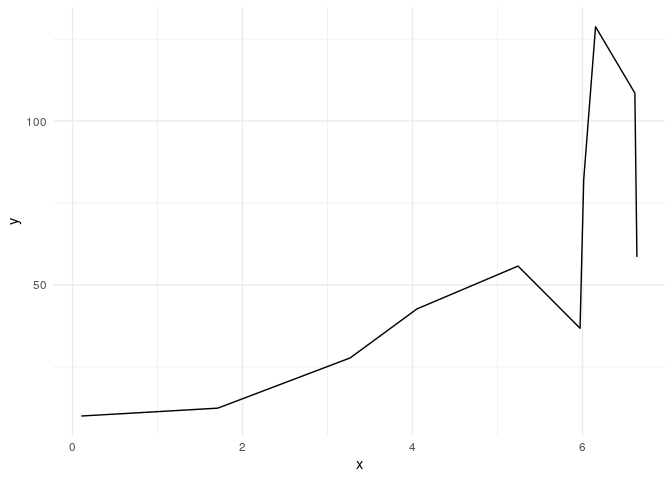

Belajar Membuat Model Regresi Linear - part 3 (Polinomial)
================

Pada tulisan [sebelumnya](https://ikanx101.com/blog/multi-linear/) saya
telah menjelaskan bagaimana caranya membuat persamaan regresi linear
banyak peubah peubah ( dan ) **dari nol**. Sekarang kita akan “naik kelas” lagi untuk membuat
fungsi regresi polinomial untuk satu peubah. Apa maksudnya?

> Kita akan membuat fungsi curve fitting yang nonlinear.

Misalkan saya memiliki 
buah pasang data sebagai berikut:
"), lalu
kita hendak membuat persamaan regresi berikut ini:  = y = a_0 + a_1 x + a_2 x^2 + a_3 x^3 + .. + a_n x^n").

Bagaimana cara kita melakukannya?

-----

Pada tulisan sebelumnya, saya mendefinisikan *error* sebagai **jarak**
antara nilai *real* dan nilai prediksi. Kali ini sama saja. Kita
menggunakan definisi dan cara perhitungan yang sama.

Misalkan saya memiliki 
buah data dengan  banyak
pangkat polinom. Maka ekspektasi kita adalah:

  
  

Dengan prinsip yang sama dengan sebelumnya, saya akan tuliskan sebagai:

  
  

Dengan menggunakan definisi *error* yang sama dengan sebelumnya:

  
)^2")  

Lantas bagaimana caranya jika banyak sekali
 baris datanya?

Saya akan lakukan *tweaks* seperti berikut sehingga
 bisa didapatkan dengan
cara:

  
^{-1} X^T Y")  

Sama persis dengan kasus sebelumnya.

-----

## Contoh Data

Mari kita uji dengan data sebagai berikut:

|         x |        y |
| --------: | -------: |
| 1.2682457 | 11.81575 |
| 4.2616476 | 33.28586 |
| 0.6927852 | 10.27871 |
| 2.3036064 | 12.58809 |
| 2.0005946 | 14.57787 |
| 0.1390073 | 10.06121 |
| 0.8925513 | 10.59040 |
| 2.8678197 | 15.52713 |
| 1.8504950 | 14.56502 |
| 0.6612379 | 10.33022 |

<!-- -->

dan saya akan membuat fungsi regresi polinm orde 3 berikut: .

Pertama-tama kita akan buat matriks sebagai berikut:

``` r
n = length(x)
x0 = rep(1,n)
X = cbind(x0,x1 = x,x2 = x^2,x3 = x^3)
t_X = t(X)
Y = y

# matriks X
X
```

    ##       x0        x1          x2           x3
    ##  [1,]  1 1.2682457  1.60844726  2.039906396
    ##  [2,]  1 4.2616476 18.16163988 77.398508205
    ##  [3,]  1 0.6927852  0.47995139  0.332503243
    ##  [4,]  1 2.3036064  5.30660227 12.224322753
    ##  [5,]  1 2.0005946  4.00237858  8.007136814
    ##  [6,]  1 0.1390073  0.01932304  0.002686045
    ##  [7,]  1 0.8925513  0.79664784  0.711049069
    ##  [8,]  1 2.8678197  8.22439006 23.586068155
    ##  [9,]  1 1.8504950  3.42433168  6.336708585
    ## [10,]  1 0.6612379  0.43723551  0.289116673

Oke, kita akan cari nilai konstantanya sebagai berikut:

``` r
solve(t_X %*% X) %*% t_X %*% Y
```

    ##          [,1]
    ## x0  8.5153593
    ## x1  5.2111291
    ## x2 -2.8801942
    ## x3  0.7064675

Maka kita dapatkan persamaan sebagai berikut:

y = 8.515 + (5.211) x + (-2.88) x^2 + (0.706 x^3)

Mari kita prediksi nilai  dan kita hitung *error*-nya.

|         x |        y | prediksi\_y |   error |
| --------: | -------: | ----------: | ------: |
| 1.2682457 | 11.81575 |   11.931674 | \-0.116 |
| 4.2616476 | 33.28586 |   33.060269 |   0.226 |
| 0.6927852 | 10.27871 |   10.977591 | \-0.699 |
| 2.3036064 | 12.58809 |   13.866450 | \-1.278 |
| 2.0005946 | 14.57787 |   13.066287 |   1.512 |
| 0.1390073 | 10.06121 |    9.185613 |   0.876 |
| 0.8925513 | 10.59040 |   11.373740 | \-0.783 |
| 2.8678197 | 15.52713 |   16.424729 | \-0.898 |
| 1.8504950 | 14.56502 |   12.769570 |   1.795 |
| 0.6612379 | 10.33022 |   10.905589 | \-0.575 |

-----

## *What’s Next?*

Sebagaimana yang telah saya sampaikan pada tulisan sebelumnya, metode
matriks seperti ini akan memudahkan kita saat membuat model-model
regresi (baik linear atau tidak) yang tidak umum. Saya akan tunjukkan
contoh lainnya di tulisan berikutnya.

-----

`if you find this article helpful, support this blog by clicking the
ads.`
