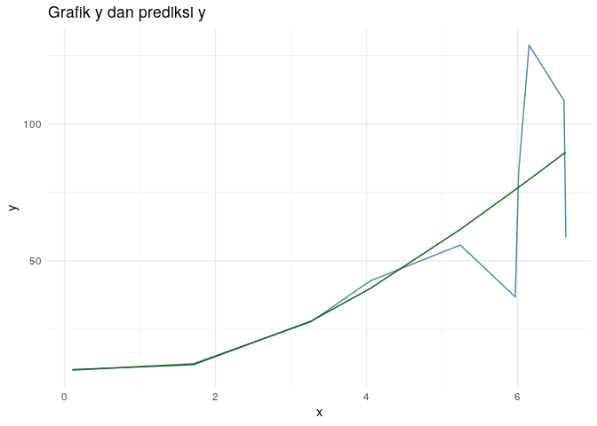

Belajar Membuat Model Regresi Linear - part 3 (Polinomial)
================

Pada tulisan [sebelumnya](https://ikanx101.com/blog/multi-linear/) saya
telah menjelaskan bagaimana caranya membuat persamaan regresi linear
banyak peubah peubah ( dan ) **dari nol**. Sekarang kita akan “naik kelas” lagi untuk membuat
fungsi regresi polinomial untuk satu peubah. Apa maksudnya?

> Kita akan membuat fungsi curve fitting yang nonlinear.

Misalkan saya memiliki 
buah pasang data sebagai berikut:
"), lalu
kita hendak membuat persamaan regresi berikut ini:  = y = a_0 + a_1 x + a_2 x^2 + a_3 x^3 + .. + a_n x^n").

Bagaimana cara kita melakukannya?

-----

Pada tulisan sebelumnya, saya mendefinisikan *error* sebagai **jarak**
antara nilai *real* dan nilai prediksi. Kali ini sama saja. Kita
menggunakan definisi dan cara perhitungan yang sama.

Misalkan saya memiliki 
buah data dengan  banyak
pangkat polinom. Maka ekspektasi kita adalah:

  
  

Dengan prinsip yang sama dengan sebelumnya, saya akan tuliskan sebagai:

  
  

Dengan menggunakan definisi *error* yang sama dengan sebelumnya:

  
)^2")  

Lantas bagaimana caranya jika banyak sekali
 baris datanya?

Saya akan lakukan *tweaks* seperti berikut sehingga
 bisa didapatkan dengan
cara:

  
^{-1} X^T Y")  

Sama persis dengan kasus sebelumnya.

-----

## Contoh Data

Mari kita uji dengan data sebagai berikut:

|         x |        y |
| --------: | -------: |
| 3.8189081 | 27.18432 |
| 5.3633670 | 76.88065 |
| 2.1791182 | 17.01758 |
| 2.8098452 | 20.83983 |
| 5.5149758 | 38.21812 |
| 0.6736603 | 10.43884 |
| 3.4468173 | 33.96799 |
| 0.0899838 | 10.02781 |
| 4.6853624 | 62.26830 |
| 4.1619140 | 31.20606 |

<!-- -->

dan saya akan membuat fungsi regresi polinm orde 3 berikut: .

Pertama-tama kita akan buat matriks sebagai berikut:

``` r
n = length(x)
x0 = rep(1,n)
X = cbind(x0,x1 = x,x2 = x^2,x3 = x^3)
t_X = t(X)
Y = y

# matriks X
X
```

    ##       x0         x1           x2           x3
    ##  [1,]  1 3.81890809 14.584059019 5.569518e+01
    ##  [2,]  1 5.36336697 28.765705236 1.542810e+02
    ##  [3,]  1 2.17911816  4.748555958 1.034766e+01
    ##  [4,]  1 2.80984518  7.895229912 2.218437e+01
    ##  [5,]  1 5.51497577 30.414957766 1.677378e+02
    ##  [6,]  1 0.67366029  0.453818184 3.057193e-01
    ##  [7,]  1 3.44681731 11.880549575 4.095008e+01
    ##  [8,]  1 0.08998377  0.008097079 7.286056e-04
    ##  [9,]  1 4.68536239 21.952620756 1.028560e+02
    ## [10,]  1 4.16191400 17.321528183 7.209071e+01

Oke, kita akan cari nilai konstantanya sebagai berikut:

``` r
solve(t_X %*% X) %*% t_X %*% Y
```

    ##           [,1]
    ## x0  12.8467480
    ## x1 -11.0947221
    ## x2   6.6844041
    ## x3  -0.5742662

Maka kita dapatkan persamaan sebagai berikut:

y = 12.847 + (-11.095) x + (6.684) x^2 + (-0.574 x^3)

Mari kita prediksi nilai  dan kita hitung *error*-nya.

|         x |        y | prediksi\_y |    error |
| --------: | -------: | ----------: | -------: |
| 3.8189081 | 27.18432 |   35.987031 |  \-8.803 |
| 5.3633670 | 76.88065 |   57.053104 |   19.828 |
| 2.1791182 | 17.01758 |   14.469473 |    2.548 |
| 2.8098452 | 20.83983 |   21.709654 |  \-0.870 |
| 5.5149758 | 38.21812 |   58.670450 | \-20.452 |
| 0.6736603 | 10.43884 |    8.230577 |    2.208 |
| 3.4468173 | 33.96799 |   30.508807 |    3.459 |
| 0.0899838 | 10.02781 |   11.902333 |  \-1.875 |
| 4.6853624 | 62.26830 |   48.554887 |   13.713 |
| 4.1619140 | 31.20606 |   41.067591 |  \-9.862 |

<!-- -->

-----

## *What’s Next?*

Sebagaimana yang telah saya sampaikan pada tulisan sebelumnya, metode
matriks seperti ini akan memudahkan kita saat membuat model-model
regresi (baik linear atau tidak) yang tidak umum. Saya akan tunjukkan
contoh lainnya di tulisan berikutnya.

-----

`if you find this article helpful, support this blog by clicking the
ads.`
