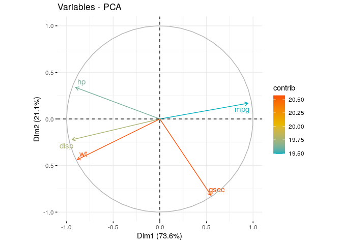

Mengenal Brand Map / Perceptual Map dalam Market Research
================

Di dunia *market research*, ada satu metode analisa yang disebut dengan
*brand map* atau *perceptual map*. Analisa tersebut di ilmu matematika
disebut dengan *principal component analysis* (**PCA**).

Secara mudah, analisa tersebut bisa membantu *market researcher* untuk
memetakan *brand* dan persepsi dalam satu grafik yang sama. Peta *brand*
dan *perception* tersebut dibuat berdasarkan prinsip *dimension
reduction* dengan titik lokasi yang relatif satu sama lain.

Sebagai contoh, misalkan saya memiliki data tabulasi hasil survey
sebagai berikut:

|          |      mpg |     disp |       hp |       wt |     qsec |
|:---------|---------:|---------:|---------:|---------:|---------:|
| AMC      | 15.20000 | 304.0000 | 150.0000 | 3.435000 | 17.30000 |
| Cadillac | 10.40000 | 472.0000 | 205.0000 | 5.250000 | 17.98000 |
| Camaro   | 13.30000 | 350.0000 | 245.0000 | 3.840000 | 15.41000 |
| Chrysler | 14.70000 | 440.0000 | 230.0000 | 5.345000 | 17.42000 |
| Datsun   | 22.80000 | 108.0000 |  93.0000 | 2.320000 | 18.61000 |
| Dodge    | 15.50000 | 318.0000 | 150.0000 | 3.520000 | 16.87000 |
| Duster   | 14.30000 | 360.0000 | 245.0000 | 3.570000 | 15.84000 |
| Ferrari  | 19.70000 | 145.0000 | 175.0000 | 2.770000 | 15.50000 |
| Fiat     | 29.85000 |  78.8500 |  66.0000 | 2.067500 | 19.18500 |
| Ford     | 15.80000 | 351.0000 | 264.0000 | 3.170000 | 14.50000 |
| Honda    | 30.40000 |  75.7000 |  52.0000 | 1.615000 | 18.52000 |
| Hornet   | 20.05000 | 309.0000 | 142.5000 | 3.327500 | 18.23000 |
| Lincoln  | 10.40000 | 460.0000 | 215.0000 | 5.424000 | 17.82000 |
| Lotus    | 30.40000 |  95.1000 | 113.0000 | 1.513000 | 16.90000 |
| Maserati | 15.00000 | 301.0000 | 335.0000 | 3.570000 | 14.60000 |
| Mazda    | 21.00000 | 160.0000 | 110.0000 | 2.747500 | 16.74000 |
| Merc     | 19.01429 | 207.1571 | 134.7143 | 3.542857 | 19.01429 |
| Pontiac  | 19.20000 | 400.0000 | 175.0000 | 3.845000 | 17.05000 |
| Porsche  | 26.00000 | 120.3000 |  91.0000 | 2.140000 | 16.70000 |
| Toyota   | 27.70000 |  95.6000 |  81.0000 | 2.150000 | 19.95500 |
| Valiant  | 18.10000 | 225.0000 | 105.0000 | 3.460000 | 20.22000 |
| Volvo    | 21.40000 | 121.0000 | 109.0000 | 2.780000 | 18.60000 |

Tabulasi di atas menunjukkan berapa “nilai” masing-masing merek `mobil`
terhadap masing-masing `persepsi`. Analisa *brand map* bisa membantu
untuk memetakan *brand* mana saja yang dekat dengan *brand* lain atau
suatu persepsi secara relatif.

Cara kerjanya adalah dengan memanfaatkan prinsip *dimension reduction*,
yakni mengecilkan banyaknya dimensi atau variabel yang terlibat dengan
mencari vektor eigen (pembangun) secara aljabar.

Sebagai contoh di atas, kita ketahui ada lima variabel (dimensi) yang
terlibat. Sayangnya kita hanya mampu membuat grafik 2D - 3D saja.
Selebihnya, kita tidak bisa menggambarkannya. Namun secara aljabar,
“barang” n-dimensi itu ada wujudnya.

Berikut adalah grafik 2D pasangan antar variabel:

<!-- -->

``` r
library(factoextra)
```

    ## Loading required package: ggplot2

    ## Welcome! Want to learn more? See two factoextra-related books at https://goo.gl/ve3WBa

``` r
res.pca <- prcomp(df, scale = TRUE)
fviz_eig(res.pca)
```

<!-- -->

``` r
fviz_pca_ind(res.pca,
             col.ind = "cos2", # Color by the quality of representation
             gradient.cols = c("#00AFBB", "#E7B800", "#FC4E07"),
             repel = TRUE     # Avoid text overlapping
             )
```

<!-- -->

``` r
fviz_pca_var(res.pca,
             col.var = "contrib", # Color by contributions to the PC
             gradient.cols = c("#00AFBB", "#E7B800", "#FC4E07"),
             repel = TRUE     # Avoid text overlapping
             )
```

<!-- -->

``` r
fviz_pca_biplot(res.pca, repel = TRUE,
                col.var = "#2E9FDF", # Variables color
                col.ind = "#696969"  # Individuals color
                )
```

<!-- -->
