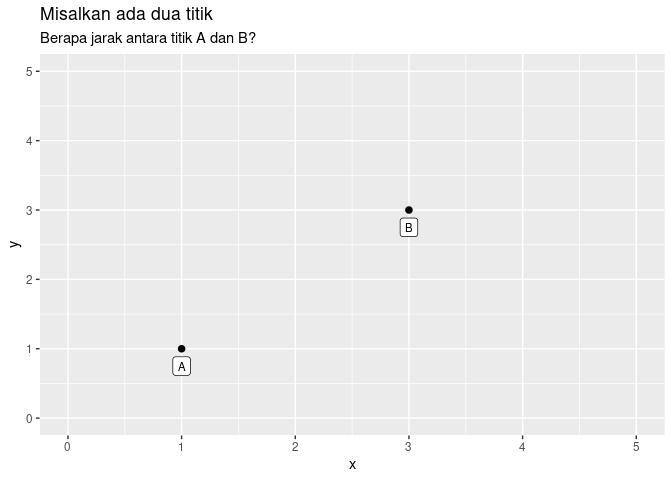

Mencari Simmilarity dan Dissimilarity dari Data
================

Pada tahun lalu, saya pernah menulis tentang bagaimana menemukan
persamaan dan perbedaan dari data [*phonebook* agar kita bisa menemukan
beberapa *entry* ganda yang ada](https://ikanx101.com/blog/phone-book/).
Pada tulisan tersebut, saya menggunakan algoritma yang berdasarkan
*cosine simmilarity*.

Kali ini saya akan membahas lebih detail apa yang disebut dengan
**persamaan** dan **pertaksamaan**.

------------------------------------------------------------------------

## *Simmilarity Vs Dissimilarity*

Prinsip sederhana yang digunakan untuk mengukur apakah dua data itu sama
atau tidak adalah dengan mengukur **jarak** antar kedua data tersebut.

> Data  dan
>  disebut sama jika
> jarak antar keduanya
>  = 0").

Pada tulisan terdahulu, saya pernah membedah [berbagai macam tipe dan
struktur data](https://ikanx101.com/blog/mengenal-data/). Masing-masing
tipe dan struktur data mmemiliki cara perhitungan jaraknya tersendiri.
Kita bahas satu-persatu berikut ini:

### Data Numerik

Misalkan saya punya dua titik numerik sebagai berikut:

 \text{ dan } p_2 = (3,3)")

<!-- -->

Untuk data numerik, ada beberapa perhitungan jarak seperti:

#### *Euclidean distance*

Yakni jarak terpendek antara dua titik. Cara perhitungannya adalah
dengan menggunakan rumus *Phytagoras*.

 = \sqrt{(x_1 - x_2)^2 + (y_1 - y_2)^2}")

Dari dua titik di atas kita hitung jaraknya sebagai berikut:

 & = & \sqrt{(x_1 - x_2)^2 + (y_1 - y_2)^2} \\
 & = & \sqrt{(1 - 3)^2 + (1 - 3)^2} \\
 & = & \sqrt{8} \\
 & \approx & 2.828427
\end{matrix}")

#### *Manhattan distance*

Yakni jarak total yang dimiliki dari masing-masing dimensinya. Misalkan
dari dua titik di atas, kita akan menghitung jarak di masing-masing
sumbu  dan sumbu
-nya.

 = |x_1 - x_2| + |y_1 - y_2|")

Dari dua titik di atas kita hitung jaraknya sebagai berikut:

 & = & |x_1 - x_2| + |y_1 - y_2| \\
 & = & |1-3| + |1-3| \\
 & = & 2 + 2 \\
 & = & 4
\end{matrix}")

#### *Chebyshev distance*

Yakni jarak terjauh dari dua titik berdasarkan masing-masing dimensinya.
Kita hanya akan cari nilai jarak terjauh dari sumbu
 atau sumbu
.

 = \max{|(x_1 - x_2)|,|(y_1 - y_2)|}")

Pada kasus ini, jarak baik di sumbu
 dan
 adalah sama-sama
.

------------------------------------------------------------------------

Selain ketiga metode di atas, ada berbagai macam cara perhitungan jarak
lain yang bisa digunakan.

------------------------------------------------------------------------

### Data Kategorik

Jika pada bagian di atas, kita telah membahas perhitungan jarak pada
data numerik. Bagaimana jika kita memiliki data kategorik? Hal yang sama
bisa juga digunakan untuk data non-numerik seperti data teks.

Misalkan, saya hendak mencari jarak dari data berikut ini:

| orang | hobi           |
|------:|:---------------|
|     1 | masak,nonton   |
|     2 | masak,otomotif |

Seberapa mirip kedua orang tersebut? Bagaimana mengukur jarak mereka?

Kita ubah terlebih dahulu kedua data tersebut menjadi bentuk kategorik
dan *binary*. Setelah itu, kita bisa mengukur jarak antara keduanya.

Ubah datanya dalam bentuk seperti ini:

| orang | masak | nonton | otomotif |
|------:|------:|-------:|---------:|
|     1 |     1 |      1 |        0 |
|     2 |     1 |      0 |        1 |

Setelah itu, kita bisa ukur dengan beberapa cara perhitungan jarak.

``` r
# dataset yang digunakan
df_new
```

    ##   orang masak nonton otomotif
    ## 1     1     1      1        0
    ## 2     2     1      0        1

``` r
# kita simpan dulu beberapa variabel penting
hobi_1 = df_new$masak[2] - df_new$masak[1]
hobi_2 = df_new$nonton[2] - df_new$nonton[1]
hobi_3 = df_new$otomotif[2] - df_new$otomotif[1]
```

#### *Euclidean distance*

``` r
jarak_ecl = sqrt(hobi_1^2 + hobi_2^2 + hobi_3^2)
jarak_ecl
```

    ## [1] 1.414214

#### *Manhattan distance*

``` r
jarak_man = hobi_1 + hobi_2 + hobi_3
jarak_man
```

    ## [1] 0

#### *Chebyshev distance*

``` r
jarak_che = max(hobi_1,hobi_2,hobi_3)
jarak_che
```

    ## [1] 1

------------------------------------------------------------------------

Kelak perhitungan jarak ini adalah **kunci** untuk menentukan seberapa
mirip atau tidak mirip sepasang data.

Bagaimana mudah kan?

------------------------------------------------------------------------

`if you find this article helpful, support this blog by clicking the ads.`
