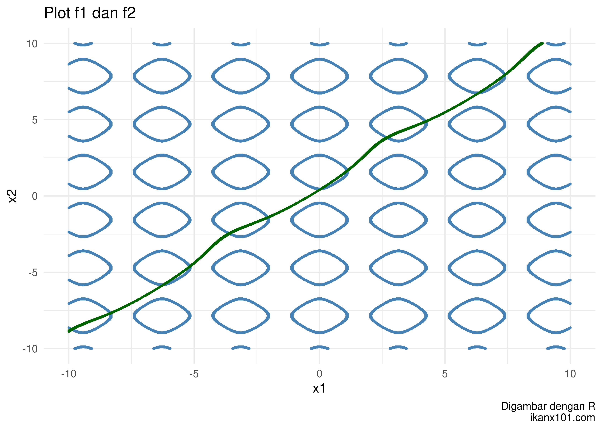

## Program *Spiral Optimization Algorithm*

Berbekal program yang telah dituliskan di bagian sebelumnya, kita akan
sempurnakan program untuk melakukan *spiral optimization* sebagai
berikut:

``` r
soa_mrf = function(N,     # banyak titik
           x1_d,  # batas bawah x1
           x1_u,  # batas atas x1
           x2_d,  # batas bawah x2
           x2_u,  # batas atas x2
           rot,   # berapa banyak rotasi
           k_max, # iterasi maks
           r){    # berapa rate konstraksi
           
# N pasang titik random di selang [a,b] di R2
x1 = runif(N,x1_d,x1_u)
x2 = runif(N,x2_d,x2_u)

# hitung theta
theta = 2*pi / rot

# definisi matriks rotasi
A = matrix(c(cos(theta),-sin(theta),
             sin(theta),cos(theta)),
           ncol = 2,byrow = T)

# bikin data frame
temp = data.frame(x1,x2) %>% mutate(f = f(x1,x2))

# proses iterasi
for(i in 1:k_max){
  # mencari titik x* dengan min(f)
  f_min = 
    temp %>% 
    filter(f == min(f))
  pusat = c(f_min$x1,f_min$x2)

  for(j in 1:N){
    # kita akan ambil titiknya satu persatu
    x0 = c(temp$x1[j],temp$x2[j])
    
    # proses rotasi dan konstraksi terhadap pusat x*
    xk = A %*% (x0-pusat) # diputar dengan x_bin sebagai pusat
        xk = pusat + (r * xk)
    
    # proses mengembalikan nilai ke temp
    temp$x1[j] = xk[1]
    temp$x2[j] = xk[2]
    }
    
    # hitung kembali nilai f(x1,x2)
    temp = temp %>% mutate(f = f(x1,x2))
    }

# proses output hasil
output = temp %>% filter(f == min(f))
return(output)
}
```

### Contoh Penggunaan Program

Kita akan coba performa program tersebut untuk menyelesaikan fungsi
berikut:

 = \frac{x_1^4 - 16 x_1^2 + 5 x_1}{2} + \frac{x_2^4 - 16 x_2^2 + 5 x_2}{2}")


Dengan
.

``` r
# definisi
N = 50
a = -4 # x1 dan x2 punya batas bawah yang sama
b = 4  # x1 dan x2 punya batas atas yang sama
k_max = 70
r = .75
rot = 30
f = function(x1,x2){
    ((x1^4 - 16 * x1^2 + 5 * x1)/2) + ((x2^4 - 16 * x2^2 + 5* x2)/2)
    }

# solving
soa_mrf(N,a,b,a,b,rot,k_max,r)
```

    ##          x1        x2         f
    ## 1 -3.302564 -2.725811 -74.68339

**Catatan**

Pada algoritma ini, penentuan

menjadi penentu hasil perhitungan.

<br>

### Mengubah Optimisasi Menjadi Pencarian Akar

*Spiral optimization algorithm* adalah suatu metode untuk mencari solusi
minimum global. Jika kita hendak memakainya untuk mencari suatu akar
persamaan (atau sistem persamaan), kita bisa melakukan modifikasi pada
fungsi-fungsi yang terlibat (membuat fungsi *merit*).

Misalkan suatu sistem persamaan non linear:

 = 0")

 = 0")

 = 0")

dengan
^T \in D")


#### Pencarian Akar

Sistem di atas memiliki solusi
^T")
jika ") yang
kita definisikan sebagai:

 = \frac{1}{1+ \sum_{i=1}^n |g_i(x)|}")

memiliki nilai maksimum sama dengan 1. **Akibatnya algoritma yang
sebelumnya adalah mencari
}")
diubah menjadi**
}").
Kenapa demikian?

> Karena jika
>  = 1")
> artinya
> | = 0")
> yang merupakan akar dari
> .

**Kelak** ")
**akan digunakan untuk menjawab soal-soal yang ada dalam tulisan ini.**

<br>

<br>

# CONTOH 1

Tentukanlah akar-akar sistem persamaan berikut dengan **SOA**. Buatlah
terlebih dahulu *contour plot*-nya:

 = \cos{(2 x_1)} - \cos{(2 x_2)} - 0.4 = 0")

 = 2 (x_2 - x_1) + \sin{ (x_2) } - \sin{(x_1)} - 1.2 = 0")

dengan


## Grafik Sistem Persamaan

Kita akan mencari akar-akar sistem persamaan saat

dan 
dengan bantuan grafik sebagai berikut:

<div class="figure">


<p class="caption">
Plot Soal 1: f1 dan f2
</p>

</div>

Terlihat bahwa ada beberapa titik solusi (persinggungan antara
")
dengan
").

<br>

## Mencari Akar Sistem Persamaan

Untuk mencari akarnya kita perlu membentuk
")
sebagaimana yang telah dijelaskan pada bagian sebelumnya.

``` r
# fungsi f1 dan f2 dari soal
f1 = function(x1,x2){cos(2* x1) - cos(2*x2) - 0.4}
f2 = function(x1,x2){2*(x2 - x1) + sin(x2) - sin(x1) - 1.2}

# membuat F(x)
# saya notasikan sebagai f kecil
f = function(x1,x2){
  sum = abs(f1(x1,x2)) + abs(f2(x1,x2))
  bawah = 1 + sum
  hasil = 1/bawah
  return(hasil)
}
```

Oleh karena solusi dari grafik ada banyak, maka kita akan *run* program
yang telah dibuat sebelumnya berulang kali:

``` r
# solving
N = 50
a = -10  # x1 dan x2 punya batas yang sama
b = 10   # x1 dan x2 punya batas yang sama
rot = 20
k_max = 60
r = .65
# run I
soa_mrf_2(N,a,b,a,b,rot,k_max,r)
```

    ##          x1        x2         f
    ## 1 -2.065162 -1.411618 0.9999999

``` r
# run II
soa_mrf_2(N,a,b,a,b,rot,k_max,r)
```

    ##          x1        x2         f
    ## 1 -6.603131 -6.217978 0.6099925

``` r
# run III
soa_mrf_2(N,a,b,a,b,rot,k_max,r)
```

    ##          x1        x2 f
    ## 1 -3.597106 -2.463483 1

<br>

Berikutnya saya coba *run* sebanyak **100 kali**, berikut adalah rekap
semua akar yang saya dapatkan:

    ##      x1   x2   f
    ## 1  -9.9 -8.8 0.9
    ## 2  -9.9 -8.8 1.0
    ## 3  -8.5 -7.9 0.7
    ## 4  -8.5 -7.8 0.7
    ## 5  -8.4 -7.8 0.8
    ## 6  -8.3 -7.8 0.8
    ## 7  -6.4 -6.0 0.7
    ## 8  -6.3 -5.9 0.9
    ## 9  -6.2 -5.8 1.0
    ## 10 -5.3 -4.8 0.8
    ## 11 -5.2 -4.7 1.0
    ## 12 -5.2 -4.6 1.0
    ## 13 -5.2 -4.6 0.9
    ## 14 -3.6 -2.5 1.0
    ## 15 -3.6 -2.4 0.9
    ## 16 -3.5 -2.6 0.8
    ## 17 -3.5 -2.5 0.8
    ## 18 -2.1 -1.5 0.9
    ## 19 -2.1 -1.4 1.0
    ## 20  0.1  0.5 1.0
    ## 21  0.2  0.6 0.9
    ## 22  0.2  0.6 0.8
    ## 23  1.1  1.6 1.0
    ## 24  2.7  3.8 1.0
    ## 25  2.7  3.9 0.8
    ## 26  2.7  3.9 0.9
    ## 27  4.2  4.9 1.0
    ## 28  4.2  4.9 0.9
    ## 29  6.3  6.8 1.0
    ## 30  6.4  6.8 1.0
    ## 31  7.2  7.7 0.7
    ## 32  7.4  7.9 1.0
    ## 33  7.5  8.1 0.7

`BERSAMBUNG`
