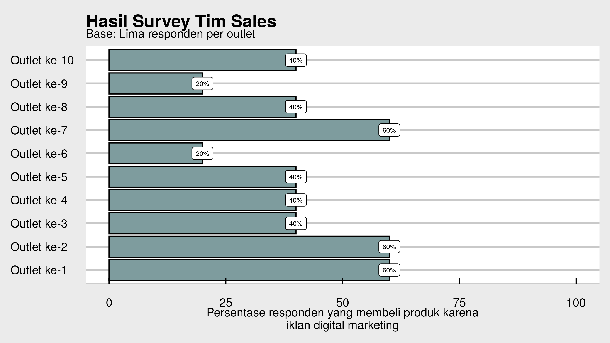

# Menghitung Peluang Menggunakan Distribusi Binomial

- [Pendahuluan](#pendahuluan)
- [Pertanyaannya](#pertanyaannya)
- [Penyelesaian](#penyelesaian)
- [Distribusi Binomial](#distribusi-binomial)

## Pendahuluan

Beberapa minggu yang lalu, saya sempat mengikuti diskusi antara tim
*sales* dan tim *digital marketing* dari suatu perusahaan (bukan
perusahaan tempat saya bekerja saat ini *yah*). Salah satu bahasan dari
diskusi tersebut adalah bagaimana tim *sales* (dengan segala
keterbatasannya) bisa membuktikan klaim dari tim *digital marketing*.
Lantas apa klaimnya?

Tim *digital marketing* mengklaim:

> Sebanyak 70% pembeli produk mereka di *modern outlet* diakibatkan oleh
> iklan yang mereka buat.

Oleh karena tim *sales* tidak memiliki sumber daya untuk melakukan
*market research*, mereka hanya mampu mengerahkan *sales promotion girl*
untuk melakukan survey singkat di beberapa *modern outlet* di suatu
*time window* tertentu.

Menggunakan prinsip *rule of five*:

> *The rule of five is a rule of thumb in statistics that estimates the
> median of a population by choosing a random sample of five from that
> population. It states that there is a 93.75% chance that the median
> value of a population is between the smallest and largest values in
> any random sample of five. This rule can be used to save data
> collection time in order to make a quicker business decision.*

Tim *sales* melakukan survey singkat dari sepuluh *modern outlet*. Tim
SPG akan mewawancarai lima orang pembeli pertama yang ada untuk kemudian
ditanyakan “apakah mereka membeli karena iklan digital?”. Akhirnya
didapatkan data sebanyak `50 orang` responden yang didapatkan dari
sepuluh buah *modern outlet* (**lima responden** per *modern outlet*).

Berikut adalah data yang didapatkan tim *sales*:

> Rata-rata persentasenya adalah 60%.

## Pertanyaannya

Bagaimana menentukan benar/tidaknya klaim tim *digital marketing* dari
data seadanya *tim sales*?

------------------------------------------------------------------------

## Penyelesaian

Mendapatkan *business question* seperti itu membuat saya berpikir
bagaimana penyelesaiannya. Sempat saya berpikir untuk menggunakan
prinsip simulasi Monte Carlo seperti [tulisan saya terkait COVID
dulu](https://ikanx101.com/blog/rapid-pabrik/). Namun kali ini saya akan
mencoba menyelesaikannya dengan cara yang lebih eksak.

## Distribusi Binomial

Pikiran saya terbang jauh saat saya sedang kuliah **analisa data** saat
S1 dulu ke materi **distribusi binomial**. Distribusi binomial adalah
distribusi peluang dari variabel diskrit yang biasa digunakan untuk
menyelesaikan masalah-masalah yang bisa dikategorikan sebagai `success`
atau `not success`.

Secara matematis, peluang bisa dihitung dari formula berikut:

 = \begin{pmatrix}
n\\ 
x
\end{pmatrix} p^x (1-p)^{n-x}")

Dimana:

merupakan kombinasi terjadinya *event*
 dari
 total kejadian.

 menandakan proporsi
*success* pada populasi.

    [1] 0.36015
