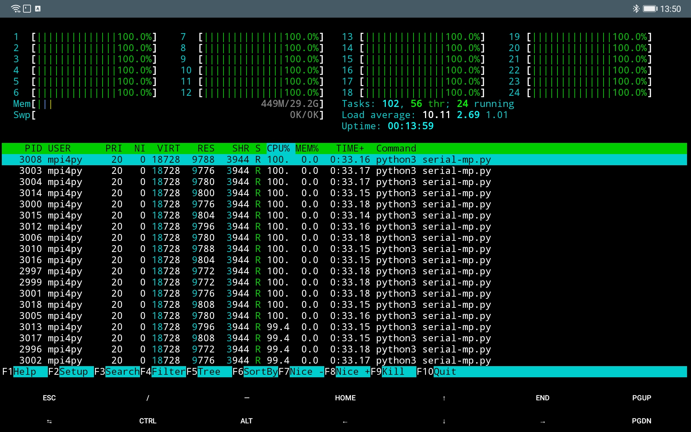
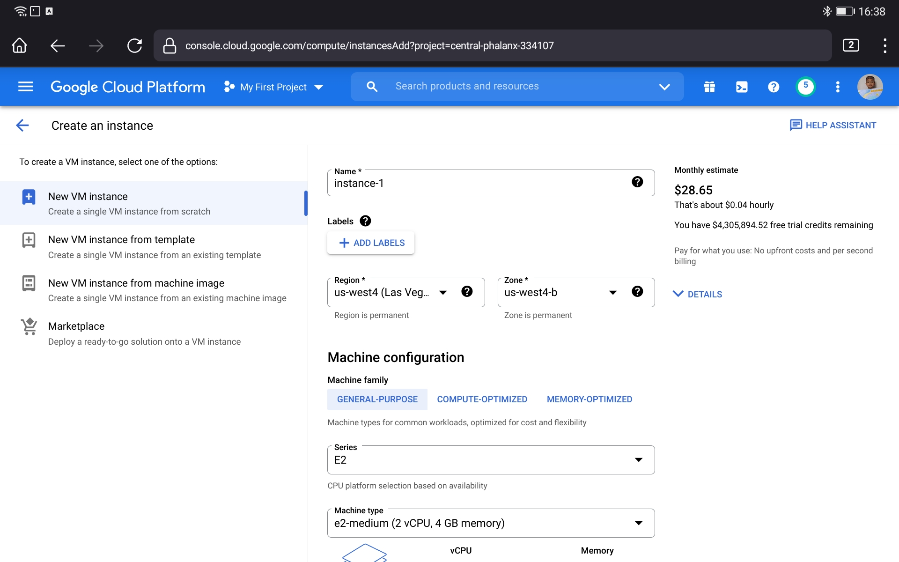

```{r setup, include=FALSE}
knitr::opts_chunk$set(echo = TRUE)
rm(list=ls())
```

Beberapa waktu yang lalu, saya sempat bercerita tentang pengalaman saya mencoba [salah satu _server_ kampus](https://ikanx101.com/blog/server-kampus/). Beberapa hari setelah itu, saya kembali mencobanya untuk melakukan suatu _multiprocessing_ algoritma numerik dengan menanfaatkan semua _cores_ dari _CPU_-nya.

Tercatat ada 24 _cores_ dengan ~29 GB RAM.

```{r out.width = "65%",echo=FALSE}

```

---

Bagi sebagian dari kita yang ingin membutuhkan _server_ untuk melakukan komputasi numerik atau untuk kebutuhan data sains, sebenarnya kita bisa dengan mudah __menyewanya__ hanya dengan bermodalkan akun ___Google___ saja.

Bahkan teruntuk _user_ yang baru pertama kali mencoba, ___Google___ memberikan _free credit_ sebesar 300 USD untuk dipakai selama 9 bulan. Harga sewa _server_-nya pun bervariasi tergantung spek yang kita pilih. Harganya dimulai dari 30 USD per bulan. 

Bagaimana cara menyewanya? 

> Saya akan tunjukkan

---

### Langkah I

Buka situs [___Google Cloud Console___](https://console.cloud.google.com). Aktifkan layanan menggunakan akun _Google_. Jika kamu baru pertama kali mengaksesnya, kamu akan mendapatkan _free credit_ sebesar `300 USD` selama 90 hari.

Pada langkah pertama ini, _Google_ meminta kita untuk memasukkan nomor kartu kredit atau kartu debit. Langkah ini diperlukan _Google_ untuk memastikan legitimiasi transaksi kita. Jangan khawatir, _Google_ tidak akan melakukan _charge_ terhadap transaksi yang tidak kita lakukan.

### Langkah II

Pilih menu _virtual machine_ lalu _create_.

```{r out.width = "65%",echo=FALSE}

```

Kita bisa memilih spek _server_ sesuai kebutuhan. Harga yang ditawarkan juga tergantung dari spek yang kita pilih.

Pada _server_ ini, saya memilih untuk menggunakan __Ubuntu 20 LTS__ sebagai _operating system_-nya.

### Langkah III

Pada bagian ini, kita perlu melakukan beberapa _setting_ tambahan di bagian:

1. ___Firewall___: ceklis koneksi `http` dan `https`.
1. ___ssh___: jika kalian hendak mengakses _server_ menggunakan _terminal_ di komputer dengan `ssh`, maka kaliah harus membuat `ssh keygen` terlebih dahulu di komputer. Caranya:

Ketikkan pada _terminal_:

```
ssh-keygen -t rsa
```

Lalu ketik: 

```
cat ~/.ssh/id_rsa.pub
```

_Copy paste_ semua kode yang muncul ke bagian _key_ `ssh` di _Google Cloud_.

### Langkah IV

Akses _server_ dengan mengetik:

```
ssh ip.external

```

di _terminal_ komputer kita.

Alamat `ip.external` _server_ kita dapatkan dari info di _Google Cloud_.

---

### Instalasi __R__

Kita bisa meng-_install_ __R__ dengan mudah di _server_ tersebut.

Untuk memudahkan, silakan _copy paste_ perintah berikut ini:

```
sudo su
apt-get update
apt-get upgrade
apt-get install build-essential
apt-get install zlib1g-dev

apt update -qq
apt install --no-install-recommends software-properties-common dirmngr
wget -qO- https://cloud.r-project.org/bin/linux/ubuntu/marutter_pubkey.asc | sudo tee -a /etc/apt/trusted.gpg.d/cran_ubuntu_key.asc
add-apt-repository "deb https://cloud.r-project.org/bin/linux/ubuntu focal-cran40/"

apt install --no-install-recommends r-base
```

Mudah kan? Semua proses ini hanya memakan waktu tidak kurang dari 10 menit saja.

_Oh iya_, jangan lupa untuk mematikan _server_ saat tidak digunakan untuk menghindari _unwanted transaction billed into your credit card_.

---

`if you find this article helpful, support this blog by clicking the ads.`
