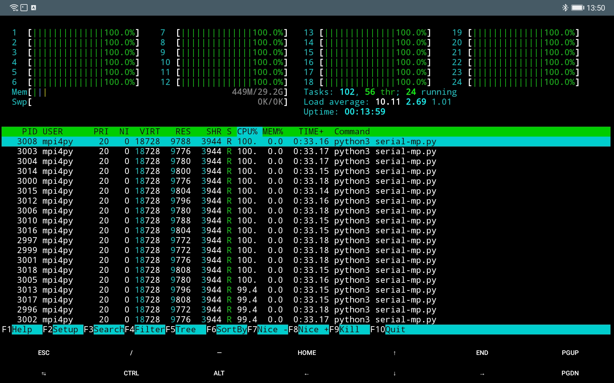
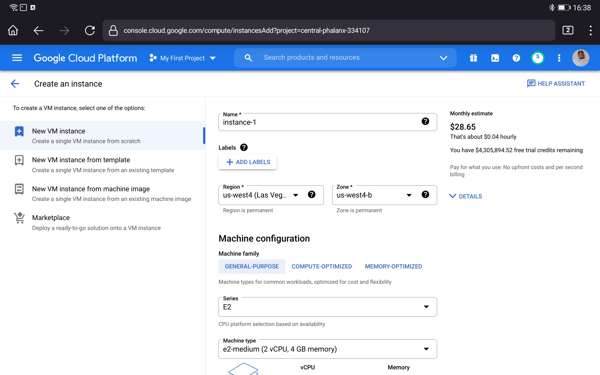

Mencoba Linux dan R di Virtual Machine Google Cloud Console
================

Beberapa waktu yang lalu, saya sempat bercerita tentang pengalaman saya
mencoba [salah satu *server*
kampus](https://ikanx101.com/blog/server-kampus/). Beberapa hari setelah
itu, saya kembali mencobanya untuk melakukan suatu *multiprocessing*
algoritma numerik dengan menanfaatkan semua *cores* dari *CPU*-nya.

Tercatat ada 24 *cores* dengan \~29 GB RAM.

-----

Bagi sebagian dari kita yang ingin membutuhkan *server* untuk melakukan
komputasi numerik atau untuk kebutuhan data sains, sebenarnya kita bisa
dengan mudah **menyewanya** hanya dengan bermodalkan akun ***Google***
saja.

Bahkan teruntuk *user* yang baru pertama kali mencoba, ***Google***
memberikan *free credit* sebesar 300 USD untuk dipakai selama 9 bulan.
Harga sewa *server*-nya pun bervariasi tergantung spek yang kita pilih.
Harganya dimulai dari 30 USD per bulan.

Bagaimana cara menyewanya?

> Saya akan tunjukkan

-----

### Langkah I

Buka situs [***Google Cloud
Console***](https://console.cloud.google.com). Aktifkan layanan
menggunakan akun *Google*. Jika kamu baru pertama kali mengaksesnya,
kamu akan mendapatkan *free credit* sebesar `300 USD` selama 90 hari.

Pada langkah pertama ini, *Google* meminta kita untuk memasukkan nomor
kartu kredit atau kartu debit. Langkah ini diperlukan *Google* untuk
memastikan legitimiasi transaksi kita. Jangan khawatir, *Google* tidak
akan melakukan *charge* terhadap transaksi yang tidak kita lakukan.

### Langkah II

Pilih menu *virtual machine* lalu *create*.

Kita bisa memilih spek *server* sesuai kebutuhan. Harga yang ditawarkan
juga tergantung dari spek yang kita pilih.
