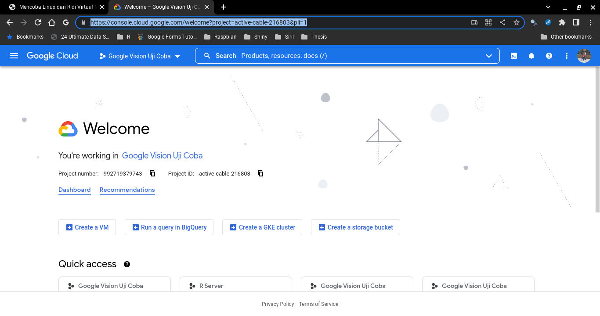
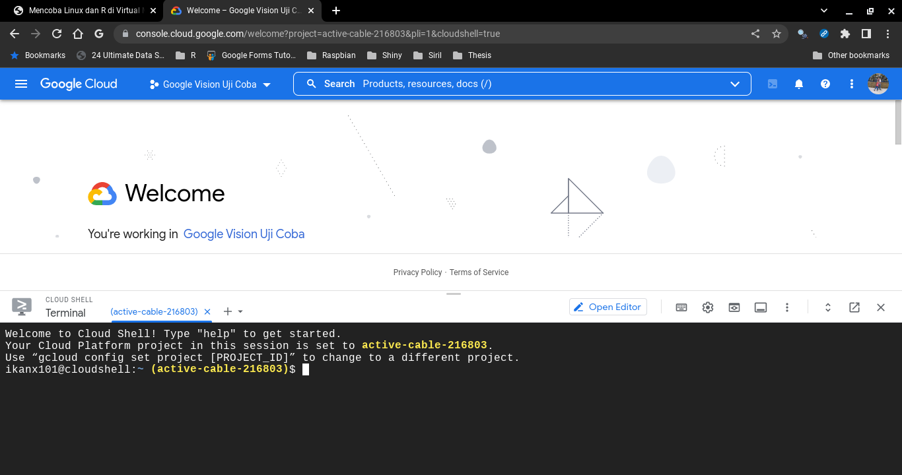
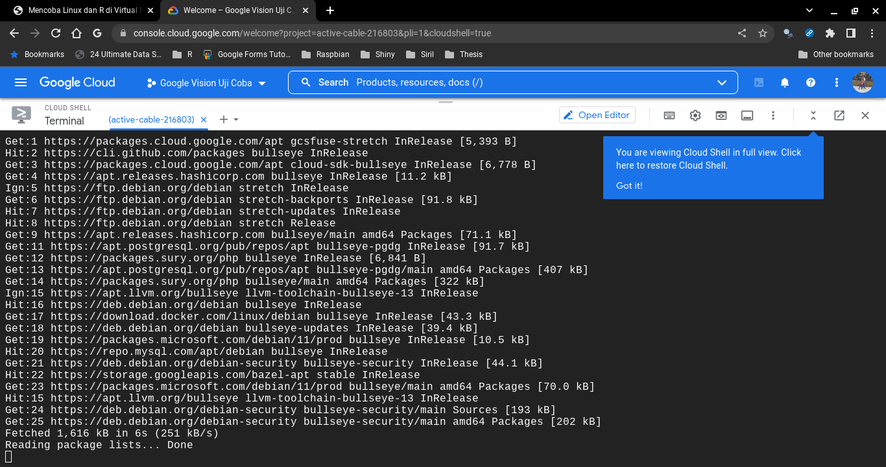
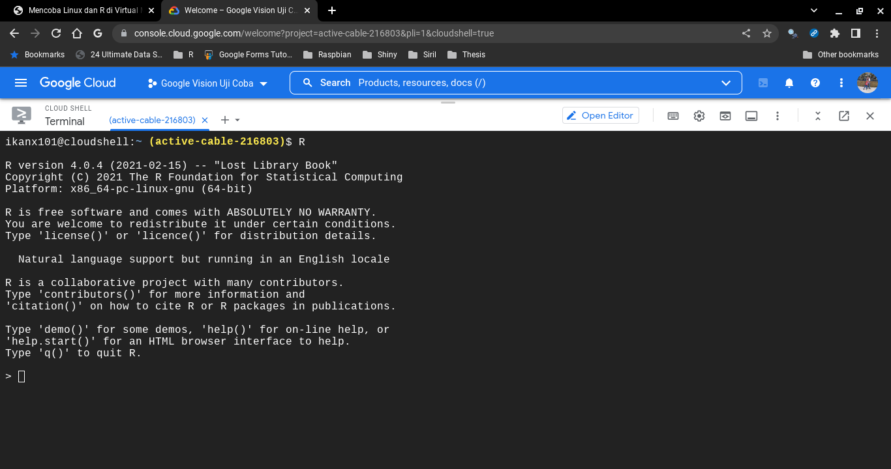

```{r setup, include=FALSE}
knitr::opts_chunk$set(echo = TRUE)
```

Pada [tulisan tahun lalu](https://ikanx101.com/blog/vm-cloud/), saya pernah menuliskan bagaimana caranya kita menyewa _Linux virtual machine_ di __Google Cloud__. Masalahnya adalah saat _free credit_ yang kita miliki habis, kita harus membayar biaya sewa tersebut. Sebenarnya biaya sewa per jam (atau per bulan) relatif sangat murah.

> Tapi apakah ada layanan VM yang lebih "gratis" namun tetap _reliable_?

Pertanyaan itu yang sering muncul di benak saya.

Setelah mencari tahu ke sana sini dan mengoprek beberapa fitur yang ada, saya menemukan satu cara menggunakan _virtual machine_ milik __Google__ secara gratis. Namun tentunya _no free lunch_ yah. Karena gratis, maka _session_ yang kita lakukan saat ini akan hilang jika _session_-nya berakhir. Oleh karena itu, kita bisa akali dengan cara:

1. Tidak menutup _session_ selama mungkin; atau
1. Menggunakan aplikasi seperti `git` untuk menyimpan pekerjaan di setiap waktu.

Selain itu, saya tidak menemukan keberadaan _ip public_ sehingga untuk mengakses _virtual machine_ ini, kita akan lakukan via _web browser_ langsung bukan dari _command line_ di _local computer_.

Salah satu kelebihan lainnya, kita bisa mengaksesnya menggunakan aplikasi `cloud console` di _gadget_ Android.

Lantas bagaimana cara mengaksesnya? Berikut adalah langkah-langkahnya:

### Langkah I

Buka situs _Google Cloud Console_ di [_link_ berikut](https://console.cloud.google.com/).

```{r out.width="70%",echo=FALSE,fig.align='center'}

```

### Langkah II

Klik tanda _command line_ (bertuliskan _activate cloud shell_) di sebelah kanan atas sehingga tampilannya menjadi:

```{r out.width="70%",echo=FALSE,fig.align='center'}

```

### Langkah III

Nah, _cloud shell_ sudah bisa langsung digunakan. Kita bisa langsung mengetik semua perintah dalam _linux_ untuk meng-_install_ berbagai aplikasi yang hendak kita gunakan.

Misalkan, saya hendak meng-_install_ `git` dan `R`, maka saya cukup mengetikkan:

```
sudo apt-get update
sudo apt-get upgrade
```

Hasil proses _update_ dan _upgrade_:

```{r out.width="70%",echo=FALSE,fig.align='center'}

```

Proses instalasi:

```
sudo apt-get install git r-base-dev
```

Berikut adalah hasil instalasi __R__-nya:

```{r out.width="70%",echo=FALSE,fig.align='center'}

```

Kita dapatkan versi __R__ `4.0.4` dalam _cloud shell_ tersebut.

Selanjutnya kita bisa melakukan _clone_  ___git repository___ dan melakukan instalasi _packages_ di __R__.

---

Semoga bermanfaat _yah_.