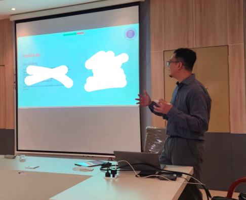
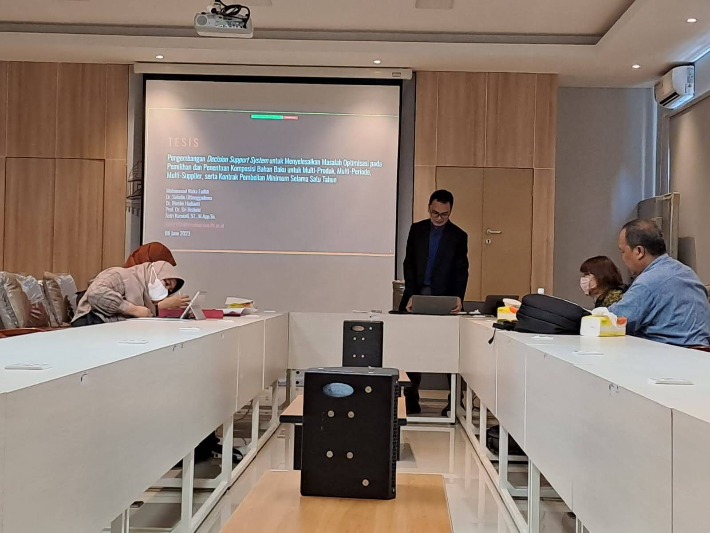
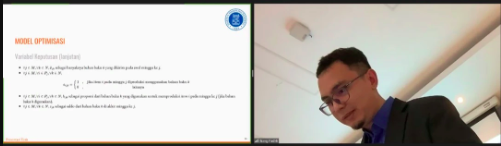

```{r setup, include=FALSE}
knitr::opts_chunk$set(echo = TRUE)
```

_Alhamdulillah_, ternyata sudah pas dua tahun sejak saya _post_ tulisan tentang [__"saya kuliah lagi"__](https://ikanx101.com/blog/kuliah-lagi/). Pada minggu lalu, saya mengakhiri masa-masa _riweuh_ akhir perkuliahan dengan melaksanakan seminar proposal dan sidang tesis di ITB. 

Begini ceritanya:

---

## Pertengahan Mei 2023

Sebenarnya, SKS terkait __proposal tesis__ sudah saya ambil pada semester III lalu. Sedangkan penelitian tesisnya sendiri sudah "selesai" pada semester lalu pula. Bahkan penelitiannya sudah dituliskan dalam bentuk jurnal yang sedang di-_submit_ ke salah satu anak _publisher_ `Elsevier`. Namun karena satu dan lain hal, pelaksanaan seminarnya sendiri tertunda hingga semester IV sekarang. Oleh karena itu, tidak ingin menunda lebih lama lagi, saya coba menjadwalkan seminar tersebut pada awal bulan Juni. 

Pertama-tama saya hubungin atasan saya di kantor dan beberapa rekan kerja untuk izin dan menginformasikan mengenai perkiraan jadwal seminar. Hal ini perlu untuk mengatur _workload_ saya dan tim agar __pas__. _hehe_

Berikutnya saya coba hubungi para dosen pembimbing dan dosen penguji. Sebagai informasi, dosen penguji untuk seminar proposal tesis cukup satu orang __doktor__ saja. _Alhamdulillah_, di ITB sudah tidak ada perkuliahan lagi pada bulan Juni sehingga saya bisa "memaksakan" tanggal yang saya sudah rencanakan kepada beliau-beliau tersebut.

Didapatlah kesepakatan bahwa pada Senin, 5 Juni 2023 pukul 09.00 saya akan menyelenggarakan seminar proposal tesis. Selanjutnya saya coba hubungi tim tata usaha Magister Sains Komputasi untuk menyiapkan ruangan dan dokumen-dokumen yang dibutuhkan.

Setelah itu, saya coba buat materi presentasinya secara perlahan dan seksama. Berhubung isinya hanya proposal, maka saya sampaikan latar belakang dari topik permasalahan yang diangkat ke dalam tesis. Oh iya, tidak lupa saya _print_ materi presentasi untuk diberikan kepada _audiens_ nanti.

## 5 Juni 2023

Saya berangkat ke Bandung dari Bekasi dengan travel selepas shubuh. Sampai di kampus jam 07.00 pagi. Setelah beberes ruangan dan menyiapkan dokumen yang ada, saya coba _review_ lagi materi yang hendak dipresentasikan. Tiba pukul 09.00 seminar saya mulai.

```{r out.width="60%",echo=FALSE,fig.align='center',fig.cap="Taken Candidly by Pak Saladin"}

```

Sayangnya salah satu dosen pembimbing saya (Bu Rieske) tidak bisa hadir karena alasan kesehatan. _Alhamdulillah_ seminarnya berjalan seru. Sesi tanya-jawab yang terjadi berhasil membangkitkan semangat para _audiens_. Akibatnya saya ditodong untuk melakukan sidang tesis esok harinya.

> Padahal saya sudah merencanakan agar sidang tesis dilakukan akhir bulan Juni saja. Kenapa? Karena ada dua luaran dari tesis saya, yakni: __model optimisasi__ dan ___decision support system___.

__Model optimisasi__ sudah selesai dan memang sudah dijadikan jurnal yang sedang di-_submit_. Sedangkan _decision support system_ yang ada sekarang baru sekedar berbentuk skrip di __R__. Agar _mevvah_, saya memasang target untuk menjadikannya _web apps_ menggunakan _Shiny_ (yakni mengawinkan [`shiny`](https://shiny.posit.co/) dengan [`ompr`](https://dirkschumacher.github.io/ompr/)). _Web apps_ tersebut yang belum saya buat.

Setelah negosiasi dengan dosen pembimbing dan dosen penguji, ditentukanlah hari Kamis, 8 Juni 2023 pukul 13.00 sebagai waktu sidang tesis saya.

Seketika itu juga ada beberapa _tasks_ yang harus diselesaikan segera, apa saja?

1. Mencari satu dosen penguji lagi. Prof. Sri (salah seorang dosen pembimbing saya) memberikan tiga nama kandidat dosen penguji. Setelah saya coba hubungi mereka satu-persatu, alhamdulillah ada seorang yang masih kosong jadwalnya di waktu tersebut.
1. Menghubungi tim tata usaha untuk menyiapkan ruangan dan dokumen-dokumen yang diperlukan.
1. Menghubungi atasan dan tim kantor bahwa saya akan mengambil cuti dadakan minggu ini untuk menyelesaikan sidang.
1. Menghubungi nyonya. __Ini yang paling penting__ karena dibutuhkan kolaborasi yang apik antara saya dan nyonya di rumah untuk mengurus semua urusan yang ada.

Pada pukul 15.00 saya bertolak kembali ke Bekasi. Di perjalanan saya coba atur strategi bagaimana dalam dua hari ke depan semua materi presentasi dan _web apps_ bisa beres.

## 6 Juni 2023

Setelah mengantarkan anak-anak sekolah, saya mulai membuat materi presentasi tesis. Untuk membuatnya, saya menggunakan [`xaringan`](https://github.com/yihui/xaringan) di __R__. `Xaringan` ini adalah andalan saya sehari-hari dalam membuat _report_ apapun di kantor.

_Alhamdulillah_ materinya selesai di antara waktu magrib dan isya.

Sementara itu nyonya mengurus akomodasi untuk nanti Kamis - Jumat di Bandung. Nyonya ingin bisa datang menonton sidang tersebut.

## 7 Juni 2023

Setelah mengantarkan anak-anak sekolah (lagi), saya mulai membuat _shiny_ dari skrip optimisasi saya tersebut. Sebenarnya ini bukan pertama kalinya saya mengawinkan `shiny` dengan `ompr`. Saya pernah membuat _shiny_ dari tulisan saya sebelumya terkait [penjadwalan sekolah tatap muka](https://ikanx101.com/blog/ptmt/). Namun kali ini tentu lebih rumit karena modelnya sendiri lebih rumit.

Saya tidak pernah merencanakan bahwa ini bisa akan selesai dalam waktu sehari tapi mau apa lagi kan?

> Konon katanya kemampuan asli seseorang baru akan muncul saat kepepet.

Setelah ngoprek sana-sini, ternyata selepas ashar sudah selesai. Saya buat video demonya untuk keperluan sidang besok. Tidak lupa saya _print_ lagi materi presentasi untuk para audiens.

Malamnya, anak-anak diungsikan ke rumah eyangnya karena mereka besok pagi masih harus berangkat sekolah. Terima kasih ya Pak Bu atas bantuannya. _hehe_.

## 8 Juni 2023: _The day the earth stood still_

Pukul 08.00 saya dan istri bertolak ke Bandung. Sepanjang perjalanan tidak ada hambatan berarti. Sesampainya di Bandung, saya mampir dulu ke [Sari Sari](https://www.instagram.com/sarisari.jajanpasar/?utm_medium=copy_link) untuk membeli _snack_ dan makan siang untuk kami berdua. Saya _sih_ sudah kehilangan nafsu makan pada saat itu.

Sesampainya di ITB pukul 11.30, saya siapkan ruangan dan dokumen-dokumen sementara nyonya makan siang dan shalat.

Pukul 13.00 pas sidang dimulai. Saya siapkan _link zoom meeting_ karena ada beberapa rekan kantor dan rekan kuliah yang ingin menonton jalannya sidang.

```{r out.width="60%",echo=FALSE,fig.align='center',fig.cap="Taken Candidly by Nyonya"}

```

_Alhamdulillah_ semua dosen pembimbing bisa hadir pada saat itu. Oh iya, izinkan saya memperkenal tiga dosen pembimbing saya, yakni:

1. [Dr. Saladin Uttunggadewa](https://www.itb.ac.id/staf/profil/saladin-uttunggadewa) merupakan dosen ketua pembimbing saya.
1. [Dr. Rieske Hadianti](https://fmipa.itb.ac.id/rieske-hadianti-2/) merupakan dosen yang _in-charge_ dari awal hingga akhir dalam hal memodelkan masalah optimisasi.
1. [Prof. Sri Redjeki](https://www.itb.ac.id/staff/view/sri-redjeki-pudjaprasetya-f-wqqe) merupakan dosen yang men-supervisi proses submisi dan penelitian secara global.

```{r out.width="60%",echo=FALSE,fig.align='center',fig.cap="Taken Candidly by Pak Agus via Zoom"}

```

Sidang beserta diskusinya berlangsung dengan sangat seru (menurut saya). _Hehe_. Sidang baru selesai pada pukul 14.30-an. _Alhamdulillah_ tidak ada revisi apapun, saya hanya tinggal menyelesaikan urusan administrasi saja untuk bisa wisuda nanti.

Selepas sidang selesai, saya baru bisa makan siang dengan tenang. _Hehe_

---

## Bonus

### 9 Juni 2023

Sebelum bertolak kembali ke Bekasi, saya dan nyonya menyempatkan diri datang ke rumah Bu Rieske untuk bersilaturahmi.

### 10 Juni 2023

Saya kembali lagi ke ITB pada Sabtu, 10 Juni 2023 karena ada dua agenda:

1. _Homecoming_ Ikatan Alumni pada pagi hari.
1. Memberikan pelatihan bagi peserta _big data challenge_ Satria Data ITB 2023.