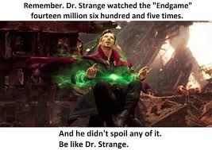

```{r setup, include=FALSE}
knitr::opts_chunk$set(echo = TRUE)
setwd("~/Documents/ikanx101.com/_posts/monty hall")
rm(list = ls())

library(dplyr)
library(ggplot2)
library(ggthemes)
```

```{r,echo=FALSE,fig.align="center"}

```

Selepas kemenangan melawan _Thanos_, kini para anggota _Avengers_ melanjutkan hidupnya masing-masing. Untuk melawan kejenuhan akibat `5` tahun berada di realita lain, _Doctor Strange_ iseng-iseng mengikuti kuis `Superdeal 1 Milliar`.

> Barangkali saya bisa menang...

Begitu pikirnya.

---

Singkat cerita, _Doctor Strange_ masuk ke dalam babak final. Dia berdiri bersama dengan _host_ di depan `3` pintu yang salah satunya berisi hadiah _supercar_, sedangkan `2` pintu lainnya berisi _zonk_.

```{r out.width="60%",echo=FALSE,fig.align='center'}
nomnoml::nomnoml("#direction: down,
                  [1 pintu berisi hadiah\n2 pintu berisi zonk|
                    [Pintu 1]
                    [Pintu 2]
                    [Pintu 3]
                    ]")
```

- Pertama-tama, si _host_ meminta _Doctor Strange_ untuk memilih salah satu pintu. 
- Setelah _Doctor Strange_ memilih satu pintu, si _host_ tiba-tiba membuka salah satu pintu yang berisi _zonk_.
- Lalu dengan nada penuh kelicikan, si _host_ menawarkan kepada _Doctor Strange_: __"Apakah kamu mau mengganti pilihan ke pintu yang lain?"__.

Seketika iman _Doctor Strange_ agak goyah. _Doctor Strange_ ingat saat dulu melakukan simulasi `Fourteen million, six hundred and five times` saat melawan _Thanos_. Kali ini dia lupa membawa _Time Stone_.

Kira-kira keputusan mana yang paling tepat?

> Di antara keputusan _stay_ atau _switch_, keputusan mana yang memberikan peluang terbesar ia mendapatkan hadiah.

---

Di dunia matematika permasalahan ini disebut dengan [_Monty Hall Problem_](https://en.wikipedia.org/wiki/Monty_Hall_problem). Ada berbagai macam cara untuk bisa menyelesaikan masalah ini. Salah satu dengan dengan perhitungan logika biasa seperti _flow_ di bawah ini:

```{r out.width="60%",echo=FALSE,fig.align='center'}
nomnoml::nomnoml("#direction: down,
                  [Saat Awal] -> [Saat dibuka satu pintu]
                  [Saat dibuka satu pintu] -> [Saat ditanya ulang]
                  [Saat Awal|
                    [Pintu 1|unknown|selected]
                    [Pintu 2|unknown]
                    [Pintu 3|unknown]
                    [Pintu 1] -> [Prob: 1/3]
                    [Pintu 2] -> [Prob: 1/3]
                    [Pintu 3] -> [Prob: 1/3]
                    ]
                  
                  [Saat dibuka satu pintu|
                    [Prob: 1/3|
                      [Pintu 1|unknown|selected]
                      ]
                    [Prob: 2/3|
                      [Pintu 2|unknown]
                      [Pintu 3|ZONK|opened]
                      [Pintu 3] -> [Prob menjadi 0]
                      ] 
                    ]
                  
                  [Saat ditanya ulang|
                    [Pintu 1|unknown|selected] -> [Prob: 1/3]
                    [Pintu 2|unknown] -> [Prob: 2/3]
                    [Pintu 3|ZONK] -> [Prob: 0]
                    ]
                 
                 
                 ")
```

Pilihan _switch_ menjadi pilihan yang memberikan peluang terbesar, yakni $\frac{2}{3} =$ `r paste0(round(200/3,1),"%")` dibandingkan tetap _stay_ pada pilihan awal.

---

Dengan menggunakan prinsip yang pernah dilakukan oleh _Doctor Strange_ saat melawan _Thanos_, kita bisa melakukan jutaan simulasi __Monte Carlo__ untuk menghitung berapa peluang _stay_ atau _switch_!

Misalkan, saya akan buat simulasi sebanyak `1000` kali. Ini adalah `15` data iterasi pertama:

```{r,echo=FALSE,warning=FALSE,message=FALSE}
babak = function(id){
  # data awal
  data = data.frame(pintu = c('a','b','c'),
                    hadiah = sample(c("mobil",'zonk','zonk'))
  )
  # di mana pintu hadiah dan pintu apa yang dpilihi
  data = 
    data %>% 
    mutate(pintu_isi_hadiah = ifelse(hadiah == "mobil",1,0),
           pintu_pilihan = sample(c(0,0,1)))
  # mencari pintu zonk untuk  dibuka
  dummy = 
    data %>% 
    mutate(dummy = pintu_isi_hadiah + pintu_pilihan) %>% 
    filter(dummy == 0) %>% 
    select(pintu)
  pintu_dibuka = sample(c(dummy$pintu),1)
  data$pintu_dibuka = ifelse(data$pintu == pintu_dibuka,1,0)
  # apakah pilihan kita berhasil?
  data = 
    data %>% filter(pintu_pilihan == 1)
  mean(data$pintu_pilihan == data$pintu_isi_hadiah)
}

simulasi = data.frame(id = c(1:1000))
simulasi$hasil = sapply(simulasi$id,babak)

simulasi %>% 
  mutate(stay = cumsum(hasil)/id*100,
         switch = 100-stay,
         stay = round(stay,1),
         switch = round(switch,1),
         hasil = NULL) %>% 
  rename(iterasi_ke = id) %>% 
  head(15) %>% 
  knitr::kable()
```

Jika hasil simulasinya saya buat dalam bentuk grafik:

```{r,echo=FALSE,fig.width=9,fig.retina=10,fig.align='center',message=FALSE,warning=FALSE}
library(ggplot2)
simulasi %>% 
  mutate(stay = cumsum(hasil)/id*100,
         switch = 100-stay,
         hasil = NULL) %>% 
  reshape2::melt(id.vars = "id") %>% 
  ggplot(aes(x = id,y = value)) +
  geom_col(aes(fill = variable)) +
  geom_hline(yintercept = 2/3*100,color = "black",alpha = .9) +
  theme_economist_white() +
  labs(title = "Berapa peluang stay vs switch?",
       subtitle = "Simulasi 1000 kali\nMakin banyak iterasi dilakukan, hasilnya semakin konvergen ke angka 2/3 vs 1/3",
       caption = "\nSimulasi menggunakan R\nikanx101.com",
       y = "Peluang",
       x =  "Banyak iterasi",
       fill = "Keputusan") +
  theme(legend.position = "right")
```

Maka, keputusan yang harus diambil _Doctor Strange_ adalah dia harus _switch_ pilihannya ke pintu lainnya.