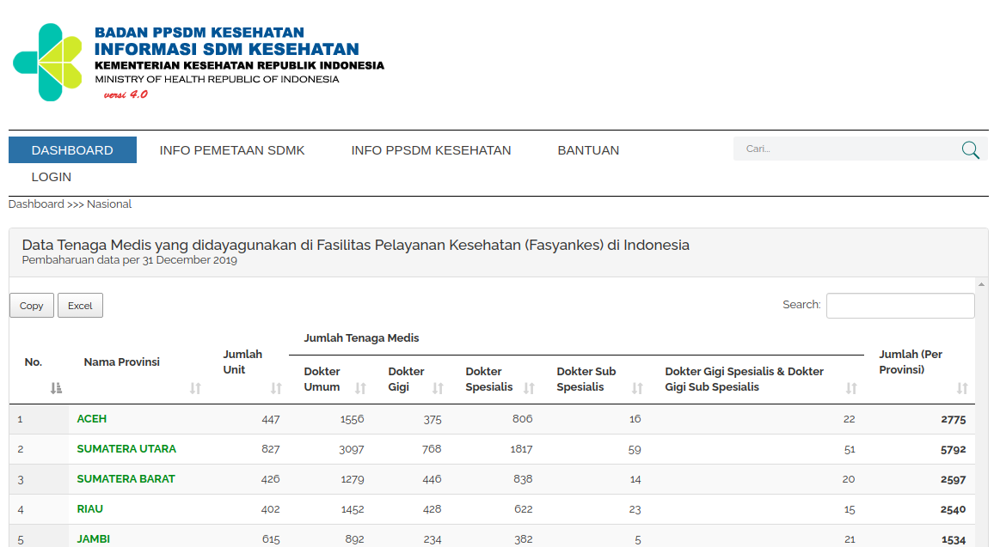

```{r setup, include=FALSE}
knitr::opts_chunk$set(echo = TRUE)
rm(list=ls())
setwd("~/Documents/ikanx101.com/_posts/nakes data/Bagian 1")
```

Sebagaimana kita ketahui bersama, beberapa saat lalu terjadi kekisruhan di kalangan pejabat terkait data tenaga kesehatan (khususnya dokter) yang ada di Indonesia. 

> Memangnya di mana sih kita bisa mendapatkan data update terkait banyaknya tenaga kesehatan di Indonesia? 

Salah satu sumber terpercaya yang bisa kita percaya adalah situs [Badan PPSDM Kemenkes](http://bppsdmk.kemkes.go.id/info_sdmk/info/index?rumpun=101).

```{r,echo=FALSE,fig.align='center'}

```
Keterangan gambar: Data provinsi bisa di- _drill down_ sampai level kabupaten dan kota.

---

Kalau kita perhatikan baik-baik, bentuk data yang disajikan dalam _website_ tersebut sudah berbentuk tabel. Walaupun kita bisa dengan mudah men-_download_ datanya dalam bentuk __Ms. Excel__, tapi akan sangat menguntungkan jika kita melakukan _web scraping_ dengan __R__.

> Lho kok malah begitu?

Jika kita ingin melakukan _scraping_ secara otomatis untuk semua data yang ada di sana (termasuk data kota dan kabupaten), membuat algoritma _scraping_ dan menggabungkan semua datanya adalah langkah yang paling cepat dan tepat.

---

# Langkah _Web Scraping_ dengan __R__

_Web scraping_ dengan menggunakan __R__ setidaknya bisa dilakukan dengan `2` cara, yakni:

1. Menggunakan `library(rvest)`, menargetkan isi `css` dari `html doc` suatu _webpages_. 
1. Menggunakan `library(Rselenium)`, menggunakan prinsip _mimic_ apa yang kita lakukan di _web browser_.

Sekarang, saya akan gunakan prinsip `library(rvest)` untuk mengambil _website_ berisi tabel. Caranya sangatlah mudah, cukup dengan menggunakan `html_table()` saja. 

Kira-kira begini _workflow_-nya:

```{r out.width="60%",echo=FALSE,fig.align='center',fig.retina=10}
nomnoml::nomnoml("#direction: down,
                 [Website Target] -> [Simpan alamat website]
                 [Simpan alamat website] -> [rvest]
                 [rvest] -> [Data carpentry]
                 
                 [rvest|
                    [read_html()] -> [html_table()]
                    ]
                 [Data carpentry|
                    [Perlu dirapikan] -> [Ya]
                    [Perlu dirapikan] -> [Tidak]
                    [Ya] -> [Selamat berjuang :)]
                    ]
                 ")
```

---

## _Web Scrape_ untuk Informasi Provinsi

Saya akan tunjukkan cara melakukan _web scraping_ pada situs informasi provinsi sebagai berikut:

```{r,message=FALSE,warning=FALSE}
# tahap 1
# load libraries yang dibutuhkan
library(rvest)
library(dplyr)

# tahap 2
# simpan url target
url = "http://bppsdmk.kemkes.go.id/info_sdmk/info/index?rumpun=101"

# tahap 3
# lakukan scrape tabel
data = read_html(url) %>% html_table(fill = T)
```

Data tabel sudah berhasil kita _scrape_. Mari kita lihat dulu struktur dari `data` tersebut:

```{r}
str(data)
```

Ternyata `data` berbentuk __list__ berisi satu _element_ saja berbentuk __data.frame__. Kita cukup mengambil _element_ pertama dari list tersebut.

```{r}
data = data[[1]]
```

Kita cek kembali struktur datanya:

```{r}
str(data)
```
Nah, sekarang `data` kita sudah berbentuk __data.frame__. Mari kita lihat bagaimana isinya:

```{r,echo=FALSE}
knitr::kable(data)
```

Ternyata didapati `colnames(data)` kurang tepat dan isi baris pertama sebenarnya tidak diperlukan. Oke, sekarang kita akan membersihkan data di atas dengan prinsip `tidy`.

- `judul_kolom` dari data sebenarnya adalah isi baris (minus kolom kelima) ditambah `colnames(data)` _element_ ke-9.

```{r}
baris_1 = t(data[1,])

judul_kolom = c(baris_1[-5],colnames(data)[9])
```

- Ganti `colnames(data)` dengan `judul_kolom` lalu hapus data baris pertama.

```{r}
colnames(data) = judul_kolom
data = data[-1,]
```

- Hapus baris berisi `total`.

```{r}
data = 
  data %>% 
  filter(No. != "Total")
```

Mari kita lihat hasilnya:

```{r,echo=FALSE}
row.names(data) = NULL
knitr::kable(data)
```

Apakah sudah selesai? Mari kita lihat kembali struktur `data` kembali:

```{r}
str(data)
```

Ternyata, variabel-variabel penting malah memiliki tipe `character` bukan `numeric`. Jadi langkah final kita tinggal mengkonversi variabel-variabel tersebut menjadi `numeric`. Ada banyak cara untuk bisa melakukannya, tapi saya akan gunakan cara simpel dengan _flow_ sebagai berikut:

```{r out.width="60%",echo=FALSE,fig.align='center',fig.retina=10}
nomnoml::nomnoml("#direction: down,
                 [data] -> [Nama Provinsi]
                 [data] -> [Variabel lainnya]
                 [Variabel lainnya] -> [mutate to numeric]
                 [Nama Provinsi] -> [Gabung]
                 [mutate to numeric] -> [Gabung]
                 [Gabung] -> [Clean data]
                 ")
```

```{r,message=FALSE,warning=FALSE}
prov = data$`Nama Provinsi`

data = 
  data %>% 
  select(-`Nama Provinsi`) %>% 
  mutate_all(as.numeric)

data$`Nama Provinsi` = prov
```

Kita lihat kembali hasil finalnya:

```{r,echo=FALSE}
str(data)
knitr::kable(data)
```

## Bagaimana? 

Mungkin ada kesan bahwa cara ini rumit yah dibandingkan _save file_ __Ms. Excel__ langsung dari _website_. Tapi kalau kalian ingin _scrape_ semua detail kabupaten kota, cara ini jauh lebih cepat dibandingkan _save_ manual satu-persatu lalu menggabungkannya di __Ms. Excel__.

Nantikan _posting_ saya selanjutnya mengenai tutorial _scrape_ data tenaga kesehatan (dokter) per kabupaten kota menggunakan __R__.