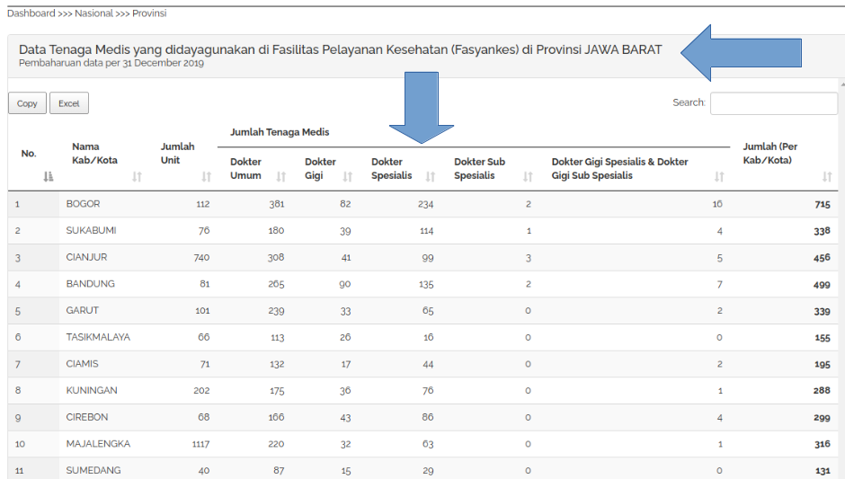

```{r setup, include=FALSE}
knitr::opts_chunk$set(echo = TRUE)
setwd("~/Documents/ikanx101.com/_posts/nakes data/Bagian 2")
rm(list=ls())
```

Masih kelanjutan dari _post_ saya [sebelumnya](https://ikanx101.com/blog/nakes-part-1/), pada [tutorial](https://ikanx101.com/tags/#tutorial) kali ini saya akan membahas cara _web scrape_ data tenaga kesehatan (dokter) pada level kabupaten dan kota dari situs [Kemenkes](http://bppsdmk.kemkes.go.id/info_sdmk/info/index?rumpun=101). Jika belum membaca tutorial pertama, saya sarankan untuk membacanya terlebih dahulu.

```{r,echo=FALSE,fig.align='center'}
knitr::include_graphics("https://raw.githubusercontent.com/ikanx101/ikanx101.github.io/master/_posts/nakes%20data/Bagian%201/kemenkes.png")
```

---

Dari halaman utama di atas, kita bisa memilih _link_ satu provinsi dan melihat data detail kabupaten dan kota yang ada. Sebagai contoh, jika saya memilih provinsi Jawa Barat, maka akan muncul seperti ini:

```{r,echo=FALSE,fig.align='center'}

```

---

Nantinya akan ada dua informasi yang akan saya _scrape_, yakni `tabel` dan `judul provinsi`. _Flow_ pengerjaannya adalah sebagai berikut:

```{r out.width="60%",echo=FALSE,fig.retina=10,fig.align='center'}
nomnoml::nomnoml("#direction: down,
                 [Iterasi hingga semua link selesai] -> [rbind data]
                 [Iterasi hingga semua link selesai|
                    [link situs] -> [tabel data]
                    [link situs] -> [keterangan provinsi]
                    [tabel data] -> [html_table()]
                    [keterangan provinsi] -> [css element]
                    [html_table()] -> [rapikan data]
                    [css element] -> [hapus tulisan yang\ntidak diperlukan]
                    [rapikan data] -> [gabung data]
                    [hapus tulisan yang\ntidak diperlukan] -> [gabung data]
                    ]
                 
                 ")

```

---

Saya akan langsung melakukan _scrape_ dan penggabungan data untuk semua provinsi yang ada. Saya mulai _yah_!

### Langkah 1

Kumpulkan terlebih dahulu semua _links_ dari masing-masing provinsi. Caranya bisa menggunakan _extension_ __link scrapper__ di _Chrome browser_. Contohnya ada `34` _links_ provinsi yang sudah saya kumpulkan sebagai berikut:

```{r,echo=FALSE}
dbase_link = readLines("link dokter.txt")
```

```{r}
dbase_link
```

### Langkah 2

Bikin _function_ yang melakukan 2 proses sekaligus, yakni ambil tabel dan ambil informasi provinsi. Untuk bisa mengambil tabel, saya modifikasi algoritma dari tulisan saya [sebelumnya](https://ikanx101.com/blog/nakes-part-1/).

```{r,message=FALSE,warning=FALSE}
library(dplyr)
library(rvest)
library(tidyr)

scrape = function(url){
  data = read_html(url) %>% html_table(fill = T)
  data = data[[1]]
  colnames(data) = data[1,]
  data = data[-1,]
  data$prov = read_html(url) %>% html_nodes("h3") %>% html_text()
  data = 
    data %>% 
    separate(prov,into = c("hapus","provinsi"),sep = "Provinsi ") %>% 
    mutate(hapus = NULL)
  return(data)
}
```

Mari kita uji coba _function_ di atas untuk _link_ pertama dari `dbase_link`.

```{r}
data = scrape(dbase_link[1])
```

```{r,echo=FALSE}
knitr::kable(data)
```

Ternyata nama variabelnya masih ada yang kurang tepat, tidak mengapa karena isi tabelnya sudah benar. Nanti akan saya bereskan setelah saya lakukan _scrape_ untuk semua _links_.

### Langkah 3

Sekarang saya akan lakukan _looping_ untuk semua _links_ dan lakukan `rbind()` sebagai berikut:

```{r,warning=FALSE,message=FALSE}
for(i in 2:length(dbase_link)){
  temp = scrape(dbase_link[i])
  data = rbind(data,temp)
}
```

Kita lihat kembali hasilnya, 10 data teratas dari data:

```{r,echo=FALSE}
knitr::kable(head(data,10))
```

### Langkah 4

Nah, sekarang tinggal tahap akhir, yaitu bebersih, saya akan lakukan dalam satu _chunk_ langkah saja sebagai berikut:

```{r,warning=FALSE,message=FALSE}
data = 
  data %>% 
  janitor::clean_names() %>% 
  filter(no!="Total")

target_numeric = colnames(data)[c(1,3:9)]

data[,target_numeric] = sapply(data[,target_numeric],as.numeric)

colnames(data) = c("no","Nama Kab/Kota","Jumlah Unit","Dokter Umum","Dokter Gigi","Dokter Spesialis",
                   "Dokter Sub Spesialis","Dokter Gigi Spesialis dan Sub Spesialis","Jumlah Total","Provinsi")
```

Berikut adalah data final hasil _scrape_ kita.

```{r,echo=FALSE}
knitr::kable(data)
data %>% openxlsx::write.xlsx("Data Dokter.xlsx")
```

Data juga bisa diunduh di [sini](https://github.com/ikanx101/ikanx101.github.io/blob/master/_posts/nakes%20data/Bagian%202/Data%20Dokter.xlsx?raw=true).