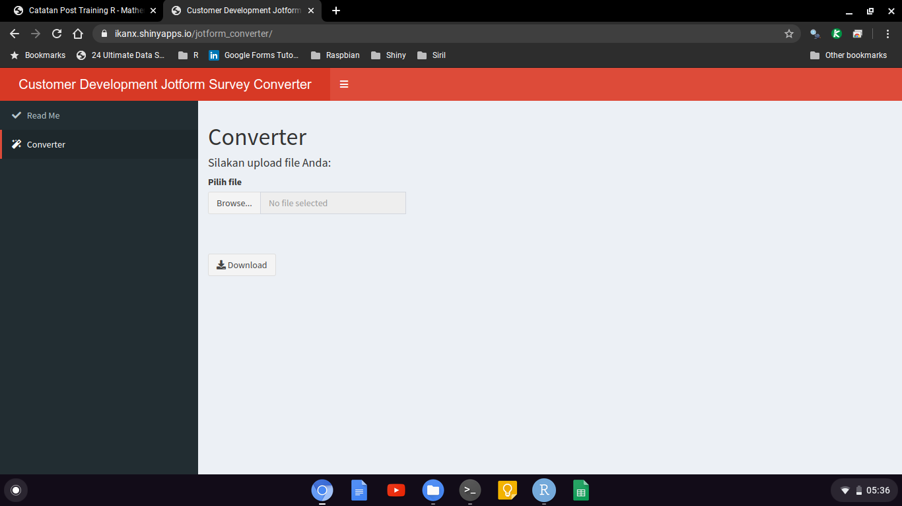
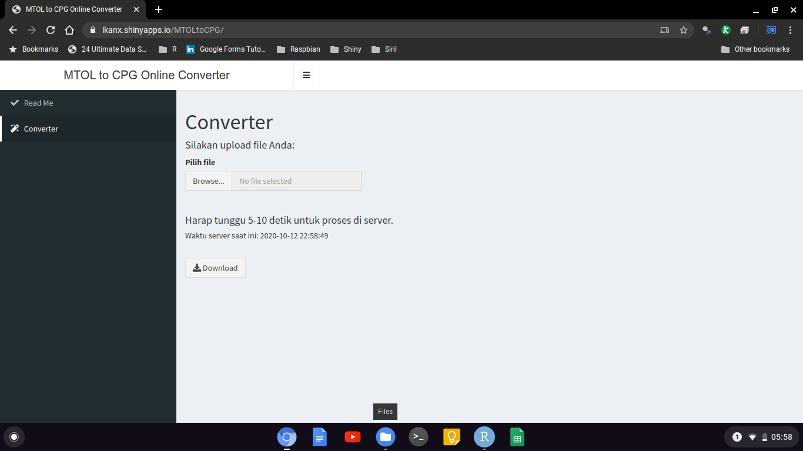
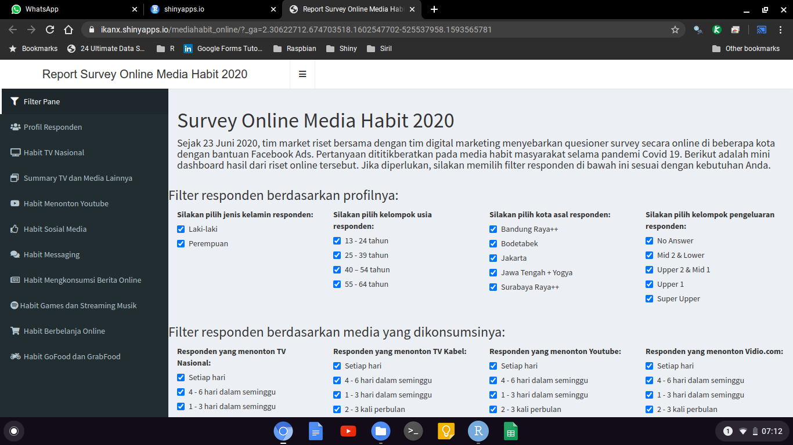
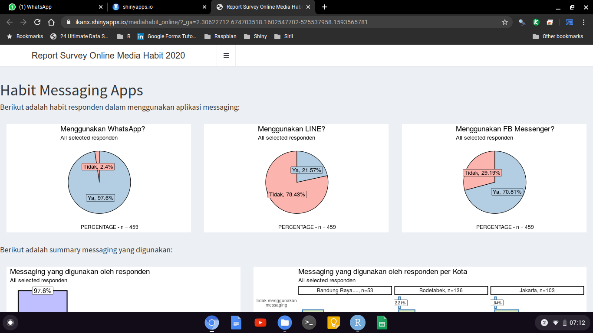
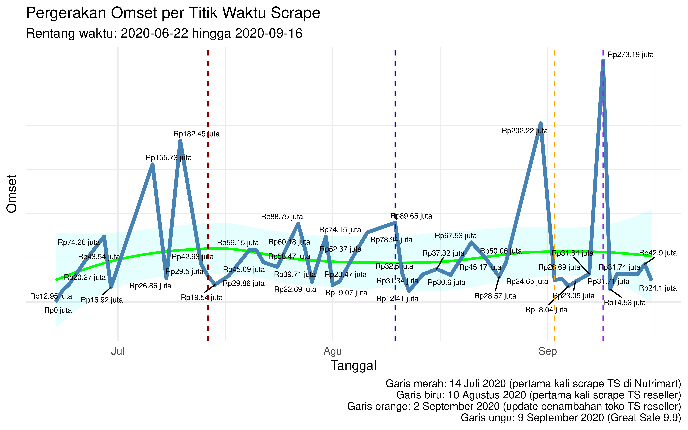
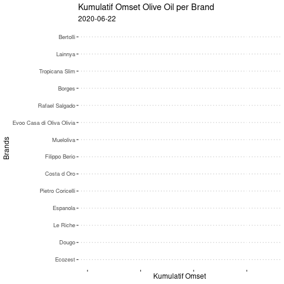

```{r setup, include=FALSE}
knitr::opts_chunk$set(echo = FALSE)
setwd("~/ikanx101.github.io/_posts/ncode")
```

# Pendahuluan

## Pendahuluan

### Apa itu R?

__R__ adalah salah satu _programming language_ yang banyak digunakan dalam bidang _data science_. Banyak orang salah kaprah memahami bahwa _data science_ itu hanya berkaitan dengan _prediction_ dan _forecasting_. Padahal banyak bidang lain yang bisa dilakukan di _data science_.

### Aplikasi di @nutrifood

__R__ digunakan untuk menyelesaikan masalah yang ada di @nutrifood terkait dengan data. Berikut adalah beberapa _keywords_ yang bisa menjelaskan __R__ _projects_ yang sudah dan sedang berjalan di tahun 2020:

- _Automation_
- _Dynamic Visualization_
- _Data Acquisition for Bussiness Intelligence_

# Detail|Automation

## Automation

### Masalah

Masih banyak ditemukan pekerjaan yang bersifat repetitif terkait data di beberapa departemen @nutrifood. Pekerjaan tersebut meliputi:

- Konversi data: dengan atau tanpa adanya proses kalkulasi yang berat.
- Penggabungan data dari _multiple sources_.
- _Reports generating_ dari data.

## Automation
### Contoh
#### Konversi: Customer Development

Tim CD sedang mengubah proses _data acquisition_ dari _Gogogo_ ke _Jotform_. Salah satu kendalanya adalah struktur hasil survey _Jotform_ tidak bisa langsung diolah dan analisa.

Perlu ada _data carpentry_ yang dilakukan. Proses manual bukanlah opsi bijak yang bisa diambil mengingat survey ini dilakukan harian di semua area Indonesia. Oleh karena itu diperlukan satu sistem terpadu, cepat, _reliable_, dan otomatis yang bisa menyelesaikan masalah ini.

Solusinya dibuatkan [_web apps online converter_](https://ikanx.shinyapps.io/jotform_converter/) menggunakan __R Shiny__. _Web apps_ disimpan di _cloud_ dan hanya _compatible_ dengan format _Jotform_ dari tim CD. Tidak perlu khawatir jika ada penambahan pertanyaan, karena _converter_ tersebut sudah dibuat dengan algoritma pintar yang mampu mengakomodir hal tersebut.

---

```{r,echo=FALSE}

```

## Automation
### Contoh
#### Konversi: Produksi PRB Ciawi

Tim produksi setiap harinya perlu membuat `CPG` dari data `MTOL` yang dibuat oleh PPIC. Proses pembuatan ini memakan waktu dan rawan kesalahan karena prosesnya tidak hanya mengubah struktur data tapi juga menambahkan kalkulasi sebagai berikut:

- Data dari MTOL harus dilakukan _matchmaking_ antara item produk dan item granulasinya. Jika _match_, maka harus dijadikan satu baris proses. Jika tidak ada pasangan, maka ada aturannya sendiri.
- Menambahkan kode _batch_ sesuai dengan aturan jenis _plant_, tanggal, kode bulan, dan kode tahun. Selain itu jika ada item ekspor, kode _batch_-nya harus dibuat dengan aturan khusus.
Kemudian produk diurutkan berdasarkan warna. Iya, warna! dari yang warna muda sampai warna tua.
- Menambahkan informasi jumlah _work order_ (WO).
- Membuat variabel urutan _batch_.

Solusinya dibuatkan [_web apps online converter_](https://ikanx.shinyapps.io/MTOLtoCPG/) menggunakan __R Shiny__. _Web apps_ disimpan di _cloud_ dan hanya _compatible_ dengan format _MTOL_ dari tim PRB.

---

```{r,echo=FALSE}

```

## Automation
### Contoh
#### Penggabungan Data: e-Commerce

Setiap bulannya, tim operasional e-commerce (Mbak May) mendapatkan banyak data dari _marketplaces_. Untuk membuat _report_ bulanan, salah satu langkah yang harus dilakukan adalah menggabungkan data terlebih dahulu.

Kondisi saat ini proses penggabungan data dilakukan manual dan memakan waktu. Dengan membuat algoritma, proses kini memakan waktu tak lebih dari `15` detik saja.

## Automation
### Contoh
#### Penggabungan Data: Automatic Report Generator

Setiap bulannya tim _procurement_ membuat _report_ kinerja _supplier_ berdasarkan data-data __KPI__ terkait. Kondisi saat ini, proses dilakukan manual dan memakan waktu karena harus melakukan kalkulasi dan _grouping_ dari _multiple sources_.

Kini dengan algoritma yang dibuat, proses _report generating_ menjadi otomatis dan cepat.

# Detail|Dynamic Visualization

## Dynamic Visualization

### Masalah

Sebagaimana yang kita ketahui, @nutrifood memilih __Tableau__ sebagai _visual analytics tools_. __Tableau__ memang sangat _powerful_ dan berguna untuk menampilkan data _sales_ dan _promotion_ tapi saat dihadapkan dengan _variable_ berjenis _multiple answers_ seketika kesaktiannya menghilang.

Tim _market research_ di beberapa kesempatan harus membuat _dashboard_ hasil rekapan riset. Banyak _variables_ berbentuk _multiple answers_ sehingga sangat menyulitkan untuk dibuat visualisasinya di __Tabi__.

Beberapa alternatif sudah dicoba dengan mengubah struktur data menjadi:

1. Mengubah ke format `.json`. Plus: Menyelesaikan masalah tanpa _hard coding_ di __Tabi__. Minus: Terbatas hanya bisa 5 - 8 _variables_ _multiple answers_ dan proses konversi ke `.json` belum tentu bisa dilakukan oleh semua tim member.
1. Mengubah ke format `one hot encoding`. Plus: relatif mudah dilakukan. Minus: proses _hard coding_ di __Tabi__ menghabiskan waktu.

Akibatnya diperlukan solusi lain visualisasi data tanpa menggunakan __Tabi__,  yakni dengan membuat [_web based dashboard_](https://ikanx.shinyapps.io/mediahabit_online/) via __R Shiny__.

---

```{r,echo=FALSE}

```

---

```{r,echo=FALSE}

```

# Detail|Data Acquisition for Business Intelligence

## Data Acquisition for Business Intelligence

### Masalah

Efek dari digitalisasi adalah banjirnya data publik yang bisa diambil dengan metode dan _tools_ yang tepat. Tropicana Slim beberapa waktu yang lalu meluncurkan _Olive Oil_ secara ekslusif di __Tokopedia__.

Muncul berbagai pertanyaan dari tim _digital marketing_:

- Apakah kita membuka _market_ baru atau mengambil _market_ brand lain? Jika mengambil _market_ brand lain, brand mana yang terpengaruh?
- Bagaimana menentukan strategi _marketing_ yang tepat?
- Bagaimana kondisi market sebelum dan setelah TS _launching_?
- Pada range harga berapa produk Tropicana Slim dijual oleh _reseller_?
- Apakah ada korelasi banyaknya reseller terhadap omset suatu brand _olive oil_?
- Apakah ada _insight(s)_ terkait penamaan _listed product olive oil_ di Tokopedia?
- Pada ukuran berapa _olive oil_ laris terjual?
- Apa saja barang lain yang dijual oleh para _seller olive oil_ ini? 

## Data Acquisition for Business Intelligence

### Solusi

Tim MR kemudian melakukan _web scraping_ untuk `> 600` _listed product_ _olive oil_ di Tokopedia sebulan sebelum TS _launching_ dan `2` bulan setelah TS _launching_.

Algoritma _web scraping_ dibuat agar pengambilan data dilakukan otomatis tanpa campur tangan manusia. Kemudian proses _cleaning_ juga dibuat otomatis sampai akhirnya analisa dilakukan dari data tersebut.

---

```{r out.width="90%",echo=FALSE}

```

---

```{r,echo=FALSE}

```

# Terima Kasih
