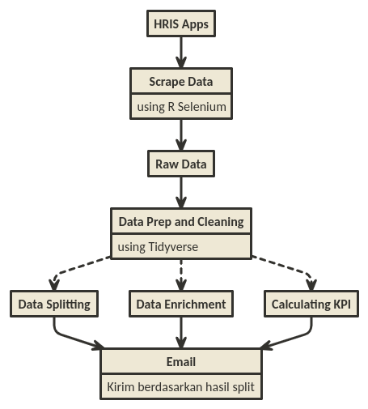
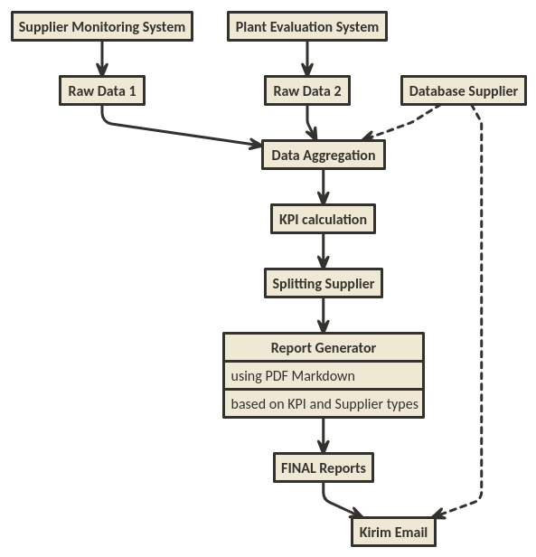
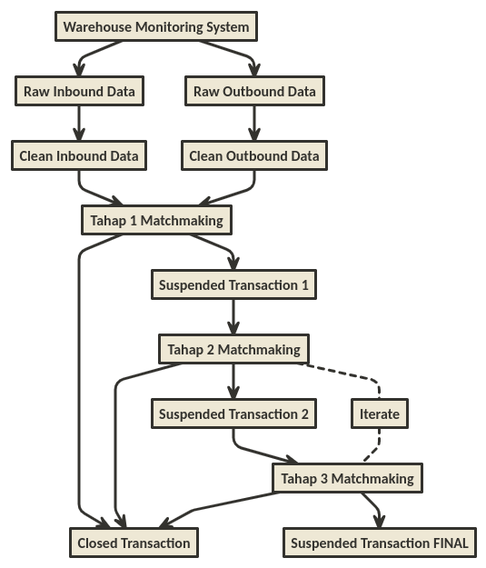

```{r setup, include=FALSE}
knitr::opts_chunk$set(echo = TRUE)
library(nomnoml)
```

Catatan: _posting_ ini mengandung konten _ngegas_.

Beberapa bulan lalu, tiba-tiba istilah _Robotic Process Automation_ (disingkat __RPA__) menjadi buah bibir di kantor saya. Usut punya usut ternyata baru saja ada _training_ dari suatu _vendor_ terkait pembuatan dan penerapan __RPA__ di kantor.

Tujuannya sangat mulia, yakni agar pekerjaan repetitif menjadi otomatis dan digantikan dengan robot (algoritma).

Setelah kepo tanya sana-sini, ternyata _tools_ yang digunakan adalah _software_ bernama __UIPath__. Bukan _software_ gratisan tapi bisa aja digunakan tanpa membayar. Tentu dengan keterbatasan tertentu _yah_.

Sampai beberapa saat lalu, saya kembali berbincang dengan beberapa rekan terkait _follow up_ dari _training_ tersebut, ternyata belum ada satu _project_-pun terkait __RPA__ yang sudah jalan.

> Mmh, kenapa yah? Jangan-jangan kasusnya sama dengan yang saya [alami dulu](https://ikanx101.github.io/blog/blog-promo-hemat-id/). Hahaha.

____

## Kenapa pakai _UIPath_?

Sempat saya bertanya hal tersebut kepada para peserta training, mereka juga tahunya itu yang diajarkan. Konon katanya _software_ tersebut bisa berinteraksi dengan berbagai macam _software_ lain di komputer.

> Wah keren nih pikir saya.

Tapi setelah berpikir kembali, kayaknya 95% kerjaan orang kantor banyak di __Excel__ _deh_. _So_ sepertinya __R__ juga cukup deh untuk membuat __RPA__ macem gini.


_Nah_ karena menunggu contoh _real_ dari __RPA__ ala _UIPath_ yang _gak_ selesai-selesai, _better_ saya kasih karya nyata __RPA__ menggunakan __R__. Oh iya, ini bukan untuk menjelekkan __UIPath__ _yah_, saya cuma mau menginformasikan bahwa dengan _tools_ yang ada dan sudah dikuasai, kita sebenarnya bisa membuat sendiri __RPA__.

_Wise man said:_

> Don't be a NATO guy! (No Action Talk Only)

Berikut adalah karya nyata yang saya himpun selama ini. Oh iya, ada _project_ saya tidak terlibat langsung dan beberapa _projects_ saya terlibat:

_____

### RPA: _Report_ Absensi Karyawan Pabrik

__RPA__ kali ini sangat menarik. Jadi ada beberapa tim _member_ personalia di pabrik ahli _macro Excel_ yang hendak belajar __R__. Mereka adalah _ashobikunal awwalun_ _training_ __R__ yang saya lakukan di kantor. 

Ceritanya mereka ingin membuat satu _flow_ pekerjaan otomatis dari mulai ambil data absensi bulanan karyawan, mengolahnya hingga mengirimkan _via email_ hasil olahan tersebut kepada orang-orang terkait. Semua yang dilakukan adalah otomatis menggunakan __R__. 

Proses ini kemudian dilakukan otomatis di tanggal dan jam tertentu dengan menggunakan _scheduler_. Secara garis besar, _flow_-nya seperti ini:

```{r,echo=FALSE}

```

Proses pembuatan algoritma hingga selesai memakan waktu satu bulan karena mereka memulainya dari nol tanpa supervisi apapun dari siapapun. Setelahnya mereka tinggal menikmati __RPA__ tersebut. _Keren banget lah!_

____

### RPA: _Report_ Evaluasi _Supplier_

__RPA__ kali ini adalah hasil kolaborasi algoritma _backbone_ yang saya kerjakan dengan peserta _training_ __R__ di kantor. Ceritanya dalam pembuatan _report_ supplier, ada banyak sekali tahapan pengambilan dan pengolahan data yang harus dilewati secara manual. _Report_ yang dihasilkan juga ada banyak jenisnya tergantung dari jenis dan kinerja dari _supplier_.

_Nah_, apa bisa pembuatan _reports_ ini dilakukan secara __RPA__?

> Jawabannya tentu bisa dengan R!

Maka dibuatlah algoritma dengan _flow_ seperti berikut:

```{r,echo=FALSE}

```

Setelah dieksekusi, 90-an _reports_ bisa selesai dalam waktu beberapa detik saja! Sangat amat menghemat waktu _yah_!

____

### RPA: Audit Transaksi _Warehouse_

Ini adalah salah satu _epic project_ yang saya lakukan di awal tahun ini. Sebagai perusahaan FMCG, tentunya ada banyak _banget_ tipe-tipe gudang yang harus diaudiit oleh tim terkait. Audit bisa dilakukan dengan dua cara:

- Audit fisik,
- Audit data transaksi.

_Nah_, __RPA__ yang saya buat adalah pada audit data transaksi.

Berbeda tipe gudang tentunya mengakibatkan perbedaan pada sistem pencatatan data, struktur data dan cara melakukan audit. Sebenarnya apa sih yang dilakukan?

> Simpelnya __hanya__ melakukan matchmaking antara transaksi inbound dengan transaksi outbound.

Simpel untuk dikatakan tapi rumit untuk dibuat. Makanya saya bilang ini _epic project_ _hahaha_.

Saya bisa katakan bahwa kemampuan modifikasi-manipulasi data menjadi hal yang krusial pada _project_ ini.

Berikut adalah _flow_-nya:

```{r,echo=FALSE}

```

____

## Prolog

Percaya atau tidak, saat seseorang hendak _enroll_ kursus _online data science_, mereka hanya akan diajarkan mengenai prediksi dan klasifikasi. Hampir tidak ada kursus yang menyentuh bidang otomasi kecuali kita sendiri yang mau mengeksplor hal ini.