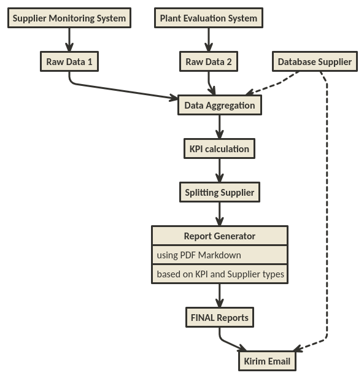
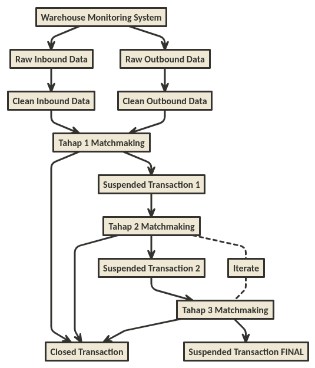

DIY Robotic Process Automation with R
================

Catatan: *posting* ini mengandung konten *ngegas*.

Beberapa bulan lalu, tiba-tiba istilah *Robotic Process Automation*
(disingkat **RPA**) menjadi buah bibir di kantor saya. Usut punya usut
ternyata baru saja ada *training* dari suatu *vendor* terkait pembuatan
dan penerapan **RPA** di kantor.

Tujuannya sangat mulia, yakni agar pekerjaan repetitif menjadi otomatis
dan digantikan dengan robot (algoritma).

Setelah kepo tanya sana-sini, ternyata *tools* yang digunakan adalah
*software* bernama **UIPath**. Bukan *software* gratisan tapi bisa aja
digunakan tanpa membayar. Tentu dengan keterbatasan tertentu *yah*.

Sampai beberapa saat lalu, saya kembali berbincang dengan beberapa rekan
terkait *follow up* dari *training* tersebut, ternyata belum ada satu
*project*-pun terkait **RPA** yang sudah jalan.

> Mmh, kenapa yah? Jangan-jangan kasusnya sama dengan yang saya [alami
> dulu](https://ikanx101.github.io/blog/blog-promo-hemat-id/). Hahaha.

-----

## Kenapa pakai *UIPath*?

Sempat saya bertanya hal tersebut kepada para peserta training, mereka
juga tahunya itu yang diajarkan. Konon katanya *software* tersebut bisa
berinteraksi dengan berbagai macam *software* lain di komputer.

> Wah keren nih pikir saya.

Tapi setelah berpikir kembali, kayaknya 95% kerjaan orang kantor banyak
di **Excel** *deh*. *So* sepertinya **R** juga cukup deh untuk membuat
**RPA** macem gini.

*Nah* karena menunggu contoh *real* dari **RPA** ala *UIPath* yang *gak*
selesai-selesai, *better* saya kasih karya nyata **RPA** menggunakan
**R**. Oh iya, ini bukan untuk menjelekkan **UIPath** *yah*, saya cuma
mau menginformasikan bahwa dengan *tools* yang ada dan sudah dikuasai,
kita sebenarnya bisa membuat sendiri **RPA**.

*Wise man said:*

> Don’t be a NATO guy\! (No Action Talk Only)

Berikut adalah karya nyata yang saya himpun selama ini. Oh iya, ada
*project* saya tidak terlibat langsung dan beberapa *projects* saya
terlibat:

-----

### RPA: *Report* Absensi Karyawan Pabrik

**RPA** kali ini sangat menarik. Jadi ada beberapa tim *member*
personalia di pabrik ahli *macro Excel* yang hendak belajar **R**.
Mereka adalah *ashobikunal awwalun* *training* **R** yang saya lakukan
di kantor.

Ceritanya mereka ingin membuat satu *flow* pekerjaan otomatis dari mulai
ambil data absensi bulanan karyawan, mengolahnya hingga mengirimkan *via
email* hasil olahan tersebut kepada orang-orang terkait. Semua yang
dilakukan adalah otomatis menggunakan **R**.

Proses ini kemudian dilakukan otomatis di tanggal dan jam tertentu
dengan menggunakan *scheduler*. Secara garis besar, *flow*-nya seperti
ini:

Proses pembuatan algoritma hingga selesai memakan waktu satu bulan
karena mereka memulainya dari nol tanpa supervisi apapun dari siapapun.
Setelahnya mereka tinggal menikmati **RPA** tersebut. *Keren banget
lah\!*

-----

### RPA: *Report* Evaluasi *Supplier*

**RPA** kali ini adalah hasil kolaborasi algoritma *backbone* yang saya
kerjakan dengan peserta *training* **R** di kantor. Ceritanya dalam
pembuatan *report* supplier, ada banyak sekali tahapan pengambilan dan
pengolahan data yang harus dilewati secara manual. *Report* yang
dihasilkan juga ada banyak jenisnya tergantung dari jenis dan kinerja
dari *supplier*.

*Nah*, apa bisa pembuatan *reports* ini dilakukan secara **RPA**?

> Jawabannya tentu bisa dengan R\!

Maka dibuatlah algoritma dengan *flow* seperti berikut:

Setelah dieksekusi, 90-an *reports* bisa selesai dalam waktu beberapa
detik saja\! Sangat amat menghemat waktu *yah*\!

-----

### RPA: Audit Transaksi *Warehouse*

Ini adalah salah satu *epic project* yang saya lakukan di awal tahun
ini. Sebagai perusahaan FMCG, tentunya ada banyak *banget* tipe-tipe
gudang yang harus diaudiit oleh tim terkait. Audit bisa dilakukan dengan
dua cara:

  - Audit fisik,
  - Audit data transaksi.

*Nah*, **RPA** yang saya buat adalah pada audit data transaksi.

Berbeda tipe gudang tentunya mengakibatkan perbedaan pada sistem
pencatatan data, struktur data dan cara melakukan audit. Sebenarnya apa
sih yang dilakukan?

> Simpelnya **hanya** melakukan matchmaking antara transaksi inbound
> dengan transaksi outbound.

Simpel untuk dikatakan tapi rumit untuk dibuat. Makanya saya bilang ini
*epic project* *hahaha*.

Saya bisa katakan bahwa kemampuan modifikasi-manipulasi data menjadi hal
yang krusial pada *project* ini.

Berikut adalah *flow*-nya:

-----

## Prolog

Percaya atau tidak, saat seseorang hendak *enroll* kursus *online data
science*, mereka hanya akan diajarkan mengenai prediksi dan klasifikasi.
Hampir tidak ada kursus yang menyentuh bidang otomasi kecuali kita
sendiri yang mau mengeksplor hal ini.
