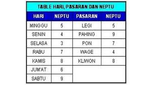

```{r setup, include=FALSE}
knitr::opts_chunk$set(echo = TRUE)
library(dplyr)
library(lubridate)
library(ggplot2)
```

```{r,echo=FALSE}

```

Bagi sebagian suku di Indonesia, penentuan tanggal nikahan bisa menjadi hal yang rumit. Banyak teman saya bercerita betapa _syulitnya_ proses `perhitungan` yang dilakukan keluarga mereka untuk mendapatkan tanggal nikahan yang __bagus__.

Percaya atau tidak, kalau hanya menghitung tanggal nikahan yang __bagus__, saya juga bisa kok!

> Gak pakai primbon, saya akan pakai _data science_ untuk menemukan tanggal nikahan terbaik di 2021!

Lho kok bisa? _Bisa donk!_

---

Pertama-tama, saya akan definisikan dulu masalahnya:

1. Biasanya orang memilih tanggal pernikahan yang jatuh di hari `Sabtu` atau `Minggu`. Kadang sebagian orang memilih hari lain yang bertepatan dengan hari libur tapi karena sangat jarang, jadi saya hanya akan _narrow down_ pemilihan tanggal di tahun `2021` yang jatuh di hari `Sabtu` atau `Minggu` saja.
1. Tanggal nikahan __terbaik__ adalah tanggal yang akan jatuh di hari yang sama saat hari pernikahan di tahun-tahun berikutnya. Misal, saya menikah di tanggal `x` yang jatuh di hari `Sabtu`, jika di tahun-tahun berikutnya saya selalu mendapati tanggal `x` sering jatuh di hari `Sabtu` maka tanggal tersebut saya bilang __terbaik__.

Jadi, saya akan memilih tanggal terbaik yang bisa memenuhi kedua persyaratan di atas.

---

## Langkah I

Saya akan kumpulkan terlebih dahulu semua tanggal di `2021` yang jatuh di hari `Sabtu` atau `Minggu`. Ternyata ada `104` hari di tahun 2021 yang memenuhi kriteria tersebut. Berikut adalah `15` contohnya:


```{r,echo=FALSE}
tanggal = seq(as.Date("2021-01-01"),
              as.Date("2021-12-31"),
              by = 1)
data = 
  data.frame(
    tanggal = tanggal,
    hari = lubridate::wday(tanggal,label = T)
            ) %>%
  filter(hari == "Sab" | hari == "Min")

knitr::kable(data[16:30,],row.names = F)

```

## Langkah II

Selanjutnya saya akan membuat proyeksi ke `50` tahun mendatang, lalu menghitung dari `104` tanggal tersebut, tanggal mana saja yang paling banyak jatuh di hari yang sama dengan hari pernikahan:

> Kenapa `50` tahun? _Simply_, karena angka tersebut adalah _golden year of marriage_.

```{r,echo=FALSE,warning=FALSE,message=FALSE}
tahun_proyeksi = c(2022:2071)

data = 
  data %>% 
  mutate(tanggal_real = substr(tanggal,9,10),
         bulan_real = substr(tanggal,6,7)) 

cek = data %>% select(tanggal_real,bulan_real,hari) %>% rename(hari_cek = hari)

tanggal_cek = as.Date("2020-01-01")
ikang = 1

for(i in 1:104){
  for(j in 1:50){
    tanggal_dummy = paste(tahun_proyeksi[j],data$bulan_real[i],data$tanggal_real[i],sep = "-")
    tanggal_cek[ikang] = as.Date(tanggal_dummy)
    ikang = ikang + 1
  }
}

final = data.frame(
  tanggal = tanggal_cek,
  hari = lubridate::wday(tanggal_cek,label=T),
  tahun = lubridate::year(tanggal_cek),
  tanggal_real = substr(tanggal_cek,9,10),
  bulan_real = substr(tanggal_cek,6,7)
)

final %>% 
  merge(cek) %>% 
  mutate(penanda = ifelse(hari == hari_cek,1,0)) %>% 
  filter(penanda == 1) %>% 
  group_by(tanggal_real,bulan_real) %>% 
  summarise(freq = n(),
            anniversary = stringr::str_c(tahun,collapse = ",")) %>% 
  ungroup() %>% 
  filter(freq == max(freq)) %>% 
  arrange(bulan_real,tanggal_real) %>% 
  mutate(bulan_real = case_when(bulan_real == "01" ~ "Jan",
                                bulan_real == "02" ~ "Feb",
                                bulan_real == "03" ~ "Mar",
                                bulan_real == "04" ~ "Apr",
                                bulan_real == "05" ~ "Mei",
                                bulan_real == "06" ~ "Jun",
                                bulan_real == "07" ~ "Jul",
                                bulan_real == "08" ~ "Agt",
                                bulan_real == "09" ~ "Sep",
                                bulan_real == "10" ~ "Okt",
                                bulan_real == "11" ~ "Nov",
                                bulan_real == "12" ~ "Des"
                                )
         ) %>% 
  mutate(new = paste(tanggal_real,bulan_real,sep = "-"),
         tanggal_real = NULL,
         bulan_real = NULL) %>% 
  select(new,freq,anniversary) %>% 
  rename("Tanggal Pilihan di 2021" = new,
         "Freq Jatuh di Hari yang Sama dengan Hari Pernikahan" = freq,
         "Tahun saat Terjadi" = anniversary) %>% 
  knitr::kable()

```

Ternyata ada `86` pilihan tanggal yang memenuhi kriteria saya.

---

# Kesimpulan

Setelah saya cek kembali, sepertinya `86` pilihan masih terlalu banyak _yah_. Tiba-tiba saya merasa gagal. 

> Jangan-jangan perhitungan menggunakan _primbon_ lebih baik _yah_. _haha_

Lalu jika dilihat, semua tanggal ini memiliki kesamaan di tahun kejadiannya. Ini adalah hal yang menarik bagi saya dimana ternyata hari bisa berulang setelah beberapa tahun.

Keputusan jadi saya kembalikan ke tangan kalian:

1. Percaya bahwa semua hari itu baik? Atau
1. Balik lagi pakai hitungan _primbon_?