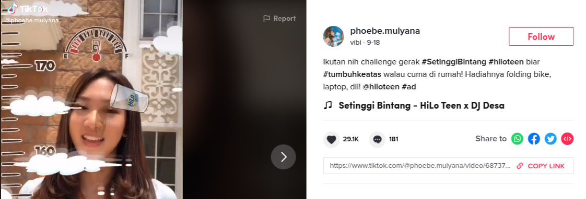

```{r setup, include=FALSE}
knitr::opts_chunk$set(echo = TRUE)
rm(list = ls())
options(scipen = 999)
setwd("~/ikanx101 com/_posts/tiktoks/Bagian 2")

load("~/ikanx101 com/_posts/tiktoks/toktok.rda")

library(dplyr)
library(ggplot2)
library(tidyr)

hestek_setinggi_bintang = 
  hestek_setinggi_bintang %>% 
  mutate(createTime = as.numeric(createTime),
         kapan_post = as.POSIXct(createTime,
                                 origin = "1970-01-01"),
         tanggal = lubridate::date(kapan_post),
         hari = lubridate::wday(kapan_post,label = T),
         jam = lubridate::hour(kapan_post)
         )
```

Pada tulisan yang [lalu](https://ikanx101.com/blog/tiki-taka/), saya telah menelaah secara umum, data terkait _hashtag_ __#SetinggiBintang__ yang viral di _Youtube_.

Pertanggal saya _scrape_ data, setidaknya semua video dengan _hashtag_ demikian sudah ditonton sebanyak _2.4 billion views_.

> Billion yah! Billion!

Saya penasaran, bagaimana bisa aktivasi digital ini menjadi sangat masif di __TikTok__.

Saya akan mulai penelusuran ini dengan melihat _post timeline_ berikut:


```{r out.width="70%",echo=FALSE,warning=FALSE,message=FALSE,fig.retina=10}
knitr::include_graphics("https://raw.githubusercontent.com/ikanx101/ikanx101.github.io/master/_posts/tiktoks/blog-post_files/figure-gfm/unnamed-chunk-5-1.png")
```

Pertama kali video dengan _hashtag_ __#SetinggiBintang__ muncul pada tanggal `18 September 2020` pukul `15:45:32 WIB` oleh [phoebe.mulyana](https://www.tiktok.com/@phoebe.mulyana/video/6873746081885375745).

```{r out.width="70%",echo=FALSE,warning=FALSE,message=FALSE,fig.retina=10}

```

Selepas video tersebut di-_post_, butuh waktu `65` menit sampai seorang _user_ bernama [stanleyhao](https://www.tiktok.com/@stanleyhao/video/6873763084222106882?lang=en) melakukan _post_ kedua. Butuh waktu `62` menit lagi sampai ada _post_ ketiga. Butuh waktu `40` menit lagi sampai ada _post_ keempat.

Berikut adalah data kapan _post_, siapa, dan jeda (dalam menit) antar _post_ pada `23` _post_ pertama. 

```{r,echo=FALSE,message=FALSE,warning=FALSE}
analisa = 
  hestek_setinggi_bintang %>% 
  arrange(kapan_post) %>% 
  select(kapan_post,authorInfos_uniqueId) %>% 
  mutate(jeda = c(0,diff(kapan_post)),
         jeda = jeda / 60) %>% 
  rename(tanggal_post = kapan_post,
         user = authorInfos_uniqueId,
         jeda_menit = jeda) 

analisa %>% 
  head(23) %>% 
  knitr::kable("html",caption = "23 Post Pertama #SetinggiBintang")
```

Kenapa saya pilih `23` _post_ pertama? 

> Perhatikan grafik paling atas! Pada hari pertama dan kedua ada `23` buah _post_. Setelah itu pada hari ketiga langsung melejit ada `115` buah _post_.  

Maka, `23` _post_ ini sepertinya krusial menurut saya.

Mari kita lihat visualisasi berikut:

```{r,echo=FALSE,warning=FALSE,message=FALSE,fig.retina=10}
analisa %>% 
  mutate(timeline = cumsum(jeda_menit),
         number_user = c(1:303),
         penanda = ifelse(number_user == 23,.1,NA)) %>% 
  ggplot(aes(x = timeline,
             y = number_user)) +
  annotate("rect",
           xmin = 0,
           ymin = 0,
           xmax = 1758.4000,
           ymax = 23,
           color = "black",
           fill = "white",
           alpha = .3,
           linetype = 3
           ) +
  geom_line(color = "steelblue",size = 1.1) +
  annotate("text",x = 3800,y = 13, label = "Area 23\nPost Pertama",size = 2.25) +
  theme_minimal() +
  labs(title = "Timeline Penambahan Post #Setinggi Bintang",
       subtitle = "303 post di TikTok dengan hashtag #Setinggi Bintang",
       x = "Timeline sejak post pertama (dalam menit)",
       y = "Jumlah Post",
       caption = "Scraped and Visualized\nusing R\nikanx101.com")
```

Kita bisa lihat kurva yang awalnya landai pada dua hari pertama, tiba-tiba melejit di hari kedua.

Sayangnya saya tidak memiliki data jumlah _view_ per posting per hari yang dilakukan oleh para _user_ tersebut. Satu-satunya hal yang bisa saya lakukan adalah dengan menjumlahkan banyaknya _followers_ dari pada _user_ tersebut.

Tentunya dengan asumsi:

1. Saya menghiraukan adanya irisan _followers_ antar _user_.
1. _Followers_ _notice_ dengan _post_ yang dilakukan _user_.

```{r,echo=FALSE,warning=FALSE,message=FALSE,fig.retina=10}
analisa = 
  hestek_setinggi_bintang %>% 
  arrange(kapan_post) %>% 
  select(kapan_post,authorInfos_uniqueId,authorStats_followerCount) %>% 
  mutate(jeda = c(0,diff(kapan_post)),
         jeda = jeda / 60) %>% 
  rename(tanggal_post = kapan_post,
         user = authorInfos_uniqueId,
         jeda_menit = jeda,
         jumlah_follower = authorStats_followerCount) %>% 
  mutate(timeline = cumsum(jeda_menit),
         number_user = c(1:303),
         penanda = ifelse(number_user == 23,.1,NA),
         follower = cumsum(jumlah_follower))

analisa %>% 
  ggplot(aes(x = timeline,
             y = follower)) +
  annotate("rect",
           xmin = 0,
           ymin = 0,
           xmax = 1758.4000,
           ymax = 13593136,
           color = "black",
           fill = "white",
           alpha = .3,
           linetype = 3
           ) +
  geom_line(color = "steelblue",size = 1.25) +
  annotate("text",x = 4000,y = 6000000, label = "Area 23\nPost Pertama",size = 2.25) +
  theme_minimal() +
  labs(title = "Timeline Penambahan Cumulative Followers dari Para User yang Post #Setinggi Bintang",
       subtitle = "303 post di TikTok dengan hashtag #Setinggi Bintang",
       x = "Timeline sejak post pertama (dalam menit)",
       y = "Jumlah Cumulative Followers",
       caption = "Scraped and Visualized\nusing R\nikanx101.com")
```

> Tuh bener kan dugaan saya!

Kuncinya berada di post awal ini.

---

## _Another Key Points_

Dari dua grafik di atas, kita bisa melihat kapan titik jenuh di mana tidak ada lagi penambahan post dengan hashtag __#SetinggiBintang__.

Ada yang mau menebak pas di timeline ke berapa?

---

### _Udah ah segitu dulu..._