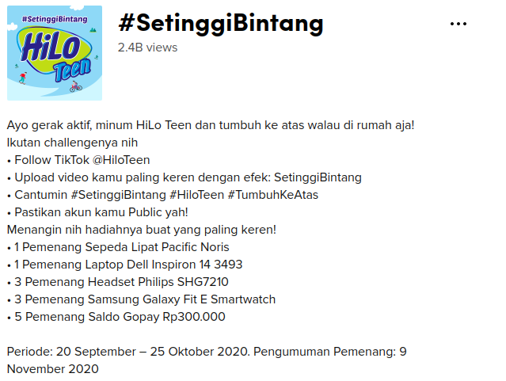

```{r setup, include=FALSE}
knitr::opts_chunk$set(echo = TRUE)
rm(list = ls())
load("toktok.rda")

library(dplyr)
library(ggplot2)
library(tidyr)
```


Sebagaimana yang kita ketahui bersama, semua aktivitas yang ada di _social media_ sejatinya adalah data publik yang bisa diambil dan diolah dengan _tools_ yang tepat.

Dulu, saya pernah menjelaskan bagaimana kita bisa mengambil data dari [_twitter_](https://passingthroughresearcher.wordpress.com/2019/10/05/twitter-analytics-menggunakan-r/), [_instagram_](https://passingthroughresearcher.wordpress.com/2019/10/29/instagram-scraper-tropicanaslim/), dan [_Youtube_](https://ikanx101.com/blog/blog-posting-sunyi/) lalu menganalisanya sesuai dengan tujuan yang diinginkan.

Sekarang saya akan mencoba mengambil data dari _platform_ _social media_ yang lagi _trending_.

> __TikTok!!!__

Ternyata _social media_ ini masih memiliki banyak celah untuk bisa dieksploitasi datanya. Suatu hal yang menguntungkan bagi para __OSINT__ _lovers_ _kayak_ saya ini. Saya berdoa agar celah-celah ini dibiarkan apa adanya. _haha_.

> Bahaya kalau sampai nanti ditutup lalu jadi tidak _accessible_ lagi untuk diambil datanya.

---

Oh iya, bagi yang belum tahu, __OSINT__ adalah _Open Source Intelligent_. Semacam kumpulan metode (dan atau _tools_) mengambil dan menganalisa data yang tersedia secara publik.

---

Oke, kembali ke topik. Saya akan menggunakan kombinasi antara __R__ dan _TikTok page source_ untuk mengambil data yang saya mau. Nah, kali ini saya akan mengambil data terkait _hashtag_ __#SetinggiBintang__ di _TikTok_. Semua data ini saya _scrape_ per tanggal `20 Oktober 2020` pukul `10:50` WIB _yah_. 


```{r,echo=FALSE}

```

---

## Mengambil Data

Untuk mengambil data _posting_ terkait _hashtag_ __#SetinggiBintang__, saya menggunakan _Phyton_ yang di-_run_ di __R__.

> Analoginya seperti _Googling_ di _Yahoo_.

Data apa saja yang bisa diambil? Karena saya mengambil semua posting terkait _hashtag_ tersebut, maka data yang bisa diambil antara lain:

- `Video meta`: ukuran video, ratio, dan durasi.
- `user-post related`: Siapa yang _posting_, kapan, deskripsi video, musik yang digunakan, _like count_, _share count_, _play count_, _comment count_,

Tapi kalau isi komen dan siapa yang komen, saya harus mengambilnya dari _page source_ si __TikTok__-nya.

Sayangnya datanya memiliki struktur _list_ jadi tidak bisa diubah dengan mudah ke dalam _Excel format files_. Bentuk data yang paling memungkinkan adalah dengan forma `.json`.

Berikut adalah struktur data dari `303` _posting_ __#SetinggiBintang__ yang saya ambil:

```{r,echo=FALSE}
str(hestek_setinggi_bintang)
```

Oke, kalau bingung melihat strukturnya, saya langsung masuk ke visualisasi dari data tersebut.

### Exploratory Data Analysis: Semua _Posting_ __#SetinggiBintang__ 

### Durasi Video

__TikTok__ memang membatasi video yang di-_post_ oleh _user_-nya. Untuk _hashtag_ __#SetinggiBintang__ ada dua kelompok video berdasarkan durasinya. Sebagian besar berada di kisaran `15` detik, selainnya ada di `19` detik.

```{r,echo=FALSE,warning=FALSE,message=FALSE,fig.retina=10}
hestek_setinggi_bintang %>% 
  ggplot(aes(x = videoMeta_duration)) +
  geom_density(fill = "gray") +
  theme_minimal() +
  labs(title = "Sebaran Durasi Video",
       subtitle = "303 Video TikTok #SetinggiBintang",
       caption = "Scraped and Visualized\nusing R\nikanx101.com",
       x = "Durasi (dalam detik)",
       y = "Density") +
  theme(axis.text.y = element_blank())
```

### Video Ratio (width x height)

_Video ratio_ dari yang paling sering digunakan adalah `576 x 1024` px, yakni sebanyak `192` buah _post_.

```{r,echo=FALSE,warning=FALSE,message=FALSE,fig.retina=10}
hestek_setinggi_bintang %>%
  group_by(videoMeta_width,videoMeta_height) %>% 
  summarise(n = n()) %>% 
  ungroup() %>% 
  rename(lebar = videoMeta_width,
         tinggi = videoMeta_height) %>% 
  ggplot(aes(x = lebar,
             y = tinggi)) +
  geom_point(aes(size = n,
                 color = n)) +
  scale_color_gradient(low="steelblue",high="darkred")+
  theme_minimal() +
  labs(title = "Ratio Video TikTok",
       subtitle = "303 Video TikTok #SetinggiBintang",
       caption = "Scraped and Visualized\nusing R\nikanx101.com",
       x = "Dimension: width",
       y = "Dimension: height") +
  theme(legend.position = "none")
```

### Waktu _Posting_

Berikutnya saya akan coba lihat waktu _posting_ video __#SetinggiBintang__.

```{r,echo=FALSE,warning=FALSE,message=FALSE,fig.retina=10}
hestek_setinggi_bintang = 
  hestek_setinggi_bintang %>% 
  mutate(createTime = as.numeric(createTime),
         kapan_post = as.POSIXct(createTime,
                                 origin = "1970-01-01"),
         tanggal = lubridate::date(kapan_post),
         hari = lubridate::wday(kapan_post,label = T),
         jam = lubridate::hour(kapan_post)
         )

hestek_setinggi_bintang %>% 
  group_by(tanggal) %>% 
  summarise(n = n()) %>% 
  ungroup() %>% 
  ggplot(aes(x = tanggal,
             y = n)) +
  geom_line() +
  geom_label(aes(label = n),size = 2) +
  theme_minimal() +
  labs(title = "Kapan Video Dipost?",
       subtitle = "303 Video TikTok #SetinggiBintang",
       caption = "Scraped and Visualized\nusing R\nikanx101.com",
       x = "Tanggal",
       y = "Banyak Video") +
  theme(legend.position = "none")

hestek_setinggi_bintang %>% 
  group_by(hari) %>% 
  summarise(n = n()) %>% 
  ungroup() %>% 
  ggplot(aes(x = hari,
             y = n)) +
  geom_col(color = "black",
           fill = "steelblue") +
  geom_label(aes(label = n),
             size = 2) +
  theme_minimal() +
  labs(title = "Hari Apa Video Paling Banyak Dipost?",
       subtitle = "303 Video TikTok #SetinggiBintang",
       caption = "Scraped and Visualized\nusing R\nikanx101.com",
       x = "Hari",
       y = "Banyak Video") +
  theme(legend.position = "none",
        axis.text.y = element_blank())

hestek_setinggi_bintang %>% 
  group_by(jam) %>% 
  summarise(n = n()) %>% 
  ungroup() %>% 
  mutate(jam = factor(jam, levels = c(0:23))) %>% 
  ggplot(aes(x = jam,
             y = n)) +
  geom_col(color = "black",
           fill = "steelblue") +
  geom_label(aes(label = n),
             size = 2) +
  theme_minimal() +
  labs(title = "Pada Jam Berapa Video Dipost?",
       subtitle = "303 Video TikTok #SetinggiBintang",
       caption = "Scraped and Visualized\nusing R\nikanx101.com",
       x = "Jam",
       y = "Banyak Video") +
  theme(legend.position = "none",
        axis.text.y = element_blank())

hestek_setinggi_bintang %>% 
  group_by(hari,jam) %>% 
  summarise(n = n()) %>% 
  ungroup() %>% 
  mutate(jam = factor(jam, levels = c(0:23))) %>% 
  ggplot(aes(x = hari,
             y = jam)) +
  geom_tile(aes(fill = n)) +
  scale_fill_gradient(low="steelblue",high="darkred") +
  theme_minimal() +
  labs(title = "Pada Jam Berapa Video Dipost per Hari?",
       subtitle = "303 Video TikTok #SetinggiBintang",
       caption = "Scraped and Visualized\nusing R\nikanx101.com",
       x = "Hari",
       y = "Jam",
       fill = "Banyak\nVideo") 
```

### Most _Likes_, _Comments_, _Share_, and _Play_

Sekarang saya akan coba lihat, _user_ mana saja yang mendapatkan _likes_ terbanyak.

```{r,echo=FALSE,warning=FALSE,message=FALSE,fig.retina=10}
pilter = 
  hestek_setinggi_bintang %>% 
  select(authorInfos_uniqueId,diggCount,shareCount,playCount,commentCount)

pilter %>% 
  arrange(desc(diggCount)) %>% 
  head(20) %>% 
  ggplot(aes(x = reorder(authorInfos_uniqueId,diggCount),
             y = diggCount)) +
  geom_col(color = "black",
           fill = "steelblue") +
  geom_label(aes(label = diggCount),
             size = 2) +
  theme_minimal() +
  labs(title = "User Mana Saja yang Paling Banyak di-Likes?",
       subtitle = "303 Video TikTok #SetinggiBintang",
       caption = "Scraped and Visualized\nusing R\nikanx101.com") +
  theme(legend.position = "none",
        axis.text.x = element_blank(),
        axis.title = element_blank()) +
  coord_flip()

```

Sekarang saya akan coba lihat, _user_ mana saja yang mendapatkan _comments_ terbanyak.

```{r,echo=FALSE,warning=FALSE,message=FALSE,fig.retina=10}
pilter %>% 
  arrange(desc(commentCount)) %>% 
  head(20) %>% 
  ggplot(aes(x = reorder(authorInfos_uniqueId,commentCount),
             y = commentCount)) +
  geom_col(color = "black",
           fill = "steelblue") +
  geom_label(aes(label = commentCount),
             size = 2) +
  theme_minimal() +
  labs(title = "User Mana Saja yang Paling Banyak di-Comment?",
       subtitle = "303 Video TikTok #SetinggiBintang",
       caption = "Scraped and Visualized\nusing R\nikanx101.com") +
  theme(legend.position = "none",
        axis.text.x = element_blank(),
        axis.title = element_blank()) +
  coord_flip()

```

Sekarang saya akan coba lihat, _user_ mana saja yang mendapatkan _share_ terbanyak.

```{r,echo=FALSE,warning=FALSE,message=FALSE,fig.retina=10}
pilter %>% 
  arrange(desc(shareCount)) %>% 
  head(20) %>% 
  ggplot(aes(x = reorder(authorInfos_uniqueId,shareCount),
             y = shareCount)) +
  geom_col(color = "black",
           fill = "steelblue") +
  geom_label(aes(label = shareCount),
             size = 2) +
  theme_minimal() +
  labs(title = "User Mana Saja yang Paling Banyak di-Share?",
       subtitle = "303 Video TikTok #SetinggiBintang",
       caption = "Scraped and Visualized\nusing R\nikanx101.com") +
  theme(legend.position = "none",
        axis.text.x = element_blank(),
        axis.title = element_blank()) +
  coord_flip()

```


Sekarang saya akan coba lihat, _user_ mana saja yang mendapatkan _play_ terbanyak.

```{r,echo=FALSE,warning=FALSE,message=FALSE,fig.retina=10}
pilter %>% 
  arrange(desc(playCount)) %>% 
  head(20) %>% 
  ggplot(aes(x = reorder(authorInfos_uniqueId,playCount),
             y = playCount)) +
  geom_col(color = "black",
           fill = "steelblue") +
  geom_label(aes(label = playCount),
             size = 2) +
  theme_minimal() +
  labs(title = "User Mana Saja yang Paling Banyak di-Play?",
       subtitle = "303 Video TikTok #SetinggiBintang",
       caption = "Scraped and Visualized\nusing R\nikanx101.com") +
  theme(legend.position = "none",
        axis.text.x = element_blank(),
        axis.title = element_blank()) +
  coord_flip()

```

Menarik bahwa ternyata kita bisa temukan _user_ yang berbeda-beda di masing-masing kategori. Kalau saya buat analisa _cross_ antara _likes_ dan _comments_, berikut hasilnya:

```{r,echo=FALSE,warning=FALSE,message=FALSE,fig.retina=10}
pilter %>% 
  mutate(label = ifelse(commentCount>50,authorInfos_uniqueId,NA)) %>% 
  ggplot(aes(x = diggCount,
             y = commentCount)) +
  geom_point(alpha = .4) +
  geom_text(aes(label=label),
            position = "jitter") +
  theme_minimal() +
  labs(title = "Likes vs Comments Video TikTok",
       subtitle = "303 Video TikTok #SetinggiBintang",
       caption = "Scraped and Visualized\nusing R\nikanx101.com",
       x = "Banyak likes",
       y = "Banyak comments")
```

### User Mana yang Punya Follower dan Video Terbanyak

Dari sekian banyak _user_ __TikTok__ yang posting __#SetinggiBintang__, saya penasaran... Siapa yang memiliki _follower_ terbanyak? Siapa yang paling __produktif__? (memiliki video terbanyak di __TikTok__).

```{r,echo=FALSE,warning=FALSE,message=FALSE,fig.retina=10}
hestek_setinggi_bintang %>% 
  select(authorInfos_uniqueId,authorStats_followerCount,authorStats_videoCount) %>% 
  rename(user = authorInfos_uniqueId,
         follower = authorStats_followerCount,
         video = authorStats_videoCount) %>% 
  mutate(label = ifelse(video >= 3000 | follower >= 1000000,
                        user,
                        NA)) %>% 
  distinct() %>% 
  ggplot(aes(x = follower,
             y = video)) +
  geom_point(alpha = .4) +
  ggrepel::geom_text_repel(aes(label = label)) +
  theme_minimal() +
  labs(title = "Siapa yang Memiliki Follower dan Video Terbanyak di TikTok?",
       subtitle = "303 Video TikTok #SetinggiBintang",
       caption = "Scraped and Visualized\nusing R\nikanx101.com",
       x = "Banyak follower",
       y = "Banyak Video")
```

---

# _What's Next?_

Selain data agregasi seperti di atas, saya juga memiliki data `20` _latest comments_ _netizen_ kepada video __#SetinggiBintang__ dari `phoebe.mulyana` sebagai berikut:

```{r,echo=FALSE}
n = length(data$comments)
for(i in 1:n){
  print(data$comments[[i]]$text)
}
```

Tentunya ada data lain juga yang _embedded_ ke data komen ini. Mirip dengan data agregasi: `waktu`, `nama user`, dan `likes`.

---

### _Udah ah segitu dulu..._