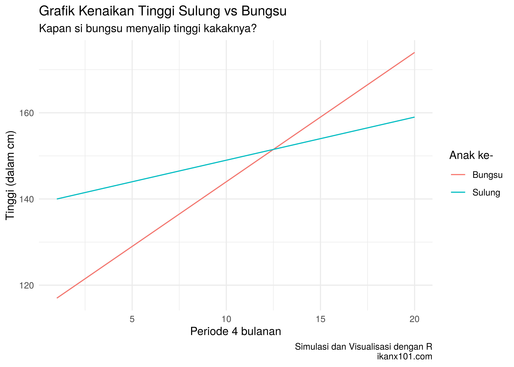

Membandingkan Tinggi Dua Anak
================

> ***Pa, kayaknya si bungsu paling tinggi di TK-nya deh…***

Begitu kata nyonya beberapa hari ini. Si bungsu saat ini masih sekolah
di TK A. Jika dibandingkan dengan si sulung pada usia yang sama, ukuran
baju si bungsu memang lebih besar dibanding kakaknya.

Saya selalu mengukur tinggi anak-anak secara berkala. Penasaran dengan
perkataan nyonya, saya coba ukur tinggi keduanya tadi sore:

  - Bungsu = 114 cm.
  - Sulung = 139 cm.

Yang menarik adalah laju pertumbuhan kedua anak tersebut. Setelah saya
bandingkan dengan data historikal pengukuran tinggi badan berkala, saya
mendapatkan informasi sebagai berikut:

  - Bungsu: laju kenaikan tinggi badan `3 cm per 4 bulan`.
  - Sulung: laju kenaikan tinggi badan `1 cm per 4 bulan`.

-----

Sambil bercanda saya berkata kepada si sulung:

> ***Kak, dengan pertumbuhan segini, suatu saat nanti kamu disalip lho
> sama adek…***

Si sulung langsung *insecure* tiba-tiba. *hehe*.

-----

Jika saya asumsikan kenaikan tinggi badan selalu stabil dan linear,
sebenarnya saya dengan mudah bisa memperkirakan kapan hal tersebut
terjadi. Saya bisa membuat dua persamaan linear sebagai berikut:

**Tinggi badan bungsu**

\(b(t) = 114 + 3t\)

**Tinggi badan sulung**

\(s(t) = 139 + t\)

dimana \(t\) adalah waktu atau periode dalam `4 bulanan`.

Berikut adalah gambar
fungsinya:



Dari grafik di atas, kita bisa hitung bahwa pada periode ke `12.5 x 4`
bulan tinggi badan si bungsu akan menyamai kakaknya.

-----

## Penyelesaian Cara Lain

Masalah pertumbuhan di atas bisa kita selesaikan dengan berbagai macam
cara. Bagi rekan-rekan yang tidak menyukai rumus matematika dan ingin
menggunakan algoritma sederhana (*looping*) bisa memanfaatkan perintah
`while()`.

Bagaimana caranya?

``` r
# initial condition
bungsu = 114
sulung = 139

# laju pertumbuhan
laju_bungsu = 3
laju_sulung = 1

# untuk menghitung periode 4 bulanan
periode_4_bulanan = 0

while(bungsu < sulung){
  bungsu = bungsu + laju_bungsu
  sulung = sulung + laju_sulung
  periode_4_bulanan = periode_4_bulanan + 1
  }

pesan = paste0("Si bungsu akan menyalip si sulung saat: ",
           periode_4_bulanan*4,
           " bulan")
print(pesan)
```

    ## [1] "Si bungsu akan menyalip si sulung saat: 52 bulan"

-----

## Catatan

1.  Pada metode grafik, kita bisa dengan eksak menemukan angkanya karena
    memang diperbolehkan memiliki koma di belakang angka. Sedangkan
    dengan metode kedua, kita hanya bisa menggunakan *integer* karena
    saya ingin memastikan **kapan saat si bungsu sudah menyalip si
    sulung**.
2.  Tulisan ini saya buat bukan untuk merundung si sulung *yah*. Tapi
    untuk mengajarkan si sulung tentang deret dan pola kenaikan linier.

-----

`if you find this article helpful, support this blog by clicking the
ads.`
