Beberapa waktu yang lalu, saya sempat menuliskan tutorial tentang bagaimana meng-_install_ `VS Code Server` di __Google Cloud Service__. Tak lama setelah itu, saya mendapati info bahwa _Github_ memiliki layanan _Codespaces_ (layanan _cloud computing_ mirip dengan _virtual private server_ / VPS) yang bisa diakses oleh para penggunanya secara gratis selama 60 jam dalam sebulan.

Hal ini tentu kabar yang menggembirakan mengingat dalam beberapa minggu ini laptop saya sedang dipakai untuk mengerjakan suatu algoritma yang harus berjalan selama 7 hari non stop. Jadi saya perlu VPS atau layanan _cloud_ yang _reliable_.

Walau saya sekarang [menyewa VPS di _Google Cloud_](https://ikanx101.com/blog/vscode-google-cloud/), saya tetap membutuhkan layanan _cloud_ lain yang gratis. _Hehe_.

Jadi _Github_ _Codespaces_ bisa digunakan sebagai VPS berbasis __Visual Studio Code__ untuk berbagai bahasa pemrograman. 

> Ilustrasinya adalah seperti kita memiliki __Visual Studio Code Server__ sendiri yang bekerja di _Github Repository_. 

Cara kerjanya adalah sebagai berikut:

```{r,echo=FALSE}
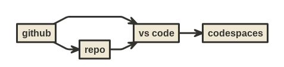
```

Syarat yang harus dipenuhi untuk mengakses layanan ini adalah:

1. Kita harus sudah memiliki akun Github.
1. Kita sudah memiliki _repository_ (sebagai contoh pada tulisan ini agar lebih mudah saya menggunakan _repository_ yang sudah pernah saya buat. Jika belum punya _repository_, kita bisa membuatnya langsung di _Codespaces_).

Sekarang saya akan tunjukkan cara mengaktifkan _Codespaces_ agar bisa menggunakan bahasa __R__.

---

## Cara Mengaktifkan _Codespaces_ untuk __R__

### Langkah ke-1

Buka halaman depan Github dengan akun kita:

```{r,echo=FALSE}
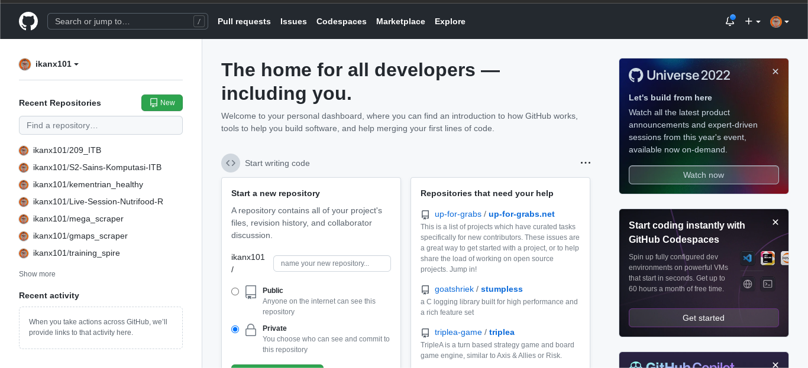
```

### Langkah ke-2

Buka _tab_ _Codespaces_ sebagai berikut:

```{r,echo=FALSE}
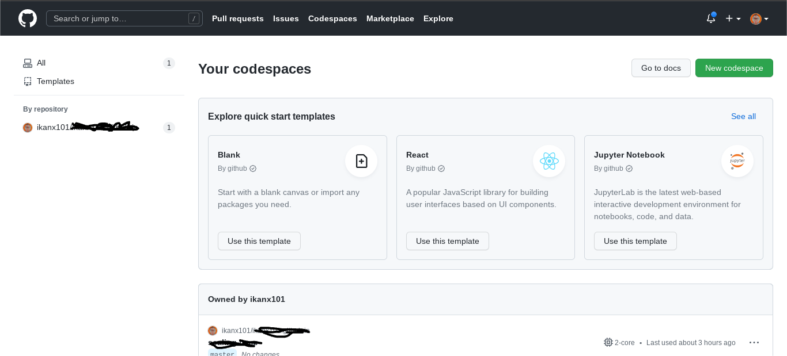
```

### Langkah ke-3

Pilih _create new codespaces_ dan pilih _repository_ yang hendak kita gunakan:

```{r,echo=FALSE}
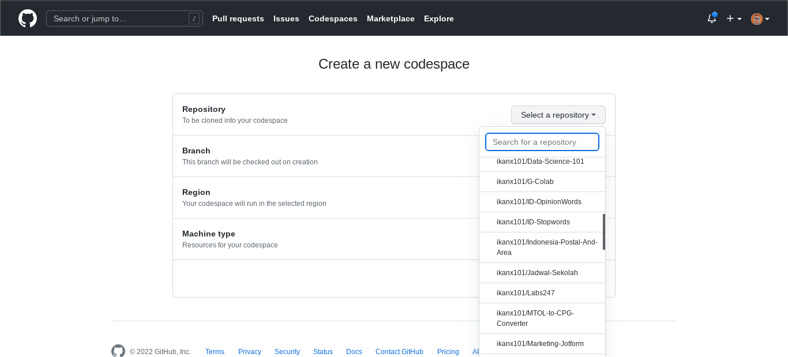
```

### Langkah ke-4

Pada _machine type_, kita bisa memilih 2 spek mesin yakni:

1. __2 Cores dan 4 GB RAM__.
1. __4 Cores dan 8 GB RAM__.

Secara _default_, pilihan mesin yang digunakan adalah __2 cores__. Jika kita memilih spek yang lebih tinggi, waktu _free runtime_ akan lebih cepat habis.

```{r,echo=FALSE}
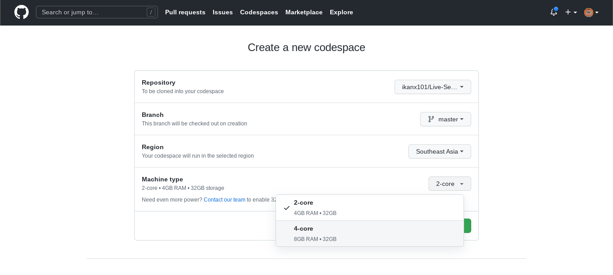
```

### Langkah ke-5

Jika berhasil, maka halaman akan berpindah ke halaman muka __Visual Studio Code__ seperti ini:

```{r,echo=FALSE}
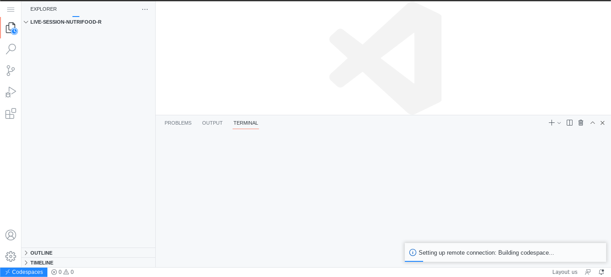
```

### Langkah ke-6

Sekarang kita perlu meng-_install_ __R__ ke dalam __Visual Studio Code__ tersebut. Caranya sangat mudah, yakni memanfaatkan _container_ yang sudah dibuat oleh para _developer_ baik hati di luar sana.

Buka ___Manage___ yang berupa simbol roda gerigi di pojok kiri bawah. Lalu pilih ___Command Palette___.

```{r,echo=FALSE}
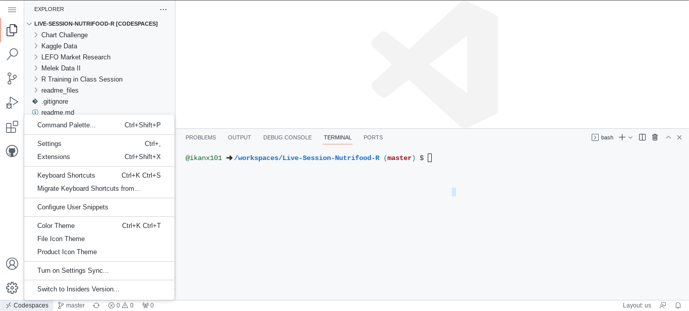
```

### Langkah ke-7

Ketik dan pilih ___Codespaces: Add Dev Container Configuration Files___.

```{r,echo=FALSE}
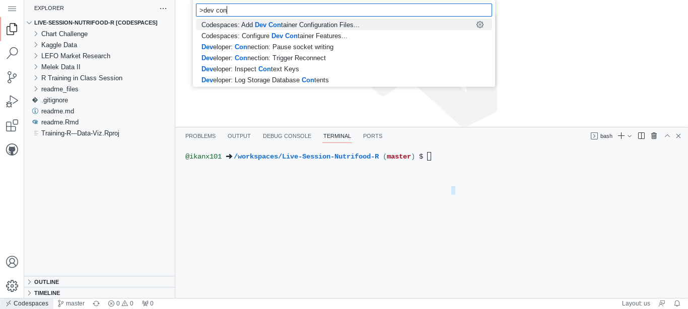
```

### Langkah ke-8

Ketik dan pilih bahasa __R__. Kita bisa pilih __R__ dengan _pre-installed_ `library(tidyverse)` dengan berbagai versi yang ada.

```{r,echo=FALSE}
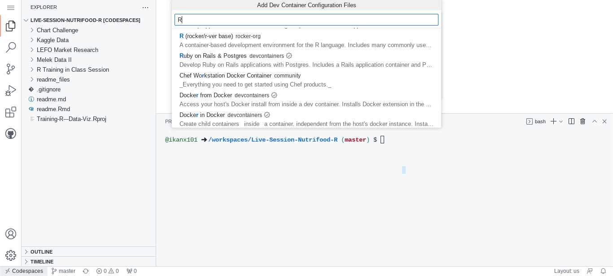
```

### Langkah ke-9

Jika sudah, lalu klik __OK__ tanpa menambah _configuration files_ yang lain.

```{r,echo=FALSE}
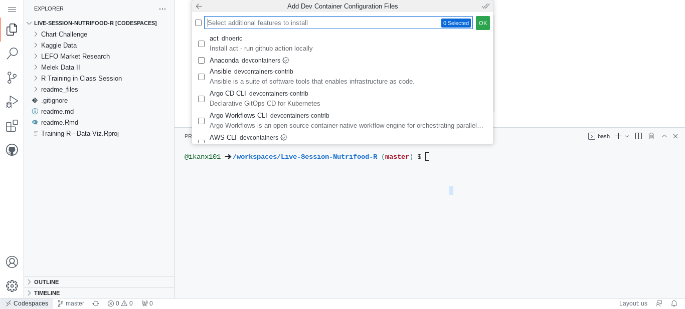
```

### Langkah ke-10

Jika berhasil, _Codespaces_ akan melakukan _reload_ dengan _setting_ terbaru. Ditunggu saja prosesnya sekitar 5-10 detik.

```{r,echo=FALSE}
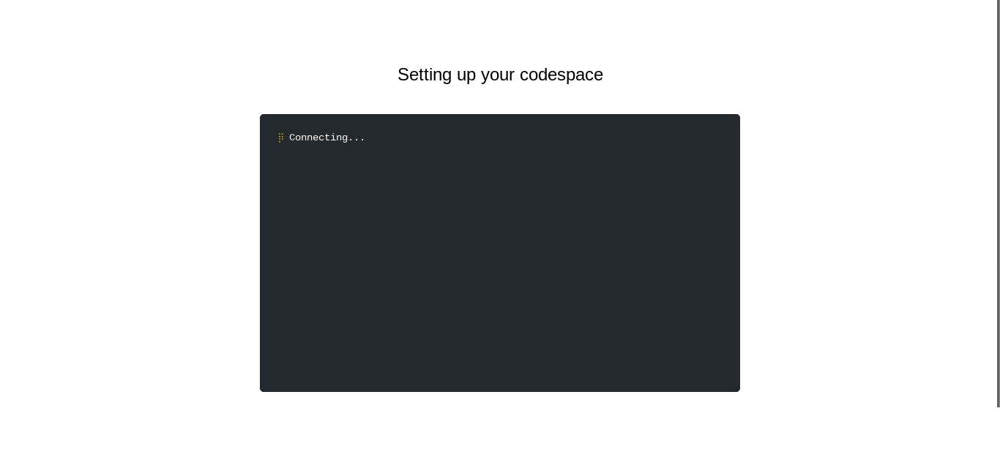
```

### Langkah ke-11

Jika sudah selesai, kita akan kembali ke halaman muka __Visual Studio Code__ dengan ada tambahan _folder_ `.devcontainer` pada _repository_ kita. 

Kita bisa mengecek apakah __R__ sudah ter-_install_ di __Visual Studio Code__ kita dengan mengetikkan __R__ di `Terminal` dan _enter_. Hasilnya seperti ini:

```{r,echo=FALSE}
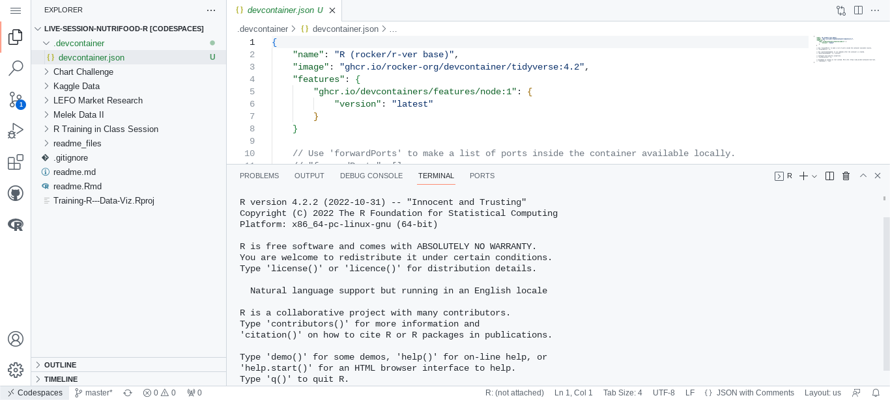
```

Kita bisa lihat bahwa sudah ter-_install_ __R__ versi terbaru `4.2.2`.

---

Proses _setting_ dan instalasi di atas cukup dilakukan sekali saja seumur hidup. Seterusnya, _Codespaces_ bisa langsung digunakan setiap kali dibutuhkan denga mengakses halaman _Github Codespaces_. 

Untuk mengetahui sejauh mana pemakaian kita, kita cukup masuk ke dalam _Settings_ di Github, lalu pilih _tab_ _billing and plans_.

```{r,echo=FALSE}
knitr::include_graphics("bilings.png")
```
