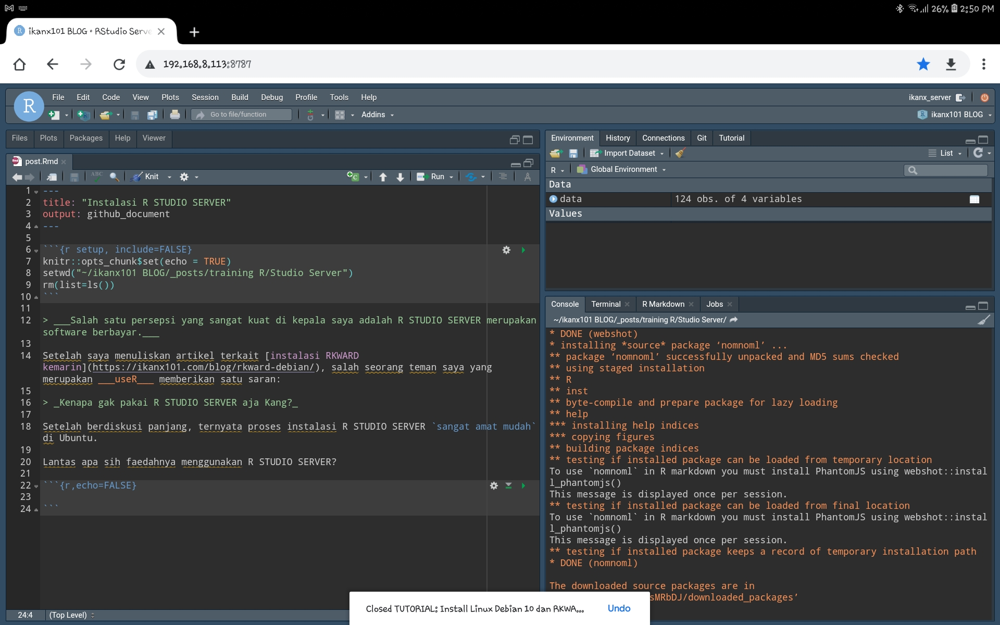
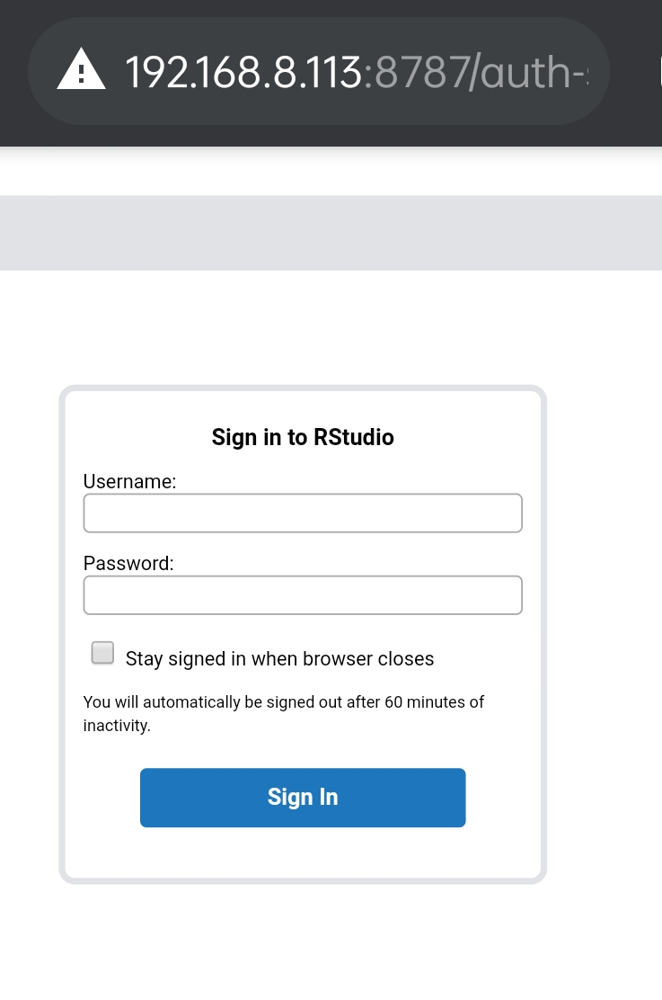

```{r setup, include=FALSE}
knitr::opts_chunk$set(echo = TRUE)
setwd("~/ikanx101 BLOG/_posts/training R/Studio Server")
rm(list=ls())
```

> ___Salah satu persepsi yang sangat kuat di kepala saya adalah R STUDIO SERVER merupakan software berbayar.___

Setelah saya menuliskan artikel terkait [instalasi RKWARD kemarin](https://ikanx101.com/blog/rkward-debian/), salah seorang teman saya yang merupakan ___useR___ memberikan satu saran:

> _Kenapa gak pakai R STUDIO SERVER aja Kang?_

Setelah berdiskusi panjang, ternyata proses instalasi R STUDIO SERVER `sangat amat mudah` di Ubuntu.

Lantas apa sih faedahnya menggunakan R STUDIO SERVER?

Jika kita meng-_install_ R STUDIO SERVER di salah satu komputer di jaringan, kita bisa mengakses R Studio menggunakan _gadget_ apapun di jaringan tersebut. Jadi mirip dengan [RStudio.cloud](https://rstudio.cloud/) tapi _unlimited processing time_. Sama seperti R Studio Desktop tapi bisa diakses di manapun dengan _gadget_ apapun di jaringan.

Sebagai contoh, tulisan ini ditulis menggunakan R STUDIO SERVER yang saya buka menggunakan _browser_ __Google Chrome__ di _Galaxy Tab_.

```{r out.width="60%",echo=FALSE,fig.align='center'}

```

Jadi bagaimana caranya?

# Proses Instalasi
Komputer saya menggunakan __OS Ubuntu 20 LTS__. Langkah pertama yang harus dilakukan adalah meng-_install_ __R__ terlebih dahulu di komputer. Caranya sudah pernah saya bahas di [sini](https://ikanx101.com/blog/review-ubuntu/#instalasi-r-dan-rstudio).

Setelah itu, kita tinggal mengunduh R STUDIO SERVER langsung dari __terminal__ dengan cara:

```
wget https://download2.rstudio.org/server/bionic/amd64/rstudio-server-1.4.1106-amd64.deb
```

Langkah berikutnya adalah meng-_install_ dengan memanfaatkan `gdebi`.

Jadi, pastikan terlebih dahulu kita telah meng-_install_ `gdebi` dengan cara:

```
sudo apt-get install gdebi-core
```

Langkah terakhir yang perlu dilakukan adalah meng-_install_ R Studio Server dengan cara:

```
sudo gdebi rstudio-server-1.4.1106-amd64.deb
```

Proses instalasinya sudah selesai.

Sekarang kita tinggal membuka _browser_ di _gadget_ manapun yang berada di jaringan yang sama dengan komputer tempat kita meng-_install_ R STUDIO SERVER.

Kita tinggal menuju alamat: `http://IP Address:8787`. Untuk komputer saya, saya tinggal menuju: `http://192.168.8.113:8787/`.

Halaman depannya berupa _login page_.

```{r out.width="60%",echo=FALSE,fig.align='center'}

```

Kita perlu memasukkan _login_ yang sama dengan _profile_ pada _setting user_ di __Ubuntu__.

## Menambah _User_
Jika diperlukan, kita bisa menambahkan _user_. Caranya cukup ketik di __terminal__:

```
sudo adduser nama_user
```

---
`if you find this article helpful, support this blog by clicking the ads.`