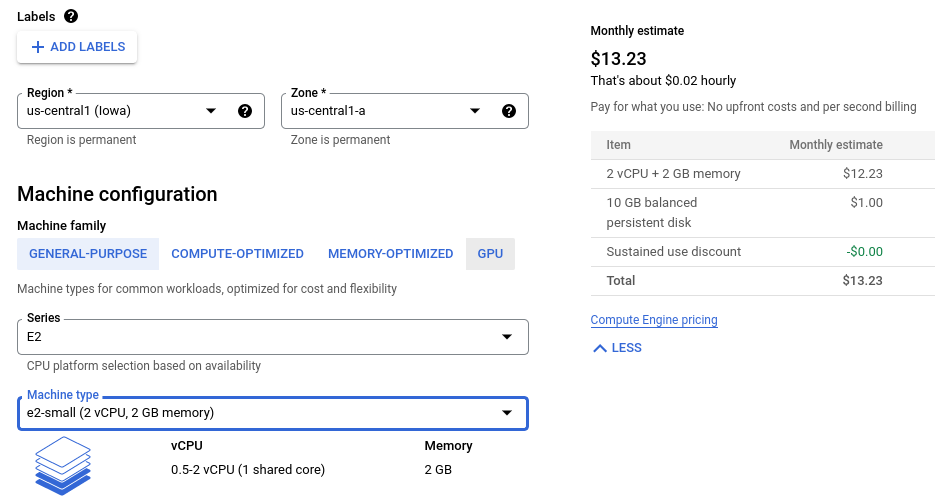
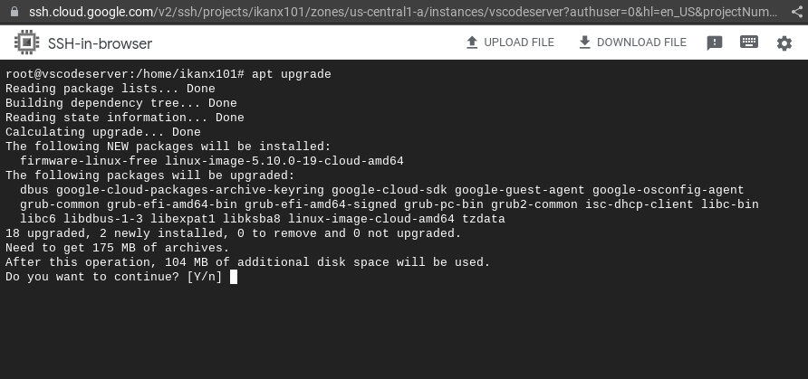
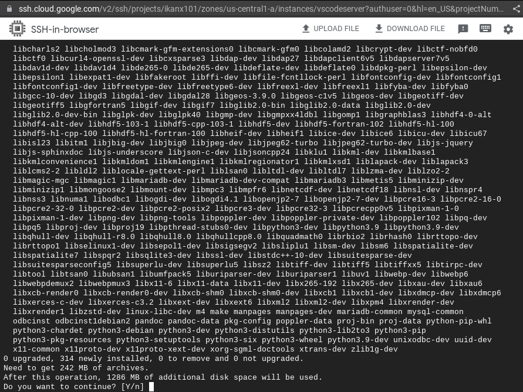
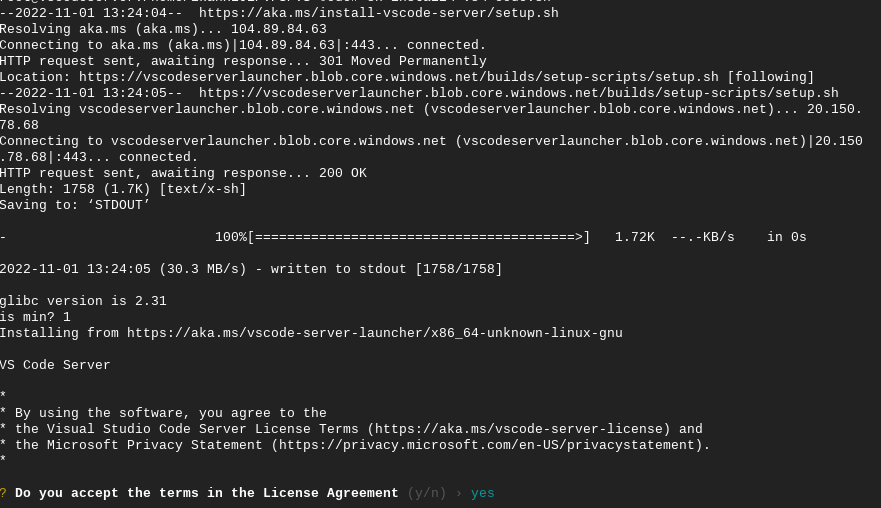
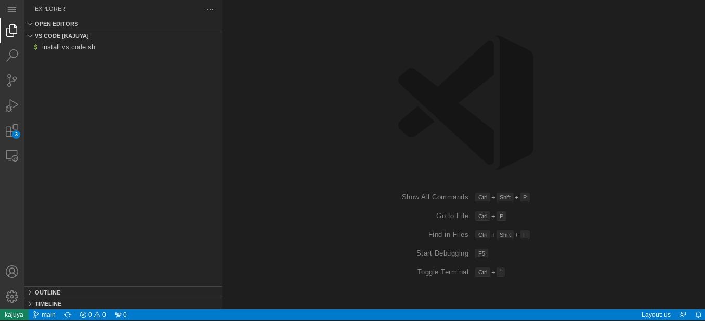
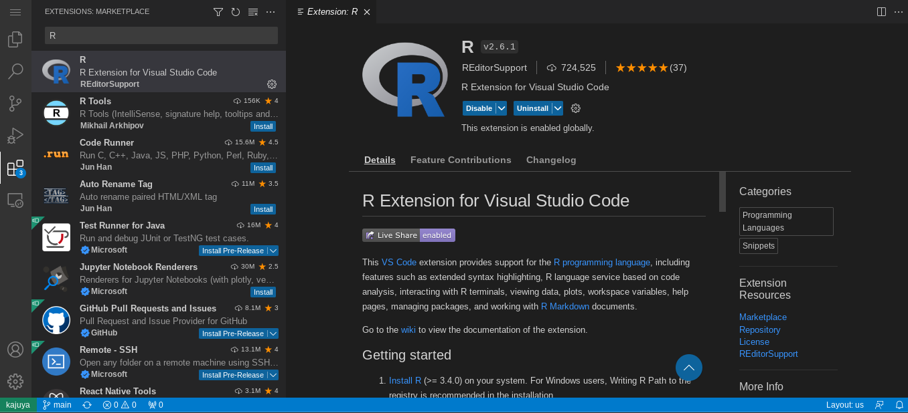

```{r setup, include=FALSE}
knitr::opts_chunk$set(echo = TRUE)
setwd("~/Co-Blog/_posts/training R/VS Code di Google VPS")
```

Pada tulisan [sebelumnya](https://ikanx101.com/blog/vs-code/), saya telah menjelaskan bagaimana meng-_install_ _Visual Studio Code_ ke dalam laptop atau PC berbasis Linux (baik Debian atau Ubuntu sama saja prosesnya). 

Sekarang saya mau _share_ salah satu keisengan saya lagi, yakni meng-_install_ ___Visual Studio Code Server___ ke dalam _virtual private server_ (VPS) di _Google Cloud_. Namun, sebelum saya memulai, saya akan menjelaskan terlebih dahulu apa itu ___Visual Studio Code Server___.

---

___VS Code Server___ adalah bentuk _server_ dari aplikasi _VS Code_ yang bisa digunakan untuk _ngoding_ berbagai macam bahasa pemrograman (salah satunya __R__). Penggunaannya sama halnya dengan ___R Studio Server___, yakni memungkinkan _user_ mengaksesnya via _gadget_ apapun tanpa harus meng-_install_-nya (hanya bermodalkan _web browser_ saja).

Saya sudah beberapa kali menulis tentang _R Studio Server_, seperti:

1. Cara _install_ di [laptop Ubuntu](https://ikanx101.com/blog/rstudio-server/),
1. Cara _install_ di [Google Colab](https://ikanx101.com/blog/r-server-colab/),
1. Cara _install_ di [Google VPS](https://ikanx101.com/blog/google-rstudio/),

Namun, salah satu kelemahan bagi _R Studio Server_ adalah kita harus memiliki _IP public_ agar _R Studio Server_ bisa diakses dari _gadget_ apapun dengan jaringan manapun. Jika tidak punya _IP public_, kita bisa mengakalinya dengan menggunakan bantuan [_pagekite_](https://ikanx101.com/blog/page-kite/) atau [_ngrok_](https://ikanx101.com/blog/ngrok-io/).

Di sinilah letak keunggulan ___VS Code Server___. Secara otomatis, ___VS Code Server___ akan melakukan _ssh tunneling_ sehingga walaupun tanpa _IP public_ ___VS Code Server___ tetap bisa diakses oleh _gadget_ manapun dengan jaringan apapun. Asal laptop atau VPS tempat kita meng-_install_ terkoneksi internet. Selain itu kita tidak perlu diribetkan oleh _setting firewall_ di _Google Cloud_ yang rumit.

Prasyarat mutlak yang wajib dipenuhi adalah keberadaan akun Github.

---

Sekarang saya akan menunjukkan cara meng-_install_ ___VS Code Server___ ke _Google VPS_. Kira-kira langkahnya adalah sebagai berikut:

1. _Create an instance_ (membuat VPS baru di layanan _Google Cloud Console_).
1. _Install_ __R__ dan berbagai _libraries_-nya dengan bantuan _command line_.
1. _Install_ ___VS Code Server___ dan lakukan otentifikasi Akun Github.

### Langkah I

Saya akan membuat VPS baru di _Google Cloud_ sebagai berikut:

```{r out.width="60%",echo=FALSE}

```


Untuk OS nya, saya akan menggunakan Debian 11 `Bullseye`.

### Langkah II

Berikutnya, saya akan gunakan koneksi `ssh` untuk meng-_install_ __R__ dan berbagai macam kebutuhan lainnya.

Saya menggunakan perintah sebagai berikut:

```
apt install pandoc gnupg ca-certificates nano gdebi-core build-essential libgdal-dev python3-pip libcurl4-openssl-dev libssl-dev libxml2-dev cmake libglpk-dev libcairo2-dev libfontconfig1-dev 

pip3 install -U radian

apt-get update
apt-get upgrade
apt-get install r-base r-base-dev
```

Pastikan kita sudah menjadi `superuser` saat menjalankan perintah tersebut.

```{r out.width="60%",echo=FALSE}



```

Setelah __R__ ter-_install_, buka __R__ dan _install_ beberapa _libraries_ berikut:

```
rm(list=ls())
pakets = installed.packages()
pakets_needed = c("dplyr","tidyr","readxl","janitor",
                  "knitr","expss","openxlsx","stringr",
                  "rvest","ggplot2","txtplot","tidytext","reshape2",
                  "rmarkdown","Ryacas","languageserver","httpgd")
necessary = setdiff(pakets_needed,pakets)
if(length(necessary) > 0){
  for(i in 1:length(necessary)) install.packages(necessary[i])
} else print("+++ semua libraries sudah ready +++")

rm(list=ls())
```

Proses ini mungkin akan memakan waktu yang relatif cukup lama (maksimum 30 - 45 menit). Oleh karena itu, kita bisa tinggal tidur saja. Tapi _setting_ ini cukup dilakukan sekali saja.


### Langkah III

Kita akan _install_ ___VS Code Server___ dengan mengeksekusi perintah berikut ini:

```
wget -O- https://aka.ms/install-vscode-server/setup.sh | sh
```

_Nah_, prosesnya sudah hampir selesai. Untuk menyalakan _server_, kita eksekusi perintah ini:

```
code-server
```

---

Jika berhasil, kita akan disuruh menjawab beberapa baris pertanyaan dan melakukan otentifikasi ke akun Github seperti ini:

```{r out.width="60%",echo=FALSE}

```

Setelah itu kita akan diberikan alamat `url` _unique_ tempat kita akan mengakses ___VS Code Server___.

---

Setelah kita buka `url` pada _web browser_, akan terlihat tampilan sebagai berikut:

```{r out.width="60%",echo=FALSE}

```

Kita tunggu saja proses instalasinya hingga selesai. Maksimum memakan waktu sekitar 15-30 menit.


Oh iya, langkah terakhir adalah dengan meng-_install_ ekstensi __R__ pada _VS Code Server_ berikut:

```{r out.width="60%",echo=FALSE}

```

---

`if you find this article helpful, support this blog by clicking the ads`