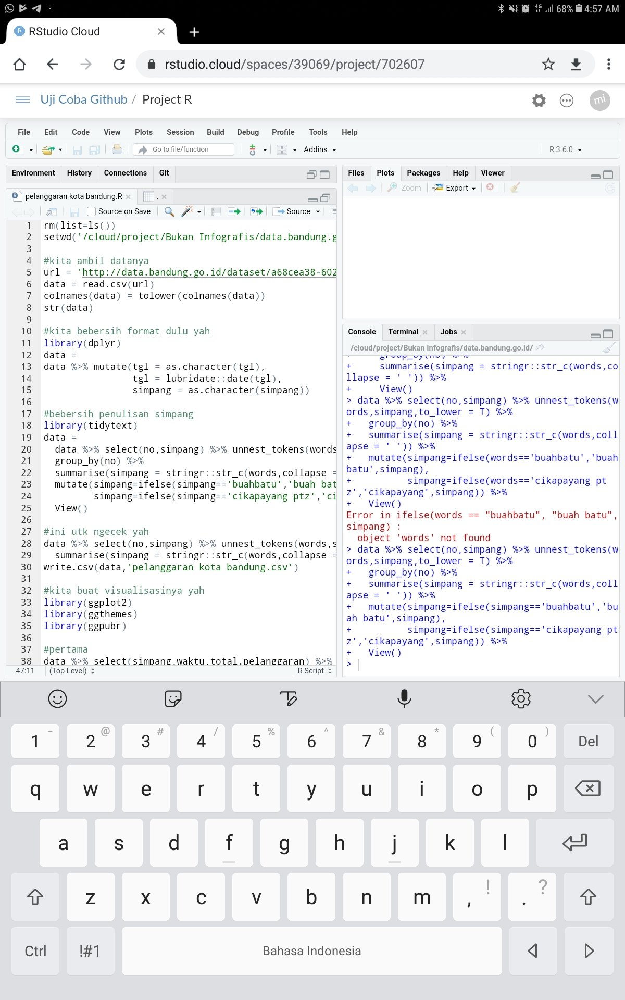

```{r setup, include=FALSE}
knitr::opts_chunk$set(echo = TRUE)
rm(list=ls())
setwd("~/Documents/ikanx101/_posts/training R/part 1")
```


# Untuk apa saya belajar __R__?

Di era digitalisasi ini, disadari atau tidak data tersebar di mana-mana. Data juga dihasilkan dengan _volume_ yang besar dalam waktu singkat. 

> _Analoginya seperti ada sungai yang memiliki arus yang deras dan kencang._
Seperti itulah kondisi saat ini.

_Tools_ analisa data klasik seperti __Ms. Excel__ dan __SPSS__ sudah tidak mampu lagi melakukan analisa _big data_ yang seringkali berbentuk _unstructured data_.

__R__ tidak sendirian, ada juga _software_ lain bernama __Python__. Keduanya digunakan untuk membuat algoritma _artificial intelligence_ (bahasa keren dari _machine learning_. Bahasa kerennya dari _computational science_).

---

# Pendahuluan

**R** merupakan salah satu bahasa pemrograman yang biasa digunakan untuk
menyelesaikan permasalahan terkait dengan data. Kita bisa membuat model
prediksi (*machine learning*, *artificial intelligence*, dan *deep
learning*) sampai membuat algoritma automasi menggunakan **R**.

> Apa perbedaan R dan Python?

Salah satu kelebihan **R** adalah:

> R is made by statistician for statistician.
Setiap *package* atau *library* yang di-*launching* di **R** biasanya
disertakan dengan jurnal ilmiah sehingga kita bisa dengan yakin
memakainya.

**R** tersedia secara *open source* sehingga *software* ini gratis dan
dikembangkan secara massal oleh komunitas-komunitas di seluruh dunia.
Sehingga *package* atau *library* yang disediakan untuk analisis
statistika dan analisa numerik juga sangat lengkap dan terus bertambah
setiap saat.

Bagaimana dengan __Python__?

> Sejatinya Python digunakan untuk membangun aplikasi. Namun, belakangan ini ternyata Python disadari bisa untuk melakukan pengolahan data.
Berbeda dengan __R__ yang memang dibangun untuk kebutuhan _data science_, __Python__ membutuhkan _libraries_ setiap kali melakukan pengolahan data.

Materi _training_ ini saya kumpulkan dari berbagai sumber dan saya _customize_ berdasarkan pengalaman selama ini berkutat dengan data yang ada (dari mulai data pabrik hingga _finance_). 

## Sejarah

__R__ Merupakan bahasa yang digunakan dalam komputasi statistik yang pertama kali dikembangkan oleh _Ross Ihaka_ dan _Robert Gentlement_ di _University of Auckland New Zealand_ yang merupakan akronim dari nama depan kedua pembuatnya. Sebelum __R__ dikenal ada __S__ yang dikembangkan oleh _John Chambers_ dan rekan-rekan dari _Bell Laboratories_ yang memiliki fungsi yang sama untuk komputasi statistik. Hal yang membedakan antara keduanya adalah __R__ merupakan sistem komputasi yang bersifat gratis.

## Fitur dan Karakteristik

Sama halnya dengan bahasa pemograman lainnya. Berbeda bahasa berarti berbeda peraturan / cara menulis _code_ (algoritma). Tapi jangan khawatir, dengan memanfaatkan _tidy principle_ di __R__, kita bisa menulis algoritma dengan mudah (bagi kita dan pembaca algoritmanya).

> Oleh karena itu, menurut saya __R__ menawarkan _learning curve_ yang jauh lebih baik dibandingkan _Python_.
Beberapa karakter dari __R__ adalah sebagai berikut:

1. Bahasa __R__ bersifat _case sensitive_. Setiap perbedaan cara penulisan (kapital vs non kapital) akan membedakan suatu objek. Contoh:

```{r}
x = 'DATA'
y = 'Data'
x == y
```

2. Segala sesuatu yang ada pada program __R__ akan diangap sebagai objek. konsep objek ini sama dengan bahasa pemrograman berbasis objek yang lain seperti _Java_, _C++_, _Python_, dll. Perbedaannya adalah bahasa __R__ relatif lebih sederhana dibandingkan bahasa pemrograman berbasis objek yang lain.
3. _Interpreted language_ atau _script_. Bahasa __R__ memungkinkan pengguna untuk melakukan kerja pada __R__ tanpa perlu melakukan _compile_ menjadi _executionable_ file (.exe).
4. Mendukung proses _loop_, _decision making_, dan menyediakan berbagai jenis operator (aritmatika, logika, dll).
5. Mendukung _export_ dan _import_ berbagai _format file_, seperti: `.txt`, `.xlsx`, `.csv`, `.json`, `sql`, dll.
6. Mudah ditingkatkan melalui penambahan fungsi atau _library_. Penambahan ini dapat dilakukan secara _online_ melalui __CRAN__ atau melalui sumber seperti __github__.
7. Menyedikan berbagai fungsi untuk keperluan visualisasi data. Visualisasi data pada __R__ dapat menggunakan _library_ bawaan atau lainnya seperti `ggplot2`, `ggvis`, `plotly`, dll.

## Kelebihan dan Kekurangan __R__

Selain karena __R__ dapat digunakan secara gratis terdapat kelebihan lain yang ditawarkan, antara lain:

1. _Protability_, penggunaan _software_ dapat digunakan kapanpun tanpa terikat oleh masa berakhirnya lisensi.
2. _Multiplatform_, __R__ bersifat _Multiplatform Operating Systems_, dimana __R__ bisa dijalankan di OS manapun. Baik Windows, iOS, Linux, Raspbian, bahkan [Android](https://passingthroughresearcher.wordpress.com/2019/07/30/install-r-3-5-2-di-android/)! Dengan fitur yang sama (tidak ada perbedaan fitur di semua OS).
3. _Programable_, pengguna dapat membuat fungsi dan metode baru atau mengembangkan modifikasi dari analisis statistika yang telah ada pada sistem __R__.
4. Fasiltas grafik yang lengkap.

Adapun kekurangan dari R antara lain:

* _Point and Click GUI_, interaksi utama dengan __R__ bersifat __CLI__ (_Command Line Interface_), walaupun saat ini telah dikembangkan _library_ yang memungkinkan kita berinteraksi dengan __R__ menggunakan __GUI__ (_Graphical User Interface_) sederhana menggunakan `library(R-Commander)` yang memiliki fungsi yang terbatas.


## R vs R Studio

Pada dasarnya, _software_ __R__ bisa di-_download_ dan di-_install_ langsung dari situs [CRAN](https://cran.r-project.org/bin/windows/base/). _Software_ __R__ ini bersifat __CLI__.

> Bayangkan Anda membuka aplikasi __notepad__. Putih dan bersih kan? 
Seperti itulah _software_ __R__.

Bagi Kamu yang kaget dan tidak terbiasa melihat tampilan yang _intimidating_ seperti itu, Kamu bisa meng-_install software_ __R Studio__. Sebuah _software_ GUI yang bisa membuat __R__ terlihat lebih _user friendly_. __R Studio__ bisa di-_download_ [di sini](https://rstudio.com/products/rstudio/download/). 

> Tapi tolong diperhatikan bahwa __R Studio__ hanya tambahan tampilan dari __R__ standar. Jadi Kamu tetap harus meng- _install_ __R__ yah!

Kelebihan R Studio antara lain:

1. _Free_, kita bisa memilih versi gratis dari __R Studio__ tanpa ada pengurangan fitur dasar dari __R__.
2. _R Studio Cloud_, tersedia layanan _cloud_ sehingga bisa diakses dan digunakan menggunakan _browser_ di _gadget_ manapun. Layanan _cloud_ ini bisa diakses [di sini](https://rstudio.cloud) dan dikoneksikan ke akun __github__ Kamu. Kira-kira seperti ini tampilannya jika dibuka di _Chrome for Android_:

```{r out.width = '40%',echo=FALSE,fig.align='center'}

```

3. _Shiny Apps_, kita bisa membuat _apps_ berbasis _web_ dari __R__. _Apps_ ini bisa dijadikan _dashboard_ atau mesin kalkulasi otomatis. Tergantung seberapa jauh Kamu membuat _coding_ algoritmanya.
4. _R Markdown_, ini fitur yang paling saya sukai. Bahkan untuk menulis _web_ ini, saya menggunakan _R Markdown_. Output files -nya beragam, mulai dari `docx`, `pptx`, `pdf`, `html`, `md`, dll. Bahkan kita bisa membuat [_e-book_](https://bookdown.org/) dengan memanfaatkan `library(bookdown)`.

Jadi, setelah membaca bagian ini pastikan Kamu sudah meng- _install_ __R__ dan __R Studio__ yah. 

> Jangan sampai terbalik urutan instalasinya!

---

# _Google Colab_

Selain menggunakan _installed software_ seperti __R__ dan __R Studio__, kita juga bisa membuat algoritma menggunakan __R__ secara _cloud service_ pada situs [Google Colab](http://colab.to/r).

Kelebihannya menggunakan _Google Colab_ adalah:

1. __Tidak perlu install apapun!__. Bisa diakses menggunakan _gadget_ manapun asal tersambung dalam koneksi internet.
1. _Pre-installed_ dengan _libraries_ untuk melakukan _machine learning_ bahkan _deep learning_.
1. Sering digunakan dalam kompetisi data sains.

Kelemahannya adalah:

1. Untuk _libraries_ yang `jarang` dipakai, kita harus meng-_install_-nya setiap kali menjalankan _environment_ Google Colab.

---

`if you find this article helpful, support this blog by clicking the ads.`