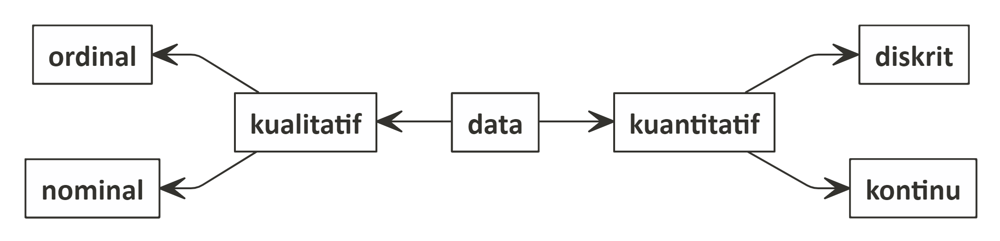

```{r setup, include=FALSE}
knitr::opts_chunk$set(echo = TRUE)
```

## Mengenal Data

Sebelum memulai bekerja dengan __R__, ada baiknya saya jelaskan dan ingatkan kembali beberapa hal penting terkait data. Dengan demikian, kita bisa memilih jenis analisa statistika apa yang tepat untuk tipe-tipe data yang berbeda.

### Tipe Data (statistika)

Secara statistika, berikut adalah pembagian data berdasarkan tipenya:

```{r out.width = '60%',echo=FALSE,fig.align='center'}

```

1. Data kualitatif: adalah data yang tidak bisa dilakukan operasi aritmatika (penjumlahan, pengurangan, pembagian, dan perkalian). Data seperti ini, kita akan sebut sebagai __data kategorik__. 
    1. __Nominal__; Representasi dari sesuatu. Contoh: `gender`, `1` saya tulis sebagai `pria` dan `2` saya tulis sebagai `wanita`. 
    1. __Ordinal__; Urutan dari data menjadi penting. Contoh: skala _likert_ 1 - 6.
2. Data kuantitatif: adalah data yang bisa dilakukan operasi aritmatika (penjumlahan, pengurangan, pembagian, dan perkalian). Data seperti ini, kita akan sebut sebagai __data numerik__. 
    1. __Diskrit__; bilangan bulat (_integer_). 
    1. __Kontinu__; bilangan _real_ (mengandung koma).

### Tipe Data di __R__

Di __R__ ada beberapa tipe data yang sering digunakan. Secara hierarki, bisa diurutkan sebagai berikut:

`character > numeric > integer > logical`

Oke, saya coba jelaskan satu persatu yah:

1. `character`: merupakan tipe data berupa karakter atau `string`. Semua data bisa dilihat sebagai `character`. Oleh karena itu, secara hierarki tipe data ini ditempatkan di urutan paling atas. Namun, data tipe ini tidak bisa dilakukan operasi aritmatika _yah_.
2. `numeric`: merupakan tipe data angka berupa bilangan _real_. Kalau saya boleh bilang, tipe data ini mirip dengan data numerik di data kuantitatif.
3. `integer`: merupakan tipe data angka berupa bilangan bulat. Sekilas mirip dengan tipe data diskrit di data kuantitatif. Namun di beberapa kondisi, tipe data ini bisa dijadikan data __kategorik__ sehingga kita bisa sebut tipenya menjadi `factor`.
4. `logical`: merupakan tipe data _boolean_. Hanya berisi `TRUE` atau `FALSE`. Tipe data ini sangat berguna saat kita melakukan _if conditional_, _looping_, atau membuat _regex_ (_reguler expression_).
5. _Date and time_; merupakan salah satu tipe data yang rumit dalam __R__ karena sejatinya kita harus berhati-hati dalam hal format penulisan tanggal dan jam.


### Struktur Data di __R__

Ada beberapa bentuk struktur data di __R__, yakni: 

1. _Single value_; satu objek yang berisi satu _value_ saja.
2. _Vector_; kumpulan dari beberapa _single value(s)_ yang menjadi satu objek. Bayangkan sebagai satu buah kolom di _file Ms. Excel_.
3. _Data frame_ atau _tibble_; merupakan kumpulan dari beberapa _vectors_ yang memiliki ukuran sama. Bayangkan sebagai satu tabel di _Ms. Excel_ yang banyaknya baris di setiap kolom sama.
4. _List_; merupakan bentuk struktur data yang sangat kompleks. Berisi _multiple data_ dengan struktur bermacam-macam.


### Apa gunanya kita mengetahui jenis dan struktur data di __R__?

Beberapa algoritma yang tersedia di _library_ mengharuskan kita memiliki _input_ yang ter-standar, baik dari segi jenis dan strukturnya.

Dengan mengetahui jenis dan struktur data, kita bisa lebih mudah bekerja dengan algoritma yang ada di _library_.

Contoh:

> Algoritma analisa _simple linear regression_ (`lm()`) memerlukan input berupa `data.frame()` dengan masing-masing _variables_ yang ada di dalamnya berjenis _numeric_.

## Tata Cara Memberikan Nama _Object_ atau Variabel

Setiap _object_ atau variabel di __R__ bisa diberikan nama sesuai dengan keinginan kita. Tidak ada aturan baku dalam memberikan nama. 

> Tapi, dengan memberikan nama yang __tepat__ kita bisa bekerja dengan ebih cepat dan efisien.
Berikut adalah tata cara pemberian nama yang akan membuat pekerjaan kita lebih efisien:

1. Seragamkan kapital atau non kapital dari nama variabel kita. Jika menggunakan _lowercase_, maka harus konsisten di setiap data yang ada di _environment_ __R__. 
2. Hindari penggunaan spasi " ". Jika memang tidak bisa dihindari, gunakan tanda "." atau "_". 
  * Contoh: variabel `tinggi badan` akan lebih baik ditulis dalam bentuk `tinggi.badan` atau `tinggi_badan`.
  
Jika sudah terlanjur memiliki nama variabel yang tidak seragam atau mengandung spasi (biasanya terjadi saat kita meng- _import_ data dari sumber lain seperti: _excel_), kita bisa merapikannya dengan otomatis dengan memanfaatkan `library(janitor)` fungsi `make_clean_names()` atau `clean_names()`.

---

_to be continued_

`if you find this article helpful, support this blog by clicking the
ads.`
