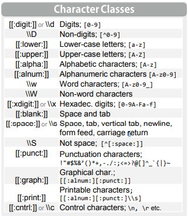
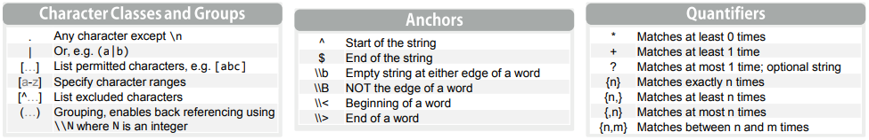

```{r setup, include=FALSE}
knitr::opts_chunk$set(echo = TRUE)
```

Ada kalanya kita harus bekerja dengan data dengan tipe `character` atau `string`.

## _Regex_

_Regex_ adalah kepanjangan dari _reguler expression_, yakni mencari _pattern_ dari data berupa _string_. _Cheatsheet_ untuk _regex_ bisa dilihat di [sini](https://rstudio.com/wp-content/uploads/2016/09/RegExCheatsheet.pdf).

Selain mengandalkan __base__ dari __R__, kita juga bisa menggunakan `library(stringr)`.

Setidaknya ada dua manfaat utama dari _regular expression_, yakni:

1. _Pattern Matching_; mencari kecocokan _pattern_ dari suatu data bertipe `character`.
2. _Replace Pattern_; mencari kecocokan _pattern_ dan mengubahnya dari suatu data bertipe `character`.

Perbedaan cara penulisan (kapital atau _lower_) bisa kita pertimbangkan untuk dijadikan syarat pencarian atau tidak, yakni dengan penambahan `ignore.case = T` atau `ignore.case = F`.

Berikut ini adalah _syntaxes_ yang ada dan digunakan untuk mencari apa:

```{r out.width = '40%',echo=FALSE,fig.align='center'}

```

```{r out.width = '85%',echo=FALSE,fig.align='center'}

```

### _Pattern Matching_

Sebagai contoh, saya akan gunakan data berikut ini:

Variabel _string_ yang diketahui:
```{r}
string = c('Market Research','market riset','survey','responden','mickey mouse')
```

Berikut _pattern_ yang diinginkan:

```{r}
pattern = 'm..ke'
```

Berikut adalah beberapa fungsi yang sering digunakan.

- _Function_ `grep()`

Perhatikan _output_ dari masing-masing perintah sebagai berikut:

```{r}
grep(pattern,string)
```

_Output_ `function` ini adalah nomor urut / elemen dari _vector_ yang sesuai dengan _pattern_ yang diinginkan.

```{r}
grep(pattern,string,value = T)
```

_Output_ `function` ini adalah isi elemen dari _vector_ yang sesuai dengan _pattern_ yang diinginkan.

```{r}
grep(pattern,string,ignore.case = T)
```

_Output_ `function` ini adalah isi elemen dari _vector_ yang sesuai dengan _pattern_ yang diinginkan dengan menghiraukan _uppercase_ atau _lowercase_.


- _Function_ `grepl()`

_Output_ dari fungsi ini berupa _logic_ (_boolean_):

```{r}
grepl(pattern,string,ignore.case = T)
```

- _Function_ menggunakan `stringr::` dan fungsi `str_detect()`

Output dari fungsi ini berupa _logic_ (_boolean_):

```{r}
stringr::str_detect(string,pattern)
```

- _Function_ menggunakan `stringr::` dan fungsi `str_locate()`

_Find starting and end position of all matches_.

```{r}
stringr::str_locate(string, pattern)
```

\newpage

- _Function_  menggunakan `stringr::` dan fungsi `str_extract()`

_Extract first match_. 

```{r}
stringr::str_extract(string, pattern)
```

### _Replace Pattern_

Kita akan gunakan contoh data berikut ini:

Ini adalah `string` yang digunakan:

```{r}
string = c("This is a sentence about axis",
           "A second pattern is also listed here")
```

Berikut adalah `pattern` dan `replacement` yang hendak dilakukan:

```{r}
pattern = 'is'
replace = 'XY'
```

Berikut adalah beberapa fungsi yang sering digunakan:

`function` `sub()`

```{r}
sub(pattern, replace, string)
sub(pattern, replace, string, ignore.case = T)
```


`function` `gsub()`

```{r}
gsub(pattern, replace, string)
gsub(pattern, replace, string, ignore.case = T)
```


---

_to be continued_

`if you find this article helpful, support this blog by clicking the
ads.`
