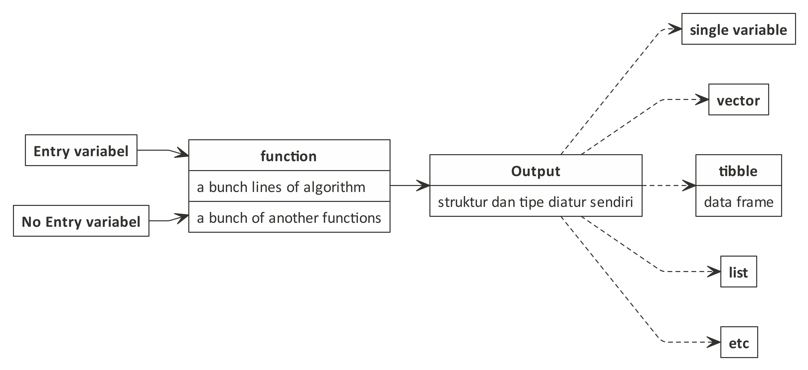

```{r setup, include=FALSE}
knitr::opts_chunk$set(echo = TRUE)
```

__R__ memungkinkan kita untuk membuat fungsi yang _custom_ secara mandiri. Jika kita sering menggunakan perintah-perintah tertentu dan ingin menghemat penulisan algoritma, kita bisa membuat _custom_ `function()` sendiri.

```{r out.width = '80%',echo=FALSE,fig.align='center'}

```

`function()` bisa memerlukan _entry variable_ atau tidak memerlukan _entry variable_ sama sekali.

## `function()` tanpa _entry variable_

Ada kalanya kita membuat `function()` tanpa ada _entry variable_. _Lho kok gitu?_

> Tergantung dari kebutuhan kita _yah_.

Sebagai contoh, kita akan membuat `function()` yang akan men- _generate_ nama orang, umur, tinggi, dan berat badan. Untuk _generate_ nama orang secara acak, saya menggunakan `library(randomNames)`. Pastikan _library_ ini ter-_install_ dulu _ya_.

```{r}
orang = function(){
  nama = randomNames::randomNames(1)
  umur = sample(c(20:60),1)
  tinggi = rnorm(1,mean = 150, sd = 20)
  tinggi = round(tinggi,1)
  berat = rnorm(1,mean = 40, sd = 5)
  berat = round(berat,1)
  data = c(nama,umur,tinggi,berat)
  return(data)
}
```

Sekarang kita akan coba panggil _function_-nya:

```{r}
orang()
```

## `function()` dengan _entry variable_

_Entry variable_ yang digunakan bisa berbentuk macam-macam dan bisa lebih dari satu.

Contoh, kita akan membuat `function()` untuk mencari modus (nilai yang paling sering muncul) dari sebuah _vector_:

```{r}
modus = function(x) {
  ux = unique(x)
  tab = tabulate(match(x, ux))
  ux[tab == max(tab)]
}
```

Mari kita cek apakah `function`-nya berhasil atau tidak:

```{r}
nama = c('a','b','a','c','d')
modus(nama)
```

Contoh berikutnya kita akan buat `function()` untuk menghitung rumus pitagoras dengan dua _entry variables_, yakni `a` dan `b` sebagai berikut:

Ini adalah rumusnya:

```{r}
pytagoras = function(a,b){
  sqrt((a^2) + (b^2))
}
```

Mari kita hitung pitagoras dengan `a = 3` dan `b = 4`, yakni:

```{r}
pytagoras(3,4)
```

---

_to be continued_

`if you find this article helpful, support this blog by clicking the
ads.`
