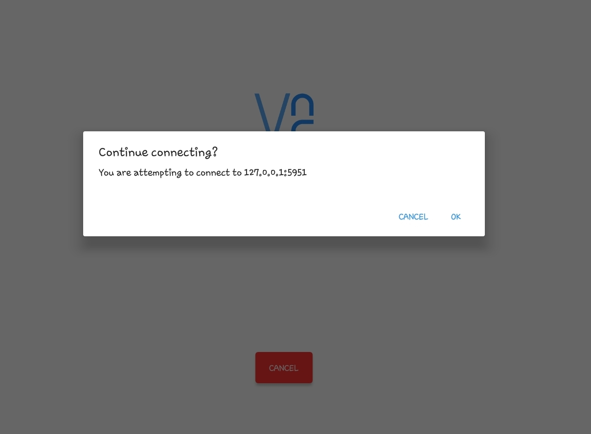
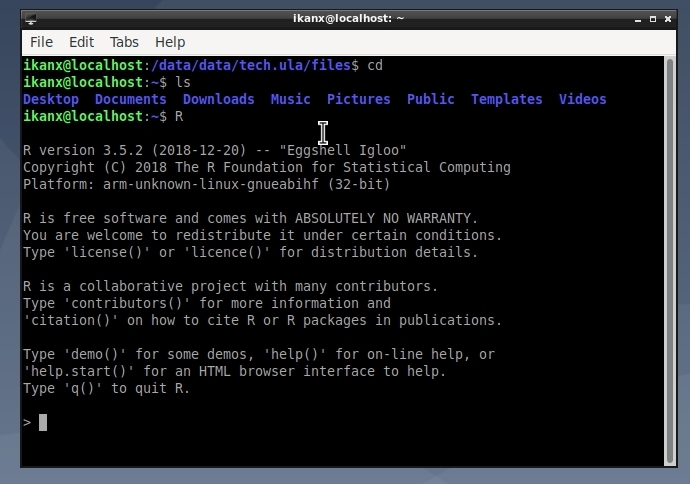
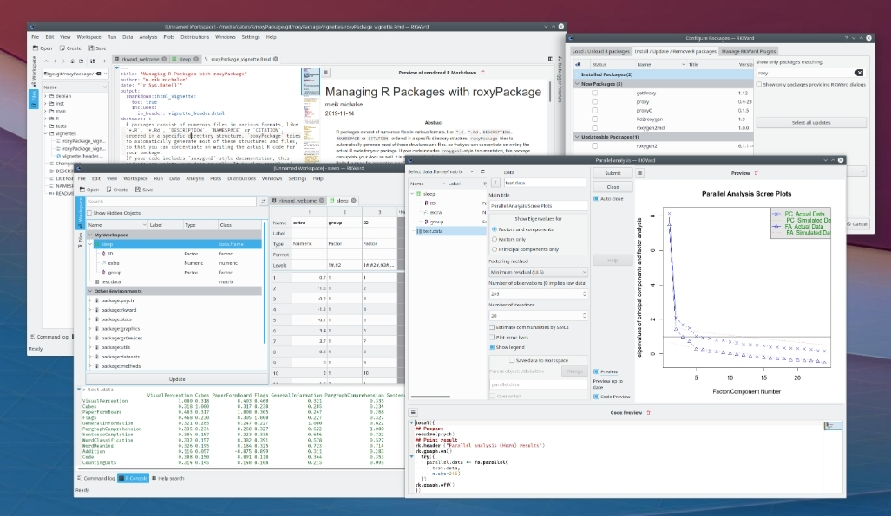

```{r setup, include=FALSE}
knitr::opts_chunk$set(echo = TRUE)
setwd("/cloud/project/_posts/training R/special RKWARD")
```

Sekitar dua tahun lalu, di blog saya yang [lama](https://passingthroughresearcher.wordpress.com/2019/06/12/analytics-on-the-go-cara-install-r-ke-gadget-android/), saya pernah menjelaskan bagaimana meng-_install_ __R__ ke dalam Android dengan memanfaatkan Linux versi _Command Line Interface_ (__CLI__).

Di beberapa kesempatan lainnya, saya juga meng-_encourage_ penggunaan [Google Colab](https://ikanx101.com/blog/google-colab/) sebagai salah satu solusi mengerjakan _data science_ menggunakan _cloud computing_.

---

Ketika bulan puasa kemarin, praktis saya meninggalkan Galaxy Tab saya sama sekali sehingga si Tab ini akhirnya dipakai si Sulung. Kemarin, setelah Tab ini saya akuisisi kembali, saya berpikir:

> ___Kira-kira bisa diapakan lagi ya Tab ini?___

Sampai akhirnya saya memutuskan untuk mencoba meng-_install_ __Linux versi__ ___desktop___ (bukan versi __CLI__) lalu mencoba untuk meng-_install_ __R Studio__.

Kenapa __R Studio__?

> Saya penasaran untuk bisa menggunakan __R__ __IDE__ di _gadget_ Android.

---

## Instalasi Linux
Proses instalasi __Linux Desktop__ sebenarnya cukup mudah. _Gadget_ Android tidak perlu di-_root_. Prinsipnya sama dengan [postingan saya sebelumnya](https://passingthroughresearcher.wordpress.com/2019/06/12/analytics-on-the-go-cara-install-r-ke-gadget-android/).

Kita cukup meng-_install_ aplikasi bernama ___UserLand___ dari ___PlayStore___.

```{r out.width="50%",echo=FALSE,fig.align='center'}
knitr::include_graphics("https://passingthroughresearcher.files.wordpress.com/2019/06/screenshot_20190612-092848_google-play-store-e1560313247862.jpg")
```

Sebagai informasi, aplikasi ini akan ter-_install_ di _memory_ internal. Saya tidak menemukan cara untuk memindahkan instalasi ke _memory_ eksternal. Untuk instalasi __Linux__ sampai __R__ dan __RKWARD__ beserta `library(tidyverse)`, saya membutuhkan ruang sekitar __3Gb__.

Selain itu, kita perlu meng-_install_ aplikasi ___VNC Viewer___ juga.

```{r out.width="50%",echo=FALSE,fig.align='center'}

```

Langkah pertama adalah, kita cukup membuka ___UserLand___ lalu memilih instalasi __Linux Desktop: Lxde__. Linux ini berbasis __Debian 10__ alias __Debian Buster__.

Kita pilih opsi __VNC__ pada saat instalasi tersebut. Silakan mengisi _username_, _password_, dan _password VNC_ sesuai selera kita.

```{r out.width="50%",echo=FALSE,fig.align='center'}

```

Proses instalasi akan berlangsung sekitar 5-10 menit tergantung dengan koneksi internet.

Setelah selesai, kita akan langsung dialihkan ke aplikasi __VNC Viewer__ seperti ini:

```{r out.width="50%",echo=FALSE,fig.align='center'}

```

Kita cukup klik __OK__. 

Selanjutnya akan ada _warning_ terkait ___unencrypted connection___. Biarkan saja karena kita sebenarnya sedang mengakses koneksi dari dalam _gadget_ kita (__bukan mengakses cloud__). Kita klik __OK__.

```{r out.width="50%",echo=FALSE,fig.align='center'}

```

Selanjutnya kita harus memasukkan _password VNC_ yang telah kita definisikan sebelumnya:

```{r out.width="50%",echo=FALSE,fig.align='center'}
knitr::include_graphics("password.jpg")
```

Jika langkah yang dilakukan benar, maka kita akan masuk ke halaman depan __Linux Debian__ berikut ini:

```{r out.width="50%",echo=FALSE,fig.align='center'}

```

## Instalasi __R__

Langkah berikutnya adalah melakukan instalasi __R__. Banyak orang menyangka bahwa __Linux__ itu susah untuk dioperasikan. Justru sebaliknya!

> ___Instalasi program apapun sangat mudah di Linux.___

Lantas bagaimana caranya?

Buka dulu __LXTerminal__ sebagai berikut:

```{r out.width="50%",echo=FALSE,fig.align='center'}

```

Pada __terminal__, ketikkan perintah ini:

```
sudo apt update
sudo apt upgrade
sudo install r-base
```

Silakan ketik __y__ untuk mengotorisasi proses _upgrade_ dan instalasi. Silakan tunggu beberapa saat hingga selesai. Setelah itu, silakan ketik `R` dan _hit_ __Enter__.

InsyaAllah hasilnya sebagai berikut:

```{r out.width="50%",echo=FALSE,fig.align='center'}

```

__R__ sudah selesai kita _install_.

## __R IDE__
Tidak semua orang terbiasa menggunakan __R__ berbasis __CLI__. Oleh karena itu, ada program __IDE__ seperti __R Studio__.

Masalahnya pada saat ini __R Studio__ tidak mengakomodir arsitektur __ARM__ (seperti _Raspberry Pi_) dan __ARMH__ (seperti Android).

Oleh karena itu, kita membutuhkan alternatif __IDE__ lain untuk menggunakan __R__.

Sebenarnya ada beberapa pilihan di luar sana. Kebetulan saya memilih aplikasi bernama __RKWARD__. 

```{r out.width="50%",echo=FALSE,fig.align='center'}

```

Instalasinya juga sangat mudah. Cukup menuliskan perintah berikut pada __terminal__:

```
sudo apt-get install rkward
```

---

Pengalaman memakai __RKWARD__ tidak berbeda dengan menggunakan __R Studio__ dalam hal menuliskan _script_.

---

`if you find this article helpful, please support this blog by clicking the ads.`